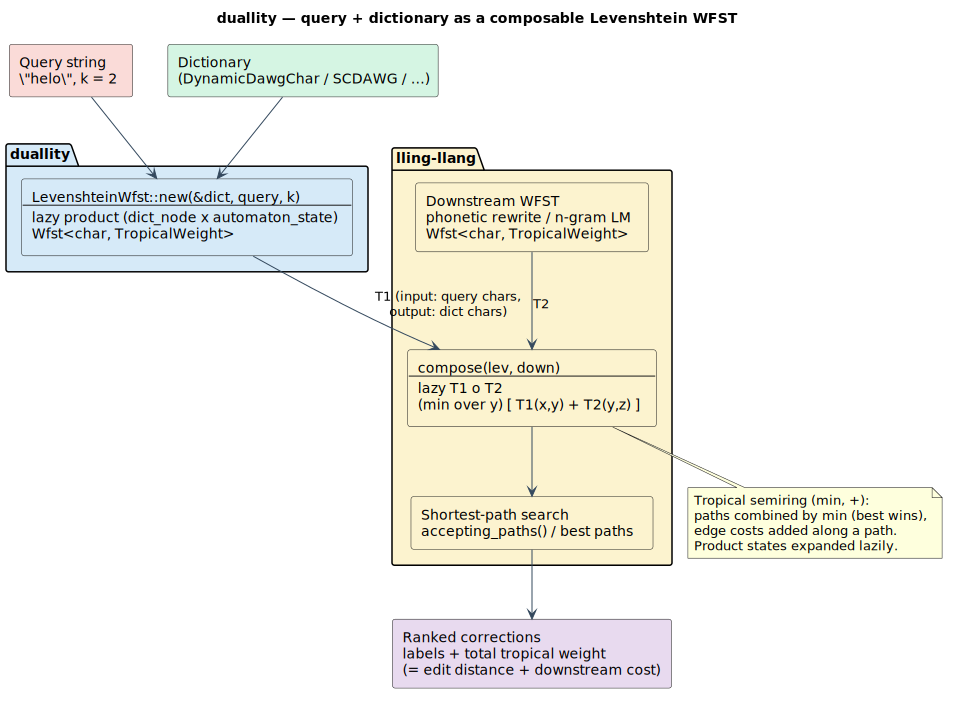

# duallity

**Levenshtein automata as [lling-llang](https://github.com/vinary-tree/lling-llang) WFSTs** — the bridge that lets a fuzzy-match automaton be *composed* with phonetic rewrites, language models, and any other weighted transducer.


[](https://crates.io/crates/duallity)
[](https://docs.rs/duallity)


---

## What is duallity?

`duallity` exposes [liblevenshtein](https://github.com/vinary-tree/liblevenshtein-rust)'s **Levenshtein automata** as [lling-llang](https://github.com/vinary-tree/lling-llang) **Weighted Finite-State Transducers (WFSTs)**. Once a fuzzy matcher *is* a WFST, it stops being a closed black box that only emits "all terms within edit distance `k`" — it becomes an algebraic object you can **compose** with other transducers:

```text
   query + dictionary  ──►  Levenshtein WFST  ──∘──  phonetic / language-model WFST  ──►  best paths
        (liblevenshtein)        (duallity)         (lling-llang / your own)            (shortest-path)
```

It is the **dual** of two existing crates, and the connective tissue between them:

- **[liblevenshtein](https://github.com/vinary-tree/liblevenshtein-rust)** supplies the *query* half — a Levenshtein-automaton transducer that walks a dictionary to find all terms within an edit distance.
- **[libdictenstein](https://github.com/vinary-tree/libdictenstein)** supplies the *container* half — the tries, DAWGs, and SCDAWGs that automaton traverses.
- **[lling-llang](https://github.com/vinary-tree/lling-llang)** supplies the *algebra* — the `Wfst` trait, the semirings, and `compose`.

`duallity` wraps the first to satisfy the third's trait, so the product `(dictionary × automaton)` slots directly into a composition pipeline. It depends on **both** liblevenshtein and lling-llang.

> **Why a separate crate?** These adapters used to live behind liblevenshtein's `wfst` feature. But lling-llang already depended on liblevenshtein, so a `wfst` feature pulling lling-llang back in created a **dependency cycle**. Extracting the adapters into `duallity` — which sits *above* both — breaks the cycle and keeps the graph acyclic. See [Relationship & migration](#relationship--migration).

---

## The idea in one diagram



A query and a dictionary become a lazy Levenshtein WFST. `compose` lazily intersects it with a downstream transducer (phonetic rewrites, an n-gram LM, …). A shortest-path search over the composed lattice returns the best corrections, ranked by total weight.

---

## What is a WFST, and what is composition?

A **Weighted Finite-State Transducer** is a finite automaton whose transitions carry an *input* label, an *output* label, and a *weight* drawn from a **semiring** `(𝕂, ⊕, ⊗, 0̄, 1̄)`:

- `⊕` (*plus*) combines **alternative** paths to the same place — it is how you sum over ways to do something.
- `⊗` (*times*) combines the weights **along** a single path — it is how you accumulate a path's cost.
- `0̄` is the identity for `⊕` (an unreachable / forbidden path); `1̄` is the identity for `⊗` (a free step).

A path's weight is the `⊗`-product of its transition weights; the weight a transducer assigns to an input/output string pair is the `⊕`-sum over all paths carrying that pair.

`duallity` works in the **tropical semiring** `(ℝ ∪ {+∞}, min, +, +∞, 0)` — lling-llang's `TropicalWeight`:

```text
a ⊕ b = min(a, b)        # the best (cheapest) alternative wins
a ⊗ b = a + b            # costs add up along a path
0̄ = +∞   (TropicalWeight::zero  — no path)
1̄ = 0    (TropicalWeight::one   — a free transition)
```

Under `(min, +)`, "`⊕`-sum over all paths" becomes "**minimum-cost path**", and "`⊗`-product along a path" becomes "**sum of edge costs**". So a shortest path *is* the best answer.

### The Levenshtein automaton as a WFST

For a query `q` and bound `k`, the Levenshtein automaton accepts exactly the strings within edit distance `k` of `q`. As a tropical WFST it is more than a yes/no acceptor — **its minimum path weight from start to an accepting state for a dictionary term `w` is precisely `edit_distance(q, w)`** (capped at `k`). Each transition is one edit operation:

```text
match       q[i] = c   consume c,  advance i,  weight 0      (1̄)
substitute  q[i] ≠ c   consume c,  advance i,  weight 1
insert                 consume c,  hold    i,  weight 1      (extra char in the term)
delete                 ε:ε,        advance i,  weight 1      (missing char in the term)
```

`duallity` builds this **lazily**: the product state space `(dictionary_node × automaton_state)` is never materialized in full. A composite `StateId` packs the pair —

```text
state_id = dict_node · max_automaton_states + automaton_state
```

— and states are expanded and cached on first touch. The dictionary `D` is generic over any [libdictenstein](https://github.com/vinary-tree/libdictenstein) backend whose edge unit converts to `char`, so byte and Unicode dictionaries both work; edit distance is computed **per Unicode scalar**, not per byte.

### Composition `T₁ ∘ T₂`

Composition chains two transducers: `(T₁ ∘ T₂)` reads what `T₁` reads, writes what `T₂` writes, and matches `T₁`'s **output** tape against `T₂`'s **input** tape. In the tropical semiring its weight is

```text
(T₁ ∘ T₂)(x, z)  =  min over y of  [ T₁(x, y) + T₂(y, z) ]
```

`lling_llang::composition::compose(t1, t2)` returns a **lazy** composition — product states are computed only as a shortest-path search visits them, so the pipeline never pays for the full Cartesian state space. This is the whole point of `duallity`: make the Levenshtein matcher a `T₁` you can feed into that `min-over-y` fold.

---

## The WFST variants

Every wrapper below implements lling-llang's `Wfst<char, TropicalWeight>` (and `LazyWfst`), so every one is composable. Pick by what you are matching.

| Variant | Type(s) | What it's for |
|---|---|---|
| **Levenshtein** | `LevenshteinWfst` | The core adapter: a query-parameterized Levenshtein automaton × dictionary, as a lazy tropical WFST. Start here. |
| **Universal** | `UniversalLevenshteinWfst<V, D>`, `BoundUniversalWfst<V, D>` | Uses liblevenshtein's *universal* (query-agnostic) automaton — the structure is built once per `max_distance` and reused across queries. `V` is the position variant (`Standard` / `Transposition` / `MergeAndSplit`). |
| **WallBreaker** | `WallBreakerWfst<'a, D>`, `WallBreakerWfstBuilder` | Defeats the "wall effect" at large `k`: splits the query (pigeonhole), finds exact substring seeds via an SCDAWG, and extends bidirectionally. Needs a `SubstringDictionary`. |
| **Generalized** | `GeneralizedWfst<D>`, `GeneralizedWfstBuilder` | A runtime-configurable automaton: mix standard, transposition, merge/split, and phonetic-digraph (`ph↔f`, `ck↔k`) operations via an `OperationSet`. |
| **Phonetic** | `PhoneticWfst<D>` / `…Builder`, `PhoneticNfaWfst`, `RewriteWfst`, `PhoneticPipelineBuilder` | Sound-alike matching. `RewriteWfst` applies rule-based rewrites (`ph→f`); `PhoneticNfaWfst` / `PhoneticWfst` compile a phonetic regex (`(ph|f)one`) into an NFA-backed transducer (feature `phonetic-rules`). |

Supporting types are public too: `DictionaryBackend` (adapts a dictionary to lling-llang's `LatticeBackend`), `LevenshteinStateSource` / `UniversalLevenshteinStateSource` (the lazy `StateSource` engines), and the `state_encoding` module (`encode` / `decode` / `estimate_automaton_states`).

---

## Quick start

```toml
[dependencies]
duallity = "0.1"
liblevenshtein = "0.9"
lling-llang = "0.1"
libdictenstein = "0.1"
```

**Wrap a Levenshtein automaton, then compose it.** Examples are marked `ignore` because they pull in the sibling crates; the constructor signatures are exact.

```rust,ignore
use duallity::LevenshteinWfst;
use libdictenstein::dynamic_dawg_char::DynamicDawgChar;
use lling_llang::composition::compose;
use lling_llang::prelude::*;

// 1. A dictionary (any libdictenstein backend with `char` units works).
let dict = DynamicDawgChar::<()>::from_terms(vec!["hello", "help", "world"]);

// 2. The Levenshtein automaton for query "helo", up to edit distance 2, as a WFST.
//    LevenshteinWfst::new(&dictionary, query, max_distance)
let lev = LevenshteinWfst::new(&dict, "helo", 2);

// 3. Compose with any downstream WFST `language_model` — a lazy product.
//    compose(t1, t2) matches t1's output tape against t2's input tape.
let composed = compose(lev, language_model);

// 4. Walk best paths; tropical weight = edit distance + downstream cost.
for path in composed.accepting_paths() {
    println!("{:?}  (weight {:?})", path.labels(), path.weight());
}
```

**Pick the algorithm variant** (transpositions = Damerau-Levenshtein):

```rust,ignore
use duallity::LevenshteinWfst;
use liblevenshtein::transducer::Algorithm;
use libdictenstein::dynamic_dawg_char::DynamicDawgChar;

let dict = DynamicDawgChar::<()>::from_terms(vec!["test"]);
// Adjacent-swap ("tset" → "test") costs 1, not 2.
let lev = LevenshteinWfst::with_algorithm(&dict, "tset", 2, Algorithm::Transposition);
```

**Compose with a rule-based phonetic rewriter** (no extra feature needed — `RewriteWfst` is always available):

```rust,ignore
use duallity::{LevenshteinWfst, RewriteWfst, CommonPhoneticRules};
use libdictenstein::dynamic_dawg_char::DynamicDawgChar;
use lling_llang::composition::compose;

let dict = DynamicDawgChar::<()>::from_terms(vec!["phone", "graph", "telephone"]);

// "fone" → rewrite (f↔ph, cost 0.1) → Levenshtein(2) over the dictionary.
let rewrite = RewriteWfst::with_rules(CommonPhoneticRules::english());
let lev     = LevenshteinWfst::new(&dict, "fone", 2);
let phonetic_fuzzy = compose(rewrite, lev);
```

**Compile a phonetic regex into a transducer** — requires `features = ["phonetic-rules"]`:

```rust,ignore
// Cargo.toml:  duallity = { version = "0.1", features = ["phonetic-rules"] }
use duallity::PhoneticWfstBuilder;
use libdictenstein::dynamic_dawg_char::DynamicDawgChar;

let dict = DynamicDawgChar::<()>::from_terms(vec!["phone", "fone", "bone"]);

// "(ph|f)one" compiles to an NFA-backed phonetic WFST over the dictionary.
let wfst = PhoneticWfstBuilder::new(dict, 2)
    .phonetic_weight(0.1)
    .build_from_pattern("(ph|f)one")
    .expect("valid phonetic pattern");
```

---

## Feature flags

| Feature | Enables | Pulls in |
|---|---|---|
| *(default)* | `LevenshteinWfst`, `UniversalLevenshteinWfst`, `WallBreakerWfst`, `GeneralizedWfst`, `RewriteWfst`, `DictionaryBackend`, the pipeline builder | — |
| `phonetic-rules` | NFA-backed phonetic variants: `PhoneticWfst` / `PhoneticWfstBuilder`, `PhoneticNfaWfst`, `PhoneticStateSource`, and `PhoneticPipelineBuilder::build` / `build_phonetic_nfa` | `liblevenshtein/phonetic-rules` |

```toml
duallity = { version = "0.1", features = ["phonetic-rules"] }
```

---

## Relationship & migration

```text
            ┌─────────────────────────────┐
            │           duallity          │   ← WFST adapters live here
            └───────────────┬─────────────┘
              depends on    │    depends on
        ┌───────────────────┴───────────────────┐
        ▼                                        ▼
┌──────────────────┐  uses dictionaries   ┌───────────────┐
│  liblevenshtein  │ ───────────────────► │ libdictenstein │
│ (fuzzy matching) │                      │ (containers)   │
└──────────────────┘                      └───────────────┘
        ▲
        │ depends on
┌──────────────────┐
│   lling-llang    │   ← the WFST framework: `Wfst`, semirings, `compose`
└──────────────────┘
```

`duallity` sits at the top and depends on **liblevenshtein 0.9**, **lling-llang 0.1**, and **libdictenstein 0.1** — the only place where all three meet, which is exactly why it can break the former liblevenshtein ⇄ lling-llang cycle.

**Migrating from liblevenshtein's old `wfst` module?** The types are unchanged; only the path moved:

```rust,ignore
// Old (liblevenshtein ≤ 0.8, behind the removed `wfst` feature)
use liblevenshtein::wfst::LevenshteinWfst;
use liblevenshtein::wfst::DictionaryBackend;

// New
use duallity::LevenshteinWfst;
use duallity::DictionaryBackend;
```

The dictionary types themselves also moved out of liblevenshtein into **libdictenstein** — see that crate's migration note (`use liblevenshtein::dictionary::X` → `use libdictenstein::X`).

---

## References

1. Mohri, M. (1997). *Finite-State Transducers in Language and Speech Processing.* Computational Linguistics 23(2), 269–311. [ACL Anthology J97-2003](https://aclanthology.org/J97-2003/)
2. Schulz, K. U., & Mihov, S. (2002). *Fast String Correction with Levenshtein Automata.* International Journal on Document Analysis and Recognition (IJDAR) 5(1), 67–85. [10.1007/s10032-002-0082-8](https://doi.org/10.1007/s10032-002-0082-8) — the automaton `duallity` wraps.
3. Mohri, M., Pereira, F., & Riley, M. (2002). *Weighted Finite-State Transducers in Speech Recognition.* Computer Speech & Language 16(1), 69–88. [10.1006/csla.2001.0184](https://doi.org/10.1006/csla.2001.0184) — composition and the tropical semiring.

---

## License

Licensed under the [Apache License, Version 2.0](LICENSE). Minimum supported Rust version: **1.70**.

Part of the [vinary-tree](https://github.com/vinary-tree) family:
[`libdictenstein`](https://github.com/vinary-tree/libdictenstein) ·
[`liblevenshtein`](https://github.com/vinary-tree/liblevenshtein-rust) ·
[`lling-llang`](https://github.com/vinary-tree/lling-llang) ·
[`llattice`](https://github.com/vinary-tree/llattice)
