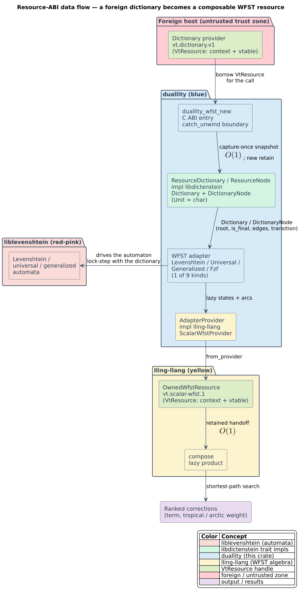

# duallity C binding

The C17/C23 facade adapts an immutable Unicode-scalar `vt.dictionary.v1`
snapshot into one of nine lazy edit/phonetic weighted finite-state transducers
(WFSTs) and exports the result as `vt.scalar-wfst.1`. The project surface has
eight `duallity_*` functions in [`duallity.h`](../../include/duallity.h); the
normative semantics are in the
[resource ABI reference](../../docs/architecture/06-resource-abi-and-bindings.md).

## Installation and loading

Install the staged native CMake/pkg-config package, or build the FFI library in
the repository's sibling-family layout. The executable evidence runs the full
four-library path:

```sh
bindings/c/tests/build-and-run.sh
```

At dynamic-load time, require exact `duallity_abi_version()` equality and an
`duallity_api_revision()` at least as new as the header. `duallity.h` includes
`vinary_tree_interop.h`; override `VT_INTEROP_HEADER` only when the build system
deliberately relocates that canonical family header.

## Executable conformance evidence

[`family_pipeline.c`](tests/family_pipeline.c) is compiled and executed by CI
against four separately built shared libraries. It constructs a Dynamic DAWG
in libdictenstein, captures it in duallity, composes the lazy WFST with an
lling-llang case map, compares its complete result set with liblevenshtein, then
repeats teardown in both ownership orders. The fixture verifies exact counts,
distances, terms, post-capture mutation isolation, and a zero retain ledger.



## API, selectors, and domains

| Element | Contract |
|---|---|
| `duallity_wfst_new` | Borrows a dictionary resource for the call, captures one immutable snapshot, validates the query/selectors, and returns an owned WFST handle. |
| `duallity_wfst_new_ref` | Provides identical semantics through a pointer to the borrowed dictionary aggregate for foreign-function interfaces that cannot pass `VtResource` by value. |
| `DuallityAlgorithm` | Standard, optimal-string-alignment transposition, merge-and-split, or unrestricted Damerau-Levenshtein; consumed only by the Levenshtein kind. |
| `DuallityWfstKind` | Levenshtein; three universal; four generalized including phonetic; or FZF. Each advertises its exact weight domain. |
| `duallity_wfst_resource` | Returns one independently retained `vt.scalar-wfst.1` resource. |
| `duallity_wfst_free` | Frees the project handle; previously exported resources remain valid. |
| `duallity_resource_release` | Releases exactly one resource retain. |

The dictionary must advertise Unicode-scalar units. Query input is
pointer-plus-byte-length UTF-8, so it may be non-NUL-terminated but must be
valid. Maximum-distance limits are kind-specific; universal/generalized state
encodings reject values beyond their represented range instead of truncating.

## Ownership and capture-once semantics

The dictionary argument is borrowed only until `duallity_wfst_new` returns.
Successful construction owns a snapshot retain; later dictionary mutation,
compaction, close, or checkpoint cannot alter the WFST's revision. A project
WFST and each exported resource are independent owners, so either can be
released first. Failed construction transfers no ownership.

Capture and resource handoff are `$`\mathcal{O}(1)`$; reachable WFST product
states expand lazily. The complete double-adapter sequence appears in
[`wfst-new-capture-compose-sequence.svg`](../../docs/diagrams/wfst-new-capture-compose-sequence.svg).

## Errors and failure containment

Every fallible call returns `DuallityStatus`. Branch on the enum, then copy
`duallity_last_error_message()` before another native call on that thread.
Invalid arguments/UTF-8, null pointers, contained panics, incompatible
resources, provider faults, and representation limits are distinct. No Rust
panic or foreign-provider fault is permitted to unwind across the C ABI.

## Concurrency and reentrancy

Distinct handles and immutable exported resources are reentrant. Do not race
free/release with an operation on the same owner. A foreign provider is
serialized by default unless it explicitly opts into parallel reentrancy;
duallity's internal lazy registries publish shared states without a
resource-wide traversal lock.

## Performance and marshalling

Pass retained resources rather than serializing dictionaries or WFST graphs.
State expansion is batched per state, labels remain `uint64_t` wire values,
and the adapter retains the dictionary snapshot rather than copying terms.
Measure end-to-end composition/search separately from constructor capture: a
cheap constructor intentionally defers product work to traversal.

## Security and provider trust

Treat the source vtable, counts, node IDs, labels, values, page offsets, query
length, and selectors as untrusted. The boundary validates interface identity,
version, domains, reserved fields, bounds, provider statuses, and resource
budgets before publication. See the
[threat model](../../docs/security/threat-model.md) and its
[foreign-provider boundary diagram](../../docs/diagrams/foreign-provider-trust-boundary.svg).

## Compatibility and troubleshooting

Project ABI/API versions, the family ABI/interface versions, package versions,
and persistent producer formats are independent. `INCOMPATIBLE_RESOURCE`
usually means a missing/wrong-version dictionary interface or a non-Unicode
domain. Loader failures usually mean the OS/CPU artifact, interop header, or
runtime search path is mismatched. Record exact selectors and the copied native
diagnostic before reducing a failure.

## Maintainer workflow

1. Update [`bindings/api.json`](../api.json) before changing selectors, symbols, or pins.
2. Extend the ABI architecture reference, threat model, and this facade guide.
3. Add positive, negative, fault-injection, mutation-isolation, and retain-ledger cases.
4. Run both binding gates and the four-cdylib family pipeline.
5. Stage native packages and validate the C and C++ consumers from installed metadata.
