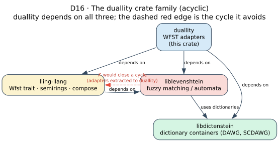

# 01 · Crate family and dependency graph

> **Prerequisites:** none — this is the entry point to the architecture section.
>
> **Defines:** the four-crate family duallity bridges, the provenance of the core traits, the
> dependency cycle duallity exists to break, what it re-exports from each sibling, and the migration
> path from liblevenshtein's old `wfst` module.

## 1. One crate, three siblings

duallity is **a single crate**, not a workspace and not a family of crates. Its
[`Cargo.toml`](../../Cargo.toml) declares a `[package]` (never a `[workspace]`), it carries its own
`Cargo.lock`, and it builds standalone with `cargo build` from its own directory. What makes it
interesting is not its size — it is deliberately small — but its *position*: it is the **connective
tissue** between three sibling crates, each with a single responsibility, and it is the only crate that
depends on all three at once.

The "crate family" is therefore **duallity plus its three dependencies**:

| Crate | Legend color | Responsibility | What duallity uses from it |
|-------|--------------|----------------|----------------------------|
| [**liblevenshtein**](https://github.com/vinary-tree/liblevenshtein-rust) | red-pink | fuzzy matching / automata | `Algorithm`; the universal automaton and its `PositionVariant` (`Standard` / `Transposition` / `MergeAndSplit`); `OperationSet` and `GeneralizedAutomaton`; the phonetic regex + NFA (`parse`, `compile`, `NFAChar`); and `wallbreaker`. |
| [**libdictenstein**](https://github.com/vinary-tree/libdictenstein) | green | dictionary containers | the `Dictionary` trait and its backends — `DynamicDawgChar` (and `DoubleArrayTrieChar`, …), `SubstringDictionary`, and `Scdawg` / SCDAWG. |
| [**lling-llang**](https://github.com/vinary-tree/lling-llang) | yellow | the WFST algebra | the `Wfst` / `LazyWfst` / `StateSource` / `LatticeBackend` traits, `TropicalWeight` (the tropical semiring `` $`\mathbb{T}`$ ``), `CachePolicy`, and `compose`. |
| **duallity** | blue | the WFST adapters (**this crate**) | — it wraps the first two so they satisfy the third. |

The colors above are the [shared documentation legend](../diagrams/README.md); every diagram in this
documentation paints these four concepts identically so the reader carries one mental model across the
whole corpus.

## 2. The core traits live in lling-llang

A recurring source of confusion is *where the WFST traits come from*. They are **defined in
lling-llang**, in its [`wfst`](https://github.com/vinary-tree/lling-llang) and `backend` modules;
duallity **implements** them and **re-exports** them for convenience. duallity introduces **no traits
of its own** — it contributes concrete *types* that satisfy lling-llang's contracts.

```text
lling-llang  defines   Wfst · LazyWfst · StateSource · LatticeBackend · Semiring · CachePolicy
                          │  (trait definitions — the algebra and its contracts)
                          ▼
duallity     implements  LevenshteinWfst · UniversalLevenshteinWfst · GeneralizedWfst ·
                         WallBreakerWfst · RewriteWfst · PhoneticWfst · PhoneticNfaWfst ·
                         LevenshteinStateSource · …· DictionaryBackend
                          │  (concrete types that honor the contracts)
                          ▼
duallity     re-exports  the trait names at the crate root, so downstream code can
                         `use duallity::{Wfst, LazyWfst, StateSource, …}` without also
                         naming lling-llang.
```

The precise trait contracts — the pre- and postconditions of every method — are the subject of
[architecture/02](02-wfst-trait-surface.md). This chapter is only concerned with *which crate owns
what*.

## 3. Why duallity is a *separate* crate

These adapters used to live behind a `wfst` **feature inside liblevenshtein**. That placement was
untenable, because **lling-llang already depends on liblevenshtein** (it uses liblevenshtein's automata
in its own `integration` layer). A `wfst` feature that pulled lling-llang back *into* liblevenshtein
would therefore close a **dependency cycle**:

```text
   ┌─────────────────────── wfst feature ───────────────────────┐
   │                                                             ▼
liblevenshtein ─────────────────────────────────────────►  lling-llang
   ▲                                                             │
   └───────────────────── already depends on ───────────────────┘
                              ✗  cycle
```

Cargo forbids cyclic crate dependencies outright; and even if it tolerated them, the cycle would weld
the two crates' release cadences together — neither could publish without the other. The fix is to
**lift the adapters out of liblevenshtein into a crate that sits above both**. That crate is duallity:



Because duallity is the **only** place where liblevenshtein and lling-llang meet, it is exactly the
right home for code that needs both. The resulting graph is a **directed acyclic graph (DAG)**: duallity
points at all three siblings, and — critically — **nothing points back at duallity**. Each crate can
now version independently, and the crate boundary falls exactly on the liblevenshtein
`` $`\rightleftarrows`$ `` lling-llang cut that would otherwise be a cycle.

## 4. What duallity re-exports from each sibling

duallity surfaces a **flat, convenient API at its crate root**, but it does *not* re-export all three
siblings uniformly. The only re-export block in [`lib.rs`](../../src/lib.rs) pulls from
`lling_llang::prelude`; liblevenshtein and libdictenstein are consumed **internally** and their types
are imported **directly** by downstream code when needed.

| Sibling | Re-exported through `duallity::*`? | Symbols |
|---------|-------------------------------------|---------|
| **lling-llang** | **yes** — for convenience, so callers need not also depend on lling-llang by name | `LazyState`, `LazyWfst`, `LazyWfstWrapper`, `Semiring`, `StateId`, `StateSource`, `TropicalWeight`, `VocabId`, `WeightedTransition`, `Wfst` |
| **liblevenshtein** | **no** — consumed internally by the adapters | callers who need `Algorithm`, `PositionVariant`, `GeneralizedAutomaton`, the phonetic NFA, or `wallbreaker` import them from `liblevenshtein` directly |
| **libdictenstein** | **no** — duallity is generic over the `Dictionary` trait | callers construct a `DynamicDawgChar`, `Scdawg`, etc. from `libdictenstein` and pass it in |

In practice a downstream program imports duallity's *own* types (`LevenshteinWfst`, `DictionaryBackend`,
…) and the re-exported lling-llang traits from `duallity`, and imports its dictionary from
`libdictenstein`:

```rust,ignore
use duallity::{LevenshteinWfst, DictionaryBackend};   // duallity's adapters
use duallity::{Wfst, LazyWfst, TropicalWeight};        // re-exported from lling_llang::prelude
use libdictenstein::dynamic_dawg::char::DynamicDawgChar; // the dictionary, imported directly
```

## 5. Migrating from liblevenshtein's old `wfst` module

The types did not change — only their **path** did. When the adapters lived behind liblevenshtein's
removed `wfst` feature they were namespaced under `liblevenshtein::wfst::…`; duallity re-exports them
**flat at its crate root**. The mechanical rule is:

```text
liblevenshtein::wfst::<any submodule>::<Type>   ─────►   duallity::<Type>
```

and, separately, every dictionary container moved out of liblevenshtein into **libdictenstein**:

```rust,ignore
// Old (liblevenshtein ≤ 0.8, behind the removed `wfst` feature)
use liblevenshtein::wfst::LevenshteinWfst;
use liblevenshtein::wfst::DictionaryBackend;
use liblevenshtein::dictionary::dynamic_dawg_char::DynamicDawgChar;

// New
use duallity::{LevenshteinWfst, DictionaryBackend};
use libdictenstein::dynamic_dawg::char::DynamicDawgChar; // note: dynamic_dawg::char, not dynamic_dawg_char
```

The full mapping (adapters flatten to `duallity::*`; dictionaries move to `libdictenstein::*`):

| Old path | New path |
|----------|----------|
| `liblevenshtein::wfst::LevenshteinWfst` | `duallity::LevenshteinWfst` |
| `liblevenshtein::wfst::state_source::LevenshteinStateSource` | `duallity::LevenshteinStateSource` |
| `liblevenshtein::wfst::DictionaryBackend` | `duallity::DictionaryBackend` |
| `liblevenshtein::wfst::universal_wrapper::{UniversalLevenshteinWfst, BoundUniversalWfst}` | `duallity::{UniversalLevenshteinWfst, BoundUniversalWfst}` |
| `liblevenshtein::wfst::universal_state_source::UniversalLevenshteinStateSource` | `duallity::UniversalLevenshteinStateSource` |
| `liblevenshtein::wfst::RewriteWfst` | `duallity::RewriteWfst` |
| `liblevenshtein::wfst::generalized_wfst::*` | `duallity::{GeneralizedWfst, GeneralizedWfstBuilder}` |
| `liblevenshtein::wfst::wallbreaker_wfst::WallBreakerWfst` | `duallity::{WallBreakerWfst, WallBreakerWfstBuilder}` |
| `liblevenshtein::wfst::phonetic_wfst::PhoneticWfst` † | `duallity::PhoneticWfst` |
| `liblevenshtein::wfst::phonetic_nfa_wfst::PhoneticNfaWfst` † | `duallity::PhoneticNfaWfst` |
| `liblevenshtein::dictionary::dynamic_dawg_char::DynamicDawgChar` | `libdictenstein::dynamic_dawg::char::DynamicDawgChar` |
| `liblevenshtein::dictionary::scdawg::Scdawg` | `libdictenstein::scdawg::Scdawg` |

† The phonetic Levenshtein and phonetic-NFA adapters are gated behind the
[`phonetic-rules` feature](#6-version-matrix-and-msrv); enable it to make these paths available.

## 6. Version matrix and MSRV

duallity **4.0.0-rc.5** (edition 2021) is built against the versions declared in its
[`Cargo.toml`](../../Cargo.toml) and pinned by its own `Cargo.lock`:

| Dependency | Version requirement |
|------------|---------------------|
| liblevenshtein | `0.9` |
| lling-llang | `0.2` |
| libdictenstein | `0.2` |
| **rustc (MSRV)** | **`1.70`** |

Beyond the three siblings, duallity pulls three small direct dependencies used by the relocated `wfst`
sources: `rustc-hash` (the `FxHashMap` used throughout the caches and registries), `smallvec` (the
inline `` $`\le 4`$ ``-transition buffers of a Levenshtein cell), and `rand` (sampling and universal
automata). The optional `phonetic-rules` feature turns on the phonetic variants and additionally
enables `liblevenshtein/phonetic-rules`; see
[guides/README · Feature flags](../guides/README.md) for what each feature turns on.

---

## References

The dependency-inversion rationale in §3 — lifting shared code into a crate above two mutually
interested libraries to keep the graph acyclic — is the crate-level analogue of the **Dependency
Inversion** and **Acyclic Dependencies** principles catalogued by Martin [13]. The WFST algebra that
lling-llang defines and duallity satisfies is Mohri's [6, 7].

6. **Mohri, M.** (1997). *Finite-State Transducers in Language and Speech Processing.* Computational
   Linguistics 23(2), 269–311.
7. **Mohri, M., Pereira, F., & Riley, M.** (2002). *Weighted Finite-State Transducers in Speech
   Recognition.* Computer Speech & Language 16(1), 69–88.
   [doi:10.1006/csla.2001.0184](https://doi.org/10.1006/csla.2001.0184).
13. **Martin, R. C.** (2000). *Design Principles and Design Patterns* — the Acyclic Dependencies and
    Dependency Inversion principles. Object Mentor.

Entries [6] and [7] are mirrored in the [bibliography](../references/bibliography.md); [13] is
introduced here for the packaging argument and should be added to the bibliography when it is next
revised.
