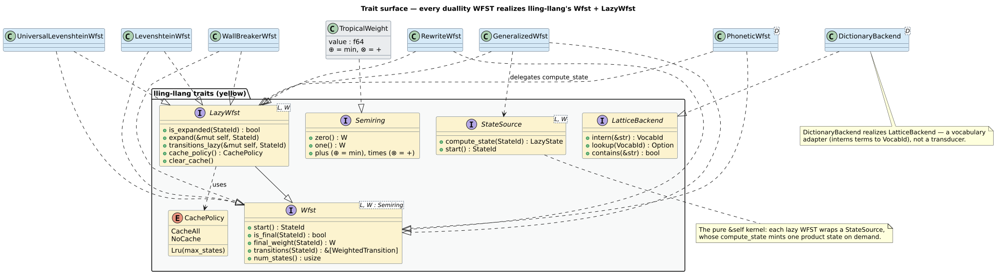

# 02 · The WFST trait surface

> **Prerequisites:** [architecture/01](01-crate-family-and-dependency-graph.md) (the traits are defined
> in lling-llang; duallity implements them) and the [tropical semiring](../theory/01-semirings-and-wfsts.md)
> (`` $`\mathbb{T} = (\mathbb{R} \cup \{+\infty\},\ \min,\ +,\ +\infty,\ 0)`$ ``).
>
> **Defines:** the four `lling_llang` traits every duallity WFST implements — `Wfst`, `LazyWfst`,
> `StateSource`, `LatticeBackend` — the `CachePolicy` enum they share, and the exact pre-/postconditions
> of every method.

duallity implements **four `lling_llang` traits**. Three describe a transducer from complementary
angles — the *eager* read-only view (`Wfst`), the *lazy* on-demand view (`LazyWfst`), and the *pure
computation kernel* (`StateSource`) — and one (`LatticeBackend`) adapts a dictionary to lling-llang's
vocabulary infrastructure. All are generic over a **label type `` $`L`$ `` (always `char` here)** and a
**`Semiring` weight `` $`W`$ `` (always `TropicalWeight`)**. duallity adds no traits of its own; it
supplies concrete *types* that satisfy these contracts.

The class diagram below is the map: the three transducer traits and their inheritance
(`LazyWfst : Wfst`), the `StateSource` kernel that feeds them, `LatticeBackend` off to the side, and the
duallity types that realize each — colored by owning crate (lling-llang yellow, duallity blue,
libdictenstein green) per the [shared legend](../diagrams/README.md).



> **Diagram status.** `wfst-trait-surface-class.svg` is a **new PlantUML class diagram** proposed by
> this chapter (catalog id **D18**); the placeholder embed above is intentional. It is *not yet
> authored* — see the [flag at the end of this chapter](#new-diagram-to-author).

Throughout, remember the tropical **[naming gotcha](../theory/README.md#semirings-and-weights)**:
`TropicalWeight::zero()` is the value `` $`+\infty`$ `` (the additive identity `` $`\bar{0}`$ ``, "no
path"), and `TropicalWeight::one()` is `` $`0`$ `` (the multiplicative identity `` $`\bar{1}`$ ``, "a
free step"). The method names follow the algebraic role, not the numeric value.

## 1. `Wfst<L, W>` — the eager view

```rust,ignore
pub trait Wfst<L, W: Semiring>: Clone + Send + Sync {
    fn start(&self) -> StateId;
    fn is_final(&self, state: StateId) -> bool;
    fn final_weight(&self, state: StateId) -> W;
    fn transitions(&self, state: StateId) -> &[WeightedTransition<L, W>];
    fn num_states(&self) -> usize;
    // provided: is_valid_state, num_transitions, total_transitions, is_empty, state(...)
}
```

`Wfst` is the **read-only** face of a transducer. A `WeightedTransition<char, TropicalWeight>` bundles
`from`, `input: Option<char>`, `output: Option<char>`, `to`, and `weight` — the
`` $`\text{in} : \text{out} / w`$ `` arc of [theory/03](../theory/03-levenshtein-as-transducer.md), with
`` $`\varepsilon`$ `` encoded as `None` on a tape. The supertrait bounds `Clone + Send + Sync` mean every
WFST can be cheaply cloned and shared across threads.

The **critical property** of `Wfst` for duallity is that it reads **only what has already been
computed**. Because duallity's WFSTs are lazy, the eager accessors are a *pure function of the cache*;
they never expand a state to answer a query. This is the source of the pitfall in §4.

| Method | Preconditions | Postconditions (duallity semantics) |
|--------|---------------|-------------------------------------|
| `start() -> StateId` | none | Returns the initial state id — the [encoding](03-state-encoding-and-product-space.md) `` $`d \cdot M + a`$ `` of the root dictionary node and start automaton state (`0` for the parameterized adapters). Total; never expands. |
| `is_final(s) -> bool` | any `` $`u32`$ `` accepted | `true` iff `s` is **cached** as final. The parameterized wrappers (`LevenshteinWfst`, `UniversalLevenshteinWfst`) additionally answer from the state source without a full expand (they call `final_weight_for_state(s)`); the generic wrapper and self-sourcing variants return `false` until `s` is computed. Never mutates. |
| `final_weight(s) -> W` | any `` $`u32`$ `` | The tropical final weight if `s` is final; otherwise `TropicalWeight::zero()` = `` $`\bar{0} = +\infty`$ `` ("not final / no path"). Same source-fallback caveat as `is_final`. |
| `transitions(s) -> &[…]` | any `` $`u32`$ `` | The cached outgoing arcs of `s`, as a slice borrowed from `&self`. **`&[]` for any state not yet expanded** (and for invalid states). This is the method callers most often misuse — see §4. |
| `num_states() -> usize` | none | For a lazy WFST this is **not** the full product cardinality; the parameterized wrappers return `` $`\max(\texttt{num\_states\_hint},\ \texttt{registered\_state\_id\_span})`$ `` — an upper bound on live ids, not a count of reachable states. |
| `is_valid_state(s) -> bool` *(provided; overridden)* | none | Default is `(s as usize) < num_states()`; duallity **overrides** it to `state_source.is_valid_product_state(s)`, which decodes `s` into `` $`(d, a)`$ `` and range-checks the components. Validity means *encodable*, not *already counted*. |
| `num_transitions(s) -> usize` *(provided)* | none | `transitions(s).len()` — therefore `0` before `s` is expanded. |
| `total_transitions() -> usize` *(provided; overridden)* | none | duallity overrides to `cache.total_cached_transitions()` — the sum over **cached** states only, not the whole product. |
| `is_empty() -> bool` *(provided; overridden)* | none | duallity overrides to `false`: a Levenshtein WFST always has at least a start state. |
| `state(s) -> Option<WfstState>` *(provided)* | `L: Clone` | `None` if `!is_valid_state(s)`; otherwise a snapshot built from `is_final`/`final_weight`/`transitions`, so it too carries empty transitions before `s` is expanded. |

**Implemented by** (the eager view of every variant): `LevenshteinWfst`, `UniversalLevenshteinWfst`,
`GeneralizedWfst`, `WallBreakerWfst`, `RewriteWfst`, and — under `phonetic-rules` — `PhoneticWfst` and
`PhoneticNfaWfst`. The generic `LazyWfstWrapper<S, L, W>` (re-exported from lling-llang) also implements
`Wfst`, and is how a bare `StateSource` becomes a `Wfst` for composition.

## 2. `LazyWfst<L, W>` — the lazy view

```rust,ignore
pub trait LazyWfst<L, W: Semiring>: Wfst<L, W> {
    fn is_expanded(&self, state: StateId) -> bool;
    fn expand(&mut self, state: StateId);
    fn transitions_lazy(&mut self, state: StateId) -> &[WeightedTransition<L, W>];
    fn cache_policy(&self) -> CachePolicy;
    fn set_cache_policy(&mut self, policy: CachePolicy);
    fn computed_states(&self) -> usize;
    fn clear_cache(&mut self);
}
```

`LazyWfst` is the interface **most direct callers use**. Its methods take `&mut self` because expansion
mutates the cache (and, for some variants, a state registry). `transitions_lazy(s)` is the fix for the
§4 pitfall: it **expands `s` and then returns its arcs**, whereas the inherited eager `transitions(s)`
only reads the cache.

| Method | Preconditions | Postconditions (duallity semantics) |
|--------|---------------|-------------------------------------|
| `is_expanded(s) -> bool` | none | `true` iff `s` is **resident in the persistent cache**. Under `NoCache` (and `Lru { max_states: 0 }`) states live only in a one-slot scratch buffer, which `is_expanded` does **not** count, so it returns `false` even immediately after `expand(s)`. |
| `expand(s)` | none | Computes `s` (if not resident) via the state source and stores it per the active [`CachePolicy`](#5-cachepolicy). **Idempotent**: re-expanding a cached state is a touch, not a recompute. A `s` that decodes to an **invalid** product state is a **no-op** (nothing is inserted). |
| `transitions_lazy(s) -> &[…]` | none | Ensures `s` is computed, then returns its arc slice (borrowed from `&mut self`). The returned slice reflects the freshly computed state. **Complexity: amortized `` $`O(1)`$ `` cache access** — see the note below. |
| `cache_policy() -> CachePolicy` | none | The currently active policy. |
| `set_cache_policy(p)` | none | Installs `p` **and clears the cache** (`LazyStateCache::set_policy` calls `clear()` then re-reserves capacity). Switching policy therefore *drops all memoized states*; set the policy once, up front. |
| `computed_states() -> usize` | none | For duallity's wrappers this is the **current resident count** (`cache.len()`), not a monotone lifetime total. (The generic `LazyWfstWrapper` instead reports total-ever-computed; the distinction matters when you compare the two.) |
| `clear_cache()` | none | Empties the persistent entries, the scratch slot, and the LRU bookkeeping (resetting the access clock). The state source is untouched, so subsequent access recomputes. |

### Complexity of `transitions_lazy` — amortized `` $`O(1)`$ ``

The cost decomposes into a **cache-access** term and a **miss** term:

```math
\underbrace{T_{\text{lazy}}(s)}_{\text{one call}}
\;=\;
\underbrace{T_{\text{probe}}}_{\text{always}}
\;+\;
\bigl[\, s \notin \text{cache} \,\bigr]\cdot
\underbrace{\bigl(T_{\text{compute}}(s) + T_{\text{insert}}\bigr)}_{\text{on a miss}} .
```

- **Cache access** (`touch_if_cached`) is a single `FxHashMap` probe: **amortized `` $`O(1)`$ ``**. Under
  `Lru`, a hit also records a fresh access tick by pushing onto a binary heap (`` $`O(\log c)`$ ``
  amortized for the *tick-maintenance*, with lazy heap compaction; the *lookup itself* stays `` $`O(1)`$ ``).
  Under `CacheAll` and `NoCache` there is no heap upkeep, so the whole access is `` $`O(1)`$ ``.
- **On a miss**, add `` $`T_{\text{compute}}(s)`$ `` — the state source's `compute_state`, which for a
  **standard Levenshtein cell is `` $`O(1)`$ ``** (it emits at most four transitions —
  match / substitute / insert / delete — from an inline `SmallVec<[_; 4]>` with no heap allocation) — plus
  an `` $`O(1)`$ `` amortized insert (`CacheAll`) or an `` $`O(\log c)`$ `` evict-then-insert (`Lru`).

So a **hot traversal that revisits states pays amortized `` $`O(1)`$ `` per touch**, and a cold traversal
pays the bounded-fan-out `compute_state` once per distinct state — the essence of laziness quantified in
[guides/05 §2](../guides/05-performance-and-tuning.md#2-cost-model).

The first touch of a state and the subsequent cache hit are traced below:


**Implemented by** the same set as `Wfst`: `LevenshteinWfst`, `UniversalLevenshteinWfst`,
`GeneralizedWfst`, `WallBreakerWfst`, `RewriteWfst`, `PhoneticWfst` and `PhoneticNfaWfst` (both under
`phonetic-rules`), and the generic `LazyWfstWrapper`.

## 3. `StateSource` — the computation kernel

```rust,ignore
pub trait StateSource<L, W: Semiring>: Clone + Send + Sync {
    fn compute_state(&self, state: StateId) -> LazyState<L, W>;
    fn start(&self) -> StateId;
    fn num_states_hint(&self) -> Option<usize> { None }  // provided
}
```

A `StateSource` is the **pure, immutable core** that knows how to compute *one* state on demand. It
returns a `LazyState`, which is either

```rust,ignore
LazyState::Computed { is_final: bool, final_weight: W, transitions: SmallVec<[WeightedTransition<L, W>; 4]> }
// ── or ──
LazyState::Pending   // the state is out of range / not defined
```

Because `compute_state` takes **`&self`**, a state source can be wrapped in a `LazyWfstWrapper<S, L, W>`
and dropped straight into [`compose`](../theory/04-composition.md): the composition search calls
`compute_state` as it visits product states, with **no `&mut` plumbing**. This immutability is exactly
what makes lazy composition cheap ([architecture/04 §7](04-lazy-evaluation-and-caching.md#7-the-immutable--mutable-split)).

| Method | Preconditions | Postconditions |
|--------|---------------|----------------|
| `compute_state(s) -> LazyState` | none | `LazyState::Computed { … }` for a valid, reachable product state; `LazyState::Pending` for an out-of-range/undefined `s`. **Referentially transparent**: the same `s` yields the same result. Interior registries (for `GeneralizedWfst`) may *grow* to mint newly discovered ids, but the growth is append-only interning and does not change any previously returned state. |
| `start() -> StateId` | none | The initial state id, identical to the wrapping WFST's `start`. |
| `num_states_hint() -> Option<usize>` *(provided)* | none | A **reservation hint, not a semantic bound**. `Some(n)` only when the underlying dictionary reports `len()` cheaply; unknown-size backends propagate `None` rather than invent a size that could over-reserve memory. |

### Two roles: wrapped sources vs. self-sourcing variants

duallity splits into two implementation styles, and the class diagram (D18) makes the split explicit:

| Style | State source (the kernel) | WFST (the cache) | How `compute_state(&self)` stays immutable |
|-------|---------------------------|------------------|--------------------------------------------|
| **Wrapped source** | `LevenshteinStateSource`, `UniversalLevenshteinStateSource`, `PhoneticStateSource` | separate wrapper (`LevenshteinWfst`, `UniversalLevenshteinWfst`, `PhoneticWfst`) that *holds* the source plus a `LazyStateCache` | the source is a plain immutable value; the cache lives in the wrapper |
| **Self-sourcing** | the WFST *is* its own source — `GeneralizedWfst`, `WallBreakerWfst`, `RewriteWfst`, `PhoneticNfaWfst` implement **both** `LazyWfst` and `StateSource` | same object | `GeneralizedWfst` keeps its node / product / continuation registries behind `Arc<RwLock<_>>`, so it can register newly discovered states while satisfying the `&self` signature; `WallBreakerWfst` instead **pre-registers its finite result-chain state forest at construction** (WallBreaker has already materialized the accepted terms), making `compute_state` fully functional and allocation-free |

**Implemented by**: `LevenshteinStateSource`, `UniversalLevenshteinStateSource`,
`PhoneticStateSource` (under `phonetic-rules`), and the self-sourcing `GeneralizedWfst`,
`WallBreakerWfst`, `RewriteWfst`, and `PhoneticNfaWfst`.

## 4. Pitfall: eager reads see `&[]` / `false` / `zero()` before `expand`

This is the single most common mistake against the trait surface. Because the eager `Wfst` accessors
read **only the cache**, calling them on a fresh WFST — before any expansion — returns the *empty* view,
**not** an error and **not** the true state:

```rust,ignore
use duallity::{LevenshteinWfst, Wfst, LazyWfst};
use libdictenstein::dynamic_dawg::char::DynamicDawgChar;

let dict = DynamicDawgChar::<()>::from_terms(vec!["hello", "help"]);
let mut wfst = LevenshteinWfst::new(&dict, "helo", 2);
let start = wfst.start();

// ✗ WRONG — eager read before expansion:
assert!(wfst.transitions(start).is_empty()); // &[]  — the start state has *not* been computed yet
// (is_final / final_weight may still answer here, because the parameterized
//  wrappers consult the state source for finality — but transitions() is cache-only.)

// ✓ RIGHT — drive expansion through the lazy view first:
let arcs = wfst.transitions_lazy(start);      // expands start, then returns its arcs
assert!(!arcs.is_empty());
```

**Symptom.** A traversal that "finds nothing": every state looks like a dead end because
`transitions(s)` is `&[]`, `is_final(s)` is `false`, and `final_weight(s)` is
`TropicalWeight::zero()` (`` $`+\infty`$ ``) for states that were read but never expanded.

**Root cause.** The eager view is a pure function of the cache. `transitions()` is **universally** `&[]`
before expansion, for *every* variant. `is_final()`/`final_weight()` return `false`/`` $`\bar{0}`$ `` before
expansion for the generic `LazyWfstWrapper` and the self-sourcing variants; the parameterized
`LevenshteinWfst`/`UniversalLevenshteinWfst` opportunistically answer finality from their state source,
but you must never *rely* on that difference.

**Fix — pick the right driver for your access pattern:**

1. **Direct traversal** — use the `LazyWfst` methods (`transitions_lazy`, `expand`) so each state is
   computed on first touch. This is what a hand-written best-first or shortest-path search should call.
2. **Composition** — do **not** hand-drive expansion at all. Wrap the `StateSource` in a
   `LazyWfstWrapper` (or hand the self-sourcing WFST directly to `compose`); the composition search
   invokes `compute_state` as it discovers product states:

   ```rust,ignore
   use duallity::{LevenshteinStateSource, LazyWfstWrapper};
   let source = LevenshteinStateSource::new(&dict, "helo", 2);
   let lazy   = LazyWfstWrapper::new(source);   // now a Wfst driven by compose(...)
   ```

The rule of thumb: **if you are reading a state you did not expand, you are holding the trait wrong.**

## 5. `CachePolicy`

```rust,ignore
pub enum CachePolicy {
    CacheAll,                       // default — keep every computed state
    Lru { max_states: usize },      // evict the least-recently-used state past the bound
    NoCache,                        // recompute every time; keep only a one-state scratch slot
}
```

`CachePolicy` (defined in lling-llang, `#[derive(Default)]` = `CacheAll`) is the one knob that trades
**memory for recomputation**. It is honored identically by the generic `LazyWfstWrapper` and by
duallity's `LazyStateCache`.

| Variant | What it keeps | Eviction | `transitions_lazy` hit cost | Use when |
|---------|---------------|----------|------------------------------|----------|
| `CacheAll` *(default)* | every computed state, as a persistent entry | none | `` $`O(1)`$ `` | one-shot queries, batch jobs — the common case |
| `Lru { max_states }` | at most `max_states` persistent entries | least-recently-touched (smallest access tick) evicted before inserting a new state; deterministic | `` $`O(1)`$ `` lookup + `` $`O(\log c)`$ `` tick upkeep | long-lived / streaming services that must bound memory |
| `NoCache` | only a **one-state scratch slot** (the last expanded state) | n/a | recompute on every distinct touch | memory-critical, rarely-revisited states |

Two edge cases are worth stating precisely, because they are exercised by lling-llang's own unit tests
for `wfst/lazy.rs`:

- **`Lru { max_states: 0 }`** degrades to the transient one-slot behavior of `NoCache` in the generic
  wrapper; in duallity's `LazyStateCache` it falls back to the wrapper's configured
  `set_max_lru_states(n)` bound (clamped to `` $`\ge 1`$ ``).
- **`NoCache` still lets `transitions_lazy` return a borrowed slice**, because the last expanded state is
  retained in the scratch slot — you get the arcs without growing `computed_states()`.

The per-variant default bounds (`DEFAULT_MAX_CACHE_SIZE`) and the deterministic-LRU mechanics are
documented in [architecture/04 §4](04-lazy-evaluation-and-caching.md#4-cache-policy-and-deterministic-eviction);
the practical memory/CPU trade-off table is in
[guides/05 §3](../guides/05-performance-and-tuning.md#3-cache-policy). Set the policy **once, before
traversal** — recall from §2 that `set_cache_policy` clears the cache.

## 6. `LatticeBackend` — adapting a dictionary

The odd one out. `DictionaryBackend<D>` implements lling-llang's `LatticeBackend`, which is a
**vocabulary** adapter, **not** a transducer: it maps interned terms to `VocabId`s (`` $`u32`$ ``) for
lling-llang's lattice infrastructure.

```rust,ignore
pub trait LatticeBackend: Clone + Send + Sync {
    fn intern(&mut self, word: &str) -> VocabId;          // existing or fresh sequential id
    fn lookup(&self, id: VocabId) -> Option<&str>;
    fn vocab_size(&self) -> usize;
    fn contains(&self, word: &str) -> bool;               // cache ∪ underlying dictionary
    fn get_id(&self, word: &str) -> Option<VocabId>;      // cache only — never interns
    fn iter(&self) -> impl Iterator<Item = (VocabId, &str)>;
    fn supports_sharing(&self) -> bool { false }          // provided
}
```

| Method | Preconditions | Postconditions (`DictionaryBackend`) |
|--------|---------------|--------------------------------------|
| `intern(w) -> VocabId` | `&mut self` | Returns the existing id if `w` was interned before; otherwise assigns the next sequential id `` $`(= \texttt{vocab\_size})`$ `` and stores `w`. **Infallible**: if the `` $`u32`$ `` id space is exhausted it returns the reserved sentinel `VOCAB_ID_EXHAUSTED` (which `lookup` maps to `None`). Use `try_intern` to distinguish exhaustion from success. |
| `lookup(id) -> Option<&str>` | none | `Some(term)` if `id` was returned by a successful `intern`; `None` for an out-of-range id or the exhaustion sentinel. `` $`O(1)`$ `` (a `Vec` index). |
| `vocab_size() -> usize` | none | The number of **interned** terms (`id_to_word.len()`) — not the size of the underlying dictionary. |
| `contains(w) -> bool` | none | `true` if `w` is in the interning cache **or** in the underlying `Dictionary::contains(w)`. This is the union, so a dictionary term reports `true` even before it is interned. |
| `get_id(w) -> Option<VocabId>` | none | Cache-only: `Some(id)` iff `w` has already been interned; **never interns**, so a dictionary term that has not yet been interned returns `None` (contrast with `contains`). |
| `iter() -> impl Iterator<Item=(VocabId,&str)>` | none | Iterates the interned vocabulary only, in id order. |
| `supports_sharing() -> bool` *(provided)* | none | `false` for `DictionaryBackend` (structural sharing is a PathMap-backend feature). |

`DictionaryBackend` interns terms **lazily**, backing the forward map with
`FxHashMap<Arc<str>, VocabId>` and the reverse map with `Vec<Arc<str>>`, so the whole backend **clones
cheaply** (the `Arc<str>`s are shared, not copied). Because `contains` consults *both* the cache and the
dictionary, it is the right membership test for a candidate correction, while `get_id` is the right test
for "have I already assigned this term a lattice id?". See
[design/levenshtein-wfst §7 · DictionaryBackend](../design/levenshtein-wfst.md) for the
end-to-end usage in a lattice-rescoring pipeline.

---

## New diagram to author

This chapter introduces **one new diagram** that does not yet exist and must be authored:

- **D18 · `wfst-trait-surface-class`** (PlantUML class diagram; source
  `../diagrams/src/wfst-trait-surface-class.puml` → `../diagrams/wfst-trait-surface-class.svg`). It
  should render: the three transducer traits with the `LazyWfst ▷ Wfst` inheritance edge; `StateSource`
  as the kernel with a `LazyWfstWrapper ──▷ StateSource` composition/uses edge; `CachePolicy` as an
  enumeration associated with `LazyWfst`; `LatticeBackend` as a standalone interface; and realization
  edges from the duallity types (`LevenshteinWfst`, `UniversalLevenshteinWfst`, `GeneralizedWfst`,
  `WallBreakerWfst`, `RewriteWfst`, `PhoneticWfst`, `PhoneticNfaWfst`, `LevenshteinStateSource`,
  `DictionaryBackend`) to the traits they implement. Distinguish **wrapped-source** from
  **self-sourcing** variants (§3). Color by owning crate per the
  [shared legend](../diagrams/README.md) (lling-llang `#FCF3CF`, duallity `#D6EAF8`, libdictenstein
  `#D5F5E3`), and typeset any type-parameter math (`` $`\langle L, W\rangle`$ ``) with PlantUML
  `<latex>…</latex>`. Add it to the [diagram catalog](../diagrams/README.md#catalog) as D18 once
  rendered.

## References

The eager/lazy/kernel split and the immutability that makes lazy composition tractable are Mohri's
on-demand (lazy) composition, in which product states are materialized only as a shortest-distance
search reaches them [7, 8].

7. **Mohri, M., Pereira, F., & Riley, M.** (2002). *Weighted Finite-State Transducers in Speech
   Recognition.* Computer Speech & Language 16(1), 69–88.
   [doi:10.1006/csla.2001.0184](https://doi.org/10.1006/csla.2001.0184).
8. **Mohri, M.** (2009). *Weighted Automata Algorithms.* In *Handbook of Weighted Automata*, 213–254.
   Springer. [doi:10.1007/978-3-642-01492-5_6](https://doi.org/10.1007/978-3-642-01492-5_6).

Both are mirrored in the [bibliography](../references/bibliography.md).
