# 03 · State encoding and the product space

> **Prerequisites:** [architecture/02 · The WFST trait surface](02-wfst-trait-surface.md) (what a
> `StateId` is and who consumes it) and the [master notation](../theory/README.md#master-notation)
> (the symbols `` $`d`$ ``, `` $`a`$ ``, `` $`M`$ ``, `` $`n`$ ``, `` $`k`$ ``, `` $`c`$ ``, and
> `` $`\mathrm{StateId}`$ ``).
>
> **Defines:** how a duallity WFST names a state with a single `u32` `StateId`; the **two encoding
> regimes** — arithmetic product packing `` $`\mathrm{StateId} = d \cdot M + a`$ `` versus flat
> registry indices; the radix `` $`M`$ `` per engine; a full **bijection proof** for the arithmetic
> scheme; and the `is_valid_state` membership check.

## 1. Every duallity WFST walks two structures at once

A duallity WFST is the lazy product of a **dictionary** (a trie/DAWG of terms, from
[`libdictenstein`](https://github.com/vinary-tree/libdictenstein)) and an **automaton** (a
Levenshtein band, a universal-automaton position set, an NFA×Levenshtein product, a rewrite
continuation chain, …). A single logical state is therefore a **pair**:

```text
state  =  (dictionary component, automaton component)
```

`lling_llang` — the WFST algebra that runs `compose`, shortest-path search, and the visited-state
frontier — identifies states by one opaque `StateId` (`u32`) and knows nothing about pairs. duallity
must therefore collapse each pair into one `u32`, and recover the pair on demand, cheaply and without
collisions. Two different strategies do this, and **which one a WFST uses is the single most important
fact about its state space.**

## 2. The two state-ID regimes

> **Why two?** The dictionary component is *always* a dense id assigned by a node registry
> ([architecture/05](05-registries-and-interning.md)) — dictionary nodes have no inherent integer
> identity. The automaton component is where the engines diverge: some can *compute* it arithmetically
> from a lattice coordinate, others must *intern* an arbitrarily-shaped object (a position set, a
> frontier, an NFA subset) to a dense id. That difference selects the regime.

| Regime | `StateId` shape | Radix `` $`M`$ `` | Engines | Source of truth |
|--------|-----------------|-------------------|---------|-----------------|
| **A — arithmetic product packing** | `` $`d \cdot M + a`$ `` | yes | `LevenshteinWfst`, `UniversalLevenshteinWfst`, `PhoneticWfst` | `state_encoding` (`lib.rs`) + `state_source.rs`, `universal_state_source.rs`, `phonetic_state_source.rs` |
| **B — flat registry index** | `` $`\mathrm{StateId} = \mathrm{id}`$ `` (the interned index itself) | none | `PhoneticNfaWfst`, `GeneralizedWfst`, `WallBreakerWfst`, `RewriteWfst` | `phonetic_nfa_wfst.rs`, `generalized_wfst.rs`, `wallbreaker_wfst.rs`, `phonetic_rewrite_wfst.rs` |

**Regime A** packs the pair with the shared `state_encoding` module (§3). All three engines call the
*same* `state_encoding::try_encode` / `state_encoding::decode`. They differ only in **how the automaton
component `` $`a`$ `` is minted**:

- `LevenshteinWfst` computes `` $`a`$ `` **structurally** from a lattice coordinate
  `` $`(\text{query\_pos},\ \text{edit\_cost})`$ `` plus a continuation slot (§7). No registry is
  consulted for the automaton side, and the radix `` $`M_{\mathrm{lev}}`$ `` is the **exact** count of
  reachable automaton states, so `` $`a < M_{\mathrm{lev}}`$ `` holds by construction.
- `UniversalLevenshteinWfst` and `PhoneticWfst` **intern** `` $`a`$ `` in a registry
  (`UniversalStateRegistry`, `ProductStateRegistry` — [architecture/05](05-registries-and-interning.md)):
  the automaton component is an arbitrary set/frontier reduced to a dense id `` $`0, 1, 2, \ldots`$ ``.
  Here the radix `` $`M_{\mathrm{uni}}`$ `` / `` $`M_{\mathrm{phon}}`$ `` is a **generous upper bound**
  reserving id space per dictionary node; if a node ever mints `` $`a \ge M`$ ``, `try_encode` returns
  `None` and the offending edge is *pruned* rather than allowed to collide into the next node's band
  (the honest failure mode documented in [design/phonetic-wfst.md](../design/phonetic-wfst.md)).

**Regime B** never calls `state_encoding`. The whole WFST state is interned to a *single* dense `u32`
by one unified registry, so the `StateId` **is** the registry index and there is no radix, no `` $`d`$ ``,
and no `` $`a`$ `` to decode:

- `PhoneticNfaWfst` — lazy subset construction; `NfaStateRegistry` hands out `` $`0, 1, 2, \ldots`$ ``
  (`next_nfa_state_id`). See [design/phonetic-nfa-wfst.md](../design/phonetic-nfa-wfst.md).
- `GeneralizedWfst` — one `StateRegistry` interns *both* product states and multi-symbol emit
  continuations into a common id space (`next_state_id`).
- `WallBreakerWfst` — pre-registers its finite result-chain forest at construction into a dense
  `id_to_state` vector (WallBreaker has already materialized the accepted terms).
- `RewriteWfst` — state `` $`0`$ `` is the home state; ids `` $`1 \ldots C`$ `` are dense continuation
  states addressed through `continuation_end_offsets` / `continuation_lookup` (index `` $`\mathrm{id} - 1`$ ``).

The rest of this chapter details **Regime A** — the arithmetic scheme, its proof, and its radices —
because it is the one with a non-trivial encoding to get right. Regime B is "the id is the index," and
each flat engine's state forest is documented in its [design](../design/) chapter.

## 3. Regime A: the `state_encoding` module

`state_encoding` (a public module in `lib.rs`) is a pure, allocation-free mixed-radix codec shared by
the three product-packing engines:

```rust,ignore
// lib.rs — state_encoding
pub fn try_encode(
    dict_node: u32,
    automaton_state: u32,
    max_automaton_states: u32,        // the radix M
) -> Option<StateId> {
    if max_automaton_states == 0 || automaton_state >= max_automaton_states {
        return None;                  // domain guard: reject (d, a) with a ∉ [0, M)
    }
    dict_node
        .checked_mul(max_automaton_states)
        .and_then(|base| base.checked_add(automaton_state))   // overflow ⇒ None (prune)
}

pub fn decode(state_id: StateId, max_automaton_states: u32) -> Option<(u32, u32)> {
    if max_automaton_states == 0 {
        return None;                  // division guard: no product width
    }
    let automaton_state = state_id % max_automaton_states;    // a = StateId mod M
    let dict_node       = state_id / max_automaton_states;    // d = ⌊StateId / M⌋
    Some((dict_node, automaton_state))
}
```

`try_encode` is `` $`\varphi_M(d, a) = d \cdot M + a`$ `` with two guards (domain and overflow);
`decode` is `` $`\psi_M(s) = (\lfloor s / M \rfloor,\ s \bmod M)`$ `` with a zero-radix guard. The next
section proves these are mutual inverses.

<!-- Diagram D3 (state-encoding-bijection): source is currently D2 at diagrams/src/state-encoding-bijection.d2;
     the integrator is migrating it to PlantUML per the diagram-tooling policy. Keep this embed. -->


## 4. The encoding is a bijection (proof)

We prove that for any fixed radix `` $`M \ge 1`$ ``, encode and decode are mutually inverse, so no two
distinct valid pairs collide and every `StateId` decodes to exactly one pair.

**Definitions.** Fix `` $`M \in \mathbb{N}`$ `` with `` $`M \ge 1`$ ``. Let the **valid-pair domain**
be

```math
P_M \;=\; \bigl\{\, (d, a) \in \mathbb{N} \times \mathbb{N} \;:\; 0 \le a < M \,\bigr\},
```

and define encode `` $`\varphi_M : P_M \to \mathbb{N}`$ `` and decode
`` $`\psi_M : \mathbb{N} \to \mathbb{N} \times \mathbb{N}`$ `` by

```math
\varphi_M(d, a) \;=\; d \cdot M + a,
\qquad
\psi_M(s) \;=\; \bigl(\lfloor s / M \rfloor,\ s \bmod M\bigr).
```

**Lemma 1 (Division Theorem).** For every `` $`s \in \mathbb{N}`$ `` and every integer `` $`M \ge 1`$ ``
there exist **unique** `` $`q, r \in \mathbb{N}`$ `` with `` $`s = qM + r`$ `` and `` $`0 \le r < M`$ ``.

*Proof.* **Existence.** The set `` $`R = \{\, s - qM : q \in \mathbb{N},\ s - qM \ge 0 \,\}`$ `` is a
subset of `` $`\mathbb{N}`$ `` and is nonempty (take `` $`q = 0`$ ``, giving `` $`s \ge 0`$ ``). By the
well-ordering principle `` $`R`$ `` has a least element `` $`r = s - qM \ge 0`$ ``. If `` $`r \ge M`$ ``
then `` $`r - M = s - (q + 1)M \ge 0`$ `` lies in `` $`R`$ `` and is strictly smaller than `` $`r`$ ``,
contradicting minimality; hence `` $`0 \le r < M`$ ``. **Uniqueness.** Suppose
`` $`qM + r = q'M + r'`$ `` with `` $`0 \le r, r' < M`$ ``. Then `` $`(q - q')M = r' - r`$ ``, so
`` $`M \mid (r' - r)`$ ``; but `` $`\lvert r' - r \rvert < M`$ ``, which forces `` $`r' - r = 0`$ ``,
hence `` $`r = r'`$ `` and (since `` $`M \ge 1`$ ``) `` $`q = q'`$ ``. `` $`\blacksquare`$ ``

**Theorem 2 (encode/decode is a bijection).** For `` $`M \ge 1`$ ``:
`` $`\psi_M \circ \varphi_M = \mathrm{id}_{P_M}`$ `` and
`` $`\varphi_M \circ \psi_M = \mathrm{id}_{\mathbb{N}}`$ ``. Consequently `` $`\varphi_M`$ `` is a
bijection from `` $`P_M`$ `` onto `` $`\mathbb{N}`$ `` with inverse `` $`\psi_M`$ ``.

*Proof.* **Left inverse (`` $`\psi_M \circ \varphi_M = \mathrm{id}`$ ``).** Take `` $`(d, a) \in P_M`$ ``,
so `` $`0 \le a < M`$ ``. Then `` $`s := \varphi_M(d, a) = dM + a`$ `` is a representation of `` $`s`$ ``
with remainder in `` $`[0, M)`$ ``. By the **uniqueness** clause of Lemma 1, the quotient and remainder
of `` $`s`$ `` are exactly `` $`d`$ `` and `` $`a`$ ``, i.e. `` $`\lfloor s/M \rfloor = d`$ `` and
`` $`s \bmod M = a`$ ``. Hence `` $`\psi_M(\varphi_M(d, a)) = (d, a)`$ ``.

**Right inverse (`` $`\varphi_M \circ \psi_M = \mathrm{id}`$ ``).** Take `` $`s \in \mathbb{N}`$ `` and
let `` $`(q, r) = \psi_M(s)`$ ``. By Lemma 1 (**existence**), `` $`s = qM + r`$ `` with
`` $`0 \le r < M`$ ``, so `` $`(q, r) \in P_M`$ `` and `` $`\varphi_M(q, r) = qM + r = s`$ ``.

A function possessing a two-sided inverse is a bijection, and that inverse is unique; therefore
`` $`\varphi_M`$ `` is a bijection `` $`P_M \xrightarrow{\ \sim\ } \mathbb{N}`$ `` with
`` $`\varphi_M^{-1} = \psi_M`$ ``. `` $`\blacksquare`$ ``

**Corollary 3 (injective and surjective, explicitly).** *Injective:* if
`` $`\varphi_M(d_1, a_1) = \varphi_M(d_2, a_2)`$ ``, apply the left inverse to both sides to get
`` $`(d_1, a_1) = (d_2, a_2)`$ `` — distinct valid pairs never collide. *Surjective:* for any target
`` $`s \in \mathbb{N}`$ ``, `` $`\varphi_M(\psi_M(s)) = s`$ `` exhibits a preimage.

**Corollary 4 (the `u32` window and the guards).** duallity works in
`` $`\mathrm{StateId} \in [0, 2^{32})`$ ``. `try_encode(d, a, M)` realizes `` $`\varphi_M`$ `` with a
**domain guard** (`None` when `` $`M = 0`$ `` or `` $`a \ge M`$ ``, i.e. `` $`(d, a) \notin P_M`$ ``) and
an **overflow guard** (`checked_mul`/`checked_add` yield `None` when `` $`dM + a \ge 2^{32}`$ ``).
`decode(s, M)` realizes `` $`\psi_M`$ `` with a **division guard** (`None` iff `` $`M = 0`$ ``). On the
representable sub-domain `` $`P_M \cap \{(d,a) : dM + a < 2^{32}\}`$ ``, `try_encode` is thus an
injection into `` $`[0, 2^{32})`$ ``, and for every `` $`s \in [0, 2^{32})`$ `` the call `decode(s, M)`
returns the *unique* preimage — Theorem 2 restricted to the `u32` window. The degenerate radix
`` $`M = 0`$ `` has **empty** domain (no `` $`a`$ `` satisfies `` $`0 \le a < 0`$ ``) and an undefined
`` $`\psi_0`$ `` (division by zero), so **both** functions consistently return `None`.

The round-trip is asserted in `lib.rs` (`test_state_encoding_roundtrip`): for every `` $`(d, a)`$ `` in
a grid, `try_encode(d, a, M).and_then(|s| decode(s, M)) == Some((d, a))`. The guard behaviour is
asserted in `test_state_encoding_rejects_out_of_range_components`.

## 5. Choosing the radix `M`

`` $`M`$ `` must strictly exceed the largest reachable automaton component `` $`a`$ ``, or two pairs in
different bands would alias. Each product-packing engine sizes `` $`M`$ `` from its own automaton state
space. Below, `` $`n = \lvert q \rvert`$ `` is the query length (Unicode scalars), `` $`k`$ `` is
`max_distance`, and `` $`c`$ `` is the number of enabled continuation-state classes (§7).

| Engine | Radix `` $`M`$ `` | Where `` $`M`$ `` comes from | `` $`a`$ `` is… | `` $`M`$ `` is… |
|--------|-------------------|------------------------------|-----------------|-----------------|
| `LevenshteinWfst` | `` $`M_{\mathrm{lev}} = (n{+}1)(k{+}1)(1{+}c)`$ `` | `bounded_levenshtein_states(n, k) · (1 + continuation_state_kinds)` | structural `` $`(\text{query\_pos},\ \text{edit\_cost},\ \text{slot})`$ `` | an **exact** count |
| `UniversalLevenshteinWfst` | `` $`M_{\mathrm{uni}} = (n{+}1)^2 (2k{+}1)`$ `` | `estimate_automaton_states(n, k) · universal_query_state_factor(n)` | a `UniversalStateRegistry` dense id | a **generous bound** |
| `PhoneticWfst` | `` $`M_{\mathrm{phon}} = \max\bigl((k{+}1)\cdot 1000,\ 10000\bigr)`$ `` | `estimated_phonetic_product_states(k)` | a `ProductStateRegistry` dense id | a **generous bound** |

**Derivations.**

- `` $`M_{\mathrm{lev}}`$ ``: the normal lattice needs
  `` $`(n{+}1)(k{+}1)`$ `` ids — `` $`n{+}1`$ `` query positions `` $`\times`$ `` `` $`k{+}1`$ `` edit
  costs (`bounded_levenshtein_states`). The factor `` $`1 + c`$ `` reserves one disjoint contiguous
  range per enabled continuation class (§7): `` $`c = 0`$ `` for `Standard`, `` $`c = 1`$ `` for
  `Transposition` (Damerau), `` $`c = 2`$ `` for `MergeAndSplit`. Because the normal lattice is exact
  and continuations reuse the same `` $`(n{+}1)(k{+}1)`$ `` width, `` $`M_{\mathrm{lev}}`$ `` equals
  `max_automaton_states` and `` $`a < M_{\mathrm{lev}}`$ `` always holds.
- `` $`M_{\mathrm{uni}}`$ ``: `estimate_automaton_states(n, k)` returns the position–distance-lattice
  bound `` $`(n{+}1)(2k{+}1)`$ `` (at most `` $`O((n{+}1)(2k{+}1))`$ `` distinct universal states); it is
  multiplied by `` $`n{+}1`$ `` (`universal_query_state_factor`) because the universal state is paired
  with an explicit consumed-query cursor `` $`\in [0, n]`$ `` in the registry key. Hence
  `` $`M_{\mathrm{uni}} = (n{+}1)^2 (2k{+}1)`$ ``. This over-counts the *deduplicated* states, so it is a
  bound, not a census.
- `` $`M_{\mathrm{phon}}`$ ``: a deliberately loose reservation of frontier-id space per dictionary
  node — `` $`10\,000`$ `` for `` $`k \le 9`$ ``, growing as `` $`(k{+}1)\cdot 1000`$ `` beyond.

> ⚠️ **Bound vs. count.** For `LevenshteinWfst`, `` $`M_{\mathrm{lev}}`$ `` is *exact*: overflow can
> only occur in the **product** (`` $`d \cdot M_{\mathrm{lev}} \ge 2^{32}`$ ``, extreme
> `` $`n \cdot k`$ `` on a huge dictionary), and `try_encode` prunes that edge. For the two
> registry-interned engines, `` $`M`$ `` also caps the **automaton** component: an adversarial pattern
> that mints more than `` $`M`$ `` frontiers/states at one node has its overflow edges pruned. Both are
> silent narrowings, never collisions. The radix arithmetic itself saturates —
> `bounded_levenshtein_states` and `estimate_automaton_states` clamp to `` $`\texttt{u32::MAX}`$ `` via
> `saturating_nonzero_u32`, and `normal_automaton_states.saturating_mul(1 + c)` saturates — so an
> unrepresentable `` $`M`$ `` degrades gracefully instead of wrapping.

## 6. Worked example — `q = "helo"`, `k = 2`, `Standard`

Here `` $`n = 4`$ ``, `` $`k = 2`$ ``, `` $`c = 0`$ ``, so
`` $`M_{\mathrm{lev}} = (4{+}1)(2{+}1)(1{+}0) = 5 \cdot 3 = 15`$ ``. The normal automaton stride is
`` $`k + 1 = 3`$ `` and the normal automaton component decodes as
`` $`a = \text{query\_pos} \cdot 3 + \text{edit\_cost}`$ `` (slot `` $`0`$ ``, §7). The table walks
several pairs through `` $`\varphi_{15}`$ `` and `` $`\psi_{15}`$ ``:

| `` $`(d, a)`$ `` | `` $`\varphi_{15}(d,a) = 15d + a`$ `` | `` $`\psi_{15}(\cdot)`$ `` | automaton meaning of `` $`a`$ `` |
|------------------|--------------------------------------|---------------------------|----------------------------------|
| `` $`(0, 0)`$ `` | `` $`0`$ `` | `` $`(0, 0)`$ `` | `Normal{ pos: 0, cost: 0 }` — the start state `` $`q_0`$ `` |
| `` $`(1, 3)`$ `` | `` $`18`$ `` | `` $`(1, 3)`$ `` | `Normal{ pos: 1, cost: 0 }` (`` $`3 = 1\cdot 3 + 0`$ ``) |
| `` $`(3, 2)`$ `` | `` $`47`$ `` | `` $`(3, 2)`$ `` | `Normal{ pos: 0, cost: 2 }` (`` $`2 = 0\cdot 3 + 2`$ ``) |
| `` $`(2, 14)`$ `` | `` $`44`$ `` | `` $`(2, 14)`$ `` | `Normal{ pos: 4, cost: 2 }` (`` $`14 = 4\cdot 3 + 2`$ ``) — query consumed, at the bound |

The middle two rows share no `StateId` despite both mentioning node/automaton value `` $`2`$ ``, because
the radix keeps their bands disjoint — exactly the injectivity of Corollary 3. The **guard** rows:

| Call | Result | Reason |
|------|--------|--------|
| `try_encode(0, 15, 15)` | `None` | domain guard: `` $`a = 15 \ge M`$ `` |
| `try_encode(300_000_000, 0, 15)` | `None` | overflow guard: `` $`15 \cdot 300{,}000{,}000 = 4.5\times10^{9} > 2^{32}{-}1`$ `` |
| `try_encode(286_331_153, 0, 15)` | `Some(4_294_967_295)` | `` $`15 \cdot 286{,}331{,}153 = 2^{32}{-}1`$ ``, the last representable band |
| `decode(x, 0)` / `try_encode(_, _, 0)` | `None` | zero-radix guard (empty domain / division by zero) |

## 7. The nested Levenshtein automaton component

Regime A packs `` $`(d, a)`$ ``; for `LevenshteinWfst` the component `` $`a`$ `` is itself a mixed-radix
encoding, so the full state is a *three*-level positional number. `LevenshteinStateCodec`
(`state_source_support.rs`) lays out `` $`a`$ `` as

```math
a \;=\; \underbrace{\text{slot}}_{\in\,\{0,\dots,c\}} \cdot \underbrace{(n{+}1)(k{+}1)}_{\text{normal width}}
        \;+\; \underbrace{\text{query\_pos}}_{\in\,[0,n]} \cdot (k{+}1)
        \;+\; \underbrace{\text{edit\_cost}}_{\in\,[0,k]} .
```

Slot `` $`0`$ `` is the **normal** lattice `` $`\mathsf{Normal}(\text{pos}, \text{cost})`$ ``; the
remaining `` $`c`$ `` slots are one-step **continuation** states that finish a two-character edit —
`` $`\mathsf{TransposeSecond}`$ `` (Damerau), `` $`\mathsf{MergeSecond}`$ `` and
`` $`\mathsf{SplitSecond}`$ `` (merge-and-split). Reserving disjoint ranges instead of a diagonal-band
over-estimate keeps `` $`M_{\mathrm{lev}}`$ `` tight while preserving constant-time
`encode_automaton_state` / `decode_automaton_state`. The universal and phonetic engines skip this level
entirely: their `` $`a`$ `` is an opaque registry id, and the structure lives inside the interned
object.

## 8. `is_valid_state` — decode, then check registration

Because `` $`\psi_M`$ `` is total on `` $`[0, 2^{32})`$ ``, *every* `StateId` decodes to *some*
`` $`(d, a)`$ `` — but most of those pairs were never reached by the lazy frontier. `is_valid_state`
therefore decodes and then confirms **both components are registered** before the state is treated as
real:

```rust,ignore
// pattern shared by the Regime-A state sources (here: LevenshteinStateSource)
pub(crate) fn is_valid_product_state(&self, state: StateId) -> bool {
    let Some((dict_node_id, automaton_state_id)) = self.codec.decode_product_state(state) else {
        return false;                                   // M = 0 (never, in practice)
    };
    if self.codec.decode_automaton_state(automaton_state_id).is_none() {
        return false;                                   // a is in-range numerically but not a live lattice/slot coordinate
    }
    let registry = crate::read_lock(&self.node_registry);
    registry.get_node(dict_node_id).is_some()           // d was interned by expansion
}
```

`UniversalLevenshteinStateSource` and `PhoneticStateSource` do the same, additionally checking the
*state* registry (`state_registry.get_state(a).is_some()` / `product_state_registry`). These are hash
and vector lookups — cheap — but they no longer treat a *syntactically* decodable id as reachable.
Invalid ids return empty lazy transitions and are **not** cached
([architecture/04](04-lazy-evaluation-and-caching.md)), so a stray `StateId` cannot pollute the cache
or inflate `computed_states()`. (Regime-B engines answer validity by a single
`registry.get(id).is_some()` — the id *is* the index.)

## 9. Why pack at all?

Packing keeps the entire `lling_llang` machinery — `compose`, shortest-path, the visited-state
frontier, the cache — working in terms of one opaque `StateId`, with no knowledge that a state is
"really" a pair. The two-structure walk is duallity's private business; the encoding is the **seam**
that hides it. Regime A hides a *product*; Regime B hides an interned *object*. Both present the same
`u32`-keyed surface upward, which is exactly what lets a Levenshtein matcher, a universal automaton, a
phonetic product, and a WallBreaker result forest all compose with the same downstream language model.

## References

- **Knuth, D. E.** (1997). *The Art of Computer Programming, Vol. 2: Seminumerical Algorithms* (3rd
  ed.), §4.1 *Positional Number Systems*. Addison-Wesley. ISBN 978-0201896848 — the classic treatment
  of mixed-radix positional encodings, of which `` $`\varphi_M`$ `` is the two-digit case.
- **Schulz, K. U., & Mihov, S.** (2002). *Fast String Correction with Levenshtein Automata.* IJDAR
  5(1), 67–85. [doi:10.1007/s10032-002-0082-8](https://doi.org/10.1007/s10032-002-0082-8) — bibliography
  entry [3]; the position-set states the universal engine interns.
- Related duallity chapters: [architecture/04 · Lazy evaluation and caching](04-lazy-evaluation-and-caching.md),
  [architecture/05 · Registries and interning](05-registries-and-interning.md),
  [design/levenshtein-wfst.md](../design/levenshtein-wfst.md) (`` $`M_{\mathrm{lev}}`$ `` in context),
  [design/phonetic-wfst.md](../design/phonetic-wfst.md) (`` $`M_{\mathrm{phon}}`$ `` and its pruning
  failure mode), [design/phonetic-nfa-wfst.md](../design/phonetic-nfa-wfst.md) and
  [design/phonetic-rewrite-wfst.md](../design/phonetic-rewrite-wfst.md) (Regime B, flat ids).
