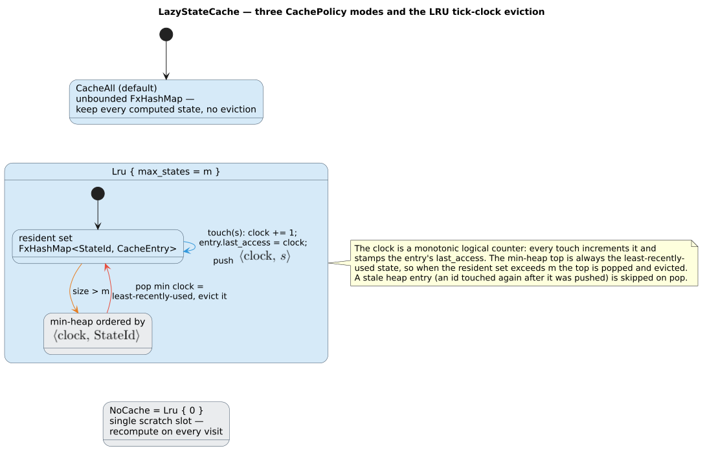

# 04 · Lazy evaluation and caching

> **Prerequisites:** [architecture/02 · The WFST trait surface](02-wfst-trait-surface.md) (the
> `Wfst` / `LazyWfst` / `StateSource` split and `CachePolicy`) and
> [architecture/03 · State encoding](03-state-encoding-and-product-space.md) (what a `StateId` decodes
> to).
>
> **Defines:** the `expand → compute_state → cache` pipeline; duallity's own
> `LazyStateCache` (`src/lazy_cache.rs`) — an `FxHashMap` + a deterministic-LRU `BinaryHeap` + a
> one-slot scratch; the three cache policies and their complexity; the per-variant
> `DEFAULT_MAX_CACHE_SIZE`; and the immutable-`StateSource` vs mutable-`LazyWfst` split.

## 1. Why lazy

The product state space (dictionary `` $`\times`$ `` automaton — [architecture/03](03-state-encoding-and-product-space.md))
is astronomically large and almost entirely unvisited by any single query. Materializing it would be
impossible; duallity instead computes a state **only on first touch** and memoizes the result. A query
that explores a few hundred states pays for a few hundred states, regardless of how many million the
dictionary could in principle induce. Laziness is not an optimization bolted on afterward — it is the
only reason a `` $`d \cdot M`$ ``-wide product is tractable at all.

## 2. The expansion pipeline

The first time a state `` $`s`$ `` is needed it flows through three layers; the second time it is served
straight from the cache.


1. The **wrapper** (`LevenshteinWfst`, `UniversalLevenshteinWfst`, `PhoneticWfst`, …) receives
   `expand(s)` / `transitions_lazy(s)` and asks its cache whether `` $`s`$ `` is already resident.
2. On a **miss**, the free function `ensure_cached_char_state` (`src/lazy_cache.rs`) drives the fill:

   ```rust,ignore
   // src/lazy_cache.rs
   pub(crate) fn ensure_cached_char_state<S, F>(
       cache: &mut LazyStateCache<CachedCharState>,
       state_source: &S,
       state: StateId,
       is_valid: F,
   ) where
       S: StateSource<char, TropicalWeight>,
       F: FnOnce(&S, StateId) -> bool,
   {
       if cache.touch_if_cached(state) { return; }          // ① already resident (and, under LRU, bumped)
       if !is_valid(state_source, state) { return; }        // ② unreachable id ⇒ never cache it
       if let Some(cached) = CachedCharState::from_lazy_state(state_source.compute_state(state)) {
           cache.insert(state, cached);                     // ③ compute once, memoize
       }
   }
   ```

   Step ② is the `is_valid_state` membership check from
   [architecture/03 §8](03-state-encoding-and-product-space.md#8-is_valid_state--decode-then-check-registration):
   an id that decodes syntactically but was never registered returns *no* transitions and is **never**
   inserted, so it cannot inflate `computed_states()` or evict a real state.
3. `compute_state(s)` decodes `` $`s`$ `` into its components, resolves them against the registries
   ([architecture/05](05-registries-and-interning.md)), and returns a
   `LazyState::Computed { is_final, final_weight, transitions }`, which is stored as a `CachedCharState`.

The cached record is compact:

```rust,ignore
// src/lazy_cache.rs
pub(crate) struct CachedCharState {
    pub(crate) is_final: bool,
    pub(crate) final_weight: TropicalWeight,
    pub(crate) transitions: SmallVec<[WeightedTransition<char, TropicalWeight>; 4]>,
}
```

`SmallVec<[_; 4]>` inlines up to four transitions — the exact branching of one Levenshtein cell
(**match** / **substitute** / **insert** / **delete**) — so the common case allocates nothing on the
heap. The cache keys these by the dense `u32` `StateId` with `rustc_hash::FxHashMap` (fast,
non-cryptographic hashing; the collision posture is analysed in
[security/hashing-and-collisions](../security/hashing-and-collisions.md)).

> **This is duallity's cache, not `lling_llang`'s.** `LazyWfstWrapper` (from `lling_llang`) is the
> *composition-time* adapter that exposes an immutable `StateSource` to `compose` (§7); it does **not**
> own the transition memo. Every duallity wrapper embeds its **own** `LazyStateCache<CachedCharState>`
> and answers `LazyWfst` directly. The two are complementary: `LazyWfstWrapper` lends `compose` a
> `&self` view, while `LazyStateCache` is the `&mut self`-guarded memo behind `transitions_lazy`.

## 3. `LazyStateCache` in full

`LazyStateCache<T>` (`src/lazy_cache.rs`) is a generic, deterministic, bounded memo:

```rust,ignore
// src/lazy_cache.rs
pub(crate) struct LazyStateCache<T> {
    entries: FxHashMap<StateId, CacheEntry<T>>,        // the resident set
    lru_heap: BinaryHeap<Reverse<(u64, StateId)>>,     // min-heap by (access tick, id)
    scratch: Option<(StateId, T)>,                     // the single NoCache slot
    clock: u64,                                        // monotonic logical access counter
    policy: CachePolicy,                               // CacheAll | Lru { max_states } | NoCache
    max_lru_states: usize,                             // fallback bound for Lru { max_states: 0 }
}

struct CacheEntry<T> { cached: T, last_access: u64 }
```

Five moving parts carry the whole design:

- **`entries`** — the resident memo, an `FxHashMap<StateId, CacheEntry<T>>`. `get`, `insert`, and
  membership are all `` $`O(1)`$ `` expected.
- **`lru_heap`** — a `BinaryHeap<Reverse<(u64, StateId)>>`. `Reverse` turns Rust's max-heap into a
  **min**-heap, so its top is the entry with the smallest access tick — the least-recently-used state,
  with ties broken by the smaller `StateId`. This is what makes eviction **deterministic** (§4).
- **`scratch`** — a single `Option<(StateId, T)>` slot used only under `NoCache`, so
  `transitions_lazy` can still return a borrowed slice for the *last* expanded state without ever
  growing the resident set.
- **`clock`** — a monotonic `u64` **logical** counter (not wall-clock time, not hash-iteration order).
  Every access mints the next tick via `next_tick`; ticks start at `` $`1`$ `` (`` $`0`$ `` marks
  "never touched under LRU").
- **`policy`** / **`max_lru_states`** — the active `CachePolicy` and the fallback bound used when the
  caller asks for `Lru { max_states: 0 }`. `new(max_lru_states)` clamps the fallback to at least
  `` $`1`$ `` and starts in `CacheAll`.

## 4. Cache policy and deterministic eviction

`CachePolicy` ([architecture/02 §5](02-wfst-trait-surface.md#5-cachepolicy)) chooses the memory
trade-off. `LazyStateCache::insert` branches on it:

| Policy | Behaviour on `insert` | Resident bound | LRU metadata touched? |
|--------|-----------------------|----------------|-----------------------|
| `CacheAll` | store in `entries` with `last_access = 0`; clear `scratch` | unbounded (all visited states) | no — `clock` stays `` $`0`$ ``, `lru_heap` stays empty |
| `Lru { max_states }` | evict down to room, then store with a fresh tick and push to `lru_heap` | `` $`\le`$ `` the effective limit | yes |
| `NoCache` | overwrite the one-slot `scratch`; `entries` stays empty | `` $`\le 1`$ `` | no |

> **Why the min-heap makes LRU deterministic.** A naive "evict some old entry" that iterated the
> `FxHashMap` would pick a victim in **hash order**, which is not reproducible across runs or across
> equal-content caches. `LazyStateCache` instead orders victims by the pair `` $`(\text{tick}, \text{id})`$ ``.
> Ticks come from a strictly increasing logical `clock`, so for a *given access sequence* the eviction
> order is a total order fixed run-to-run — identical inputs evict identically. This determinism is why
> the WFST's observable behaviour (which states remain expanded) does not depend on allocator or hash
> seed.

Three subtleties keep this correct and bounded:

- **Lazy heap deletion.** Re-touching a state under LRU pushes a *new* `(tick, id)` without removing the
  old one, so the heap can hold stale entries. `pop_lru_victim` discards any popped `(tick, id)` whose
  `tick` no longer equals the entry's current `last_access` (or whose id was removed), guaranteeing the
  victim is genuinely the least-recently-used **live** state.
- **Heap compaction.** `compact_lru_heap_if_needed` rebuilds the heap from `entries` once it exceeds
  `` $`\max(4\,\lvert\text{entries}\rvert,\ 64)`$ `` — so a hot state touched thousands of times cannot
  make the heap grow without bound (test `repeated_lru_touches_do_not_grow_heap_without_bound`).
- **Clock rollover.** If `clock` ever reaches `` $`\texttt{u64::MAX}`$ ``, `next_tick` calls
  `renumber_lru_ticks`, which sorts live entries by age and renumbers them densely from `` $`1`$ ``,
  preserving recency order (test `lru_clock_rollover_preserves_recency_order`). At one tick per access
  this is astronomically rare, but it keeps the invariant total.

The **scratch** slot deserves its own note: under `NoCache`, `insert` writes `scratch = Some((s, v))`
and clears nothing else, so `len()` (hence `computed_states()`) stays `` $`0`$ `` and `is_expanded`
always returns `false`, yet `get(s)` and `transitions_lazy(s)` still see the freshest state
(test `no_cache_keeps_only_scratch_state`). It is a one-entry cache that deliberately reports itself as
empty.

### Complexity

Let `` $`N`$ `` be the effective LRU limit and `` $`H = \lvert\text{lru\_heap}\rvert`$ ``; compaction
keeps `` $`H = O(N)`$ ``. `FxHashMap` operations are `` $`O(1)`$ `` expected.

| Operation | `CacheAll` | `Lru { max_states }` | `NoCache` |
|-----------|-----------|----------------------|-----------|
| `get` / `touch_if_cached` (hit) | `` $`O(1)`$ `` | `` $`O(\log H)`$ `` (re-touch pushes one tick) | `` $`O(1)`$ `` (slot compare) |
| `insert`, first touch | `` $`O(1)`$ `` amortized | `` $`O(\log H)`$ `` amortized + eviction | `` $`O(1)`$ `` (overwrite slot) |
| eviction of one victim | — (never) | `` $`O(\log H)`$ `` amortized (lazy, skips stale) | — |
| resident memory | `` $`O(\text{states visited})`$ `` | `` $`O(N)`$ `` | `` $`O(1)`$ `` |
| heap memory | `` $`0`$ `` (unused) | `` $`O(N)`$ `` | `` $`0`$ `` (unused) |

`CacheAll` is the cheapest per-op and the default; choose `Lru { max_states }` to cap memory on a huge
crawl, and `NoCache` for a streaming pass that never revisits a state.

### The eviction tick, as literate pseudocode

The following renders `insert` under `Lru { max_states }` together with the eviction helpers, in
Knuth's literate style (`` $`\gets`$ `` is assignment; `entries`, `lru_heap`, `clock` are the fields of
§3):

```text
⟨ Insert (s, v) under Lru{ max_states } ⟩ ≡
    limit ← lru_limit(max_states)                 ▷ max_states>0 ? max_states : max_lru_states, then max(·,1)
    if s ∉ entries then
        ⟨ Evict until there is room for one insertion ⟩
    t ← next_tick()                               ▷ a fresh, strictly larger logical tick
    entries[s] ← CacheEntry{ cached: v, last_access: t }
    push Reverse((t, s)) onto lru_heap
    ⟨ Compact lru_heap if it has grown too large ⟩
    scratch ← ∅

⟨ Evict until there is room for one insertion ⟩ ≡
    while |entries| ≥ limit do
        if not evict_one_lru() then break         ▷ nothing live left to evict

⟨ evict_one_lru() → bool ⟩ ≡
    victim ← pop_lru_victim()
    if victim = ∅ then                            ▷ heap held only stale ticks
        rebuild_lru_heap()                        ▷ regenerate from entries with last_access>0
        victim ← pop_lru_victim()
        if victim = ∅ then return false
    remove victim from entries
    return true

⟨ pop_lru_victim() → StateId | ∅ ⟩ ≡
    while lru_heap is nonempty do
        Reverse((t, s)) ← pop the minimum of lru_heap
        if s ∈ entries and entries[s].last_access = t then
            return s                              ▷ smallest live (tick, id) ⇒ least recently used
    return ∅                                       ▷ all popped ticks were stale

⟨ next_tick() → u64 ⟩ ≡
    if clock = u64::MAX then renumber_lru_ticks() ▷ dense renumber, preserving recency order
    clock ← max(clock + 1, 1)                      ▷ ticks are ≥ 1; 0 means "untouched"
    return clock
```

The guard `entries[s].last_access = t` in `pop_lru_victim` is the entire lazy-deletion mechanism: a
stale heap record (left behind by a re-touch) fails the equality and is silently dropped, so the first
record that *passes* is provably the least-recently-used live entry.

### Default bounds per variant

`Lru { max_states: 0 }` delegates to the wrapper's configured fallback, and `set_max_cache_size`
updates it. Each wrapper seeds `LazyStateCache::new(DEFAULT_MAX_CACHE_SIZE)`:

| Variant(s) | `DEFAULT_MAX_CACHE_SIZE` |
|------------|--------------------------|
| `LevenshteinWfst`, `UniversalLevenshteinWfst`, `PhoneticWfst`, `GeneralizedWfst`, `WallBreakerWfst` | `100_000` |
| `PhoneticNfaWfst` | `50_000` |
| `RewriteWfst` | `10_000` |

`max_states = 0` falls back to that bound (test `lru_zero_policy_uses_configured_bound`); a positive
`max_states` is used directly. Large limits are treated as *speculative* preallocation and clamped to
`MAX_SPECULATIVE_PREALLOCATION = 16_384` up front so `Lru { max_states: usize::MAX }` does not try to
reserve four billion slots (test `lru_policy_treats_large_limits_as_speculative_reservations`).

<!-- NEW diagram D-lru (cache-policy-lru-eviction): PLACEHOLDER — the SVG does not exist yet.
     Integrator: author diagrams/src/cache-policy-lru-eviction.puml (PlantUML) illustrating the
     BinaryHeap<Reverse<(clock,StateId)>> deterministic eviction tick (insert → next_tick → push →
     evict_one_lru → pop_lru_victim skipping stale ticks), colored per the shared legend
     (duallity = blue, weight/tick = gray, evicted victim = red), then render to
     diagrams/cache-policy-lru-eviction.svg and register it in diagrams/README.md's catalog. -->


## 5. First touch vs. second touch — a trace

Take a fresh `LevenshteinWfst` for `q = "helo"`, `k = 2`, default `CacheAll`, and the start state
`` $`s_0 = 0`$ ``.

**First touch — `expand(0)`** (via `ensure_cached_char_state`):

1. `cache.touch_if_cached(0)` → `0 ∉ entries`, `scratch` empty → **`false`** (miss).
2. `is_valid(source, 0)` → `decode(0, M) = (0, 0)`; node `` $`0`$ `` is the registered root, automaton
   `` $`0`$ `` is the live start coordinate → **`true`**.
3. `source.compute_state(0)` walks (dict root `` $`\times`$ `` automaton start), yielding
   `LazyState::Computed { .. }`.
4. `CachedCharState::from_lazy_state(..)` → `Some(cached)`.
5. `cache.insert(0, cached)` → under `CacheAll`, `entries[0] = { cached, last_access: 0 }`;
   `computed_states()` is now `` $`1`$ ``.

**Second touch — `expand(0)` or `transitions_lazy(0)`:**

1. `cache.touch_if_cached(0)` → `0 ∈ entries` → `touch(0)` (a no-op under `CacheAll`) → **`true`**;
   `ensure_cached_char_state` returns immediately.
2. No `compute_state` call, no allocation. `transitions(0)` returns the slice already in `entries[0]`.

Under `Lru { max_states }` the only difference is step 1 of the second touch: `touch(0)` mints a fresh
tick, sets `entries[0].last_access` to it, and pushes `(tick, 0)` onto `lru_heap`, marking
`` $`s_0`$ `` most-recently-used — so a later eviction spares it in favour of a colder state. Under
`NoCache`, the "first touch" writes `scratch = (0, cached)` (with `computed_states()` still `` $`0`$ ``),
and any touch of a *different* state overwrites it, so the second touch of `` $`s_0`$ `` is a hit only
if nothing intervened.

## 6. What the wrapper exposes on top

Each wrapper forwards the `LazyWfst` surface to its `LazyStateCache`:

| `LazyWfst` method | delegates to |
|-------------------|--------------|
| `expand(&mut self, s)` | an `ensure_state` fill of the `LazyStateCache` (`ensure_cached_char_state(&mut cache, &source, s, is_valid)` in the state-source wrappers) |
| `transitions_lazy(&mut self, s)` | `expand` then return `transitions(s)` |
| `is_expanded(s)` | `cache.is_expanded(s)` (`false` under `NoCache`) |
| `computed_states()` | `cache.len()` (`` $`0`$ `` under `NoCache`) |
| `set_cache_policy(p)` | `cache.set_policy(p)` (which `clear`s and re-reserves) |
| `clear_cache()` | `cache.clear()` (resets `entries`, `lru_heap`, `scratch`, `clock`) |

`set_policy` deliberately **clears** the cache and re-reserves capacity for the new policy, so switching
policy mid-flight never leaves stale LRU metadata behind (test
`clear_resets_cached_state_and_lru_clock_generation`).

## 7. The immutable / mutable split

There are **two ways** to drive a duallity WFST, and the difference is load-bearing:

| Path | Method | Mutability | Used by |
|------|--------|------------|---------|
| **StateSource** | `compute_state(&self, s) -> LazyState` | immutable (`&self`) | `compose`, via `lling_llang`'s `LazyWfstWrapper` |
| **LazyWfst** | `expand(&mut self, s)`, `transitions_lazy(&mut self, s)` | mutable (`&mut self`) | direct callers, through `LazyStateCache` |

The immutable `StateSource` path is what makes composition cheap: `compose` holds a *shared* reference
and calls `compute_state` as the search visits product states, never needing `&mut`. **Every** engine
implements `StateSource`, but they divide by *when* their state set is fixed:

- **Lazily registering** — `LevenshteinStateSource`, `UniversalLevenshteinStateSource`,
  `PhoneticStateSource`, `GeneralizedWfst`, and `PhoneticNfaWfst` discover nodes/states *during*
  `compute_state`. Their `compute_state` stays `&self` only because the registries live behind
  `Arc<RwLock<_>>` ([architecture/05](05-registries-and-interning.md)); interior mutability, not
  `&mut`, absorbs the writes.
- **Construction-fixed** — `WallBreakerWfst` and `RewriteWfst` need no interior mutability at all: they
  fix their entire (finite) state set up front — WallBreaker **pre-registers** its result-chain forest
  (it has already materialized the accepted terms), Rewrite its home-plus-continuation states
  (`` $`0 \ldots C`$ ``) — so their `compute_state` is a pure read.

The mutable `LazyWfst` path is for direct callers: it layers the cache **policies** of this chapter over
the very same `StateId`s that `StateSource` computes. The per-WFST `LazyStateCache` is guarded by
`&mut self` and is **not** shared across clones or threads — only the registries cross threads — so cache
policy is a private, per-handle concern. This division is exercised end-to-end in
[design/wallbreaker-wfst](../design/wallbreaker-wfst.md) and the composition guides.

## References

- Source: `src/lazy_cache.rs` (`LazyStateCache`, `CachedCharState`, `ensure_cached_char_state`), and the
  per-variant `DEFAULT_MAX_CACHE_SIZE` constants in `src/wrapper.rs`, `src/universal_wrapper.rs`,
  `src/phonetic_wfst.rs`, `src/generalized_wfst.rs`, `src/wallbreaker_wfst.rs`,
  `src/phonetic_nfa_wfst.rs`, `src/phonetic_rewrite_wfst.rs`.
- Related chapters: [architecture/02 · The WFST trait surface](02-wfst-trait-surface.md),
  [architecture/03 · State encoding](03-state-encoding-and-product-space.md),
  [architecture/05 · Registries and interning](05-registries-and-interning.md),
  [engineering/concurrency-and-locking](../engineering/concurrency-and-locking.md),
  [security/hashing-and-collisions](../security/hashing-and-collisions.md).
