# 05 · Registries and interning

> **Prerequisites:** [architecture/03 · State encoding](03-state-encoding-and-product-space.md) (a
> `StateId` decodes to a `` $`(d, a)`$ `` pair in Regime A, or *is* a registry index in Regime B) and
> [architecture/04 · Lazy evaluation and caching](04-lazy-evaluation-and-caching.md) (registries are
> read/written during `compute_state`).
>
> **Defines:** the registry families that assign stable dense `u32` ids to dictionary nodes and
> automaton states; the compact exact `DictionaryNodeKey` and its **exact bit layout**; the
> `DictionaryBackend` `VocabId` interner and its exhaustion sentinel; and the `Arc<RwLock>` concurrency
> model with poison recovery.

## 1. Why interning is needed

A `StateId` is a `u32` ([architecture/03](03-state-encoding-and-product-space.md)), but almost none of
the things a WFST state is *made of* arrive as a `u32`:

- a **dictionary node** is an opaque handle from `libdictenstein` with no inherent integer identity;
- a **universal-automaton state** is a *set of positions*; a **phonetic product state** is a
  deletion-closed *frontier* of `(NFA-state-set, cost)` positions; an **NFA state** (in the phonetic
  DFA) is a *set* of NFA states; a **generalized state** is a `(node, byte-offset, cost)` product or a
  multi-symbol *emit* continuation.

Each must receive a **stable, sequential `u32`** so it can serve as a `StateId` component (Regime A) or
as the whole `StateId` (Regime B). That is a **registry's** job: a bidirectional map between rich
objects and dense ids, allocated on first sight. Every registry hands out ids `` $`0, 1, 2, \ldots`$ ``
through a `next_*_id(len) = u32::try_from(len).ok()` helper, so id allocation itself cannot silently
wrap — it returns `None` once the `u32` space is exhausted and the caller prunes rather than aliases.

## 2. The registry families

| Registry | Forward map (key `` $`\to`$ `` id) | Reverse (id `` $`\to`$ `` object) | Id `` $`0`$ `` seed | Consumer(s) | Role |
|----------|-----------------------------------|-----------------------------------|---------------------|-------------|------|
| `DictionaryNodeRegistry<N>` | `FxHashMap<DictionaryNodeKey, u32>` | `Vec<N>` | root (key `ROOT`) | `LevenshteinStateSource`, `PhoneticStateSource`, `GeneralizedWfst` | the `` $`d`$ `` component |
| `DepthDictionaryNodeRegistry<N>` | as above, plus `id_to_depth: Vec<usize>` | `(N, depth)` | root, depth `` $`0`$ `` | `UniversalLevenshteinStateSource` | the `` $`d`$ `` component + character depth |
| `UniversalStateRegistry<V>` | `FxHashMap<UniversalStateKey, u32>` | `Vec<RegisteredUniversalState<V>>` (`Arc<UniversalState<V>>` + `query_pos`) | initial universal state | `UniversalLevenshteinStateSource` | the `` $`a`$ `` component |
| `ProductStateRegistry` | `FxHashMap<ProductStateKey, u32>` | `Vec<Arc<[ProductStateChar]>>` | initial frontier | `PhoneticStateSource` | the `` $`a`$ `` component |
| `NfaStateRegistry` | `FxHashMap<StateSetKey, u32>` | `Vec<RegisteredNfaState>` (`Arc<state set>` + `is_final`) | start-anchor closure | `PhoneticNfaWfst` | the **whole** `StateId` (Regime B) |
| `StateRegistry` (generalized) | `FxHashMap<ProductStateKey, StateId>` + `FxHashMap<Arc<EmitState>, StateId>` | `Vec<RegisteredState>` (`Product` or `Emit`) | start product state | `GeneralizedWfst` | the **whole** `StateId` (Regime B) |
| `WallBreakerWfst::id_to_state` | (built once, not a hash-interner) | `Vec<WallBreakerStateKey>` | super-start (index `` $`0`$ ``) | `WallBreakerWfst` | the **whole** `StateId` (Regime B) |

The first four registries supply a *component* of a packed Regime-A `StateId`; the last three supply the
*entire* id in Regime B. `WallBreakerWfst` is the outlier: it does not intern lazily at all — it
**pre-builds** a dense `id_to_state` forest at construction (`build_wallbreaker_state_index`), because
WallBreaker has already materialized the accepted terms, so there is nothing to discover on the fly.

## 3. The common shape

Every lazily-populated registry follows the same shape — a **forward** hash map `key → u32` for
deduplication and a **reverse** vector indexed by the id for recovery:

```rust,ignore
// src/node_registry.rs (representative)
pub(crate) struct DictionaryNodeRegistry<N: DictionaryNode> {
    node_to_id: FxHashMap<DictionaryNodeKey, u32>,   // forward: dedup a key to its id
    id_to_node: Vec<N>,                              // reverse: id (an index) back to the node
}

pub(crate) fn register_node(&mut self, node: N, key: DictionaryNodeKey) -> Option<u32> {
    if let Some(id) = self.get_id(key) { return Some(id); }   // seen before ⇒ same id
    let id = next_registry_id(self.id_to_node.len())?;        // else id = current len, capped at u32
    self.node_to_id.insert(key, id);
    self.id_to_node.push(node);
    Some(id)
}
```

`register_*` is **`` $`O(1)`$ `` amortized**: one `FxHashMap` probe (`` $`O(1)`$ `` expected) plus a
`Vec::push` (`` $`O(1)`$ `` amortized, `` $`O(n)`$ `` only on the rare doubling reallocation). Id
`` $`0`$ `` is always the root/initial object, registered in the constructor so the WFST's `start()` can
be the literal `` $`0`$ `` (`` $`\mathrm{encode}(0, 0) = 0`$ `` in Regime A). A companion
`candidate_id(key)` returns the id a key *would* receive without mutating — the state sources use it to
check that a prospective child would encode within the radix **before** taking the write lock and
committing the registration, so a pruned edge never leaves an orphan node behind
(tested by `*_does_not_register_pruned_*` across the state sources).

`DepthDictionaryNodeRegistry` wraps `DictionaryNodeRegistry` and pushes the node's **character depth**
into a parallel `id_to_depth` vector. The universal engine needs depth because it evaluates the relevant
subword `` $`s_k(q,\ d{+}1)`$ `` at dictionary depth `` $`d`$ `` (Schulz & Mihov [3]); keeping depth in
the node registry and the *consumed query-label cursor* in `UniversalStateRegistry` keeps the two
cursors explicit, so the wrapper never has to recover a WFST label position from the universal
automaton's abstract offsets.

## 4. The compact exact node key

Dictionary nodes lack ids, so the node registries key a child by the **exact path step** that reaches
it: the pair `` $`(\text{parent id},\ \text{edge label})`$ ``. Rather than hash that pair as opaque
struct fields, `DictionaryNodeKey` packs it losslessly into one `u64` (`src/node_key.rs`):

```rust,ignore
// src/node_key.rs
pub(crate) struct DictionaryNodeKey(u64);

const CHAR_BITS: u64 = 21;
const CHAR_MASK: u64 = (1 << CHAR_BITS) - 1;         // 0x1F_FFFF — 21 low bits

impl DictionaryNodeKey {
    pub(crate) const ROOT: Self = Self(u64::MAX);    // 0xFFFF_FFFF_FFFF_FFFF, reserved

    pub(crate) fn child(parent_id: u32, edge_label: char) -> Self {
        let codepoint = edge_label as u64;           // Unicode scalar value ≤ 0x10FFFF < 2^21
        debug_assert!(codepoint <= CHAR_MASK);
        Self((u64::from(parent_id) << CHAR_BITS) | codepoint)
    }
}
```

Formally, for a parent id `` $`p \in [0, 2^{32})`$ `` and an edge label `` $`\ell`$ `` with Unicode
scalar value `` $`\mathrm{cp}(\ell)`$ ``, the child key is

```math
\mathrm{child}(p, \ell) \;=\; \bigl(p \ll 21\bigr)\ \lor\ \mathrm{cp}(\ell),
\qquad 0 \le \mathrm{cp}(\ell) \le \mathtt{0x10FFFF} < 2^{21},
```

and the root sentinel is

```math
\texttt{ROOT} \;=\; \mathtt{0xFFFF\_FFFF\_FFFF\_FFFF} \;=\; 2^{64} - 1 .
```

### Bit layout

The `u64` is partitioned into three fields — 21 bits of codepoint, 32 bits of parent id, and 11 unused
high bits that are always zero for a child key:

```text
 bit  63 ……………………… 53 │ 52 ……………………………………………… 21 │ 20 ………………………………………… 0
     ┌───────────────────┬────────────────────────────────┬──────────────────────────────┐
     │  0 0 … 0   (11)   │      parent_id     (32)        │      codepoint      (21)     │
     │   must be zero    │  u32 dictionary-node id (p)    │  Unicode scalar value cp(ℓ)  │
     └───────────────────┴────────────────────────────────┴──────────────────────────────┘
         high padding            DictionaryNodeKey(u64)          ROOT = all 64 bits set
```

### Exactness (no child key can alias the root, no two path steps collide)

- **Field disjointness.** `` $`\mathrm{cp}(\ell)`$ `` occupies bits `` $`[0, 21)`$ `` and, since
  `` $`\mathrm{cp}(\ell) < 2^{21}`$ ``, never overflows into the parent field. `` $`p \ll 21`$ `` places
  the 32-bit parent id in bits `` $`[21, 53)`$ ``. The `` $`\lor`$ `` therefore combines two
  non-overlapping bit ranges, so `` $`(p, \mathrm{cp}(\ell))`$ `` is **recoverable** — distinct path
  steps produce distinct keys (tested by `child_keys_encode_parent_and_label`).
- **Root can never collide.** A child key uses at most bits `` $`[0, 53)`$ ``, so its maximum value is

  ```math
  \max \mathrm{child} \;=\; \bigl((2^{32}-1) \ll 21\bigr) \lor (2^{21}-1) \;=\; 2^{53} - 1 \;<\; 2^{64} - 1 \;=\; \texttt{ROOT}.
  ```

  The 11 high bits `` $`[53, 64)`$ `` are always zero for a child, so no child key can equal the
  all-ones root sentinel (tested by `child_keys_are_distinct_from_root`).



`FxHashMap` still hashes the `u64` internally for table placement, but the key is **exact**: ordinary
hash-table collisions are resolved by `Eq` on the `u64` and never alias two different dictionary nodes.
The only residual hardening option is for dictionaries to expose true stable node identities, which would
remove path-step interning altogether; the exact-key argument and the residual hash-table considerations
are analysed in [security/hashing-and-collisions](../security/hashing-and-collisions.md).

## 5. Automaton-state keys are canonicalized before interning

The automaton-side registries key by a **canonical serialization** of an unordered object, so that two
representations of the same logical state intern to one id:

- `UniversalStateRegistry` keys on `UniversalStateKey { query_pos, length_diff, positions }`, where
  `positions` is a byte serialization of the position set (`universal_state_key`). Two universal states
  with the same positions and the same consumed-query cursor share an id and an `Arc`.
- `ProductStateRegistry` **canonicalizes** each frontier before keying it: NFA-state vectors are sorted
  and deduplicated, the accumulated cost is bucketed to `` $`10^{-6}`$ `` (`product_cost_key`), and the
  frontier is sorted/deduped so equivalent frontiers collapse to one `ProductStateKey`
  (`canonicalize_product_frontier`). This is why a single `ProductStateChar` is insufficient — the
  deletion-closed *frontier* is the true state.
- `NfaStateRegistry` keys on a sorted NFA state-set (`StateSetKey`), the standard powerset-construction
  key (Rabin & Scott); `get_or_create_with_key` interns each subset once.

Canonicalization is what makes the reverse vector a *deduplicated* census: the radix bounds
`` $`M_{\mathrm{uni}}`$ `` / `` $`M_{\mathrm{phon}}`$ ``
([architecture/03 §5](03-state-encoding-and-product-space.md#5-choosing-the-radix-m)) over-count these
deduplicated states, guaranteeing `` $`a < M`$ `` for realistic inputs.

## 6. `VocabId` interning in `DictionaryBackend`

Distinct from the node/state registries, `DictionaryBackend` (`src/backend.rs`) is a **term interner**
that adapts a `libdictenstein` dictionary to `lling_llang`'s `LatticeBackend`. It maps dictionary
**terms** (`&str`) to sequential `VocabId`s and back:

```rust,ignore
// src/backend.rs
const VOCAB_ID_EXHAUSTED: VocabId = VocabId::MAX;    // the reserved exhaustion sentinel

fn next_vocab_id(len: usize) -> Option<VocabId> {
    let id = VocabId::try_from(len).ok()?;
    (id < VOCAB_ID_EXHAUSTED).then_some(id)          // never hand out VocabId::MAX
}

pub fn try_intern(&mut self, word: &str) -> Option<VocabId> {
    if let Some(&id) = self.word_to_id.get(word) { return Some(id); }   // dedup
    let id = next_vocab_id(self.id_to_word.len())?;                     // else next id, or None if exhausted
    let word_arc: Arc<str> = word.into();
    self.word_to_id.insert(word_arc.clone(), id);
    self.id_to_word.push(word_arc);
    Some(id)
}
```

The mapping is bidirectional and `` $`O(1)`$ `` amortized in both directions —
`word_to_id: FxHashMap<Arc<str>, VocabId>` for `term → id` and `id_to_word: Vec<Arc<str>>` for
`id → term` — with terms shared behind `Arc<str>` so both maps hold the same allocation. Terms are
interned **lazily** by default (`new`), or eagerly (`with_vocabulary` / `try_with_vocabulary`).

The sentinel matters at the trait boundary. `VOCAB_ID_EXHAUSTED = VocabId::MAX` is **reserved and never
assigned** to a real term (`next_vocab_id` stops one short). The two entry points then differ in how they
report exhaustion:

- `LatticeBackend::intern` is **infallible** (its signature returns `VocabId`), so on exhaustion it
  returns `Self::VOCAB_ID_EXHAUSTED`; because that id is never a real term, a later `lookup` of it yields
  `None` — the failure is inert, not a panic.
- `try_intern` (and `try_with_vocabulary`) return `Option`, so callers that must distinguish exhaustion
  from a successful interning get `None`. `has_vocab_capacity` previews whether the next term still fits.

This keeps a `u32`-addressed vocabulary total: an over-full dictionary degrades to "no new ids" rather
than wrapping a `VocabId` back onto an existing term (tested by
`test_next_vocab_id_reserves_exhaustion_sentinel`).

## 7. Concurrency model

Registries are shared and mutated during lazy expansion, so each state source wraps its registries in
`Arc<RwLock<…>>`:

- **reads** (resolve a node/state by id) take a read lock — many can proceed concurrently;
- **writes** (register a newly seen child) take a write lock — exclusive and brief. The universal engine
  batches its registry writes across a dictionary node's edge scan to avoid lock churn on high-degree
  nodes while preserving a fixed **node-before-state** lock order.

`Arc` makes a whole state source cheap to **clone** — clones share the registries — which matters because
`Wfst: Clone` and `compose` clones its operands. The per-WFST transition cache
([architecture/04](04-lazy-evaluation-and-caching.md)) is *not* shared: it is guarded by `&mut self`, so
only the registries cross threads.

### Lock poisoning

If a thread panics while holding a registry lock, Rust marks the lock **poisoned**. duallity acquires
every registry lock through the crate-local `read_lock` / `write_lock` helpers (`src/lib.rs`), which
recover the inner guard with `PoisonError::into_inner()` instead of turning every later acquisition into
a second panic:

```rust,ignore
// src/lib.rs
pub(crate) fn read_lock<T>(lock: &RwLock<T>) -> RwLockReadGuard<'_, T> {
    lock.read().unwrap_or_else(|poisoned| poisoned.into_inner())
}
```

This keeps the lazy state graph usable after a caller-side thread failure while preserving Rust's
memory-safety guarantees (tested by `test_lock_helpers_recover_poisoned_lock`). For write-heavy
workloads, lock-free registries (a concurrent map or a persistent structure) remain a compatible
alternative; the trade-offs are laid out in
[engineering/concurrency-and-locking](../engineering/concurrency-and-locking.md).

## References

- Source: `src/node_key.rs` (`DictionaryNodeKey`), `src/node_registry.rs`
  (`DictionaryNodeRegistry`, `DepthDictionaryNodeRegistry`), `src/universal_state_support.rs`
  (`UniversalStateRegistry`), `src/phonetic_state_support.rs` (`ProductStateRegistry`),
  `src/phonetic_nfa_wfst.rs` (`NfaStateRegistry`), `src/generalized_state_support.rs` (`StateRegistry`),
  `src/backend.rs` (`DictionaryBackend`, `VocabId` interning), `src/lib.rs` (`read_lock`/`write_lock`).
- **Schulz, K. U., & Mihov, S.** (2002). *Fast String Correction with Levenshtein Automata.* IJDAR
  5(1), 67–85. [doi:10.1007/s10032-002-0082-8](https://doi.org/10.1007/s10032-002-0082-8) — bibliography
  entry [3]; the relevant-subword and position-set states interned here.
- Related chapters: [architecture/03 · State encoding](03-state-encoding-and-product-space.md),
  [architecture/04 · Lazy evaluation and caching](04-lazy-evaluation-and-caching.md),
  [security/hashing-and-collisions](../security/hashing-and-collisions.md),
  [engineering/concurrency-and-locking](../engineering/concurrency-and-locking.md).
