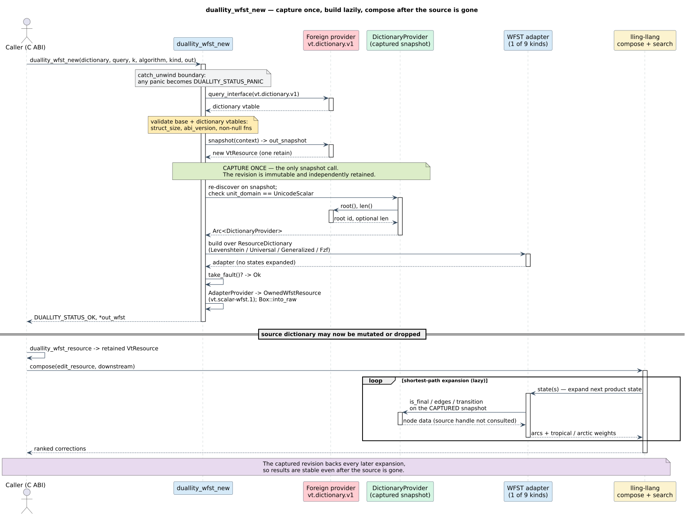

# 06 · The resource ABI and language bindings

> **Prerequisites:** [architecture/01](01-crate-family-and-dependency-graph.md) (the crate family),
> [architecture/02](02-wfst-trait-surface.md) (the `Wfst` / `LazyWfst` / `StateSource` surface), and
> [architecture/05](05-registries-and-interning.md) (the shared registries a captured revision backs).
>
> **Defines:** the shared vinary-tree **resource ABI** duallity speaks, the eight-function
> `duallity_*` **C ABI**, the totality of its status codes, the nine automaton **kinds** and the
> algorithms they select, the **capture-once** rule, the **double-adapter** bridge (duallity implements
> *both* libdictenstein's `Dictionary`/`DictionaryNode` traits *and* lling-llang's `ScalarWfstProvider`),
> and the provider-fault and panic **containment** duties at the boundary.

The other architecture chapters describe duallity as a set of Rust types that satisfy lling-llang's
trait contracts. This chapter describes the *second* interface duallity exposes: a stable **C ABI** and
the modular language bindings built on it. It is the connective tissue at the level of *compiled
artifacts* — the point where a dictionary built by one independently compiled library becomes a WFST
that a second independently compiled library composes, with no shared Rust types and no serialization.

## 1. Where duallity sits in the resource ABI

duallity is the top consumer of the **vinary-tree resource ABI**: the family-shared, dependency-free
contract defined by the
[`vinary-tree-interop`](https://github.com/vinary-tree/liblevenshtein-rust/tree/master/vinary-tree-interop)
crate. That crate defines *layouts and constants only* — no logic — so that a producer and a consumer
compiled from different crate graphs, or even different languages, agree on memory layout without
sharing code.

The unit of exchange is a **`VtResource`**: a two-word `(context, vtable)` handle whose base vtable
carries `retain` / `release` (reference counting) and `query_interface` (versioned interface discovery,
in the spirit of a component-object vtable). A non-null resource owns exactly **one retain**; copying
the two words does *not* retain — the receiver must `retain` before storing a second owned copy and
must `release` once per owned retain. duallity participates through exactly two versioned interfaces:

| Interface | 16-byte id | Direction | Who implements it |
|-----------|-----------|-----------|-------------------|
| **`vt.dictionary.v1`** | `VT_DICTIONARY_INTERFACE_ID` | **in** — the dictionary duallity reads | a *foreign* provider (e.g. a [libdictenstein](https://github.com/vinary-tree/libdictenstein) `DynamicDawgBinding`, or any conforming library) |
| **`vt.scalar-wfst.1`** | `VT_WFST_INTERFACE_ID` | **out** — the WFST duallity hands back | duallity itself, via [lling-llang](https://github.com/vinary-tree/lling-llang)'s `OwnedWfstResource` |

The data flow is therefore a single left-to-right pipeline across three siblings, with duallity in the
middle turning one interface into the other:


> **New diagram — `duallity-resource-abi-dataflow` (D37).** A PlantUML component diagram of the
> three-sibling flow; source `.puml` and rendered `.svg` are committed under
> [`../diagrams/`](../diagrams/README.md#catalog). It uses the shared legend: liblevenshtein red-pink,
> libdictenstein green, duallity blue, lling-llang yellow, the `VtResource` handle pale lime, the
> foreign zone light rose, results purple.

Because duallity is the *only* place liblevenshtein, libdictenstein, and lling-llang meet
([architecture/01](01-crate-family-and-dependency-graph.md)), it is the only place this two-interface
adaptation can live.

## 2. The eight-function C ABI

The stable surface is eight `extern "C"` functions in [`src/ffi.rs`](../../src/ffi.rs), declared in
[`include/duallity.h`](../../include/duallity.h) and wrapped by the RAII C++ facade in
[`include/duallity.hpp`](../../include/duallity.hpp). The surface is deliberately minimal: **construct**,
**hand back the resource**, **free**, plus reference-count and diagnostic helpers.

| Function | Purpose | Returns | Panics across the boundary? | Complexity |
|----------|---------|---------|-----------------------------|------------|
| `duallity_abi_version()` | the stable ABI version (`1`) | `uint32_t` | no — trivial | `` $`O(1)`$ `` |
| `duallity_api_revision()` | the additive API revision (`2`) | `uint32_t` | no — trivial | `` $`O(1)`$ `` |
| `duallity_last_error_message()` | this thread's last boundary error | `const char*` | no — thread-local read | `` $`O(1)`$ `` |
| `duallity_wfst_new(...)` | capture a dictionary revision and build a lazy WFST | `DuallityStatus` | **no** — `catch_unwind` maps a panic to `PANIC` | `` $`O(1)`$ `` in `` $`\lvert D \rvert`$ `` |
| `duallity_wfst_new_ref(...)` | pointer-form equivalent of `duallity_wfst_new` for FFIs that cannot pass a C aggregate by value | `DuallityStatus` | **no** — delegates through the same contained constructor | `` $`O(1)`$ `` in `` $`\lvert D \rvert`$ `` |
| `duallity_wfst_resource(wfst, out)` | hand back a **new retained** `vt.scalar-wfst.1` resource | `DuallityStatus` | **no** — `catch_unwind` | `` $`O(1)`$ `` |
| `duallity_wfst_free(wfst)` | free a handle (null accepted) | `void` | no — a `Box` drop | `` $`O(1)`$ `` amortized |
| `duallity_resource_release(res)` | release one `VtResource` retain (null-safe) | `void` | no — a vtable `release` call | `` $`O(1)`$ `` amortized |

**Ownership and lifetime.** The two owning types have distinct lifecycles, and mixing them is the one
easy mistake:

- A **`DuallityWfst*`** is a project-owned opaque handle returned by `duallity_wfst_new`. It is freed
  **only** by `duallity_wfst_free`, exactly once. Passing null to `free` is a no-op.
- A **`VtResource`** produced by `duallity_wfst_resource` carries **one independent retain** of the
  underlying `vt.scalar-wfst.1` resource. It is released **only** by `duallity_resource_release`, once
  per resource obtained. Crucially, that resource is *not* the `DuallityWfst*` handle: it may outlive
  the handle, and freeing the handle does **not** release resources already handed out.
- The `dictionary` argument to either constructor is **borrowed** for the duration of the call only.
  duallity takes its own retain of the *snapshot* (§5); the caller keeps ownership of the argument and
  releases it on its own schedule.

**Thread-safety.** `duallity_last_error_message` returns a pointer into **thread-local** storage; the
message is valid until the next `duallity_*` call **on the same thread**, and each thread sees only its
own last error. All eight functions are safe to call concurrently on distinct handles/resources; the
produced `vt.scalar-wfst.1` resource is itself safe for concurrent expansion (§6). Freeing or releasing
the *same* handle/resource from two threads at once is a use-after-free the caller must avoid, exactly
as for any reference-counted handle.

## 3. Status-code totality

Every fallible C function returns a `DuallityStatus` (`#[repr(u32)]`). The wire always carries a raw
`u32`; a consumer decodes it, and an out-of-range value is provider misbehavior, never undefined
behavior. The eight discriminants and their producers:

| `DuallityStatus` | Value | Produced when |
|------------------|-------|---------------|
| `OK` | `0` | the operation succeeded |
| `INVALID_ARGUMENT` | `1` | `algorithm` `` $`> 3`$ `` or `kind` `` $`> 8`$ ``; a universal/generalized `maximum_distance` that exceeds `u8`; a generalized/fzf builder rejection |
| `INVALID_UTF8` | `2` | `query_data[0..query_len]` is not valid UTF-8 |
| `NULL_POINTER` | `3` | a required out-pointer is null, `query_data` is null with non-zero `query_len`, `wfst` is null, or the dictionary resource's `context`/`vtable` word is null |
| `PANIC` | `4` | a Rust panic was caught at the boundary by `catch_unwind` |
| `INCOMPATIBLE_RESOURCE` | `5` | the base or dictionary vtable is ABI-incompatible, the resource has no dictionary interface, or the dictionary's `unit_domain` is not `UnicodeScalar` |
| `PROVIDER_ERROR` | `6` | a foreign dictionary callback returned a non-`Ok` status, or returned output that violated the interface contract |
| `LIMIT_EXCEEDED` | `7` | **reserved** — defined in the ABI, but *not currently produced* by any `duallity_wfst_new` path (see the note below) |

The mapping from the internal `BindingError` ([`src/bindings.rs`](../../src/bindings.rs)) to the C
status is total and is the subject of the machine-checked proof in
[`proofs/coq/StatusMapping.v`](../../proofs/coq/StatusMapping.v):

| `BindingError` variant | `DuallityStatus` |
|------------------------|------------------|
| `NullResource` | `NULL_POINTER` |
| `InvalidArgument(_)` | `INVALID_ARGUMENT` |
| `IncompatibleResourceAbi`, `MissingDictionaryInterface`, `IncompatibleDictionaryInterface`, `UnitDomainMismatch(_)` | `INCOMPATIBLE_RESOURCE` |
| `Provider(_)`, `InvalidProviderOutput(_)` | `PROVIDER_ERROR` |

> **Totality note — `LIMIT_EXCEEDED` is reserved.** No `BindingError` variant maps to `LIMIT_EXCEEDED`,
> and `src/ffi.rs` never returns it directly, so at ABI version `1` it is unreachable through
> `duallity_wfst_new`. In particular, a `maximum_distance` that overflows the `u8` bound of the
> universal and generalized kinds surfaces as `INVALID_ARGUMENT` (via `BindingError::InvalidArgument`),
> **not** `LIMIT_EXCEEDED`. Bindings should still handle the value — it is part of the published enum
> and a future revision may begin producing it — but a portable test suite cannot construct it today.

## 4. The nine automaton kinds and their algorithms

`duallity_wfst_new` takes two orthogonal selectors: a **`kind`** (`DuallityWfstKind`, nine values) that
chooses the adapter family, and an **`algorithm`** (`DuallityAlgorithm`, four values) that the
Levenshtein kind alone consumes. Both are validated as enums *before* dispatch, so an out-of-range
`algorithm` is rejected with `INVALID_ARGUMENT` even for a kind that would otherwise ignore it.

| `kind` | `DuallityWfstKind` | Adapter built | Uses `algorithm`? | `maximum_distance` bound | Weight domain |
|--------|--------------------|---------------|-------------------|--------------------------|---------------|
| `0` | `LEVENSHTEIN` | `LevenshteinWfst` | **yes** — `Standard` / `Transposition` / `MergeAndSplit` / `DamerauLevenshtein` | `usize` | tropical `` $`(\min, +)`$ `` |
| `1` | `UNIVERSAL_STANDARD` | `UniversalLevenshteinWfst<Standard>` | no (fixed by kind) | must fit `u8` | tropical |
| `2` | `UNIVERSAL_TRANSPOSITION` | `UniversalLevenshteinWfst<Transposition>` | no | must fit `u8` | tropical |
| `3` | `UNIVERSAL_MERGE_AND_SPLIT` | `UniversalLevenshteinWfst<MergeAndSplit>` | no | must fit `u8` | tropical |
| `4` | `GENERALIZED_STANDARD` | `GeneralizedWfst` (standard ops) | no | must fit `u8` | tropical |
| `5` | `GENERALIZED_TRANSPOSITION` | `GeneralizedWfst` (transposition) | no | must fit `u8` | tropical |
| `6` | `GENERALIZED_MERGE_AND_SPLIT` | `GeneralizedWfst` (merge/split) | no | must fit `u8` | tropical |
| `7` | `GENERALIZED_PHONETIC` | `GeneralizedWfst` (phonetic digraphs) | no | must fit `u8` | tropical |
| `8` | `FZF` | `FzfWfst` | no | ignored (fzf takes no distance) | **arctic** `` $`(\max, +)`$ `` |

The **weight domain** is observable on the returned resource's `vt.scalar-wfst.1` vtable: the fzf
scorer maximizes a match score, so it advertises `VtWeightDomain::ArcticF64`; every edit-distance kind
minimizes a cost and advertises `VtWeightDomain::TropicalF64`. A consumer must read `weight_domain`
before interpreting arc weights — the same `f64` slot means "lower is better" under tropical and
"higher is better" under arctic. The fzf scorer's arctic telescoping and its lazy pruning bound are
machine-checked in [`proofs/coq/FzfPrefixBound.v`](../../proofs/coq/FzfPrefixBound.v). The per-variant
semantics are documented in the [design](../design/README.md) pages; this table is only the *ABI
selector* view of them.

## 5. The capture-once rule

`duallity_wfst_new` reads the foreign dictionary **exactly once**, at construction, and never touches
the caller's resource again. Concretely, `DictionaryProvider::capture` calls the provider's `snapshot`
callback a single time to obtain an **immutable revision** — a new `VtResource` carrying its own retain
— and every later expansion reads *that* revision, not the source handle. This is the same discipline
as a **persistent data structure** [22]: the snapshot is a version frozen at capture time that survives
any later mutation of the source.

The rule has three consequences the bindings depend on:

1. **The resource may outlive its source.** After `duallity_wfst_new` returns, the caller may mutate,
   clear, or drop the source dictionary handle; the WFST — and any `vt.scalar-wfst.1` resource obtained
   from it — keeps matching against the captured revision.
2. **Construction is `` $`O(1)`$ `` in `` $`\lvert D \rvert`$ ``.** The snapshot is a structural-sharing
   handle, not a copy; no terms are serialized or duplicated. The `root`, optional `len`, and
   `unit_domain` are read once at capture and cached.
3. **Exactly one snapshot call.** Calling `snapshot` more than once could observe two different
   revisions and silently split the state space. The single-call invariant is modeled and checked in
   [`proofs/tla/SnapshotCaptureOnce.tla`](../../proofs/tla/SnapshotCaptureOnce.tla).



> **New diagram — `wfst-new-capture-compose-sequence` (D38).** A PlantUML sequence diagram of the
> constructor path and the later compose/search path; source and SVG under
> [`../diagrams/`](../diagrams/README.md#catalog). The capture-once step is highlighted in the
> `VtResource`-handle pale lime; the `catch_unwind` boundary in panic-containment gray.

## 6. The double-adapter bridge

The heart of the crate is that duallity implements **two trait families at once** — one on the input
side, one on the output side — to turn a `vt.dictionary.v1` resource into a `vt.scalar-wfst.1` resource.

**Input side — libdictenstein.** [`src/bindings.rs`](../../src/bindings.rs) defines two types over the
captured provider:

- `ResourceNode` implements libdictenstein's **`DictionaryNode`** (with `Unit = char`): `is_final`,
  `transition`, and `edges`. Each method calls the foreign vtable, decodes and validates the result,
  and yields child `ResourceNode`s sharing the same `Arc<DictionaryProvider>`.
- `ResourceDictionary` implements libdictenstein's **`Dictionary`**: `root`, `len`, and a
  `sync_strategy` of `Persistent` (the snapshot is immutable, so no locking is needed for reads).

Because the duallity WFST engines are generic over any `Dictionary`, they walk the foreign dictionary
through these two impls exactly as they walk a native `DynamicDawgChar` — the foreign origin is
invisible above the adapter. That the adapter is a *faithful* view of the captured revision — its
`root` / `is_final` / `edges` / `transition` mirror the snapshot exactly — is machine-checked in
[`proofs/coq/AdapterLaws.v`](../../proofs/coq/AdapterLaws.v).

**Output side — lling-llang.** The chosen engine is wrapped in an `AdapterProvider` that implements
lling-llang's **`ScalarWfstProvider`**: `weight_domain`, `start`, `num_states`, and `state`. The
`state` callback clones the lightweight WFST shell (registries and the dictionary snapshot are shared
via `Arc`, so the clone is cheap), expands the requested product state, and marshals its outgoing arcs
into the flat `VtWfstArc` layout — mapping the tropical or arctic weight into the single `f64` slot and
each `Option<char>` label into a `(has_input/has_output, u64)` pair. `OwnedWfstResource::from_provider`
then packages that provider as the outgoing `vt.scalar-wfst.1` resource.

So a single `duallity_wfst_new` call threads a value through **both** adapter layers:

```text
foreign vt.dictionary.v1
      │  ResourceDictionary / ResourceNode   (impl libdictenstein Dictionary + DictionaryNode)
      ▼
duallity WFST engine (drives a liblevenshtein automaton lock-step with the dictionary)
      │  AdapterProvider                       (impl lling-llang ScalarWfstProvider)
      ▼
lling-llang OwnedWfstResource → vt.scalar-wfst.1
```

This double adapter is *why* duallity must depend on all three siblings at once
([architecture/01](01-crate-family-and-dependency-graph.md)): the two trait families it bridges are
owned by two different crates, and the automaton between them by a third. The product-state codec that
the engines share — `` $`\mathrm{StateId} = d \cdot M + a`$ `` — is the subject of
[architecture/03](03-state-encoding-and-product-space.md) and is machine-checked in
[`proofs/coq/StateEncoding.v`](../../proofs/coq/StateEncoding.v).

## 7. Provider-fault handling and validation

A foreign `vt.dictionary.v1` provider is **untrusted input** ([security/threat-model](../security/threat-model.md)).
duallity therefore validates every callback result and *contains* every fault rather than trusting the
provider:

- **Vtable discovery.** `discover_dictionary` rejects a base vtable with the wrong `struct_size`,
  a mismatched `abi_version`, or any null required function; a resource with no dictionary interface
  (`query_interface` returns `Unsupported`) yields `MissingDictionaryInterface`; a dictionary vtable
  missing `snapshot` / `root` / `node_is_final` / `node_edges` yields
  `IncompatibleDictionaryInterface`.
- **Unit-domain check.** The text adapters require `VtUnitDomain::UnicodeScalar`; a byte or `u64`
  dictionary yields `UnitDomainMismatch` → `INCOMPATIBLE_RESOURCE`.
- **Status decode.** Every raw `u32` status is decoded with `VtStatus::from_raw`; an out-of-range
  discriminant becomes `ProviderError` instead of an illegal enum value.
- **Edge-page validation.** `expanded_edges` pages a node's outgoing edges through `node_edges` and
  rejects a page that reports `written > capacity`, `offset + written > total`, or zero progress with
  edges still outstanding — the exact shapes a misbehaving pager could use to loop or over-read.
- **Scalar validation.** Each edge `label` must be a valid Unicode scalar (`char::from_u32`); each
  boolean flag (`is_final`, `found`) must be `0` or `1`. A violation is a fault, not a panic.
- **Concurrency gate.** After capture, duallity honors the provider's threading contract. If the
  dictionary vtable sets `dictionary_flags::PARALLEL_REENTRANT`, callbacks run without added locking; if
  not, every callback is serialized through a per-provider `Mutex` (`Gate::Serial`), so a non-reentrant
  provider is never entered concurrently.
- **Fault latch.** The first non-`Ok` status observed during lazy expansion is latched in a
  `Mutex<Option<VtStatus>>`; a fallible trait method (which cannot itself return an error) returns a
  safe default, and the *constructor* surfaces the latched fault via `take_fault()` as
  `PROVIDER_ERROR`. First-fault-wins keeps the reported cause deterministic.

These validations are the concrete discharge of the "adversarial vtable / misbehaving paging /
out-of-domain labels" duties enumerated in [security/threat-model §7](../security/threat-model.md).

## 8. Panic containment

The FFI layer uses `unsafe` (it dereferences caller pointers, calls foreign function pointers, and
transfers `Box` ownership across the boundary), so it cannot rely on the zero-`unsafe` guarantee that
the pure-compute core enjoys ([engineering/safety-and-panics](../engineering/safety-and-panics.md)).
Instead it contains failure at the boundary:

- **Unwinding is caught.** `duallity_wfst_new` and `duallity_wfst_resource` run their bodies inside
  `catch_unwind(AssertUnwindSafe(...))`; a panic is converted to `DUALLITY_STATUS_PANIC` with a
  thread-local message, never allowed to unwind across the `extern "C"` frame (which would be undefined
  behavior). `duallity_wfst_free` and `duallity_resource_release` are drop/release paths that do not
  allocate or call fallible logic, so they need no catch.
- **Pointers are checked before use.** Null out-pointers become `NULL_POINTER`; a null-with-length
  query becomes `NULL_POINTER`; `duallity_resource_release` is a no-op on a resource with a null
  `context` or `vtable`.
- **Diagnostics are thread-local.** The last-error slot is a `thread_local!` `CString`, so a
  concurrent caller on another thread cannot observe or clobber this thread's message.

Together, §7 and §8 make the boundary **fail-closed**: any adversarial provider, any invalid argument,
and any internal panic produce a bounded, well-typed `DuallityStatus` and leave no partially
constructed state visible to the caller.

## 9. Versioning

Two constants describe the surface. `DUALLITY_ABI_VERSION` (`1`) is the *breaking* layout/behavior
version; `DUALLITY_API_REVISION` (`2`) is the *additive* revision, bumped when a backward-compatible
function or enum value is added. Underneath, the interop crate's `VT_ABI_VERSION` and the
per-interface versions (`VT_DICTIONARY_INTERFACE_VERSION`, `VT_WFST_INTERFACE_VERSION`) evolve
additively via a `struct_size` prefix on every vtable, so a newer consumer can safely read an older,
shorter vtable. A binding negotiates by calling `duallity_abi_version()` at load time and refusing a
major it does not understand. The living record of binding versions and pins is the
[bindings findings ledger](../scientific-ledger/bindings-findings-ledger.md).

---

## References

The composition operation the outgoing WFST feeds is Mohri's [9, 10]; the automaton between the two
adapters is Schulz–Mihov [6] (parameterized) and Mihov–Schulz [7] (universal). The capture-once
immutable-revision discipline is a persistent data structure in the sense of Driscoll et al. [22]. The
crate-boundary rationale that forces the double adapter into one crate is Martin's Acyclic Dependencies
principle [21] (see [architecture/01](01-crate-family-and-dependency-graph.md)).

6. **Schulz, K. U., & Mihov, S.** (2002). *Fast String Correction with Levenshtein Automata.* IJDAR
   5(1), 67–85. [doi:10.1007/s10032-002-0082-8](https://doi.org/10.1007/s10032-002-0082-8).
7. **Mihov, S., & Schulz, K. U.** (2004). *Fast Approximate Search in Large Dictionaries.*
   Computational Linguistics 30(4), 451–477.
   [doi:10.1162/0891201042544938](https://doi.org/10.1162/0891201042544938).
9. **Mohri, M.** (1997). *Finite-State Transducers in Language and Speech Processing.* Computational
   Linguistics 23(2), 269–311. [ACL Anthology J97-2003](https://aclanthology.org/J97-2003/).
10. **Mohri, M., Pereira, F., & Riley, M.** (2002). *Weighted Finite-State Transducers in Speech
    Recognition.* Computer Speech & Language 16(1), 69–88.
    [doi:10.1006/csla.2001.0184](https://doi.org/10.1006/csla.2001.0184).
21. **Martin, R. C.** (2000). *Design Principles and Design Patterns.* Object Mentor — the Acyclic
    Dependencies and Dependency-Inversion principles.
22. **Driscoll, J. R., Sarnak, N., Sleator, D. D., & Tarjan, R. E.** (1989). *Making Data Structures
    Persistent.* Journal of Computer and System Sciences 38(1), 86–124.
    [doi:10.1016/0022-0000(89)90034-2](https://doi.org/10.1016/0022-0000(89)90034-2) — the
    immutable-revision model behind the capture-once rule.

Entries [6], [7], [9], [10], and [21] are mirrored in the [bibliography](../references/bibliography.md);
[22] is added to the bibliography by this chapter.
