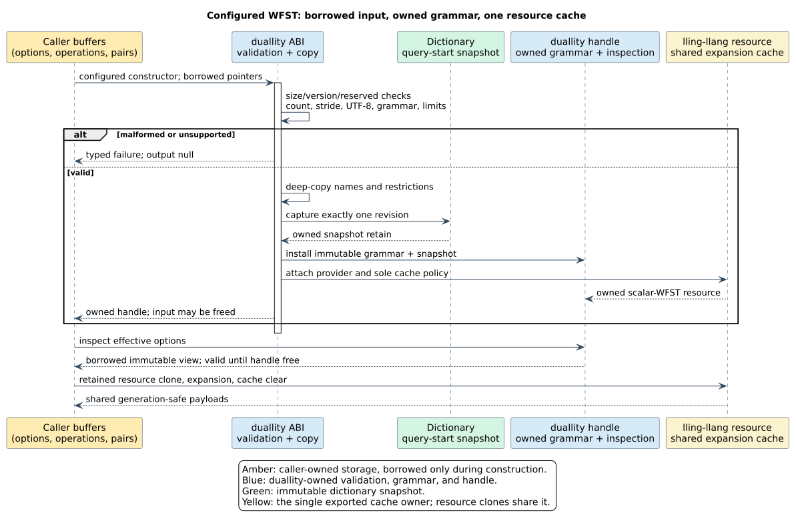

# 07 · Versioned configurable WFST ABI contract

> **Status:** this development branch exports API revision 3 while preserving
> ABI version 1 and the eight earlier function signatures. The release has
> **not** been published; language-level facades and final conformance remain
> separate qualification tasks. Consumers must negotiate the returned API
> revision before calling these functions.
>
> **Prerequisites:** [resource ABI and bindings](06-resource-abi-and-bindings.md),
> [lazy evaluation and caching](04-lazy-evaluation-and-caching.md), and
> [registries and interning](05-registries-and-interning.md).

The stable C **ABI version** describes calling conventions and the original
resource layout. An **API revision** adds named functions without changing
existing ones. A **record version** describes one configuration structure's
field meanings. They are deliberately separate: revision 3 keeps ABI version
1, preserves every revision-2 function, and introduces version-1 records.
The authoritative field lists, selector values, and parsing budgets are in
[`bindings/api.json`](../../bindings/api.json) under `configAbi`; the public
declarations are in [`include/duallity.h`](../../include/duallity.h). The
binding checker compares every field and enum value, rather than treating a
shared name as proof of layout agreement.

## The configuration boundary

The revision-3 entry points are `duallity_wfst_new_configured_ref`,
`duallity_wfst_options_default`, `duallity_wfst_options_get`,
`duallity_wfst_cache_statistics`, `duallity_wfst_cache_clear`, and
`duallity_wfst_cache_set_policy`. The pointer-form constructor avoids
by-value aggregate rules that differ among foreign-function interfaces.
The two existing constructors retain their signatures and behavior.

`duallity_wfst_options_default` fills a caller-sized record with a
parameterized Levenshtein WFST, standard edit algorithm, maximum distance 2,
`CACHE_ALL`, and no custom limits or operations. The caller must initialize
the record header to its writable `sizeof`, version 1, and zero reserved word
before calling. A caller may then change supported fields before construction.

`DuallityWfstOptionsV1` selects the automaton kind, edit algorithm, maximum
distance, cache policy/capacity, optional generalized hard limits, and an
optional custom operation catalog. All input pointers and arrays are borrowed
only until the constructor returns. On success, the handle owns deep copies
of the operation names and restriction strings; the resulting resource owns
one captured dictionary snapshot. The source dictionary, its provider, and
the source handle may subsequently be changed or dropped without changing
that WFST's meaning. A failed constructor leaves the output handle null and
releases every temporary copy and retain.

`duallity_wfst_options_get` reports the *effective* configuration. Its
catalog and limits pointers refer to immutable storage owned by the
`DuallityWfst` handle and remain readable until that handle is freed. They
must not be modified, freed, or used after freeing the handle. A separately
retained `VtResource` may outlive the handle, but does not prolong these
inspection pointers; clients that need them later must copy them. Cache
policy changes update the effective policy reported by the next inspection,
not the query-start dictionary snapshot or operation grammar.

## Sized-record rules

Every record begins with `DuallityRecordHeaderV1`: for input records,
`struct_size` counts readable bytes including the header; for output records,
it declares the writable extent. `record_version` is `1`, and `reserved`
is zero. `struct_size` must include the complete known version-1 layout and
must not exceed 4096 bytes. An input with a larger size is accepted only
when its unknown trailing bytes are zero. This lets a newer caller use an
older revision-3 library without silently applying unsupported fields.
No parser reads an optional pointer or array before validating its containing
record's header, count, stride, and arithmetic bounds. A caller must provide
readable, correctly aligned storage for the byte extent it declares; no C ABI
can prove that an arbitrary non-null address is mapped.

An array uses an explicit byte stride, at least the known element size and
at most 4096 bytes. The element's `struct_size` must fit in that stride.
Multiplication of count by stride and pointer-offset arithmetic must be
checked before reading an element. Zero count requires null pointer and zero
stride; a nonzero count requires non-null pointer. All reserved fields and
unknown enum values are rejected, rather than guessed. A library writes only
within the caller-declared output extent and reports an insufficient size
without retaining a resource or returning a partly owned handle.

The following limits apply *before* deep-copying or consulting a foreign
dictionary: at most 4096 operations, at most 4096 restriction pairs across
them, and at most 1 MiB total custom name/source/target UTF-8 bytes. The
native operation grammar additionally bounds the sum of consumed scalar
widths to 4096. All wire `uint64_t` lengths and capacities are checked when
converted to host `usize`; overflow is `LIMIT_EXCEEDED`, not truncation.
Exact configured generalized ceilings are represented by the eight fields
of `DuallityGeneralizedLimitsV1`. A null limits pointer requests the native
defaults, while a non-null record explicitly supplies every ceiling,
including legitimate zero query or operation-width ceilings.

## Operation grammar and supported combinations

An operation consumes `consume_x` Unicode scalars from the dictionary and
`consume_y` from the query. Its finite, nonnegative `weight` is an edit cost.
`ANY` accepts every pair of slices of those widths; `EQUAL` requires equal
slices and equal widths; `ADJACENT_TRANSPOSE` requires two scalars on each
side and their reversal; `LISTED` requires one of the explicitly supplied
source/target UTF-8 string pairs. Names are diagnostic, not semantic.

Each operation name must be nonempty, valid UTF-8, no longer than 1024
bytes, and contain no NUL byte. A listed restriction must contain at least
one pair. Each source and target string must be nonempty, valid UTF-8, and
have scalar lengths exactly matching the operation's declared widths. The
boundary must reject empty restriction strings itself: the native
`SubstitutionSet::allow_str` silently ignores them. An operation consuming
neither side is invalid. A zero-cost operation must preserve length. The
complete catalog must pass native `OperationSet::validate` before dictionary
capture; constructor assertions are never a substitute for validation.

| Kind | Algorithm field | Custom operations | Limits | Distance |
| --- | --- | --- | --- | --- |
| Parameterized Levenshtein | all four defined edit algorithms | none | native defaults only | host-sized |
| Universal variants | `STANDARD` sentinel | none | native defaults only | at most 255 |
| Generalized variants | `STANDARD` sentinel | nonempty array replaces the named preset; empty array uses it | optional explicit hard ceilings | at most 255 |
| FZF | `STANDARD` sentinel | none | native defaults only | zero sentinel |

An unsupported combination returns `INVALID_ARGUMENT`; the legacy
constructors retain their historical handling of ignored fields. A custom
array is never silently appended to or merged with a preset. Consequently,
the exact operation grammar can be reconstructed from inspection, and a
renamed operation cannot alter semantic applicability.

## One cache owner and observable controls

The exported lling-llang provider resource is the sole authority for cached
expansion payloads. The native automaton's state registry is semantic state,
not an independently evictable payload cache. `CACHE_ALL` retains successful
valid states; `NO_CACHE` retains no expansion payload or per-state metadata;
`LRU` maintains an exact global recency order with a strict positive capacity.
The zero-capacity legacy heuristic is normalized at construction: for native
parameterized, universal, and generalized kinds it means a capacity of
100000; for FZF it means `NO_CACHE`, matching its native lazy-wrapper
exception. Inspection reports the normalized effective policy and capacity.
This normalization does not create a second cache.

Resource clones share the cache. A cache clear publishes a new generation
without changing state identities, dictionary snapshot, or in-flight returned
values. A policy change also clears residency atomically. Neither action
holds cache synchronization across provider callbacks or payload destruction.
`DuallityCacheStatisticsV1` reports saturating cumulative request counters;
`resident_states` and `recency_records` describe one coherent published
root, but counters can advance concurrently, so the whole record is not a
transactional snapshot. Eviction may change residency, never WFST semantics.

## Consumer and failure examples

For an old C consumer, `duallity_wfst_new_ref` and its ownership rules are
unchanged when linked against a revision-3 library. A new consumer first
checks that `duallity_abi_version() == 1` and
`duallity_api_revision() >= 3`, then initializes a version-1 options record
with its actual `sizeof` and uses `duallity_wfst_new_configured_ref`. A
foreign binding performs that check before resolving new symbols and wraps
the returned handle and resource with its language's normal deterministic
lifecycle mechanism.

For a malformed example, a `LISTED` operation declaring one restriction
whose source has zero bytes is rejected with `INVALID_ARGUMENT`. It must not
turn into an unrestricted operation when the native substitution set ignores
the empty pair. A nonzero array count with a null pointer is `NULL_POINTER`.
An excessive count or checked size overflow is `LIMIT_EXCEEDED`. An unknown
record version or nonzero reserved word is `INVALID_ARGUMENT`. Provider
faults and caught Rust panics retain the existing distinct status codes.
Each failure path leaves the output null and the caller's input buffers
untouched; no callback is invoked while cache synchronization is held.

## Verification boundary

The model/header checker and C layout compilation check that the exported
declarations are synchronized. The internal Rust parser validates the
records and deep-copies operation and restriction text before construction;
its [focused qualification](../scientific-ledger/configurable-construction-2026-09-29.md)
also compares the complete lazy WFST graph with the legacy generalized path
after dropping the source dictionary. The internal
[inspection qualification](../scientific-ledger/configurable-inspection-2026-09-29.md)
checks that name, restriction, operation, and limits pointers refer to
handle-owned storage even after caller buffers are dropped, while a separately
retained WFST resource remains valid after the handle is freed. The internal
[cache-control qualification](../scientific-ledger/configurable-cache-2026-09-29.md)
tests normalization, exact LRU residency, cloned resources, statistics,
concurrent calls, and reentrant clear against the exported provider cache.
The [revision-3 C-boundary qualification](../scientific-ledger/configurable-c-boundary-2026-09-29.md)
checks the callable symbols, old/new C consumers, malformed records, output
failure behavior, and snapshot-retain balance. The higher-level foreign
facades and final package-wide conformance are follow-up tasks. No package
publication is implied by this development-branch contract.
