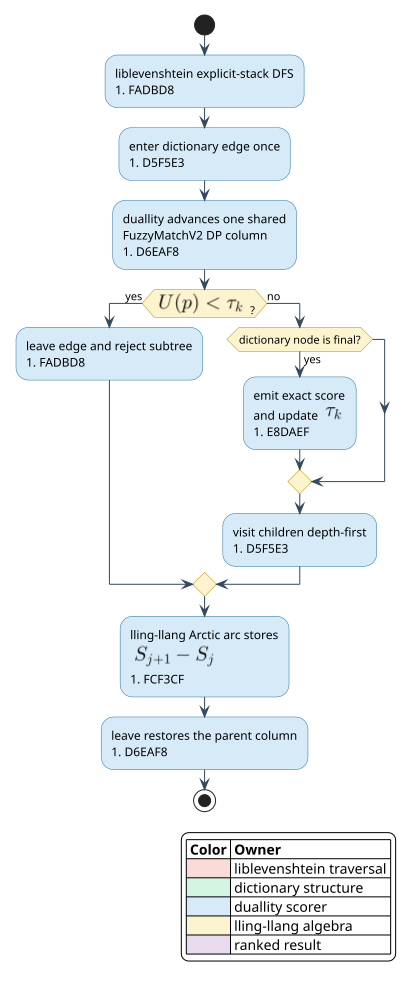

# fzf scoring as a prefix-shared Arctic WFST

## Purpose and vocabulary

An **fzf score** ranks a query as an ordered subsequence of a candidate. A
**local alignment** may begin after any candidate prefix. A **dynamic-programming
column** (DP column) stores every live partial alignment after one candidate
character. A **prefix visitor** receives balanced `enter` and `leave` callbacks
from a depth-first dictionary traversal. An **upper bound** is a score no
descendant can exceed; it supports branch-and-bound top-`` $`k`$ `` search.

This adapter implements fzf's `FuzzyMatchV2` recurrence once and exposes it as
`FzfScorer`, `FzfStateSource`, and `FzfWfst`.



## Why the crate boundary is load-bearing

liblevenshtein's distance walkers minimize non-negative costs. If accumulated
cost is `` $`c`$ `` and a lawful step costs `` $`w \ge 0`$ ``, then
`` $`c + w \ge c`$ ``. That inflation law makes a prefix cost a subtree lower
bound.

fzf combines parallel alternatives with `` $`\max`$ `` and sequential gains or
penalties with `` $`+`$ ``. Its algebra is the Arctic semiring:

```math
\mathbb{A} =
(\mathbb{R}\cup\{-\infty\},\ \max,\ +,\ -\infty,\ 0).
```

The gain-valued recurrence does not satisfy liblevenshtein's non-negative-cost
contract. Structural DFS stays in liblevenshtein, score state stays in
duallity, and reusable max-plus algebra stays in lling-llang. This follows the
standard separation between graph structure and weight algebra
[Mohri 2009](https://doi.org/10.1007/978-3-642-01492-5_6).

## Exact incremental recurrence

Let `` $`q_0,\ldots,q_{m-1}`$ `` be query characters and `` $`x_j`$ `` the
candidate character at column `` $`j`$ ``. Each cell retains its best score,
consecutive-match length, first bonus, and gap state. A match adds the base
score and a class-dependent bonus. Skipping a candidate character subtracts a
gap-start or gap-extension penalty. The implementation mirrors the
[upstream recurrence](https://github.com/junegunn/fzf/blob/master/src/algo/algo.go),
and its differential fixtures are shared with fzf's
[algorithm tests](https://github.com/junegunn/fzf/blob/master/src/algo/algo_test.go).

```text
procedure SCORE-DICTIONARY(root, query, k)
    core    := precompute(query, scheme, case-mode)
    stack   := [core.initial-column]
    best-k  := empty minimum heap

    on ENTER(character):
        next := core.advance(stack.last, character)
        push(stack, next)
        return core.upper-bound(next) >= kth-score(best-k)

    on ACCEPT(term):
        score := stack.last.best-complete-score
        insert-exact(best-k, score)
        emit(term, score)

    on LEAVE(character):
        pop(stack)
```

`enter` always pushes before deciding, and `leave` always pops. The pairing is
therefore balanced even when an entire subtree is rejected.

## The corrected local-alignment upper bound

An earlier design proposed only the active-alignment term
`` $`S + (m-j)\beta`$ ``. That is unsound: a descendant can ignore the prefix
and begin a perfect match later. Let `` $`U_0`$ `` bound an alignment that has
not started, and `` $`U_i`$ `` bound a live alignment matched through query
index `` $`i`$ ``. The implemented bound is

```math
U(p) = \max\!\left(
  U_0,\
  \max_{i\ \mathrm{reachable}}
    \left[S_i + (m-i-1)(s_{\mathrm{match}} + b_{\max})\right]
\right).
```

Every descendant alignment is either unstarted or extends one live cell, so it
is covered by one term. Pruning when `` $`U(p) < \tau_k`$ `` cannot remove a
score at least `` $`\tau_k`$ ``. Rocq, Verus, Dafny, two SMT solvers, TLA+, and
property tests check the same invariant.

Without subtree height or character-reachability metadata, `` $`U_0`$ `` is the
global maximum and usually prevents score-based prefix pruning. Prefix sharing
still avoids recomputing common DP columns. Reachability metadata is gated by
measurement; it is not silently added as an unmeasured Bloom-filter cost.

## Path-sensitive WFST states

A directed acyclic word graph (DAWG) may merge two dictionary prefixes into one
node. fzf state cannot merge with it: different prefixes can reach that node
with different bonuses and DP columns. `FzfStateSource` therefore keys a child
by `` $`(\text{parent state},\text{character})`$ ``.

Let `` $`S_j`$ `` be the best complete score after prefix length `` $`j`$ ``.
The WFST arc stores `` $`\Delta_j=S_{j+1}-S_j`$ ``. Arctic multiplication is
addition, so the path weight telescopes:

```math
S_0 + \sum_{j=0}^{n-1}(S_{j+1}-S_j) = S_n.
```

Nonmatching dictionary finals remain non-final in `FzfWfst`.

## Complexity, limits, and evidence

For query length `` $`m`$ `` and `` $`E_v`$ `` visited edges, traversal takes
`` $`O(mE_v)`$ `` time and `` $`O(md)`$ `` active memory at depth `` $`d`$ ``.
Independent scoring takes `` $`O(m\sum_t |t|)`$ `` time. Path-sensitive WFST
materialization may create more states than its underlying DAWG.

`FzfConfig` defaults to at most 1,000 query characters and 1,000,000 candidate
characters. Callers handling untrusted input should choose lower limits.
Scores use `i32` with saturating bound arithmetic.

Evidence includes upstream fixtures, generated trie/brute-force top-`` $`k`$ ``
equality, generated descendant-bound checks, cross-surface integration tests,
Arctic algebra properties, and five formal-verification tool families.

## Deliberate limitations

- This is the scorer, not fzf's terminal UI, tokenizer, or highlighting API.
- Case-insensitive matching uses ASCII folding and simple one-scalar Unicode
  lowercasing; it does not implement optional Latin accent normalization.
- Tests order equal scores lexicographically. Upstream UI tie policy may also
  depend on stable input order and other flags.
