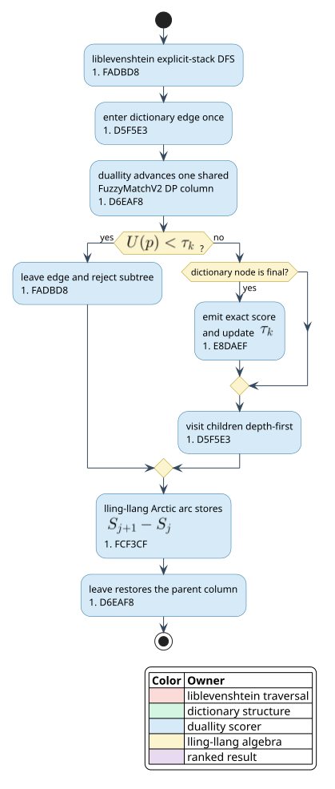

# fzf scoring as a prefix-shared Arctic WFST

## Purpose and vocabulary

An **fzf score** ranks a query as an ordered subsequence of a candidate. A
**local alignment** may begin after any candidate prefix. A **dynamic-programming
column** (DP column) stores every live partial alignment after one candidate
character. A **prefix visitor** receives balanced `enter` and `leave` callbacks
from a depth-first dictionary traversal. An **upper bound** is a score no
descendant can exceed; it supports branch-and-bound top-$`k`$ search.

This adapter implements fzf's `FuzzyMatchV2` recurrence once and exposes it as
`FzfScorer`, `FzfStateSource`, and `FzfWfst`.



## Why the crate boundary is load-bearing

liblevenshtein's distance walkers minimize non-negative costs. If accumulated
cost is $`c`$ and a lawful step costs $`w \ge 0`$, then
$`c + w \ge c`$. That inflation law makes a prefix cost a subtree lower
bound.

fzf combines parallel alternatives with $`\max`$ and sequential gains or
penalties with $`+`$. Its algebra is the Arctic semiring:

```math
\mathbb{A} =
(\mathbb{R}\cup\{-\infty\},\ \max,\ +,\ -\infty,\ 0).
```

The gain-valued recurrence does not satisfy liblevenshtein's non-negative-cost
contract. Structural DFS stays in liblevenshtein, score state stays in
duallity, and reusable max-plus algebra stays in lling-llang. This follows the
standard separation between graph structure and weight algebra
[Mohri 2009](https://doi.org/10.1007/978-3-642-01492-5_6).

## Exact incremental recurrence

Let $`q_0,\ldots,q_{m-1}`$ be query characters and $`x_j`$ the
candidate character at column $`j`$. Each cell retains its best score,
consecutive-match length, first bonus, and gap state. A match adds the base
score and a class-dependent bonus. Skipping a candidate character subtracts a
gap-start or gap-extension penalty. The implementation mirrors the
[upstream recurrence](https://github.com/junegunn/fzf/blob/master/src/algo/algo.go),
and its differential fixtures are shared with fzf's
[algorithm tests](https://github.com/junegunn/fzf/blob/master/src/algo/algo_test.go).

```text
procedure SCORE-DICTIONARY(root, query, k)
    core    := precompute(query, scheme, case-mode)
    stack   := [core.initial-column]
    best-k  := empty minimum heap

    on ENTER(character, depth):
        next := core.advance(stack.last, character)
        push(stack, next)
        capacity := maximum-candidate-length - depth
        return core.upper-bound(next, capacity) >= kth-score(best-k)

    on ACCEPT(term):
        score := stack.last.best-complete-score
        insert-exact(best-k, score)
        emit(term, score)

    on LEAVE(character):
        pop(stack)
```

`enter` always pushes before deciding, and `leave` always pops. The pairing is
therefore balanced even when an entire subtree is rejected.

## The corrected local-alignment upper bound

An earlier design proposed only the active-alignment term
$`S + (m-j)\beta`$. That is unsound: a descendant can ignore the prefix
and begin a perfect match later. Let $`A(p)=n_{\max}-|p|`$ be the number
of candidate characters still available under the configured length ceiling.
Let $`C(p)`$ be the best complete score already observed in prefix
$`p`$, and let $`S_i`$ be a live alignment matched through query
index $`i`$. The implemented bound is

```math
U(p) = \max\!\left(
  C(p),\
  \mathbf{1}_{m \le A(p)} U_0,\
  \max_{\substack{i\ \mathrm{reachable} \\ m-i-1 \le A(p)}}
    \left[S_i + (m-i-1)(s_{\mathrm{match}} + b_{\max})\right]
\right).
```

Infeasible terms are omitted; if all three alternatives are absent, the Rust
API returns `None` and the subtree cannot contain a match. A gap transition
cannot increase a cell score, a match adds at most
$`s_{\mathrm{match}}+b_{\max}`$, and each child consumes one unit of
capacity. A newly started child alignment is covered by its parent's unstarted
term. These recurrence facts derive $`U(pc)\le U(p)`$ and, by induction,
every completed descendant score is at most $`U(p)`$. Pruning when
$`U(p) < \tau_k`$ therefore cannot remove a score at least
$`\tau_k`$.

`FzfStats` separates score-bound and length-bound rejections and counts bound
evaluations. The checked-in real-path benchmark observes score-bound pruning;
the generated property suite checks descendant domination, child monotonicity,
and exact top-$`k`$ equality. See the
[scientific ledger](../scientific-ledger/fzf-prefix-bound-2026-08-02.md).

## Path-sensitive WFST states

A directed acyclic word graph (DAWG) may merge two dictionary prefixes into one
node. fzf state cannot merge with it: different prefixes can reach that node
with different bonuses and DP columns. `FzfStateSource` therefore keys a child
by $`(\text{parent state},\text{character})`$.

Let $`S_j`$ be the best complete score after prefix length $`j`$.
The WFST arc stores $`\Delta_j=S_{j+1}-S_j`$. Arctic multiplication is
addition, so the path weight telescopes:

```math
S_0 + \sum_{j=0}^{n-1}(S_{j+1}-S_j) = S_n.
```

Nonmatching dictionary finals remain non-final in `FzfWfst`.

## Complexity, limits, and evidence

For query length $`m`$ and $`E_v`$ visited edges, traversal takes
$`\mathcal{O}(mE_v)`$ time and $`\mathcal{O}(md)`$ active memory at depth $`d`$.
Independent scoring takes $`\mathcal{O}(m\sum_t |t|)`$ time. Path-sensitive WFST
materialization may create more states than its underlying DAWG.

`FzfConfig` defaults to at most 1,000 query characters and 1,000,000 candidate
characters. Callers handling untrusted input should choose lower limits.
Scores use `i32` with saturating bound arithmetic.

### Revision-6 C and Julia boundary

`DuallityFzfConfigV1` transports the native `case_sensitive`, `scheme`,
`top_k`, `max_query_chars`, and `max_candidate_chars` settings. It also carries
`max_work_units` for whole-dictionary ranking and the provider's cache policy
and capacity for a configured FZF WFST. A record header states the readable
size and version; reserved and unknown trailing bytes must be zero. The C
boundary validates every field before capturing a dictionary snapshot.

`duallity_fzf_score` scores one borrowed UTF-8 candidate and writes a
caller-sized `DuallityFzfScoreV1`. `duallity_fzf_rank_ref` captures one
dictionary revision and performs iterative depth-first traversal. Its explicit
stack avoids recursion proportional to term length. The traversal counts each
enumerated dictionary edge as one work unit. If the count would exceed
`max_work_units`, it returns `DUALLITY_STATUS_LIMIT_EXCEEDED`, clears the output
slot, and releases all intermediate state. It never returns a partial ranking.

```text
procedure RANK-SNAPSHOT(dictionary, query, config)
    snapshot := capture(dictionary)
    scorer   := FzfScorer(query, config)
    work     := 0
    stack    := [root(snapshot)]
    best     := bounded minimum heap of size top_k
    while stack is not empty:
        event := pop(stack)
        if event is LEAVE: scorer.leave(event.character); continue
        scorer.enter(event.character)
        if current node is final and scorer accepts it:
            retain (term, score) in best when it outranks the worst hit
        children := current node's edges
        if work + length(children) > max_work_units: fail with LIMIT_EXCEEDED
        work := work + length(children)
        push matching children and a balanced LEAVE event
    return best sorted by score descending, then UTF-8 term ascending
```

The ranking handle owns copied UTF-8 hit terms. A caller may borrow a hit's
pointer only until `duallity_fzf_ranking_free`. Duallity.jl copies each hit
and its counters before freeing the handle. The configured WFST uses the same
`FzfConfig` but retains a separate lazy graph and provider cache. Cache clear
and policy changes alter residency; they do not alter scores or accepted
terms. Julia's `ConfiguredWfst` closes the graph retain and native handle in
one operation.

The ranking heap uses $`\mathcal{O}(k)`$ hit slots, with each retained term
bounded by `max_candidate_chars`; the active traversal stack uses at most
$`\mathcal{O}(E_v)`$ node events under the work ceiling. Score computation
continues to take $`\mathcal{O}(mE_v)`$ time. Ties are ordered by term bytes
after scoring, so provider edge enumeration order cannot change the published
top-$`k`$ result. The [Julia binding guide](../../bindings/julia/Duallity/README.md)
shows the API and deterministic cleanup.

Evidence includes an independent batch implementation checked against 15
published upstream scores, score-for-score differential testing over a
checked-in real repository path corpus, generated trie/brute-force
top-$`k`$ equality, generated descendant-bound and monotonicity checks,
cross-surface integration tests, Arctic algebra properties, and five
formal-verification tool families.

## Deliberate limitations

- This is the scorer, not fzf's terminal UI, tokenizer, or highlighting API.
- Case-insensitive matching uses ASCII folding and simple one-scalar Unicode
  lowercasing; it does not implement optional Latin accent normalization.
- Tests order equal scores lexicographically. Upstream UI tie policy may also
  depend on stable input order and other flags.
