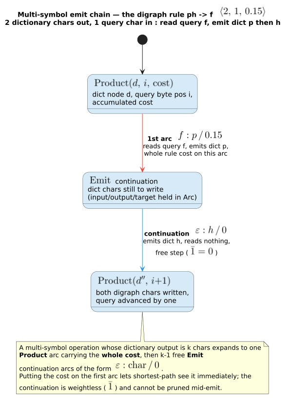
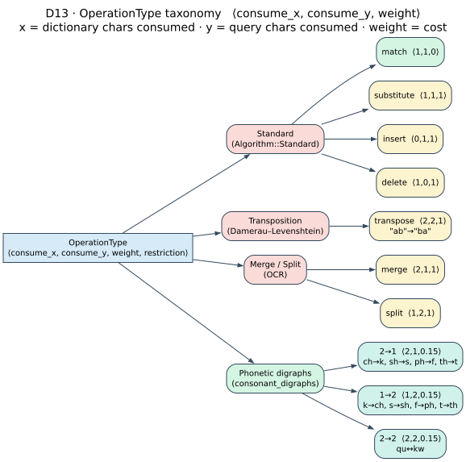

# Generalized WFST

> **`GeneralizedWfst<D>`** and **`GeneralizedWfstBuilder<'a, D>`** — a runtime-configurable Levenshtein
> WFST whose **operation set** (standard, transposition, merge/split, phonetic digraphs) is chosen at
> build time and realized as a genuine lazy **product graph** with continuation states, so a
> single-`char` transducer can still emit multi-character rewrites such as `ph → f`. Always available
> (no feature flag).

All shared symbols (`` $`q`$ ``, `` $`n`$ ``, `` $`k`$ ``, `` $`D`$ ``, the tropical semiring
`` $`\mathbb{T}`$ `` with `` $`\bar{1} = 0`$ `` / `` $`\bar{0} = +\infty`$ ``, the transducer relation
`` $`T(x, y)`$ ``, `` $`\varepsilon`$ ``) are defined once in the
[master notation table](../theory/README.md#master-notation). Page-local symbols introduced here — the
product tuple `` $`\pi = (\nu, b, c)`$ ``, an operation `` $`o = \langle x, y, \omega, \varrho\rangle`$ ``,
and the query-only cost `` $`\kappa`$ `` — are defined at first use.

## 1. Intuition

Where [`LevenshteinWfst`](levenshtein-wfst.md) hardcodes the four standard edits, `GeneralizedWfst`
lets you **assemble the operation set at runtime** — add adjacent transpositions, OCR-style
merge/split, or phonetic digraph rewrites (`ph↔f`, `ch↔k`, `qu↔kw`) — and hands the result to
liblevenshtein's `GeneralizedAutomaton` while itself walking a lazily-interned product of the
dictionary against the query.



The one structural subtlety is that the WFST's label type is a single `char`, yet a phonetic digraph
consumes/produces *two* characters on one tape. The wrapper resolves this with **continuation
states**: a multi-symbol operation emits its first aligned character pair as an ordinary weighted arc,
then threads the remaining pairs through zero-cost continuation arcs before landing on the successor
product state. The `Wfst<char, TropicalWeight>` surface is preserved exactly; the digraph simply
becomes a short chain of `char : char` arcs whose total weight is the operation's cost.

## 2. Operational semantics

### 2.1 States `` $`Q`$ `` — two kinds

`GeneralizedWfst` interns two kinds of state into a dense `StateRegistry` (an `id_to_state: Vec<…>`
plus dedup maps):

| Kind | Tuple | Meaning |
|------|-------|---------|
| **Product** | `` $`\pi = (\nu, b, c)`$ `` | a dictionary node id `` $`\nu`$ ``, the **byte** offset `` $`b`$ `` into the query, and the accumulated weighted cost `` $`c`$ `` used for bounded pruning. |
| **Emit** (continuation) | `` $`(\mathbf{u}, \mathbf{d}, i, j, \tau)`$ `` | the full input/output `char` slices `` $`\mathbf{u}`$ `` (query) and `` $`\mathbf{d}`$ `` (dict) of one multi-symbol operation, the two cursors `` $`i, j`$ ``, and the ultimate target product id `` $`\tau`$ ``. |

Product states are deduplicated on `` $`(\nu,\, b,\, \operatorname{bits}(c))`$ `` (the cost is
canonicalized — `` $`-0.0 \mapsto 0.0`$ `` — then bit-cast), so two paths that reach the same node at
the same query position and cost share one id. Emit states are deduplicated on full structural
equality with `Arc`-shared label slices, so repeated firings of the same digraph reuse one
continuation chain.

### 2.2 Start `` $`q_0`$ ``

`start()` is id `` $`0`$ ``, the product state `` $`q_0 = (\nu_{\mathrm{root}},\, 0,\, 0)`$ `` — the
dictionary root, query byte `` $`0`$ ``, cost `` $`0`$ ``. The registry pre-registers exactly this one
state; every other state is interned on demand during expansion.

### 2.3 Operations `` $`o = \langle x, y, \omega, \varrho\rangle`$ ``

An operation is a `liblevenshtein::transducer::OperationType`. Its arity is
`` $`\langle x, y, \omega, \varrho\rangle`$ `` where — matching `OperationType::new(consume_x,
consume_y, weight, name)` — **`` $`x = \texttt{consume\_x}`$ `` counts characters consumed from the
DICTIONARY side, `` $`y = \texttt{consume\_y}`$ `` counts characters consumed from the QUERY side**,
`` $`\omega`$ `` is the cost, and `` $`\varrho`$ `` an optional named restriction (a UTF-8 byte-string
pair set). duallity's expansion honours this orientation literally: it draws dictionary paths of `` $`x`$ ``
scalars and a query segment of `` $`y`$ `` scalars (`generalized_wfst.rs`:
`dict_width = consume_x; query_width = consume_y`). All counts are **Unicode scalar values**, but the
restriction is matched against the selected UTF-8 **byte** slices, so a restricted operation with
`` $`x = y = 1`$ `` can pin a single non-ASCII substitution.

An operation is *applicable* to a candidate dictionary scalar sequence `` $`\mathbf{d}`$ `` and query
scalar sequence `` $`\mathbf{u}`$ `` per its class (`generalized_ops::operation_applies`):

```math
\mathrm{app}_o(\mathbf{d}, \mathbf{u}) =
\begin{cases}
\mathbf{d} = \mathbf{u}, & \textsf{Match}\ \langle 1,1,0\rangle,\\[2pt]
\operatorname{bytes}(\mathbf{d}) \ne \operatorname{bytes}(\mathbf{u}), & \textsf{Unrestricted\ substitution}\ \langle 1,1,\omega>0\rangle,\\[2pt]
d_0 = u_1 \wedge d_1 = u_0 \wedge \mathbf{d} \ne \mathbf{u}, & \textsf{Unrestricted\ transpose}\ \langle 2,2,\cdot\rangle,\\[2pt]
\varrho.\mathrm{contains\_str}\bigl(\operatorname{bytes}(\mathbf{d}), \operatorname{bytes}(\mathbf{u})\bigr), & \textsf{Restricted}\ (\varrho \ne \varnothing),\\[2pt]
\textsf{true}, & \textsf{Any}\ (\text{insert, delete, merge, split}).
\end{cases}
```

### 2.4 Weighted transitions `` $`E`$ ``

From a product state `` $`\pi = (\nu, b, c)`$ ``, for each operation `` $`o`$ `` with
`` $`(x, y) \ne (0, 0)`$ `` and `` $`c + \omega \le k`$ ``: read the length-`` $`y`$ `` query segment
`` $`\mathbf{u} = u_0\cdots u_{y-1}`$ `` starting at byte `` $`b`$ `` (ending at byte `` $`b'`$ ``), and
enumerate every length-`` $`x`$ `` dictionary path `` $`\mathbf{d} = d_0\cdots d_{x-1}`$ `` from
`` $`\nu`$ `` to a node `` $`\nu'`$ ``. For each such `` $`\mathbf{d}`$ `` with
`` $`\mathrm{app}_o(\mathbf{d}, \mathbf{u})`$ ``, add an edge bundle from `` $`\pi`$ `` to the successor
product state

```math
\pi' = \bigl(\nu',\; b',\; \operatorname{canon}(c + \omega)\bigr).
```

The bundle aligns the two scalar sequences **positionally**, pairing `` $`u_j`$ `` with `` $`d_j`$ ``
and padding the shorter side with `` $`\varepsilon`$ ``. Writing `` $`L = \max(x, y)`$ `` for the number
of aligned pairs:

- **Single-symbol operation** (`` $`L \le 1`$ `` — match, substitute, insert, delete): one arc
  `` $`u_0 : d_0 \,/\, \omega`$ `` directly to `` $`\pi'`$ `` (with `` $`\varepsilon`$ `` on whichever
  side is empty).
- **Multi-symbol operation** (`` $`L \ge 2`$ `` — transpose, merge, split, digraphs): the **first**
  pair `` $`u_0 : d_0 \,/\, \omega`$ `` carries the full cost and lands on an **Emit** continuation;
  each subsequent pair `` $`u_j : d_j \,/\, \bar{1}`$ `` is a zero-cost arc; the last reaches
  `` $`\pi'`$ ``.



Concretely, the phonetic digraph `ph → f` (`` $`o = \langle 2, 1, 0.15\rangle`$ ``, dictionary `"ph"`,
query `"f"`) fires as the chain

```math
\pi \xrightarrow{\;f : p \,/\, 0.15\;} \underbrace{(\,[f],\,[p,h],\,1,\,1,\,\pi'\,)}_{\textsf{Emit}} \xrightarrow{\;\varepsilon : h \,/\, \bar{1}\;} \pi',
```

so the aggregate label pair is *input* `` $`f`$ `` (query) / *output* `` $`ph`$ `` (dict) at total cost
`` $`0.15`$ ``. This is the same two-arc idiom [`LevenshteinWfst`](levenshtein-wfst.md#26-merge-and-split-ocr-arities)
uses for transposition and merge/split, generalized to arbitrary arities.

> **Operation-name orientation.** liblevenshtein names operations by *which tape they consume*:
> `insert` `` $`\langle 0,1,1\rangle`$ `` consumes one **query** scalar and none from the dictionary
> (arc `` $`u_0 : \varepsilon`$ ``); `delete` `` $`\langle 1,0,1\rangle`$ `` consumes one **dictionary**
> scalar and none from the query (arc `` $`\varepsilon : d_0`$ ``). This is the mirror image of the
> query-centric naming in the `LevenshteinWfst` transition table — the *arcs* are identical, only the
> labels "insert"/"delete" swap perspective.

### 2.5 Final predicate and final weight `` $`\rho`$ ``

Only product states can be accepting, and a product state is accepting when the dictionary node is a
terminal **and** whatever query remains can be spent on query-only (insertion) operations. Define the
**query-only cost** `` $`\kappa(b)`$ `` — the minimum cost to consume the query suffix from byte
`` $`b`$ `` using only operations with `` $`x = 0`$ `` (`compute_query_only_costs`):

```math
\kappa(\lvert q\rvert) = 0,
\qquad
\kappa(b) = \min_{\substack{o : x = 0,\; y > 0\\ \mathrm{app}_o(\langle\rangle,\, \mathbf{u}_{b,y})}} \bigl[\, \omega + \kappa(b') \,\bigr],
```

where `` $`\mathbf{u}_{b,y}`$ `` is the `` $`y`$ ``-scalar query segment at byte `` $`b`$ `` and
`` $`b'`$ `` the byte after it (`` $`\kappa(b) = {+\infty}`$ `` if no such chain exists). Then

```math
F(\pi) \iff \nu \text{ is final } \wedge\; b \le \lvert q\rvert \;\wedge\; c \le k \;\wedge\; \kappa(b) < +\infty \;\wedge\; c + \kappa(b) \le k,
\qquad
\rho(\pi) = c + \kappa(b).
```

Emit states are always non-final. Reading a complete accepting path therefore spells one dictionary
term on the output tape and the query on the input tape, and its total tropical weight —
`` $`\bigotimes`$ `` of the per-arc costs plus `` $`\rho`$ `` — equals the generalized edit distance
under the configured operation set:

```math
T(q, w) = \min_{\pi : q \rightsquigarrow w}\ \Bigl[\ \textstyle\bigotimes_{e \in \pi} \omega(e)\ \Bigr] \otimes \rho(\pi)
        = d_{\mathcal{O}}(q, w),
```

with `` $`d_{\mathcal{O}}`$ `` the distance induced by the operation set `` $`\mathcal{O}`$ `` (standard
`` $`d_{\mathrm{lev}}`$ ``, transposition `` $`d_{\mathrm{DL}}`$ ``, or a phonetically-weighted metric).

### 2.6 Expansion in literate pseudocode

Complexity per product state: `` $`O\!\bigl(\lvert\mathcal{O}\rvert \cdot F^{x}\bigr)`$ `` where
`` $`F`$ `` is the dictionary branching factor and `` $`x \le 2`$ `` the largest arity; the query slice
is `` $`O(1)`$ `` from the stored byte offset.

```text
⟨Generalized: expand a product state π = (ν, b, c)⟩ ≡
  Input:   a registered product state; the OperationSet 𝒪; the owned dictionary D; the query q
  Output:  (is_final, ρ, transitions) cached for π
  Invariant: b is a byte offset on a char boundary, so slicing q from b is O(1); c ≤ k always holds

  1. if ν not final or b > |q| or c > k:   accepted ← ⊥                 ▷ prune early
     else: accepted ← (κ(b) < +∞ and c + κ(b) ≤ k);  ρ ← c + κ(b)
  2. transitions ← ∅
  3. for each operation o = ⟨x, y, ω, ϱ⟩ in 𝒪:
       4. if (x,y) = (0,0) or c + ω > k:  continue                       ▷ no-op / over budget
       5. 𝐮, b' ← the y query scalars at byte b        (skip o if out of range)     ▷ width-cached
       6. for each dict path 𝐝 = d₀…d_{x-1} : ν ↝ ν' of exactly x scalars:          ▷ width-cached
            7. if not app_o(𝐝, 𝐮):  continue
            8. π' ← intern_product(ν', b', canon(c + ω))
            9. if max(x, y) ≤ 1:  emit  u₀ : d₀ / ω  →  π'               ▷ single arc, ε-padded
              10. else:            emit  u₀ : d₀ / ω  →  Emit(𝐮, 𝐝, 1, 1, π')  ▷ then ε-cost continuations to π'
  11. return (accepted, ρ, transitions)
```

The dictionary paths and query segments are cached by width within a single expansion (`DictPathCache`,
`QuerySegmentCache`), so operations that share an arity reuse one traversal.

## 3. Type, bounds, and the 4.0.0-rc.4 API

```rust,ignore
pub struct GeneralizedWfst<D>
where
    D: Dictionary + Clone + Send + Sync,
    D::Node: DictionaryNode<Unit = char>,     // NOTE: the unit must BE char (stricter than other variants)
{ /* owned dictionary, query, GeneralizedAutomaton, OperationSet, prepared ops, query_only_costs, registries, cache */ }

pub struct GeneralizedWfstBuilder<'a, D>
where D: Dictionary + Clone + Send + Sync, D::Node: DictionaryNode<Unit = char>
{ /* &'a dictionary, query, max_distance: u8 (default 2), operations: OperationSet (default standard) */ }
```

`GeneralizedWfst` **owns a clone** of the dictionary (`dictionary.clone()`); the DAWG containers are
`Arc`-backed so the clone is cheap, but it is a real clone, unlike [`WallBreakerWfst`](wallbreaker-wfst.md)
which stores none.

```rust,ignore
impl<D> GeneralizedWfst<D> {
    pub fn new(dictionary: &D, query: &str, max_distance: u8, operations: OperationSet) -> Self;
    pub fn query(&self) -> &str;
    pub fn max_distance(&self) -> u8;                    // u8 (cf. usize for Levenshtein/WallBreaker)
    pub fn set_max_cache_size(&mut self, size: usize);
}

impl<'a, D> GeneralizedWfstBuilder<'a, D> {
    pub fn new(dictionary: &'a D) -> Self;               // defaults: max_distance 2, OperationSet::standard()
    pub fn query(self, query: &str) -> Self;
    pub fn max_distance(self, distance: u8) -> Self;
    pub fn with_standard_ops(self) -> Self;              // match / substitute / insert / delete
    pub fn with_transposition(self) -> Self;             // standard + adjacent swap
    pub fn with_merge_split(self) -> Self;               // standard + merge + split
    pub fn with_phonetic_digraphs(self) -> Self;         // standard + ph↔f, ch↔k, qu↔kw, … (restricted)
    pub fn with_operations(self, operations: OperationSet) -> Self;
    pub fn build(self) -> Result<GeneralizedWfst<D>, String>;   // Err("Query not set") if no query
}
```

The wrapper implements `Wfst`, `LazyWfst`, and `StateSource<char, TropicalWeight>` (and is `Clone`),
with the same dual composition surface as the other variants: `StateSource::compute_state` is the pure
`&self` path; `LazyWfst::expand` / `transitions_lazy` add the mutable transition cache.

> **Bounding at construction.** `new` normalizes the operation set through `bounded_operation_set`
> before building: it **drops any operation whose weight exceeds `` $`k`$ ``** (it can never fire within
> budget) and **deduplicates operations with identical WFST semantics** (same `` $`x`$ ``, `` $`y`$ ``,
> `` $`\omega`$ ``, `` $`\varrho`$ ``). A consequence worth internalizing: at `` $`k = 0`$ `` only the
> weight-`` $`0`$ `` `match` survives, so a substitute (weight `` $`1`$ ``) is silently removed. The
> builder's only failure mode is `Err("Query not set")`.

### The operation set

`OperationSet` is a bag of `OperationType`s. Each preset (verified against
`liblevenshtein::transducer::operation_set` and `::phonetic`) contributes:

| Preset | Operation | `` $`\langle x_{\text{dict}},\, y_{\text{query}},\, \omega\rangle`$ `` | Applicability | Tape arc(s) — `` $`\text{query} : \text{dict} / \omega`$ `` |
|--------|-----------|:---:|-----------|-----------|
| `standard()` | match | `` $`\langle 1,1,0\rangle`$ `` | `` $`\mathbf{d}=\mathbf{u}`$ `` | `` $`u_0 : d_0 / 0`$ `` (`` $`u_0 = d_0`$ ``) |
| `standard()` | substitute | `` $`\langle 1,1,1\rangle`$ `` | bytes differ | `` $`u_0 : d_0 / 1`$ `` |
| `standard()` | insert | `` $`\langle 0,1,1\rangle`$ `` | any | `` $`u_0 : \varepsilon / 1`$ `` |
| `standard()` | delete | `` $`\langle 1,0,1\rangle`$ `` | any | `` $`\varepsilon : d_0 / 1`$ `` |
| `with_transposition()` | transpose | `` $`\langle 2,2,1\rangle`$ `` | `` $`d_0{=}u_1 \wedge d_1{=}u_0`$ `` | `` $`u_0 : d_0 / 1 \,\cdot\, u_1 : d_1 / 0`$ `` |
| `with_merge_split()` | merge | `` $`\langle 2,1,1\rangle`$ `` | any | `` $`u_0 : d_0 / 1 \,\cdot\, \varepsilon : d_1 / 0`$ `` |
| `with_merge_split()` | split | `` $`\langle 1,2,1\rangle`$ `` | any | `` $`u_0 : d_0 / 1 \,\cdot\, u_1 : \varepsilon / 0`$ `` |
| digraphs (2→1) | `ch→k, sh→s, ph→f, th→t` | `` $`\langle 2,1,0.15\rangle`$ `` | restricted | `` $`u_0 : d_0 / 0.15 \,\cdot\, \varepsilon : d_1 / 0`$ `` |
| digraphs (1→2) | `k→ch, s→sh, f→ph, t→th` | `` $`\langle 1,2,0.15\rangle`$ `` | restricted | `` $`u_0 : d_0 / 0.15 \,\cdot\, u_1 : \varepsilon / 0`$ `` |
| digraphs (2→2) | `qu↔kw` | `` $`\langle 2,2,0.15\rangle`$ `` | restricted | `` $`u_0 : d_0 / 0.15 \,\cdot\, u_1 : d_1 / 0`$ `` |

> **Merge vs. split arity.** Following duallity's `generalized_ops.rs`
> (`OperationType::new(2, 1, …, "merge")`, whose first argument is the **dictionary** arity), `merge`
> is `` $`\langle x{=}2, y{=}1\rangle`$ `` (two **dictionary** scalars collapse into one **query**
> scalar — the OCR reading of `"rn"` as `"m"`) and `split` is `` $`\langle x{=}1, y{=}2\rangle`$ ``
> (one dictionary scalar spreads over two query scalars — `"m"` read as `"rn"`). This matches the
> `LevenshteinWfst` merge/split rows, reading `` $`x`$ `` as the dictionary side.

The taxonomy — standard vs. transposition vs. merge/split vs. restricted digraph — is diagram **D13**:



## 4. Complexity and the state-id scheme

**Reachable product states** are bounded by the product of three finite factors: distinct dictionary
nodes, query byte offsets, and distinct accumulated costs. `num_states_hint` estimates this as

```math
\lvert D\rvert \cdot (n + 1) \cdot \bigl(\lvert\mathcal{O}\rvert \cdot (k + 1)\bigr),
\qquad n = \lvert q\rvert_{\text{bytes}},
```

capped at `` $`10^6`$ `` and floored by the count already registered (`generalized_wfst.rs`:
`num_states_hint`). The factor `` $`\lvert\mathcal{O}\rvert \cdot (k+1)`$ `` is a proxy for the number
of distinct `` $`(\text{query position}, \text{cost})`$ `` combinations; fractional digraph weights
mean the true count of cost levels is data-dependent, so this is an upper-bound hint, not an exact
size. Each expansion touches `` $`O(\lvert\mathcal{O}\rvert)`$ `` operations and, per operation, a
width-`` $`x`$ `` dictionary DFS (`` $`x \le 2`$ ``) and one `` $`O(1)`$ `` query slice; multi-symbol
firings add `` $`O(x + y)`$ `` zero-cost continuation states.

**UTF-8 in `` $`O(1)`$ ``.** The query position is stored as a **byte** offset precisely so that
slicing the next `` $`y \le 2`$ `` scalars is a constant-time `str::get(b..)` from a known char
boundary (`str_segment_by_char_width`); operation counts remain per Unicode scalar.

**State-id scheme (the "radix").** Like WallBreaker/Universal/Phonetic, `GeneralizedWfst` assigns
**dense registry ids** — there is **no** arithmetic radix `` $`M`$ `` and no
`` $`\mathrm{StateId} = d \cdot M + a`$ `` decode. Product ids come from interning
`` $`(\nu, b, \operatorname{bits}(c))`$ `` and emit ids from interning the continuation tuple; decoding
a `StateId` is the table lookup `` $`\texttt{id\_to\_state}[\mathrm{id}]`$ ``. Both id regimes — the
arithmetic product for the Levenshtein path and the dense registry here — are documented in
[architecture/03](../architecture/03-state-encoding-and-product-space.md).

## 5. Worked example

**Standard edits.** Construct directly with an explicit operation set and drive the start state:

```rust,ignore
use duallity::{GeneralizedWfst, GeneralizedWfstBuilder};
use liblevenshtein::transducer::OperationSet;
use libdictenstein::dynamic_dawg::char::DynamicDawgChar;
use lling_llang::prelude::*;

let dict = DynamicDawgChar::<()>::from_terms(vec!["hello", "help"]);

let mut g = GeneralizedWfst::new(&dict, "helo", 2, OperationSet::standard());
assert_eq!(g.query(), "helo");
g.expand(g.start());   // lazily interns reachable product states as transitions are read
```

Expanding `` $`q_0 = (\nu_{\mathrm{root}}, 0, 0)`$ `` yields, among others, the `match` arc
`` $`h : h / 0`$ `` to `` $`(\nu_{h}, 1, 0)`$ ``. The minimum-weight accepting path spelling `"hello"`
threads three matches, one `delete` (the dictionary's second `l`, which the query lacks — `delete` is
`` $`\langle 1,0,1\rangle`$ ``, so `` $`\varepsilon : l / 1`$ ``), and a final match:

```text
 q₀ ─h:h/0─▶ (ν_h,1,0) ─e:e/0─▶ (ν_he,2,0) ─l:l/0─▶ (ν_hel,3,0) ─ε:l/1─▶ (ν_hell,3,1) ─o:o/0─▶ (ν_hello,4,1) ✔
                                                                                          ν_hello final, b=4=|helo|, κ(4)=0 ⇒ ρ = 1
```

The path accumulates `` $`0 \otimes 0 \otimes 0 \otimes 1 \otimes 0 = 1`$ `` and closes with
`` $`\rho = c + \kappa(4) = 1 + 0 = 1`$ ``, so
`` $`T(\texttt{helo}, \texttt{hello}) = 1 = d_{\mathrm{lev}}(\texttt{helo}, \texttt{hello})`$ `` — one
insertion, exactly the standard edit distance.

**Phonetic digraphs.** The builder wires `ph↔f` (and siblings) on top of the standard set:

```rust,ignore
let dict = DynamicDawgChar::<()>::from_terms(vec!["phone", "graph", "church"]);

let g2 = GeneralizedWfstBuilder::new(&dict)
    .query("fone").max_distance(2).with_phonetic_digraphs()
    .build()
    .expect("query was set");
assert_eq!(g2.max_distance(), 2);
```

For `` $`q = \texttt{"fone"}`$ `` against `"phone"`, the digraph `` $`\langle 2,1,0.15\rangle`$ ``
(dictionary `"ph"`, query `"f"`) fires from `` $`q_0`$ `` as the continuation chain
`` $`f : p / 0.15 \,\cdot\, \varepsilon : h / 0`$ ``, landing at `` $`(\nu_{ph}, 1, 0.15)`$ ``; three
matches (`o`, `n`, `e`) then reach the terminal `"phone"` node with the query exhausted, accepting at
`` $`\rho = 0.15`$ ``. So `"fone"` is corrected to `"phone"` at cost `` $`0.15`$ `` rather than the
`` $`2`$ `` a naive two-substitution alignment would charge.

## 6. Limitations

> ⚠️ **`Unit = char` only.** The bound `D::Node: DictionaryNode<Unit = char>` is stricter than every
> other variant: byte (`u8`) dictionaries are **not** accepted, because operation arities count Unicode
> scalars and the expander slices UTF-8. Use a `char` container (`DynamicDawgChar`, `DoubleArrayTrieChar`,
> `SuffixAutomatonChar`, …). [`LevenshteinWfst`](levenshtein-wfst.md) and
> [`WallBreakerWfst`](wallbreaker-wfst.md), by contrast, accept `Unit: Into<char>` / `Into<u32>`.

> ⚠️ **Digraph weights are fixed at `` $`0.15`$ ``.** `consonant_digraphs()` bakes in the cost
> `` $`0.15`$ `` for every `ch/sh/ph/th/qu` rewrite, and `with_phonetic_digraphs()` exposes no knob to
> retune it. To use different phonetic costs, build a custom `OperationSet` (via `OperationType::with_restriction`)
> and pass it through `with_operations(..)`; for fully rule-based phonetics with tunable weights, prefer
> [`RewriteWfst` / `PhoneticWfst`](phonetic-rewrite-wfst.md).

> ⚠️ **Over-budget operations vanish.** `bounded_operation_set` drops any operation with
> `` $`\omega > k`$ `` and collapses WFST-equivalent duplicates. This is correct (such operations can
> never fire within budget) but silent — an operation set that "does nothing" at a given `` $`k`$ `` is
> not an error. Raise `` $`k`$ `` (or lower the operation's weight) to make it reachable.

> ⚠️ **Continuation depth is bounded by arity.** Because the label type is a single `char`, every
> multi-symbol operation is realized as `` $`\max(x, y)`$ `` arcs through interned Emit states. With the
> shipped presets `` $`\max(x, y) \le 2`$ ``, so a digraph is always exactly two arcs; a hypothetical
> custom operation with larger arity would produce a proportionally longer zero-cost tail.

## 7. Diagrams

| ID | Diagram | Shows |
|----|---------|-------|
| **D13** | [`operationtype-taxonomy`](../diagrams/operationtype-taxonomy.svg) | the `OperationType` taxonomy keyed by `` $`\langle\texttt{consume\_x}, \texttt{consume\_y}\rangle`$ `` arity: standard, transposition, merge/split, restricted digraphs. |
| **D14** | [`generalized-builder-flow`](../diagrams/generalized-builder-flow.svg) | the fluent builder selecting an `OperationSet` and producing a `GeneralizedWfst` over a lazy product graph. |
| **NEW** | `product-emit-continuation` | how a multi-symbol operation (`ph → f`) becomes an arc `` $`f{:}p/0.15`$ `` to an Emit continuation, then `` $`\varepsilon{:}h/0`$ `` to the target product state — the mechanism that keeps a single-`char` WFST able to emit digraphs. |

All follow the shared [color legend](../diagrams/README.md#shared-color-legend-single-source-of-truth)
(`liblevenshtein` red-pink, `libdictenstein` green, `duallity` blue; match green, substitute red,
insert blue, delete orange; `` $`\varepsilon`$ `` steps dashed light-gray; accepting states gold).

## See also

- [theory/07 · Regular-language limits](../theory/07-regular-language-limits.md) — the operation taxonomy and what it can/cannot express, in the Chomsky hierarchy.
- [design/levenshtein-wfst](levenshtein-wfst.md) — the fixed four-edit counterpart and the shared two-arc idiom for multi-symbol edits.
- [design/universal-wfst](universal-wfst.md) — compile-time metric variants (`Standard`/`Transposition`/`MergeAndSplit`) for many-query reuse.
- [design/phonetic-rewrite-wfst](phonetic-rewrite-wfst.md) — rule-based phonetic rewriting with tunable weights.
- [architecture/03 · State encoding and the product space](../architecture/03-state-encoding-and-product-space.md) — the dense-registry vs. arithmetic-radix id regimes.

## References

1. **Schulz, K. U., & Mihov, S.** (2002). *Fast String Correction with Levenshtein Automata.* IJDAR 5(1), 67–85. [doi:10.1007/s10032-002-0082-8](https://doi.org/10.1007/s10032-002-0082-8) — the automaton framework the generalized operations extend.
2. **Mihov, S., & Schulz, K. U.** (2004). *Fast Approximate Search in Large Dictionaries.* Computational Linguistics 30(4), 451–477. [doi:10.1162/0891201042544938](https://doi.org/10.1162/0891201042544938) — universal/generalized position semantics and merge/split arities.
3. **Mohri, M., Pereira, F., & Riley, M.** (2002). *Weighted finite-state transducers in speech recognition.* Computer Speech & Language 16(1), 69–88. [doi:10.1006/csla.2001.0184](https://doi.org/10.1006/csla.2001.0184) — the WFST / tropical-semiring surface the product graph composes into.
