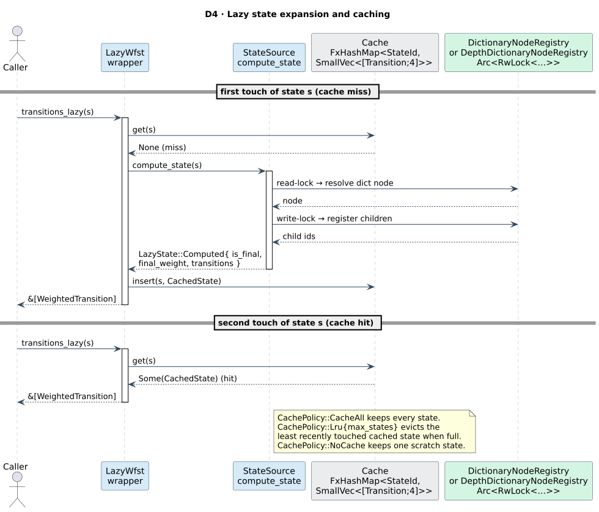

# Levenshtein WFST

> **`LevenshteinWfst<D>`** — the core adapter. A query-parameterized Levenshtein automaton × a
> dictionary, presented as a lazy `Wfst<char, TropicalWeight>`. **Start here.**
> Supporting types: `LevenshteinStateSource<D>` (the kernel) and `DictionaryBackend<D>` (the
> lattice adapter). Always available (no feature flag).

## 1. Intuition

`LevenshteinWfst::new(&dict, "helo", 2)` is "the Levenshtein automaton for the query `helo` up to
edit distance 2, walking the dictionary `dict`, as a composable transducer". Its accepting paths spell
out dictionary terms within distance 2 of `helo`, and each path's tropical weight is that term's edit
distance. The machinery is the edit lattice of [theory/02](../theory/02-edit-distance-and-levenshtein-automata.md)
made into transitions ([theory/03](../theory/03-levenshtein-as-transducer.md)).


## 2. Type and bounds

```rust,ignore
pub struct LevenshteinWfst<D>
where
    D: Dictionary + Clone + Send + Sync,
    D::Node: Send + Sync,
    <D::Node as DictionaryNode>::Unit: Into<char> + TryFrom<char> + Copy + Send + Sync,
{ /* state_source, cache, max_distance, algorithm, max_automaton_states, cache_policy, … */ }
```

The unit bound `Into<char> + TryFrom<char>` is what lets the *same* wrapper serve byte (`u8`) and
Unicode (`u32`) dictionaries: edit distance is always computed **per Unicode scalar**, never per byte.

## 3. Constructors and methods

```rust,ignore
// Construct (Algorithm::Standard)
pub fn new(dictionary: &D, query: &str, max_distance: usize) -> Self;
// Construct with an explicit algorithm (Standard / Transposition / MergeAndSplit)
pub fn with_algorithm(dictionary: &D, query: &str, max_distance: usize, algorithm: Algorithm) -> Self;

pub fn max_distance(&self) -> usize;
pub fn algorithm(&self) -> Algorithm;
pub fn query(&self) -> &str;
pub fn set_max_cache_size(&mut self, size: usize);   // honoured under CachePolicy::Lru
```

It implements `Wfst<char, TropicalWeight>` and `LazyWfst<char, TropicalWeight>`. `start()` is the
encoded `(dict_root = 0, query_pos = 0)`. `is_final`/`final_weight`/`transitions` read the cache, so
**expand a state before reading it eagerly** (or use `transitions_lazy`).

## 4. Semantics

The kernel is `LevenshteinStateSource<D>`, whose `compute_transitions` realizes the four edit
operations exactly as in [theory/03](../theory/03-levenshtein-as-transducer.md):

| Operation | input : output | weight | successor |
|-----------|----------------|--------|-----------|
| match (`q[pos] = c`) | `q[pos] : c` | `0` | `(child, pos+1)` |
| substitute (`q[pos] ≠ c`) | `q[pos] : c` | `1` | `(child, pos+1)` |
| insert (per dict edge `c`) | `ε : c` | `1` | `(child, pos)` |
| delete | `q[pos] : ε` | `1` | `(dict_node, pos+1)` |
| merge (`q[pos..pos+2] → c`) | `q[pos] : c`, then `q[pos+1] : ε` | `1 + 0` | `(child, pos+2)` |
| split (`q[pos] → c₀c₁`) | `q[pos] : c₀`, then `ε : c₁` | `1 + 0` | `(grandchild, pos+1)` |

A state is accepting iff `dict_node.is_final() ∧ (n − pos) ≤ k`, with final weight `n − pos` (the cost
of deleting the unconsumed query tail). See the literate pseudocode in
[theory/03 §3](../theory/03-levenshtein-as-transducer.md#3-the-transition-kernel-as-literate-pseudocode).

### Adjacent transposition

When `Algorithm::Transposition` is selected, `LevenshteinStateSource` adds unit-cost adjacent swaps.
Because the WFST label type is a single `char`, a swap is represented as two arcs: the first arc emits
the swapped dictionary character and charges weight `1`; the second arc must immediately emit the
other swapped character and charges weight `0`. For query `"ba"` and dictionary term `"ab"`, the
accepting path is `('b':'a')/1` followed by `('a':'b')/0`.

### Merge and split

When `Algorithm::MergeAndSplit` is selected, `LevenshteinStateSource` adds the OCR-style arities from
liblevenshtein's operation set: merge `⟨1 dict, 2 query, 1⟩` and split `⟨2 dict, 1 query, 1⟩`. These
are also represented as two single-label arcs. For query `"rn"` and dictionary term `"m"`, merge is
`('r':'m')/1` followed by `('n':ε)/0`. For query `"m"` and dictionary term `"rn"`, split is
`('m':'r')/1` followed by `(ε:'n')/0`.

## 5. UTF-8

Edit distance is per Unicode scalar. The tests exercise `café`/`naïve`/`北京` against ASCII spellings
and confirm distances are counted in `char`s, not bytes.

## 6. Example

```rust,ignore
use duallity::LevenshteinWfst;
use liblevenshtein::transducer::Algorithm;
use libdictenstein::dynamic_dawg::char::DynamicDawgChar;
use lling_llang::prelude::*;

let dict = DynamicDawgChar::<()>::from_terms(vec!["hello", "help", "world"]);

// Standard edit distance ≤ 2 for the query "helo".
let mut lev = LevenshteinWfst::new(&dict, "helo", 2);
assert_eq!(lev.max_distance(), 2);
assert_eq!(lev.query(), "helo");

// Expand the start state, then read its transitions.
let s0 = lev.start();
lev.expand(s0);
assert!(lev.is_expanded(s0));

// Damerau–Levenshtein adjacent swaps are represented as two WFST arcs with total cost 1.
let _dl = LevenshteinWfst::with_algorithm(&dict, "tset", 2, Algorithm::Transposition);
```



## 7. DictionaryBackend

`DictionaryBackend<D>` is the supporting adapter that lets a libdictenstein dictionary act as
lling-llang's `LatticeBackend` (the vocabulary layer used by lattice infrastructure). It is **not** a
transducer — it interns terms to `VocabId`s.

```rust,ignore
pub struct DictionaryBackend<D>
where D: Dictionary + Clone + Send + Sync, D::Node: Send + Sync { /* … */ }

pub fn new(dictionary: D) -> Self;                                   // empty vocab (lazy interning)
pub fn with_vocabulary<I: IntoIterator<Item = String>>(dictionary: D, terms: I) -> Self; // pre-intern
pub fn dictionary(&self) -> &D;
pub fn dictionary_mut(&mut self) -> &mut D;
pub fn into_dictionary(self) -> D;
```

Interning is lazy and backed by `FxHashMap<Arc<str>, VocabId>` (forward) + `Vec<Arc<str>>` (reverse),
so the backend clones cheaply. `contains(word)` is true if the word is in the interning cache **or**
the underlying `Dictionary`. `get_id(word)` consults the cache only (no auto-intern). See the trait in
[architecture/02 §5](../architecture/02-wfst-trait-surface.md#5-latticebackend--adapting-a-dictionary).

```rust,ignore
use duallity::DictionaryBackend;
use libdictenstein::dynamic_dawg::char::DynamicDawgChar;
use lling_llang::prelude::*;

let dict = DynamicDawgChar::<()>::from_terms(vec!["hello", "world"]);
let mut backend = DictionaryBackend::new(dict);
let id_hello = backend.intern("hello");
assert_eq!(backend.lookup(id_hello), Some("hello"));
assert_eq!(backend.intern("hello"), id_hello);   // stable
assert!(backend.contains("world"));              // via the underlying dictionary
```

## See also

- [theory/02 · Edit distance and Levenshtein automata](../theory/02-edit-distance-and-levenshtein-automata.md)
- [theory/03 · The Levenshtein automaton as a transducer](../theory/03-levenshtein-as-transducer.md)
- [architecture/03 · State encoding](../architecture/03-state-encoding-and-product-space.md)
- [guides/01 · Quickstart](../guides/01-quickstart.md)
