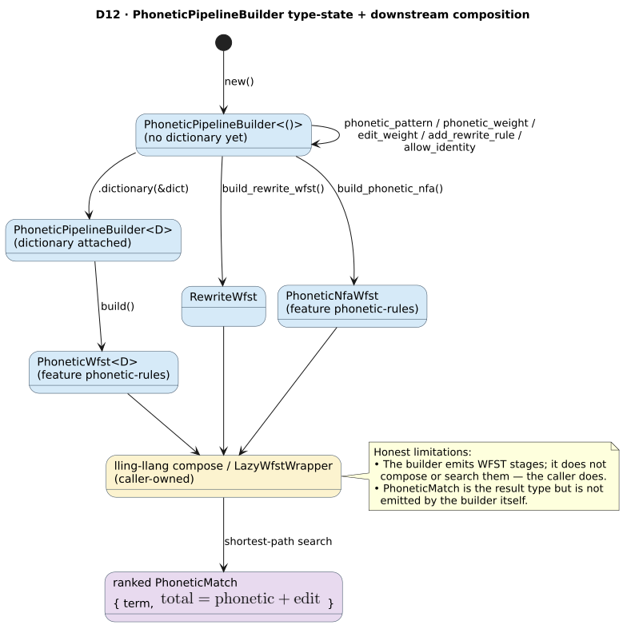

# Phonetic Pipeline Builder

> **`PhoneticPipelineBuilder`**, **`PhoneticPipelineConfig`**, **`PhoneticMatch`** — one fluent,
> type-state front-end that emits any of the phonetic WFST stages from a single configuration. The
> rewrite stage is always available; the NFA/dictionary stages need `features = ["phonetic-rules"]`.

## 1. Intuition

Rather than constructing [`RewriteWfst`](phonetic-rewrite-wfst.md),
[`PhoneticNfaWfst`](phonetic-nfa-wfst.md), or [`PhoneticWfst`](phonetic-wfst.md) by hand, configure one
builder and ask it for whichever stage you need. The builder advances through a **type state**: it
starts as `PhoneticPipelineBuilder<()>` (no dictionary) and becomes `PhoneticPipelineBuilder<D>` once
you attach a dictionary, which unlocks the dictionary-backed `build()`.

 to <D> and has three exits; the caller composes and searches" width="820"/>

## 2. Types

```rust,ignore
pub struct PhoneticPipelineConfig {
    pub pattern: Option<String>,
    pub max_distance: u8,        // default 2
    pub phonetic_weight: f64,    // default 0.0
    pub edit_weight: f64,        // default 1.0
    pub rewrite_rules: Vec<RewriteRule>,
    pub allow_identity: bool,    // default true
}   // implements Default

pub struct PhoneticPipelineBuilder<D = ()> { /* config, dictionary: Option<D> */ }

pub struct PhoneticMatch {
    pub term: String,
    pub total_cost: f64,         // = phonetic_cost + weighted edit_cost
    pub phonetic_cost: f64,
    pub edit_cost: f64,          // pass the already weighted edit component
}
```

`PhoneticMatch` is ordered by `total_cost` then `term` (so it sorts ascending by cost and is usable in
a `BinaryHeap`/`BTreeSet`). `new(term, phonetic_cost, edit_cost)` sets `total_cost` to the sum; pass
the edit component after any `edit_weight` multiplier has been applied.

## 3. Builder methods

```rust,ignore
// Always available (no Dictionary bound):
impl PhoneticPipelineBuilder<()> { pub fn new() -> Self; }
impl<D> PhoneticPipelineBuilder<D> {
    pub fn phonetic_pattern(self, pattern: &str) -> Self;
    pub fn max_edit_distance(self, distance: u8) -> Self;
    pub fn phonetic_weight(self, weight: f64) -> Result<Self, InvalidWeightError>;
    pub fn edit_weight(self, weight: f64) -> Result<Self, InvalidWeightError>;
    pub fn add_rewrite_rule(self, input: &str, output: &str, cost: f64) -> Result<Self, InvalidWeightError>;
    pub fn add_rewrite_rules(self, rules: Vec<RewriteRule>) -> Result<Self, InvalidWeightError>;
    pub fn allow_identity(self, allow: bool) -> Self;
    pub fn dictionary<D2>(self, dictionary: &D2) -> PhoneticPipelineBuilder<D2>;   // type-state transition
    pub fn build_rewrite_wfst(&self) -> Result<RewriteWfst, InvalidWeightError>;   // no feature needed
}

// Behind `phonetic-rules`:
#[cfg(feature = "phonetic-rules")]
impl<D> PhoneticPipelineBuilder<D> {
    pub fn build_phonetic_nfa(&self) -> Result<PhoneticNfaWfst, String>;           // needs a pattern
}
#[cfg(feature = "phonetic-rules")]
impl<D: Dictionary + …> PhoneticPipelineBuilder<D> {
    pub fn build(&self) -> Result<PhoneticWfst<D>, String>;                        // needs dictionary + pattern
}
```

The three exits:

| Exit | Produces | Requires | Feature |
|------|----------|----------|---------|
| `build_rewrite_wfst()` | `RewriteWfst` | rewrite rules (or identity) | none |
| `build_phonetic_nfa()` | `PhoneticNfaWfst` | `pattern` | `phonetic-rules` |
| `build()` | `PhoneticWfst<D>` | `dictionary` + `pattern` | `phonetic-rules` |

## 4. Scoring

The two scoring knobs are applied by the emitted stages:

- `phonetic_weight` is passed to `PhoneticNfaWfst`/`PhoneticWfst` and charged on consuming phonetic
  transitions.
- `edit_weight` is passed to `PhoneticWfst` and scales the accepting edit-distance final weight.

`max_edit_distance(k)` remains the unweighted edit bound. The weight multipliers affect ranking, not
the set of product states explored within `k`.

All cost inputs are validated at the builder/API boundary:

- `phonetic_weight` and `edit_weight` must be finite, non-negative `f64` values.
- Rewrite-rule costs passed through `add_rewrite_rule`/`add_rewrite_rules` must also be finite and
  non-negative.

## 5. ⚠ Honest limitations

This builder *assembles stages*; it does **not** run a pipeline:

- **The builder does not compose or search.** It returns WFST stages; **the caller** composes them
  (`lling_llang::composition::compose` / `LazyWfstWrapper`) and runs a shortest-path search. See
  [theory/04 · Composition](../theory/04-composition.md) and
  [guides/03 · Composing pipelines](../guides/03-composing-pipelines.md).
- **`PhoneticMatch` is not emitted internally.** It is the result/aggregation type (separating
  `phonetic_cost` and `edit_cost`, exposing `total_cost` for ranking), but the builder does not
  populate it — the caller constructs `PhoneticMatch` values from the search results.

These are stated so you do not expect the builder to return ranked matches by itself.

## 6. Example

```rust,ignore
// Cargo.toml:  duallity = { version = "0.2", features = ["phonetic-rules"] }
use duallity::{PhoneticPipelineBuilder, PhoneticMatch};
use libdictenstein::dynamic_dawg::char::DynamicDawgChar;

let dict = DynamicDawgChar::<()>::from_terms(vec!["phone", "fone", "bone"]);

// One config, three possible artifacts:
let builder = PhoneticPipelineBuilder::new()
    .phonetic_pattern("(ph|f)one")
    .max_edit_distance(2)
    .phonetic_weight(0.1)
    .expect("valid phonetic weight")
    .edit_weight(1.5)
    .expect("valid edit weight");

let _rewrite = builder.build_rewrite_wfst().expect("valid rewrite rules");
let _nfa     = builder.build_phonetic_nfa().expect("has a pattern");

// Attach a dictionary (type state () -> D) and build the full phonetic WFST:
let full = builder.dictionary(&dict).build().expect("dictionary + pattern");
assert_eq!(full.max_distance(), 2);
assert_eq!(full.edit_weight(), 1.5);

// PhoneticMatch is the caller-constructed result/ranking type:
let m = PhoneticMatch::new("phone".to_string(), 0.1, 1.5);
assert_eq!(m.total_cost, 1.6);
```

## See also

- [design/phonetic-rewrite-wfst](phonetic-rewrite-wfst.md), [design/phonetic-nfa-wfst](phonetic-nfa-wfst.md), [design/phonetic-wfst](phonetic-wfst.md)
- [theory/04 · Composition](../theory/04-composition.md)
- [guides/04 · Phonetic matching](../guides/04-phonetic-matching.md)
