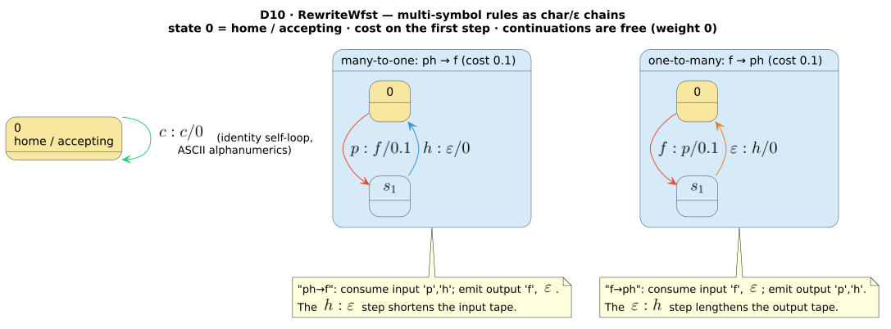

# Phonetic Rewrite WFST

> **`RewriteWfst`**, **`RewriteRule`**, **`CommonPhoneticRules`** — a rule-based phonetic rewriter
> (`ph→f`, `ck→k`, …) presented as a composable `Wfst<char, TropicalWeight>`.
> **Always available — no feature flag.**

## 1. Intuition

A `RewriteWfst` normalizes orthography so that, after composition with a
[Levenshtein WFST](levenshtein-wfst.md), a misspelling like `"fone"` can reach `"phone"` cheaply.
Each **rule** maps an input substring to an output substring at a fixed tropical cost — `ph→f` at
`` $`0.1`$ ``, `ck→k` at `` $`0.1`$ ``, and so on — and every un-rewritten printable-ASCII character
passes through for free via an identity self-loop.

The transducer is deliberately *small and orthography-only*: it does not know about dictionaries,
edit distance, or context. It is a normalizing front stage you place **before** a fuzzy matcher, so
the pipeline's total cost decomposes into *rewrite cost* + *edit distance* ([theory/04 ·
Composition](../theory/04-composition.md)). Because it is a `Wfst`, it participates in the same
`` $`\min`$ ``-plus fold as every other duallity variant rather than being a closed preprocessing
pass.

## 2. Operational semantics

> **Notation.** Symbols below are defined once in the
> [master notation table](../theory/README.md#master-notation): `` $`Q`$ `` (state set),
> `` $`q_0`$ `` (initial state), `` $`F`$ `` (final states), `` $`\rho`$ `` (final weight),
> `` $`\varepsilon`$ `` (the empty tape label), `` $`\bar{0} = +\infty`$ `` and `` $`\bar{1} = 0`$ ``
> (the tropical additive / multiplicative identities), and the edge notation
> `` $`\text{in} : \text{out} / w`$ `` (input label, output label, weight). All weights live in the
> tropical semiring `` $`\mathbb{T} = (\mathbb{R} \cup \{+\infty\},\ \min,\ +,\ +\infty,\ 0)`$ ``.

Let the configured rules be `` $`r_1, \ldots, r_R`$ ``, where rule `` $`r`$ `` has input string
`` $`\mathrm{in}_r`$ ``, output string `` $`\mathrm{out}_r`$ ``, and cost `` $`\mathrm{cost}_r`$ ``.
Define the **step count** of a rule as the length of its longer tape:

```math
s_r \;=\; \max\bigl(\lvert \mathrm{in}_r \rvert,\ \lvert \mathrm{out}_r \rvert\bigr).
```

**States.** State `` $`0`$ `` is the **home** state; each rule contributes `` $`s_r - 1`$ ``
intermediate **continuation states** that thread its multi-symbol rewrite. Writing
`` $`C = \sum_{r} (s_r - 1)`$ `` for the total number of continuation states,

```math
Q \;=\; \{0\} \,\cup\, \{\,c_{r,j} : 1 \le r \le R,\ 1 \le j \le s_r - 1\,\},
\qquad \lvert Q \rvert \;=\; 1 + C.
```

Continuation states are assigned **dense sequential `u32` ids** starting at `` $`1`$ `` (there is no
`` $`d \cdot M + a`$ `` product encoding here — that regime belongs to the dictionary-backed variants;
see [architecture/03](../architecture/03-state-encoding-and-product-space.md)).

**Initial state.** `` $`q_0 = 0`$ ``.

**Final predicate and final weight.** State `` $`0`$ `` is the *only* accepting state, and its final
weight is the free weight `` $`\bar{1}`$ ``; every continuation state is non-accepting (final weight
`` $`\bar{0}`$ ``, "no path"):

```math
F = \{0\}, \qquad
\rho(q) \;=\;
\begin{cases}
\bar{1} = 0 & q = 0,\\[2pt]
\bar{0} = +\infty & q \ne 0.
\end{cases}
```

Because only the home state accepts, every rule chain must **return to `` $`0`$ ``** before the input
is accepted — a rule is applied atomically or not at all.

**Transition relation.** Rule `` $`r`$ `` is emitted as a chain of `` $`s_r`$ `` edges. Step
`` $`j \in \{0, \ldots, s_r - 1\}`$ `` reads `` $`\mathrm{in}_r[j]`$ `` (or `` $`\varepsilon`$ `` when
`` $`j \ge \lvert \mathrm{in}_r \rvert`$ ``) and writes `` $`\mathrm{out}_r[j]`$ `` (or
`` $`\varepsilon`$ `` when `` $`j \ge \lvert \mathrm{out}_r \rvert`$ ``). The **whole rule cost sits
on step `` $`0`$ ``**; all continuation steps are free:

```math
0 \;\xrightarrow{\ \mathrm{in}_r[0]\,:\,\mathrm{out}_r[0]\ /\ \mathrm{cost}_r\ }\; c_{r,1}
  \;\xrightarrow{\ \mathrm{in}_r[1]\,:\,\mathrm{out}_r[1]\ /\ \bar{1}\ }\; c_{r,2}
  \;\cdots\;
  c_{r,\,s_r-1} \;\xrightarrow{\ \mathrm{in}_r[s_r-1]\,:\,\mathrm{out}_r[s_r-1]\ /\ \bar{1}\ }\; 0.
```

A one-step rule (`` $`s_r = 1`$ ``, e.g. `c→s`) is a single self-loop `` $`0 \to 0`$ `` carrying the
whole cost. **Identity self-loops.** When `allow_identity` is set (the default), state `` $`0`$ ``
additionally carries `` $`c : c / \bar{1}`$ `` for every one of the 95 **printable ASCII** characters
`` $`c`$ `` from `` `' '` `` (`` $`\texttt{0x20}`$ ``) through `` `'~'` `` (`` $`\texttt{0x7E}`$ ``), so
any character not consumed by a rule passes through at zero cost. With
`allow_identity` cleared, a character is accepted **only** if some rule consumes it.

**Enumeration order and pruning.** From state `` $`0`$ `` the step-0 edges are enumerated by
descending `priority`, with insertion order breaking ties; the identity loops follow. The assembled
edge multiset is then passed through `prune_dominated_transitions`, which keys edges on
`` $`(\text{from}, \text{in}, \text{out}, \text{to})`$ `` and keeps only the **minimum-weight**
representative of each key. A rule such as `ph→f` at `` $`0.1`$ `` therefore dominates the identity
`p:p` only when their `` $`(\text{in},\text{out})`$ `` labels coincide (they do not, so both survive);
duplicate `` $`(\text{in},\text{out},\text{to})`$ `` edges introduced by overlapping rules collapse
to their cheapest form.

## 3. API surface (duallity 4.0.0-rc.3)

`RewriteWfst`, `RewriteRule`, and `CommonPhoneticRules` are re-exported from the crate root with **no
feature gate** (`src/phonetic_rewrite_wfst.rs`). `RewriteWfst` is a concrete, non-generic type.

```rust,ignore
pub struct RewriteRule {
    pub input: String,    // characters to match (query side)
    pub output: String,   // replacement characters (dictionary side)
    pub cost: f64,        // tropical cost of applying the rule
    pub priority: i32,    // higher = enumerated first when several rules leave state 0
}

impl RewriteRule {
    pub fn new(input: &str, output: &str) -> Self;                 // cost 0.0, priority 0
    pub fn with_cost(input: &str, output: &str, cost: f64)
        -> Result<Self, InvalidWeightError>;                       // validates cost
    pub fn with_priority(self, priority: i32) -> Self;             // consuming setter
}
```

```rust,ignore
pub struct RewriteWfst { /* rules, prepared_rules, continuation_lookup, cache, allow_identity, … */ }

impl RewriteWfst {
    pub fn new() -> Self;                                          // empty, allow_identity = true
    pub fn with_rules(rules: Vec<RewriteRule>)
        -> Result<Self, InvalidWeightError>;
    pub fn add_rule(&mut self, input: &str, output: &str, cost: f64)
        -> Result<(), InvalidWeightError>;
    pub fn add_rewrite_rule(&mut self, rule: RewriteRule)
        -> Result<(), InvalidWeightError>;
    pub fn set_allow_identity(&mut self, allow: bool);
    pub fn num_rules(&self) -> usize;
}

impl Default for RewriteWfst { /* == new() */ }

pub struct CommonPhoneticRules;   // namespace of preset rule sets
impl CommonPhoneticRules {
    pub fn english() -> Vec<RewriteRule>;
    pub fn german()  -> Vec<RewriteRule>;
    pub fn french()  -> Vec<RewriteRule>;
}
```

**Weight validation.** Rule costs must be finite and non-negative. `RewriteRule::with_cost`,
`RewriteWfst::with_rules`, `RewriteWfst::add_rule`, and `RewriteWfst::add_rewrite_rule` all return
`Result<_, InvalidWeightError>`, rejecting `NaN`, `` $`\pm\infty`$ ``, and negative values *before*
any invalid `TropicalWeight` can be emitted. `RewriteRule::new` and the preset constructors take
already-valid literal costs and are infallible.

**Trait implementations.** `RewriteWfst` implements `Wfst<char, TropicalWeight>`,
`LazyWfst<char, TropicalWeight>`, and a **fully functional** `StateSource<char, TropicalWeight>`, so
it can be driven either mutably (`expand` / `transitions_lazy`) or immutably through `compute_state`
(the path `compose` uses via `LazyWfstWrapper`; see
[architecture/02](../architecture/02-wfst-trait-surface.md)). It also derives `Clone`.
`num_states()` returns `` $`1 + C`$ `` (capped at the addressable `u32` range).

### The preset rule sets (verified against `src/phonetic_rewrite_wfst.rs`)

Each preset is a `Vec<RewriteRule>` with `priority = 0` throughout; the `(input → output, cost)` rows
below are exact. `` $`s`$ `` is the step count `` $`\max(\lvert\mathrm{in}\rvert,\lvert\mathrm{out}\rvert)`$ ``
and `` $`s-1`$ `` the continuation states the rule contributes.

**`CommonPhoneticRules::english()`** — `` $`\sum (s-1) = 5`$ ``, so an English `RewriteWfst` has
`` $`\lvert Q \rvert = 6`$ ``:

| input → output | cost | `` $`s`$ `` | `` $`s-1`$ `` | note |
|----------------|------|-----|-------|------|
| `ph → f`  | `0.1` | 2 | 1 | many-to-one |
| `gh → f`  | `0.2` | 2 | 1 | *rough → ruff* |
| `ck → k`  | `0.1` | 2 | 1 | many-to-one |
| `qu → kw` | `0.1` | 2 | 1 | two-to-two |
| `x → ks`  | `0.1` | 2 | 1 | one-to-many |
| `c → k`   | `0.2` | 1 | 0 | coarse hard-c |
| `c → s`   | `0.2` | 1 | 0 | coarse soft-c |

**`CommonPhoneticRules::german()`** — `` $`\sum (s-1) = 3`$ `` (`sch→sh` alone contributes 2):

| input → output | cost | `` $`s`$ `` | `` $`s-1`$ `` | note |
|----------------|------|-----|-------|------|
| `sch → sh` | `0.1` | 3 | 2 | three-to-two |
| `ch → x`   | `0.1` | 2 | 1 | voiceless fricative (IPA [x] / [ç]) |
| `ß → ss`   | `0.1` | 2 | 1 | one-to-two |
| `ä → ae`   | `0.1` | 2 | 1 | one-to-two |
| `ö → oe`   | `0.1` | 2 | 1 | one-to-two |
| `ü → ue`   | `0.1` | 2 | 1 | one-to-two |

**`CommonPhoneticRules::french()`** — `` $`\sum (s-1) = 5`$ ``:

| input → output | cost | `` $`s`$ `` | `` $`s-1`$ `` | note |
|----------------|------|-----|-------|------|
| `eau → o` | `0.1` | 3 | 2 | three-to-one |
| `aux → o` | `0.1` | 3 | 2 | three-to-one |
| `ai → e`  | `0.1` | 2 | 1 | two-to-one |
| `ph → f`  | `0.1` | 2 | 1 | many-to-one |
| `qu → k`  | `0.1` | 2 | 1 | two-to-one |

The German scalars `ß`, `ä`, `ö`, `ü` are single Unicode `char`s (`` $`\lvert\mathrm{in}\rvert = 1`$ ``),
so `ß→ss` is one-to-many with `` $`s = 2`$ ``.

## 4. Complexity

Let `` $`L = \sum_r s_r`$ `` be the total rule length. Construction (`with_rules` /
`PreparedRuleMetadata::from_rules`) tokenizes every rule and builds the dense continuation lookup in
`` $`O(L)`$ `` time and space, with all buffers **preallocated** to their exact final sizes; the
priority order is one `` $`O(R \log R)`$ `` sort. The automaton has `` $`\lvert Q \rvert = 1 + C`$ ``
states and no `` $`d \cdot M + a`$ `` radix — state ids are dense `u32` values `` $`0 \ldots C`$ ``.

Per-state expansion is where the fan-out lands:

| Expanded state | Edges built before pruning | After `prune_dominated_transitions` |
|----------------|----------------------------|-------------------------------------|
| home (`` $`0`$ ``), `allow_identity = true`  | `` $`R + 95`$ `` | dominated duplicates removed |
| home (`` $`0`$ ``), `allow_identity = false` | `` $`R`$ ``      | dominated duplicates removed |
| continuation `` $`c_{r,j}`$ ``               | `` $`1`$ ``      | unchanged |

Pruning is `` $`O(t)`$ `` linear scan for `` $`t < 16`$ `` edges and switches to an
`` $`O(t)`$ `` `FxHashMap` pass at or above that threshold (`HASH_PRUNE_THRESHOLD`). Expanded states
are memoized in an LRU `LazyStateCache` (default capacity `10_000`), so each state's edges are
computed once. A home-state fan-out of `` $`R + 95`$ `` is dominated by the constant `95` identity
loops for small rule sets; clear `allow_identity` when you only want rule edges.

## 5. Worked example

Compose the English preset in front of a Levenshtein matcher and drive the search. This is the
canonical two-stage phonetic pipeline: `RewriteWfst` normalizes, `LevenshteinWfst` fuzzes.

```rust,ignore
use duallity::{LevenshteinWfst, RewriteWfst, CommonPhoneticRules};
use libdictenstein::dynamic_dawg::char::DynamicDawgChar;
use lling_llang::composition::compose;
use lling_llang::prelude::*;

let dict = DynamicDawgChar::<()>::from_terms(vec!["phone", "graph", "telephone"]);

// "fone" → rewrite (f↔ph at cost 0.1) → Levenshtein(2) over the dictionary.
let rewrite = RewriteWfst::with_rules(CommonPhoneticRules::english())
    .expect("valid preset rules");
let lev     = LevenshteinWfst::new(&dict, "fone", 2);
let mut composed = compose(rewrite, lev);      // RewriteWfst ∘ LevenshteinWfst

// The tropical weight of each accepting path is  rewrite cost + edit distance.
// Reaching "phone" from "fone" pays the ph↔f rewrite (0.1) plus its residual edits.
for path in composed.accepting_paths() {
    println!("{:?} -> {:?}  weight {}", path.inputs, path.outputs, path.weight.value());
}
```

The accepting path to `"phone"` carries the `` $`0.1`$ `` rewrite cost of the `f`/`ph` alternation
plus whatever edit distance remains after normalization; a term reached purely by identity
pass-through and edits carries no rewrite component. Building a custom rule set is symmetric:

```rust,ignore
use duallity::{RewriteRule, RewriteWfst};

let mut r = RewriteWfst::new();
r.add_rule("ph", "f", 0.1).expect("valid rewrite rule");           // ph → f
r.add_rewrite_rule(
    RewriteRule::with_cost("ck", "k", 0.1).expect("valid rewrite rule").with_priority(5),
).expect("valid rewrite rule");                                     // ck → k, tried first
assert_eq!(r.num_rules(), 2);
```

### The char / epsilon chain shapes

The three tape shapes below are pinned by the integration tests
`rewrite_wfst_many_to_one_input_chain_consumes_continuation`,
`rewrite_wfst_one_to_many_output_chain_emits_continuation`, and
`rewrite_wfst_identity_transitions_passthrough_printable_symbols` (`tests/phonetic_rewrite_wfst.rs`):

| Rule | Step 0 | Step 1 | Tape effect |
|------|--------|--------|-------------|
| `ph → f` (many-to-one) | `` $`p : f / 0.1`$ `` → `` $`c_1`$ `` | `` $`h : \varepsilon / \bar{1}`$ `` → `` $`0`$ `` | shortens the **input** tape (trailing `` $`h : \varepsilon`$ ``) |
| `f → ph` (one-to-many) | `` $`f : p / 0.1`$ `` → `` $`c_1`$ `` | `` $`\varepsilon : h / \bar{1}`$ `` → `` $`0`$ `` | lengthens the **output** tape (trailing `` $`\varepsilon : h`$ ``) |
| `c → s` (one-to-one)   | `` $`c : s / 0.2`$ `` → `` $`0`$ `` | — | equal-length, single self-loop |

## 6. ⚠ Honest limitations

- **Rules are unconditional.** `RewriteRule` stores only `input`/`output`/`cost`/`priority`; there is
  no left/right context, lookahead, or word-boundary condition. The English `c→k` and `c→s` presets
  are therefore *coarse alternatives* offered simultaneously, not lexically-conditioned choices.
  Model context by **expanding it into explicit unconditional rules** before construction: a
  right-context rule "`c→s` before `e`" becomes the consumed-context rule `ce→se` (the `e` passes
  through as part of the output). This is the intended workaround, and it is exact.
- **`priority` orders, it does not gate.** Higher priority merely enumerates a rule's step-0 edge
  earlier from the home state; equal-priority rules keep insertion order. Every applicable rule is
  still available — priority does not suppress lower-priority alternatives.
- **The identity alphabet is printable ASCII only** (95 symbols, `` $`\texttt{0x20}`$ `` …
  `` $`\texttt{0x7E}`$ ``). A character outside that range (an emoji, a CJK ideograph, most accented
  Latin letters) has **no** identity self-loop, so with `allow_identity` on it can only be accepted
  if a rule consumes it. Preset rules whose *inputs* are wide scalars (German `ä`, `ö`, `ü`, `ß`) are
  matched by their explicit rule edges, but arbitrary out-of-range passthrough is not provided. For
  full-Unicode alternation use the regex-backed [`PhoneticNfaWfst`](phonetic-nfa-wfst.md) with a
  custom alphabet instead.
- **No dictionary, no edit distance.** `RewriteWfst` is an orthography normalizer only; the fuzzy
  matching comes from the Levenshtein stage you compose behind it.

## 7. Diagram

The `ph→f` (many-to-one) and `f→ph` (one-to-many) chains, with the whole cost on step 0 and free
continuations returning to the home state:



## See also

- [theory/03 · The Levenshtein automaton as a transducer](../theory/03-levenshtein-as-transducer.md) — the same `` $`\varepsilon`$ ``-on-one-tape convention.
- [theory/04 · Composition](../theory/04-composition.md) — how `` $`\text{rewrite} \circ \text{lev}`$ `` folds the two cost components.
- [design/phonetic-nfa-wfst](phonetic-nfa-wfst.md) — regex → NFA phonetic matching (feature-gated), when rules are not enough.
- [design/phonetic-wfst](phonetic-wfst.md) — sound-alike matching over a dictionary from a regex.
- [design/phonetic-pipeline-builder](phonetic-pipeline-builder.md) — the `build_rewrite_wfst()` front-end.
- [guides/04 · Phonetic matching](../guides/04-phonetic-matching.md) — rules vs. regex, with the preset rule sets.
- Source: `src/phonetic_rewrite_wfst.rs`, `src/phonetic_rewrite_support.rs`.

## References

1. **Mohri, M.** (1997). *Finite-State Transducers in Language and Speech Processing.* Computational
   Linguistics 23(2), 269–311. [ACL Anthology J97-2003](https://aclanthology.org/J97-2003/) — the
   weighted-transducer framework in which rewrite rules become labelled, composable arcs.
2. **Mohri, M., Pereira, F., & Riley, M.** (2002). *Weighted Finite-State Transducers in Speech
   Recognition.* Computer Speech & Language 16(1), 69–88.
   [doi:10.1006/csla.2001.0184](https://doi.org/10.1006/csla.2001.0184) — composition of weighted
   transducers, the operation this stage is built to feed.
