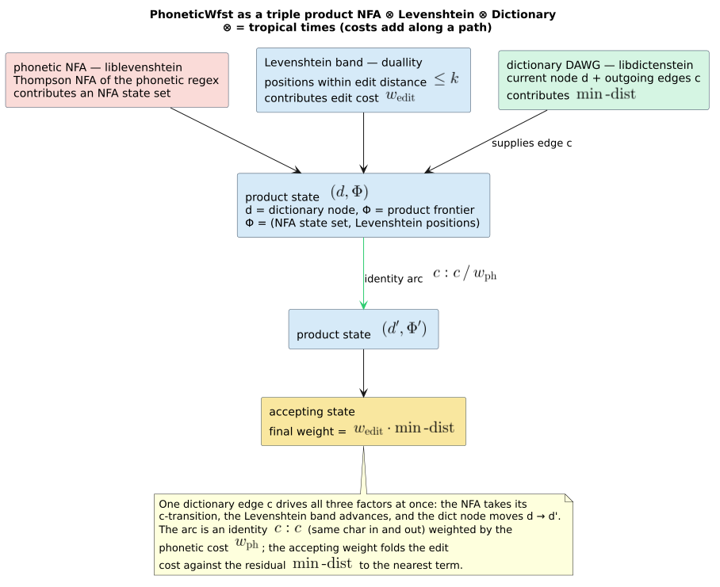

# Phonetic WFST

> **`PhoneticWfst<D>`**, **`PhoneticWfstBuilder<D>`**, and the kernel **`PhoneticStateSource<D>`** —
> sound-alike matching: a phonetic regex compiled to an NFA, fused with a Levenshtein automaton over
> a dictionary as the triple product **NFA × Levenshtein × Dictionary**. **Requires
> `features = ["phonetic-rules"]`.**

## 1. Intuition

`PhoneticWfst` answers *"which dictionary terms sound like this pattern, within $`k`$ edits?"*.
You give it a phonetic regex (`(ph|f)one`) and a dictionary; it compiles the pattern to an NFA
([theory/07](../theory/07-regular-language-limits.md)) and forms the **triple product** — the phonetic
NFA (which strings *sound right*), the Levenshtein automaton (how far a spelling may drift), and the
dictionary (which strings actually exist). A path's weight then blends a per-character *phonetic*
component with an accepting *edit-distance* component, so results can be ranked by "how close, and how
plausibly-spelled".

This is the end-to-end phonetic query. Its two lighter cousins are the bare pattern transducer
[`PhoneticNfaWfst`](phonetic-nfa-wfst.md) (no dictionary, no edits) and the rule-based
[`RewriteWfst`](phonetic-rewrite-wfst.md) (fixed $`\texttt{ph} \to \texttt{f}`$-style rules, feature-free). `PhoneticWfst` is
the one to reach for when the query is a *pattern* and the target is a *dictionary*.

## 2. Operational semantics — the triple product

> **Notation.** From the [master notation table](../theory/README.md#master-notation):
> $`Q`$, $`q_0`$, $`F`$, $`\rho`$ (final weight), $`k`$ (`max_distance`),
> $`D`$ (dictionary), $`d`$ (a dictionary-node id), $`M`$ (encoding radix),
> $`\bar{0} = +\infty`$, $`\bar{1} = 0`$, and the edge notation
> $`\text{in}:\text{out}/w`$. Weights live in the tropical semiring $`\mathbb{T}`$. Write
> $`\omega_p`$ for `phonetic_weight`, $`\omega_e`$ for `edit_weight`, and
> $`M_{\mathrm{phon}}`$ for the phonetic radix.

The kernel `PhoneticStateSource<D>` holds an `Arc<ProductAutomatonChar>` — the
NFA × Levenshtein product — and walks it *alongside* the dictionary. A product-automaton state is not
a single NFA×Levenshtein position but a **frontier** $`\Phi`$: a canonicalized,
**deletion-closed** set of `ProductStateChar` positions (a single position would miss the
deletion-closure states the native trie traversal explores). Each distinct frontier is interned to a
`u32` id $`p`$ by a shared `Arc<RwLock<ProductStateRegistry>>`; each dictionary
node is interned to $`d`$ by a shared node registry.

**States and encoding.** A WFST state is a pair $`(d, p)`$ — dictionary node $`d`$,
product frontier $`p`$ — packed into one `u32` `StateId` by the arithmetic scheme of
[architecture/03](../architecture/03-state-encoding-and-product-space.md):

```math
\mathrm{StateId} \;=\; d \cdot M_{\mathrm{phon}} + p,
\qquad
M_{\mathrm{phon}} \;=\; \max\bigl((k+1)\cdot 1000,\ 10000\bigr).
```

**Initial state.** $`q_0 = \mathrm{encode}(0, 0) = 0`$: the dictionary root paired with the
product automaton's initial frontier.

**Transition relation.** From $`(d, \Phi)`$, for every dictionary edge $`(c, \text{child})`$
of node $`d`$ (character $`c`$ from the dictionary unit), ask the product automaton for the
deletion-closed successor frontier $`\Phi' = \mathrm{transition\_frontier}(\Phi, c)`$. If
$`\Phi'`$ is non-empty, register $`\text{child}`$ as $`d'`$ and $`\Phi'`$ as
$`p'`$, and emit an **identity** edge charged $`\omega_p`$:

```math
(d, \Phi) \;\xrightarrow{\ c\,:\,c\ /\ \omega_p\ }\; (d', \Phi').
```

An empty successor frontier prunes the edge (the character cannot be reached within $`k`$ while
staying phonetically live). Encoding is checked before registration: a target that cannot fit
$`d' \cdot M_{\mathrm{phon}} + p'`$ in a `u32` is dropped rather than mis-encoded.

**Final predicate and final weight.** A state accepts iff the dictionary node is a word end **and**
the product frontier has an accepting position; the accepting cost is $`\omega_e`$ times the
**minimum accepting edit distance** in the frontier:

```math
\rho(d, \Phi) \;=\;
\begin{cases}
\omega_e \cdot \delta_{\min}(\Phi) & d.\mathsf{is\_final}() \ \wedge\ \delta_{\min}(\Phi) = \min\{\text{accepting distances in } \Phi\} \text{ exists},\\[4pt]
\bar{0} = +\infty & \text{otherwise,}
\end{cases}
```

and $`(d,\Phi) \in F`$ exactly when that first case fires. $`k`$ (= `max_distance`) is the
**unweighted** edit bound baked into the product automaton: it determines *which* frontier positions
exist and therefore which states are explored. The weights $`\omega_p, \omega_e`$ scale the
*reported* costs for ranking — they do **not** change the explored set.

## 3. API surface (duallity 4.0.0-rc.6)

All three types are exported from the crate root **behind `features = ["phonetic-rules"]`**
(`src/phonetic_wfst.rs`, `src/phonetic_state_source.rs`). They share the dictionary bounds

```rust,ignore
D: Dictionary + Clone + Send + Sync,
D::Node: Send + Sync,
<D::Node as DictionaryNode>::Unit: Into<char> + TryFrom<char> + Copy + Send + Sync,
```

so any `libdictenstein` backend with `char` units (e.g. `DynamicDawgChar`) qualifies.

```rust,ignore
#[cfg(feature = "phonetic-rules")]
impl<D> PhoneticWfst<D> /* bounds above */ {
    pub fn new(dictionary: &D, nfa: NFAChar, max_distance: u8) -> Self;   // ω_p = 0.0, ω_e = 1.0
    pub fn with_phonetic_weight(dictionary: &D, nfa: NFAChar, max_distance: u8, phonetic_weight: f64)
        -> Result<Self, InvalidWeightError>;
    pub fn with_weights(dictionary: &D, nfa: NFAChar, max_distance: u8,
                        phonetic_weight: f64, edit_weight: f64)
        -> Result<Self, InvalidWeightError>;
    pub fn max_distance(&self) -> u8;
    pub fn phonetic_weight(&self) -> f64;
    pub fn edit_weight(&self) -> f64;
    pub fn set_max_cache_size(&mut self, size: usize);
}
```

The **builder owns the dictionary by value** (unlike the borrow-based `new`/`with_*`), so it can be
consumed by `build_from_pattern`:

```rust,ignore
#[cfg(feature = "phonetic-rules")]
impl<D> PhoneticWfstBuilder<D> /* bounds above */ {
    pub fn new(dictionary: D, max_distance: u8) -> Self;                  // ω_p = 0.0, ω_e = 1.0
    pub fn phonetic_weight(self, weight: f64) -> Result<Self, InvalidWeightError>;   // consuming
    pub fn edit_weight(self, weight: f64) -> Result<Self, InvalidWeightError>;       // consuming
    pub fn build_from_pattern(self, pattern: &str) -> Result<PhoneticWfst<D>, String>;
}
```

`build_from_pattern` runs `regex::parse` and then `nfa::compile` (a Thompson construction), wrapped into
`PhoneticWfst::with_weights`; parse/compile failures surface as the `Err(String)`, and a bad weight
surfaces as the same `String` (via `InvalidWeightError::to_string`). The `PhoneticStateSource<D>`
kernel exposes the parallel `new` / `with_phonetic_weight` / `with_weights` constructors (borrowing
`&D`) plus `max_distance()`, `phonetic_weight()`, and `edit_weight()` accessors; it is the immutable
`StateSource` that `compose` drives (wrap it in a `LazyWfstWrapper`, or use `PhoneticWfst`, which
already layers a cache over it).

**Weight validation.** `with_phonetic_weight`, `with_weights`, and both builder setters return
`Result<_, InvalidWeightError>`, rejecting `NaN`, infinities, and negatives before any
`TropicalWeight` is emitted. `new` fixes $`\omega_p = 0`$, $`\omega_e = 1`$ and is
infallible.

**Trait implementations.** `PhoneticWfst<D>` implements `Wfst<char, TropicalWeight>` and
`LazyWfst<char, TropicalWeight>`, delegating computation to `PhoneticStateSource<D>` (which implements
`StateSource<char, TropicalWeight>`). `max_distance` is a `u8`. `PhoneticWfst` derives `Clone`; its
default LRU cache capacity is `100_000` states.

## 4. Complexity

Let $`n = \lvert Q_N \rvert`$ be the NFA size, $`\deg_D`$ the dictionary node out-degree,
and $`\lvert\Phi\rvert`$ the frontier size. The reachable product space is bounded by
$`(\text{registered dictionary nodes}) \times M_{\mathrm{phon}}`$, but it is explored **lazily**:
a product state is minted only when a search visits it. Expanding one state $`(d, \Phi)`$ costs

```math
O\bigl(\deg_D \cdot (\lvert\Phi\rvert + \lvert\Phi'\rvert)\bigr),
```

one deletion-closed `transition_frontier` per dictionary edge plus the frontier canonicalization that
keys the successor for interning. Frontiers are canonicalized (NFA-state vectors sorted/deduped, the
`accumulated_cost` bucketed to $`10^{-6}`$ via `product_cost_key`) so equivalent frontiers share
one id and one `Arc`. Registries live behind `Arc<RwLock<_>>`, and expanded states
memoize in the LRU `LazyStateCache` (default `100_000`).

The radix $`M_{\mathrm{phon}} = \max((k+1)\cdot 1000,\ 10000)`$ is a **generous upper bound** on
the number of product frontiers per dictionary node — $`10\,000`$ for $`k \le 9`$,
$`(k+1)\cdot 1000`$ beyond. It reserves id space; it is not the count of frontiers actually
minted. `try_encode` rejects any $`p \ge M_{\mathrm{phon}}`$, so an overfull node prunes rather
than colliding into a neighbour's band.

## 5. Worked example

```rust,ignore
// Cargo.toml:  duallity = { version = "=4.0.0-rc.6", features = ["phonetic-rules"] }
use duallity::PhoneticWfstBuilder;
use libdictenstein::dynamic_dawg::char::DynamicDawgChar;
use lling_llang::prelude::*;

let dict = DynamicDawgChar::<()>::from_terms(vec!["phone", "fone", "bone"]);

// "(ph|f)one" compiles to an NFA-backed phonetic WFST over the dictionary.
let mut wfst = PhoneticWfstBuilder::new(dict, 2)          // k = 2
    .phonetic_weight(0.1).expect("valid phonetic weight") // ω_p = 0.1 per consumed char
    .edit_weight(1.5).expect("valid edit weight")         // ω_e = 1.5 per accepting edit
    .build_from_pattern("(ph|f)one")
    .expect("valid phonetic pattern");
assert_eq!(wfst.max_distance(), 2);
assert_eq!(wfst.edit_weight(), 1.5);
wfst.expand(wfst.start());
```

The pattern's language is $`L\bigl((ph|f)one\bigr) = \{\texttt{phone}, \texttt{fone}\}`$. Walking
the dictionary against the product:

| term | in $`L`$? | $`\delta_{\min}`$ (accepting distance) | accepting weight $`\omega_e \cdot \delta_{\min}`$ | accumulated phonetic edges $`\omega_p \cdot \lvert\text{term}\rvert`$ | total path |
|------|:----:|:---:|:---:|:---:|:---:|
| `phone` | yes | $`0`$ | $`1.5 \cdot 0 = 0`$ | $`0.1 \cdot 5 = 0.5`$ | $`0.5`$ |
| `fone`  | yes | $`0`$ | $`1.5 \cdot 0 = 0`$ | $`0.1 \cdot 4 = 0.4`$ | $`0.4`$ |
| `bone`  | no  | $`1`$ ($`\texttt{b} \to \texttt{f}`$) | $`1.5 \cdot 1 = 1.5`$ | $`0.1 \cdot 4 = 0.4`$ | $`1.9`$ |

`phone` and `fone` are both *exact* pattern matches, so their **accepting** (final) weight is
$`1.5 \cdot 0 = 0`$ — they differ only by their accumulated per-character phonetic edge weight.
`bone` is not in the pattern language; it is reached only through one edit ($`\texttt{b} \to \texttt{f}`$, within
$`k = 2`$), contributing the non-zero edit term $`1.5 \cdot 1`$. A shortest-path search
over the composed pipeline therefore ranks `fone` $`\prec`$ `phone` $`\prec`$ `bone` by
total path weight.

## 6. ⚠ Honest limitations

- **`max_distance` is a `u8`.** The unweighted edit bound is $`0 \le k \le 255`$. This is
  narrower than the `usize` bound of [`LevenshteinWfst`](levenshtein-wfst.md) /
  [`WallBreakerWfst`](wallbreaker-wfst.md) — deliberately, because the phonetic product's state space
  grows quickly in $`k`$.
- **Weights are ranking-only.** $`\omega_p`$ and $`\omega_e`$ scale reported costs; they
  do **not** change which product states are explored. Pruning is by the *unweighted* distance
  $`\le k`$. Setting $`\omega_e = 0`$ does not widen the search; it only flattens the
  edit contribution to zero.
- **The radix is a generous bound, not a count.** $`M_{\mathrm{phon}}`$ reserves id space per
  dictionary node; an adversarial pattern that mints more than $`M_{\mathrm{phon}}`$ frontiers
  at one node has its overflow edges **pruned** (they cannot encode), silently narrowing results
  rather than erroring. This is very unlikely with realistic patterns and small $`k`$, but it
  is the honest failure mode.
- **Feature-gated.** The trio does not exist without `features = ["phonetic-rules"]`. Use
  [`RewriteWfst`](phonetic-rewrite-wfst.md) for a feature-free phonetic front stage.

## 7. Diagram

The regex parses, compiles (Thompson) to an NFA, and forms the NFA × Levenshtein × Dictionary
product this variant walks:


A dedicated diagram of the **deletion-closed product frontier** $`\Phi`$ — the set of
NFA×Levenshtein positions carried at each $`(d, \Phi)`$ state, and how `transition_frontier`
advances it per dictionary character — would sharpen §2; see the integrator note below
(`triple-product-frontier.svg`, pending).



## See also

- [design/phonetic-nfa-wfst](phonetic-nfa-wfst.md) — the bare NFA stage (the product's left factor).
- [design/phonetic-rewrite-wfst](phonetic-rewrite-wfst.md) — the rule-based, feature-free alternative.
- [design/phonetic-pipeline-builder](phonetic-pipeline-builder.md) — the fluent front-end whose `build()` emits this variant.
- [design/levenshtein-wfst](levenshtein-wfst.md) — the edit-distance factor.
- [theory/04 · Composition](../theory/04-composition.md) and [theory/07 · Regular-language limits](../theory/07-regular-language-limits.md).
- [architecture/03 · State encoding and the product space](../architecture/03-state-encoding-and-product-space.md) — the $`d \cdot M + p`$ scheme and $`M_{\mathrm{phon}}`$.
- Source: `src/phonetic_wfst.rs`, `src/phonetic_state_source.rs`, `src/phonetic_state_support.rs`, `src/phonetic_anchors.rs`.

## References

1. **Schulz, K. U., & Mihov, S.** (2002). *Fast string correction with Levenshtein automata.*
   International Journal on Document Analysis and Recognition 5(1), 67–85.
   [doi:10.1007/s10032-002-0082-8](https://doi.org/10.1007/s10032-002-0082-8) — the Levenshtein-automaton
   factor of the product.
2. **Mohri, M., Pereira, F., & Riley, M.** (2002). *Weighted Finite-State Transducers in Speech
   Recognition.* Computer Speech & Language 16(1), 69–88.
   [doi:10.1006/csla.2001.0184](https://doi.org/10.1006/csla.2001.0184) — the product/composition of
   weighted transducers over a semiring.
3. **Thompson, K.** (1968). *Programming Techniques: Regular expression search algorithm.*
   Communications of the ACM 11(6), 419–422.
   [doi:10.1145/363347.363387](https://doi.org/10.1145/363347.363387) — compiling the pattern to the
   NFA that seeds the product.
