# Phonetic WFST

> **`PhoneticWfst<D>`**, **`PhoneticWfstBuilder<D>`**, and the kernel **`PhoneticStateSource<D>`** —
> sound-alike matching: a phonetic regex compiled to an NFA, fused with a Levenshtein automaton over a
> dictionary. **Requires `features = ["phonetic-rules"]`.**

## 1. Intuition

`PhoneticWfst` answers "which dictionary terms sound like this pattern, within `k` edits?". You give
it a phonetic regex (`(ph|f)one`) and a dictionary; it compiles the pattern to an NFA
([theory/07](../theory/07-regular-language-limits.md)) and forms the triple product **NFA × Levenshtein
× Dictionary**, so a path's weight blends phonetic-alternation cost and edit cost.



## 2. Types and bounds

```rust,ignore
#[cfg(feature = "phonetic-rules")]
pub struct PhoneticWfst<D>
where
    D: Dictionary + Clone + Send + Sync,
    D::Node: Send + Sync,
    <D::Node as DictionaryNode>::Unit: Into<char> + TryFrom<char> + Copy + Send + Sync,
{ /* state_source: PhoneticStateSource<D>, cache, max_distance: u8, phonetic_weight, edit_weight, … */ }

#[cfg(feature = "phonetic-rules")]
pub struct PhoneticWfstBuilder<D> where /* same bounds */ { /* dictionary: D, max_distance: u8, phonetic_weight, edit_weight */ }
```

The builder **owns** the dictionary (`D`, by value), unlike the borrow-based variants.

## 3. Constructors, builder, and methods

```rust,ignore
impl<D> PhoneticWfst<D> {
    pub fn new(dictionary: &D, nfa: NFAChar, max_distance: u8) -> Self;                 // phonetic_weight = 0.0
    pub fn with_phonetic_weight(dictionary: &D, nfa: NFAChar, max_distance: u8, phonetic_weight: f64) -> Result<Self, InvalidWeightError>;
    pub fn with_weights(dictionary: &D, nfa: NFAChar, max_distance: u8, phonetic_weight: f64, edit_weight: f64) -> Result<Self, InvalidWeightError>;
    pub fn max_distance(&self) -> u8;
    pub fn phonetic_weight(&self) -> f64;
    pub fn edit_weight(&self) -> f64;
    pub fn set_max_cache_size(&mut self, size: usize);
}

impl<D> PhoneticWfstBuilder<D> {
    pub fn new(dictionary: D, max_distance: u8) -> Self;       // phonetic_weight = 0.0
    pub fn phonetic_weight(self, weight: f64) -> Result<Self, InvalidWeightError>;
    pub fn edit_weight(self, weight: f64) -> Result<Self, InvalidWeightError>;
    pub fn build_from_pattern(self, pattern: &str) -> Result<PhoneticWfst<D>, String>;
}
```

`build_from_pattern` is `regex::parse` then `nfa::compile` (a Thompson construction), wrapped into a
`PhoneticWfst`:

```rust,ignore
let ast = parse(pattern).map_err(|e| format!("Parse error: {:?}", e))?;
let nfa = compile(&ast).map_err(|e| format!("Compile error: {:?}", e))?;
PhoneticWfst::with_weights(
    &self.dictionary,
    nfa,
    self.max_distance,
    self.phonetic_weight,
    self.edit_weight,
)
.map_err(|error| error.to_string())
```

`PhoneticWfst` implements `Wfst` and `LazyWfst`, delegating expansion to `PhoneticStateSource`; the
product-state radix is `max_product_states = ((max_distance + 1) · 1000).max(10_000)`
([architecture/03](../architecture/03-state-encoding-and-product-space.md)).

## 4. Semantics — the triple product

`PhoneticStateSource<D>` holds an `Arc<ProductAutomatonChar>` (NFA × Levenshtein) and walks it
alongside the dictionary. For each dictionary edge `(dict_char, child)`:

- ask the product automaton for its successor on `dict_char`;
- charge **`phonetic_weight`** on the dictionary-edge transition, matching
  [`PhoneticNfaWfst`](phonetic-nfa-wfst.md)'s per-consuming-transition convention;
- emit an **identity** transition `dict_char : dict_char` to the encoded successor state.

A product state is accepting iff `dict_node.is_final() ∧ product.is_accepting(state)`, with final
weight equal to `edit_weight × edit_distance`, where `edit_distance` is the minimum accepting edit
distance in the product frontier. `max_distance` remains the unweighted edit bound; the weights affect
ranking, not pruning.

Both `phonetic_weight` and `edit_weight` are public cost parameters and must be finite,
non-negative `f64` values. Constructors and builder setters reject `NaN`, infinities, and negative
values before any `TropicalWeight` is emitted.

## 5. Example

```rust,ignore
// Cargo.toml:  duallity = { version = "0.3", features = ["phonetic-rules"] }
use duallity::PhoneticWfstBuilder;
use libdictenstein::dynamic_dawg::char::DynamicDawgChar;
use lling_llang::prelude::*;

let dict = DynamicDawgChar::<()>::from_terms(vec!["phone", "fone", "bone"]);

// "(ph|f)one" compiles to an NFA-backed phonetic WFST over the dictionary.
let mut wfst = PhoneticWfstBuilder::new(dict, 2)
    .phonetic_weight(0.1)
    .expect("valid phonetic weight")
    .edit_weight(1.5)
    .expect("valid edit weight")
    .build_from_pattern("(ph|f)one")
    .expect("valid phonetic pattern");
assert_eq!(wfst.max_distance(), 2);
assert_eq!(wfst.edit_weight(), 1.5);
wfst.expand(wfst.start());
```

## See also

- [design/phonetic-nfa-wfst](phonetic-nfa-wfst.md) (the bare NFA stage)
- [design/phonetic-rewrite-wfst](phonetic-rewrite-wfst.md) (rule-based alternative)
- [design/phonetic-pipeline-builder](phonetic-pipeline-builder.md) (one fluent front-end for all three)
- [theory/07 · Regular-language limits](../theory/07-regular-language-limits.md)
