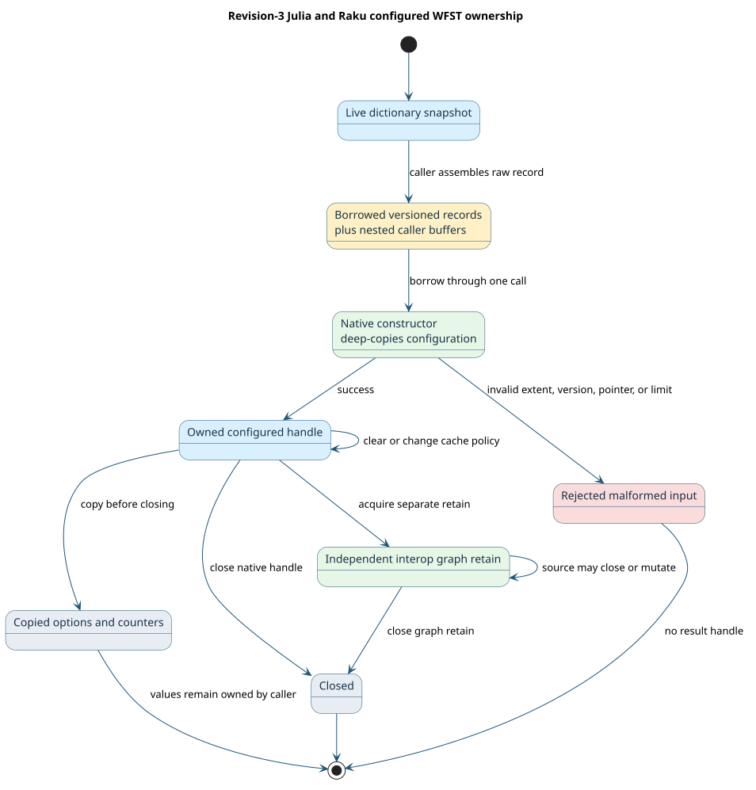

# Revision-3 configuration mirrors for Julia and Raku

Duallity's [binding model](../../bindings/api.json) and
[C header](../../include/duallity.h) define six versioned configuration
records and six revision-3 functions. The Julia and Raku mirrors use those
records to build a configurable lazy weighted finite-state transducer (WFST),
inspect effective options, and control its cache. A WFST consumes input
labels, emits output labels, and assigns weights to paths. The configured
constructor captures one immutable dictionary revision; it does not copy the
dictionary's terms.



## Wire contract and generation

`scripts/generate-config-abi.py` emits the Julia record definitions in
`bindings/julia/Duallity/src/GeneratedAbi.jl` and the Raku record definitions
in `bindings/raku/lib/Duallity/ConfigAbi.rakumod`. The Raku native function
declarations remain generated by `scripts/generate-raku-abi.py`. The binding
gate checks both generators against the authoritative model and public C
declarations. The six records are `DuallityRecordHeaderV1`,
`DuallityRestrictionV1`, `DuallityOperationV1`,
`DuallityGeneralizedLimitsV1`, `DuallityWfstOptionsV1`, and
`DuallityCacheStatisticsV1`.

Each input or output record starts with a header containing its byte extent,
record version, and zero reserved word. The constructor accepts a complete
version-1 prefix and rejects nonzero reserved bytes or malformed nested
records. Raku represents pointer slots as writable `size_t` fields because
Rakudo's `NativeCall` C-struct pointer accessors cannot assign those slots;
the slot still has the native pointer width and alignment. Callers convert an
address to `Int` when filling an input slot and back to `Pointer` when reading
a borrowed address. The tests exercise the actual native constructor and
readback on the supported 64-bit targets. The package does not promise an
untested 32-bit layout.

The records carry raw pointers. Julia `Vector` values form contiguous arrays
of these immutable wire structs. Raku `CArray[Record]` stores pointers to
separate records, so it cannot be passed as a C array of records. A single
Raku record can be passed by address with a count of one. For larger arrays,
the caller must allocate contiguous bytes with the modeled stride; there is
no Raku convenience builder for multiple records in this mirror. Both
facades require an explicit `keepalive` owner for any non-null nested pointer.
The native constructor deep-copies operation names and restrictions before
returning, so the borrowed input buffers may then be released.

## Resource lifetime and readback

The old `wfst` constructors continue returning an ordinary Vinary Tree
interop graph. The new `configured_wfst` (Julia) and `configured-wfst` (Raku)
return a managed object with two independently owned pieces: `.graph`, the
interop retain for traversal and composition, and a native configured handle
for options and cache operations. Closing the managed object releases both.
The original dictionary or snapshot may close immediately after construction.

Native `duallity_wfst_options_get` returns nested pointers borrowed from the
configured handle. `effective_options` and `.options` copy every string,
restriction, operation, and limit before returning. Their results remain
valid after close. Cache statistics are value-only records and are copied as
well. A cache clear increments its counter; changing policy clears residency
while preserving the accepted language and state identities. Cache policy
does not change path weights.

The core call sequence is:

```text
options := native defaults with versioned header
fill raw scalar fields and preserve any nested arrays
configured := native configured constructor(dictionary snapshot, query, options)
graph := configured.graph
inspect copied options or counters; optionally clear/change cache
close configured after graph use
```

The native options record also supports custom operation applicability and
restriction pairs. The Julia and Raku conformance tests pass a named custom
operation with a listed restriction, bounded generalized limits, and an LRU
cache policy. They mutate the caller's name and restriction buffers after
construction and assert that readback still returns the original text. Both
facades reject missing `keepalive` ownership;
the native ABI rejects a nonzero reserved header word. See the
[Julia guide](../../bindings/julia/Duallity/README.md) and
[Raku guide](../../bindings/raku/README.md) for runnable examples.

## Supported surface and remaining gaps

| Surface | Julia | Raku |
| --- | --- | --- |
| Model-generated revision-3 records and selectors | Yes | Yes |
| Native defaults and configured constructor | Yes | Yes |
| Custom operation and limit records | Raw wire records | Raw wire records; contiguous arrays are caller-managed |
| Effective options with copied nested content | Yes | Yes |
| Cache statistics, clear, and policy update | Yes | Yes |
| Graph ownership and direct composition | `.graph` | `.graph` |
| Higher-level typed option builder | Separate Julia parity item | Not provided by this raw mirror |
| Revision-4 phonetic constructors | Existing Julia facade | Separate Raku phonetic item |

Run `python3 scripts/generate-config-abi.py --check`,
`python3 scripts/generate-raku-abi.py --check`, and
`python3 scripts/check-bindings.py` to detect model drift. The package CI
builds the native library and tests both language facades on fresh runners;
the local conformance tests cover malformed records, resource cleanup,
snapshot lifetime, deep copy, and cache controls.
