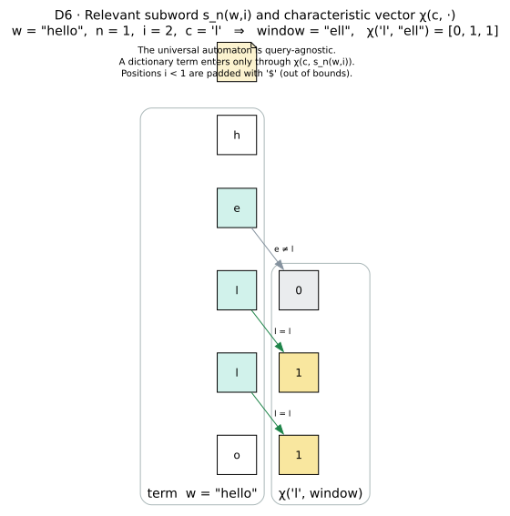

# Universal Levenshtein WFST

> **`UniversalLevenshteinWfst<V, D>`** and the reuse factory **`BoundUniversalWfst<V, D>`** — a
> Levenshtein WFST backed by liblevenshtein's **query-agnostic** universal automaton. The universal
> transition relation `` $`U_k`$ `` is fixed by `max_distance` alone (independent of the query *and* of
> the alphabet `` $`\Sigma`$ ``), so one `BoundUniversalWfst` factory mints a per-query wrapper for
> every query. Kernel: `UniversalLevenshteinStateSource<V, D>`. Always available — **no feature flag**.

All symbols are defined in the [master notation table](../theory/README.md#master-notation); each is
linked there on first use. Math is GitHub-flavored MathJax (inline = backtick span wrapped in dollars;
display = fenced `math` block).

---

## 1. Intuition

The [parameterized `LevenshteinWfst`](levenshtein-wfst.md) bakes the query into the automaton and so
rebuilds the whole machine for every new query. The **universal** construction of Schulz & Mihov
[[3](#references)] and Mihov & Schulz [[4](#references)] instead fixes a *single* automaton
`` $`U_k`$ `` per distance `` $`k`$ ``, whose transitions are driven not by concrete characters but by
[characteristic vectors](../theory/README.md#master-notation) `` $`\chi(c, s)`$ `` — bit vectors saying
*where* the next character matches a small window of the fixed word ([theory/05](../theory/05-universal-automata.md)).
`` $`U_k`$ `` is the same automaton for `"helo"`, `"wrld"`, or any query, over any alphabet.

`BoundUniversalWfst::<V, _>::new(dict, k)` captures the pair `` $`(D, k)`$ `` as a lightweight factory;
`.with_query(q)` wires the fixed `` $`U_k`$ `` transition function to a query `` $`q`$ `` and hands back
a `UniversalLevenshteinWfst<V, D>` that walks the dictionary as a lazy `Wfst<char, TropicalWeight>`.
Because `` $`U_k`$ `` needs **no per-query construction** (it is a constant function of characteristic
vectors), minting a per-query wrapper is cheap, and the cost is `` $`\lvert\Sigma\rvert`$ ``-independent.



---

## 2. Operational semantics

The universal WFST is the product `` $`\text{(dictionary trie)} \times U_k`$ ``, but with the
**automaton driven by the dictionary path** and the **query used as the fixed word** — the reverse of
the parameterized variant's mental model. The transducer *labels* stay canonical, though: input tape =
query, output tape = dictionary.

### 2.1 Driving convention (the load-bearing subtlety)

In the universal formulation the roles swap relative to `LevenshteinWfst`:

- the **dictionary path** is the *processed input* fed to `` $`U_k`$ `` — the string being tested;
- the **query** `` $`q`$ `` is the *fixed word* `` $`w`$ `` the automaton is parameterized around, so
  `` $`\lvert w\rvert = n = \lvert q\rvert`$ ``.

At dictionary depth `` $`d`$ `` (the number of dictionary scalars consumed so far), the kernel forms the
[relevant subword](../theory/README.md#master-notation) window `` $`s_k(q,\, d{+}1)`$ `` around the fixed
word and, for the next dictionary character `` $`c`$ ``, the characteristic vector
`` $`\chi\bigl(c,\, s_k(q, d{+}1)\bigr)`$ `` (`relevant_subword_at` / `CharacteristicVector::new`). That
vector drives `` $`U_k`$ ``'s transition. The **query-label cursor** `` $`j`$ `` (which query scalar
labels the input tape) is tracked *exactly and separately* in the registry — it is never recovered from
the universal automaton's abstract offsets (tests
`test_universal_state_source_tracks_exact_query_position`,
`…_can_spell_full_label_pairs`).



### 2.2 State set `` $`Q`$ ``, initial state `` $`q_0`$ ``

A product state pairs a **registered dictionary node** `` $`d`$ `` (carrying its trie depth) with a
**registered universal state** `` $`\Pi`$ `` — a subsumption-reduced set of positions
`` $`\langle \mathrm{offset},\ \mathrm{errors},\ \mathrm{type}\rangle`$ `` paired with the exact query
cursor `` $`j`$ ``:

```math
Q \;=\; \bigl\{\,(d,\ \Pi)\ :\ d \in \text{node registry},\ \Pi \in \text{state registry}\,\bigr\},
\qquad q_0 \;=\; (d = 0,\ \Pi_0) \;=\; 0 .
```

`` $`\Pi_0 = `$ ``\ `UniversalState::initial(k)` at cursor `` $`j = 0`$ `` is registered as id
`` $`0`$ ``, and the root as node id `` $`0`$ ``, so `start()` is the integer `` $`0`$ `` (test
`test_universal_levenshtein_wfst_start_state`). Both components are **dense ids assigned by
registries** — the `DepthDictionaryNodeRegistry` for `` $`d`$ `` and the `UniversalStateRegistry` for
`` $`\Pi`$ `` — packed as
`` $`\mathrm{StateId} = d \cdot M_{\mathrm{uni}} + \Pi`$ `` with radix

```math
M_{\mathrm{uni}} \;=\; (n{+}1)^2\,(2k{+}1)
\;=\; \underbrace{(n{+}1)(2k{+}1)}_{\texttt{estimate\_automaton\_states}(n,k)} \cdot \underbrace{(n{+}1)}_{\text{query-cursor factor}} .
```

Unlike the Levenshtein path, the automaton component `` $`\Pi`$ `` is **not** an arithmetic function of
`` $`(i, e)`$ ``; it is a lookup id keyed by the serialized position set, the length difference, and the
query cursor `` $`j`$ `` (`universal_state_key`). See
[architecture/03](../architecture/03-state-encoding-and-product-space.md).

### 2.3 Weighted transition relation

From state `` $`(d, \Pi)`$ `` at depth `` $`d`$ `` with query cursor `` $`j`$ ``, window
`` $`s = s_k(q, d{+}1)`$ ``, and the query-consumption flag `` $`\beta = [\,j < n\,]`$ ``:

| Kind | Guard | `` $`\text{in}:\text{out}/w`$ `` | Successor |
|------|-------|-------------------------------|-----------|
| **dictionary edge** (per edge `` $`c \to d'`$ ``) | `` $`\Pi' = \delta_{U_k}\!\bigl(\Pi,\ \chi(c, s),\ \beta\bigr)`$ `` exists | `` $`q[j] : c \,/\, \bar{1}`$ `` if `` $`j<n`$ ``, else `` $`\varepsilon : c \,/\, \bar{1}`$ `` | `` $`(d',\ \Pi'\ \text{at cursor}\ j{+}\beta)`$ `` |
| **deletion continuation** | `` $`j < n`$ `` | `` $`q[j] : \varepsilon \,/\, \bar{1}`$ `` | `` $`(d,\ \Pi\ \text{at cursor}\ j{+}1)`$ `` |

**Every arc carries weight** `` $`\bar{1}`$ `` (`TropicalWeight::one()`, the multiplicative identity =
numeric `` $`0`$ ``, a *free step* — see the [naming gotcha](../theory/README.md#semirings-and-weights)).
No edit cost is charged on any edge. When the query is exhausted (`` $`j \ge n`$ ``, so
`` $`\beta = 0`$ ``) a dictionary edge fires with an `` $`\varepsilon`$ `` input — an insertion of the
dictionary character `` $`c`$ `` beyond the query, which is how the dictionary term may run longer than
`` $`q`$ ``. The **deletion-continuation** arc consumes a query scalar with an `` $`\varepsilon`$ ``
output and *does not advance the dictionary*, so a caller can spell the full input string even after the
dictionary path has reached a final node (test `…_can_spell_full_label_pairs`).

### 2.4 Final predicate and final weight

The entire edit cost surfaces **only at acceptance**. A state `` $`(d, \Pi)`$ `` is final iff its
dictionary node terminates a term and the universal state satisfies the Schulz–Mihov
[[3](#references)] Proposition 11 acceptance test (`universal_accepting_weight`), evaluated with fixed
word length `` $`\lvert w\rvert = n`$ `` and processed-input length `` $`= d`$ ``:

```math
\text{final}(d, \Pi) \;\iff\; d.\texttt{is\_final()}\ \wedge\ \operatorname{acc}\nolimits_k(\Pi,\ n,\ d)\ \text{is defined},
```

```math
\rho(d, \Pi) \;=\; \operatorname{acc}\nolimits_k(\Pi,\ n,\ d)
\;=\; \min_{\pi \in \Pi}
\begin{cases}
\mathrm{errors}(\pi) & \pi\ \text{accepting},\ \mathrm{offset}(\pi) \le 0,\ \mathrm{errors}(\pi) \le k, \\[2pt]
\mathrm{errors}(\pi) + r & r = n - \bigl(d + \mathrm{offset}(\pi)\bigr) \le k - \mathrm{errors}(\pi), \\[2pt]
\text{(omit)} & \text{otherwise.}
\end{cases}
```

The final weight is thus the **minimum accepting error count** over `` $`\Pi`$ ``'s active positions —
the residual `` $`r`$ `` deletes the still-unmatched suffix of the fixed word. Because all arc weights
are `` $`\bar{1}`$ ``, a path's reported weight `` $`w(\pi) \otimes \rho(\pi) = 0 + \rho`$ `` equals the
term's edit distance, carried *entirely* by `` $`\rho`$ ``. This deliberately avoids double-counting:
universal states expose an *aggregate* cost at acceptance, not a locally attributable cost per edge
(tests `…_weights_paths_by_final_edit_distance`, `…_transition_labels_preserve_transducer_sides`).

---

## 3. The 0.3.0 API

### 3.1 Types and bounds

```rust,ignore
pub struct UniversalLevenshteinWfst<V, D>
where
    V: PositionVariant + Clone + Send + Sync,
    V::State: Send + Sync,
    D: Dictionary + Clone + Send + Sync,
    D::Node: Send + Sync,
    <D::Node as DictionaryNode>::Unit: Into<char> + TryFrom<char> + Copy + Send + Sync,
{ /* state_source: UniversalLevenshteinStateSource<V, D>, cache, max_distance: u8 */ }

pub struct BoundUniversalWfst<V, D> where /* identical bounds */
{ /* dictionary: D, max_distance: u8, PhantomData<V> */ }
```

The position variant `` $`V`$ `` (from `liblevenshtein::transducer::universal`, a `PositionVariant`)
selects the metric at the *type* level:

| `` $`V`$ `` | Metric |
|----|--------|
| `Standard` | Levenshtein (insert / delete / substitute) |
| `Transposition` | Damerau–Levenshtein (real adjacent-swap support) |
| `MergeAndSplit` | one ↔ two character merge / split (OCR) |

> **`max_distance` is a `u8` here** (the universal automaton is parameterized at the byte level),
> whereas [`LevenshteinWfst`](levenshtein-wfst.md) takes a `usize`. Mixing the two variants in one
> pipeline needs an explicit cast.

### 3.2 Constructors and methods

```rust,ignore
impl<V, D> UniversalLevenshteinWfst<V, D> {
    pub fn new(dictionary: &D, query: &str, max_distance: u8) -> Self;
    pub fn max_distance(&self) -> u8;
    pub fn query(&self) -> &str;                       // borrows the interned UTF-8 query
    pub fn set_max_cache_size(&mut self, size: usize); // honoured only under CachePolicy::Lru
}

impl<V, D> BoundUniversalWfst<V, D> {
    pub fn new(dictionary: D, max_distance: u8) -> Self;                     // O(1): captures (D, k)
    pub fn with_query(&self, query: &str) -> UniversalLevenshteinWfst<V, D>; // mint a per-query WFST
    pub fn max_distance(&self) -> u8;
}
// BoundUniversalWfst: Clone (clones the dictionary handle + k).
```

Both wrappers implement `Wfst<char, TropicalWeight>` and `LazyWfst<char, TropicalWeight>` with the same
surface as the parameterized variant — `start()` `` $`= 0`$ ``, the eager reads (`transitions`,
`is_final`, `final_weight`) reflect only what has been expanded/registered, and driving is via
`expand` / `transitions_lazy` under a `CachePolicy` ([architecture/02](../architecture/02-wfst-trait-surface.md),
[architecture/04](../architecture/04-lazy-evaluation-and-caching.md)). The difference between the two
wrappers lives entirely in the state source; `BoundUniversalWfst` adds only the factory ergonomics.

---

## 4. Complexity

Let `` $`n = \lvert q\rvert`$ ``, `` $`k`$ `` = `max_distance`, `` $`\delta`$ `` a dictionary node's
out-degree, and `` $`M_{\mathrm{uni}} = (n{+}1)^2(2k{+}1)`$ `` the radix.

| Phase | Cost | Notes |
|-------|------|-------|
| **`BoundUniversalWfst::new`** | `` $`O(1)`$ `` | moves the dictionary in, stores `` $`k`$ ``; no traversal, no automaton build |
| **`with_query` / `UniversalLevenshteinWfst::new`** | `` $`O\bigl(n\,(n+k)\bigr)`$ `` | precomputes the per-depth relevant-subword windows and seeds the registries with `` $`\Pi_0`$ `` |
| **Per-state expansion** | `` $`O(\delta)`$ `` | one characteristic-vector transition and one amortized-`` $`O(1)`$ `` registry insert per dictionary edge, plus one deletion-continuation arc |
| **Space** | `` $`O(\lvert R\rvert)`$ `` cached states | bounded by the LRU cap under `CachePolicy::Lru` |

The decisive property is that the universal transition relation `` $`U_k`$ `` is **built once — as a
constant function of characteristic vectors** — so `with_query` performs *no per-query automaton
construction* and its cost is `` $`\lvert\Sigma\rvert`$ ``-**independent** (the classical advantage of
universal automata [[3](#references), [4](#references)]). Against the same `` $`(D, k)`$ ``, this is the
variant to reach for at high query volume; the residual per-query work is only the relevant-subword
precompute and registry initialization, not a fresh determinized automaton. As with the Levenshtein
path, the `u32` `StateId` bounds the addressable product: encoding fails (silently pruning the edge)
once `` $`\lvert D_{\text{reg}}\rvert \cdot M_{\mathrm{uni}} \ge 2^{32}`$ `` (test
`test_universal_state_source_prunes_unencodable_targets`).

---

## 5. Worked end-to-end example

Build one factory, mint many queries:

```rust,ignore
use duallity::BoundUniversalWfst;
use liblevenshtein::transducer::universal::{Standard, Transposition};
use libdictenstein::dynamic_dawg::char::DynamicDawgChar;
use lling_llang::prelude::*;

let dict = DynamicDawgChar::<()>::from_terms(vec!["hello", "world", "help"]);

// The query-agnostic U_2 is fixed here; the factory just captures (dict, 2).
let bound = BoundUniversalWfst::<Standard, _>::new(dict.clone(), 2);

let mut w1 = bound.with_query("helo");   // no automaton rebuild — only per-query wiring
let mut w2 = bound.with_query("wrld");
w1.expand(w1.start());
w2.expand(w2.start());
```

**`w1` (query `"helo"`, `` $`k = 2`$ ``).** Driving `` $`U_2`$ `` with the dictionary terms as processed
input, the accepting terms and their final weights are:

| Dictionary term `` $`w`$ `` | Edit | Arc weights | Final weight `` $`\rho`$ `` = distance |
|------|------|-------------|----------------|
| `"hello"` | insert `l` | all `` $`\bar{1} = 0`$ `` | `` $`1`$ `` |
| `"help"` | substitute `o→p` | all `` $`\bar{1} = 0`$ `` | `` $`1`$ `` |
| `"world"` | `` $`d_{\mathrm{lev}} = 4 > 2`$ `` | — | rejected |

Concretely, the label path to `"help"` is `` $`\text{h:h}/\bar{1}\ \ \text{e:e}/\bar{1}\ \ \text{l:l}/\bar{1}\ \ \text{o:p}/\bar{1}`$ ``
— **every arc free** — and the whole edit cost, `` $`1`$ ``, appears *only* in the accepting state's
`` $`\rho`$ ``. This is the universal signature: pruning below `` $`k`$ `` happens through the position
set inside `` $`U_k`$ ``, not through arc weights.

**`w2` (query `"wrld"`, `` $`k = 2`$ ``)** accepts `"world"` (insert `o`) at final weight `` $`1`$ ``;
`"hello"` and `"help"` are rejected (`` $`d_{\mathrm{lev}} \ge 4`$ ``).

**Transposition variant, `"tset"`.** Switching `` $`V`$ `` to `Transposition` gives real
Damerau–Levenshtein swaps:

```rust,ignore
let bound_dl = BoundUniversalWfst::<Transposition, _>::new(
    DynamicDawgChar::<()>::from_terms(vec!["test", "tset"]), 1);
let _swap = bound_dl.with_query("tset");   // "tset" -> "tset" at ρ = 0; "tset" -> "test" at ρ = 1 (one swap)
```

`"tset"` matches itself at final weight `` $`0`$ ``, and `"test"` at final weight
`` $`1 = d_{\mathrm{DL}}(\texttt{"tset"}, \texttt{"test"})`$ `` via a single adjacent transposition — a
distance the `Standard` variant would report as `` $`2`$ `` (two substitutions).

---

## 6. ⚠ Honest limitations

- **`max_distance` is capped at `u8`.** The universal automaton is parameterized at the byte level, so
  `` $`k \le 255`$ ``. This is never a practical spelling-correction bound, but it is a hard type-level
  ceiling and differs from `LevenshteinWfst`'s `usize`.
- **Weight-`` $`\bar{1}`$ `` (zero-cost) edges ⇒ pruning happens at acceptance, not on arcs.** Because
  no edit cost is charged on any transition, a shortest-path search cannot prune a partial path by its
  accumulated arc weight alone; discrimination between candidate terms occurs when
  `` $`\rho`$ `` is read at a final state. The intra-`` $`k`$ `` pruning is done *inside* `` $`U_k`$ ``'s
  position set, which is correct but means arc weights are uninformative mid-path.
- **`with_query` is not zero-cost.** The query-agnostic `` $`U_k`$ `` needs no rebuild, but each
  per-query wrapper still allocates fresh registries and precomputes the query's relevant-subword
  windows (`` $`O(n(n+k))`$ ``). The amortized win over `LevenshteinWfst` is the eliminated per-query
  automaton construction and the `` $`\lvert\Sigma\rvert`$ ``-independence — not the elimination of all
  per-query allocation.
- **Two cursors, one packed id.** The dictionary depth drives `` $`U_k`$ ``; the query-label cursor
  `` $`j`$ `` labels the input tape. They are tracked separately (the registry keys `` $`\Pi`$ `` by
  both), so a state id does *not* arithmetically decode to `` $`(i, e)`$ `` the way a Levenshtein state
  id does — reason about it through the registries, not by division.
- **The product space must fit a `u32`.** `` $`M_{\mathrm{uni}} = (n{+}1)^2(2k{+}1)`$ `` grows
  quadratically in `` $`n`$ ``; for very long queries over very large dictionaries, encoding can fail
  and the offending edges are silently pruned rather than erroring.

---

## See also

- [theory/02 · Edit distance and Levenshtein automata](../theory/02-edit-distance-and-levenshtein-automata.md) — the metric and the `` $`2k{+}1`$ `` band.
- [theory/03 · The Levenshtein automaton as a transducer](../theory/03-levenshtein-as-transducer.md) — the canonical label orientation shared with this variant.
- [theory/05 · Universal automata](../theory/05-universal-automata.md) — characteristic vectors, relevant subwords, and `` $`U_k`$ `` reuse in full.
- [architecture/03 · State encoding and the product space](../architecture/03-state-encoding-and-product-space.md) — the registry-assigned `` $`d \cdot M_{\mathrm{uni}} + \Pi`$ `` scheme.
- [architecture/04 · Lazy evaluation and caching](../architecture/04-lazy-evaluation-and-caching.md) — expansion and cache policy.
- [design/levenshtein-wfst](levenshtein-wfst.md) — the parameterized counterpart.
- [guides/02 · Choosing a variant](../guides/02-choosing-a-variant.md) · [guides/05 · Performance and tuning](../guides/05-performance-and-tuning.md).

## References

1. **Levenshtein, V. I.** (1966). *Binary codes capable of correcting deletions, insertions, and reversals.* Soviet Physics Doklady 10(8), pp. 707–710 — the edit distance.
2. **Mohri, M.** (1997). *Finite-state transducers in language and speech processing.* Computational Linguistics 23(2), pp. 269–311. ACL J97-2003 — the weighted-transducer / semiring framework.
3. **Schulz, K. U., & Mihov, S.** (2002). *Fast string correction with Levenshtein automata.* IJDAR 5(1), pp. 67–85. [doi:10.1007/s10032-002-0082-8](https://doi.org/10.1007/s10032-002-0082-8) — the universal automaton, characteristic vectors, and the Proposition 11 acceptance test.
4. **Mihov, S., & Schulz, K. U.** (2004). *Fast approximate search in large dictionaries.* Computational Linguistics 30(4), pp. 451–477. [doi:10.1162/0891201042544938](https://doi.org/10.1162/0891201042544938) — universal automata for large-dictionary approximate search.
</content>
