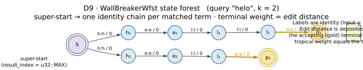
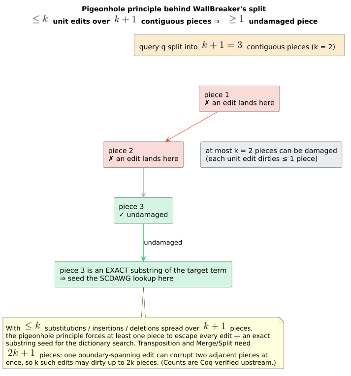

# WallBreaker WFST

> **`WallBreakerWfst<'a, D>`** and **`WallBreakerWfstBuilder<'a, D>`** — defeat the **wall effect** at
> large edit distance by seeding on exact substrings and extending bidirectionally, then re-presenting
> the finite answer set as a composable weighted transducer. Requires a `SubstringDictionary` (an
> SCDAWG). Always available (no feature flag).

All mathematical symbols below (`` $`q`$ ``, `` $`k`$ ``, `` $`d_{\mathrm{lev}}`$ ``, the tropical
semiring `` $`\mathbb{T}`$ ``, `` $`\bar{0}`$ ``/`` $`\bar{1}`$ ``, the transducer relation
`` $`T(x, y)`$ ``, …) are defined once in the
[master notation table](../theory/README.md#master-notation); this page uses them without redefinition.

## 1. Intuition

At small `` $`k`$ `` the plain Levenshtein automaton of
[theory/02](../theory/02-edit-distance-and-levenshtein-automata.md) is fast because its reachable band
is narrow. At **large** `` $`k`$ `` it hits a combinatorial **wall**: at the very start of the
dictionary traversal nothing has been matched yet, so the first `` $`k`$ `` characters cannot prune
*any* candidate — every dictionary prefix of length `` $`\le k`$ `` stays live
([theory/06](../theory/06-wallbreaker-and-the-wall-effect.md)). `WallBreakerWfst` jumps the wall
rather than climbing it: it splits the query so that at least one contiguous **piece** is guaranteed
uncorrupted, finds that piece as an **exact substring** of the dictionary (an operation the SCDAWG
answers in time linear in the piece length and independent of `` $`k`$ ``), then extends outward to
reconstruct and re-verify the full match.



The split–seed–extend–verify **algorithm itself lives upstream** in `liblevenshtein::wallbreaker`;
this wrapper *invokes* it once (eagerly, at construction), normalizes the results, and re-presents them
as a lazy WFST. The crucial mental model: **the WFST is a view over the already-computed answer set,
not a lazy search of the dictionary.** Every accepting path spells one matched term and carries that
term's edit distance as its tropical weight, so the wrapper drops straight into an `lling_llang`
composition pipeline like any other transducer.

## 2. Operational semantics

`WallBreakerWfst` is, structurally, a **forest of linear identity chains** rooted at one shared
super-start state. Let the normalized result set (Section 2.5) be the sequence of matched pairs

```math
\bigl(w_0, d_0\bigr),\ \bigl(w_1, d_1\bigr),\ \ldots,\ \bigl(w_{R-1}, d_{R-1}\bigr),
\qquad m_r = \lvert w_r \rvert,\quad d_r = d_{\mathrm{lev}}(q, w_r) \le k,
```

where `` $`R`$ `` is the number of surviving results, `` $`w_r`$ `` the `` $`r`$ ``-th matched
dictionary term, and `` $`d_r`$ `` its verified distance from the query `` $`q`$ `` (for the chosen
metric — Damerau–Levenshtein `` $`d_{\mathrm{DL}}`$ `` under `Transposition`/`MergeAndSplit`).

### 2.1 States `` $`Q`$ ``

```math
Q \;=\; \{\, q_0 \,\}\;\cup\;\bigl\{\, \langle r, p\rangle \;:\; 0 \le r < R,\ 1 \le p \le m_r \,\bigr\}.
```

Each state is a `WallBreakerStateKey { result_index: u32, char_position: u32 }`. The state
`` $`\langle r, p\rangle`$ `` means *"`` $`p`$ `` characters of term `` $`w_r`$ `` have been read"*.
State ids are **dense `u32`s** assigned in char-arena order: with the arena offset
`` $`\beta_r = \sum_{j<r} m_j`$ `` (the number of characters of all earlier terms),

```math
\mathrm{id}(q_0) = 0, \qquad \mathrm{id}\bigl(\langle r, p\rangle\bigr) = \beta_r + p,
\qquad \lvert Q\rvert \;=\; 1 + \sum_{r=0}^{R-1} m_r .
```

Construction **pre-registers every reachable chain state** into the dense `id_to_state: Vec<…>` table
(`build_wallbreaker_state_index`), so `num_states()` `` $`= \lvert Q\rvert`$ `` is known immediately and
`is_valid_state`, `is_final`, and `final_weight` answer from the registry without any expansion.

### 2.2 Start `` $`q_0`$ ``

The **super-start** is the sentinel key `` $`q_0 = \langle \texttt{u32::MAX},\, 0\rangle`$ `` at id `` $`0`$ ``
(`SUPER_START_RESULT_INDEX = u32::MAX`). It is the single root that fans out into one chain per matched
term; `start()` returns `` $`0`$ ``.

### 2.3 Final predicate and final weight `` $`\rho`$ ``

A terminal chain state is accepting; its final weight is the term's distance. The super-start is
accepting only when the **empty term** matched (i.e. `` $`\varepsilon`$ `` is a dictionary term within
`` $`k`$ ``), which lets the transducer emit the empty correction:

```math
F\bigl(\langle r, p\rangle\bigr) \iff p = m_r,
\qquad
\rho\bigl(\langle r, p\rangle\bigr) = \operatorname{TropicalWeight}(d_r)\ \ (p = m_r);
```

```math
F(q_0) \iff \exists\, r:\; w_r = \varepsilon \ \wedge\ d_r \le k,
\qquad
\rho(q_0) = \min\{\, d_r : w_r = \varepsilon \,\}.
```

Non-terminal chain states (`` $`p < m_r`$ ``) are non-final with `` $`\rho = \bar{0} = +\infty`$ ``.
One representability guard applies: a distance that is not an **exact** `f64` integer
(`` $`d_r > 2^{53}`$ ``) makes that terminal non-final rather than emitting a lossy weight
(`result_final_weights[r] = None`; test `test_wallbreaker_result_state_with_unrepresentable_weight_is_non_final`).

### 2.4 Weighted transitions `` $`E`$ ``

Every arc is an **identity label** `` $`c : c`$ `` (input tape = output tape = the dictionary
character) carrying the tropical multiplicative identity `` $`\bar{1} = 0`$ `` — a *free step*. All of
a term's distance is deferred to `` $`\rho`$ `` at the terminal:

```math
E(q_0) = \bigl\{\; w_r[0] : w_r[0] \,/\, \bar{1}\;\longrightarrow\; \langle r, 1\rangle \;:\; m_r \ge 1 \;\bigr\},
```

```math
E\bigl(\langle r, p\rangle\bigr) =
\begin{cases}
\bigl\{\; w_r[p] : w_r[p] \,/\, \bar{1}\;\longrightarrow\;\langle r, p{+}1\rangle \;\bigr\}, & p < m_r,\\[2pt]
\varnothing, & p = m_r .
\end{cases}
```

Reading the chain `` $`q_0 \to \langle r,1\rangle \to \cdots \to \langle r, m_r\rangle`$ `` therefore
spells exactly `` $`w_r[0]\,w_r[1]\cdots w_r[m_r - 1] = w_r`$ ``, accumulating
`` $`\bigotimes \bar{1} = 0`$ `` along the way and closing with `` $`\rho = d_r`$ ``. Because the two
tapes are identical, the transducer relation collapses to a **weighted acceptor over the answer set**:

```math
T(x, y) \;=\;
\begin{cases}
d_r, & x = y = w_r \text{ for some matched result } r,\\[2pt]
\min\{\, d_j : w_j = \varepsilon \,\}, & x = y = \varepsilon \text{ and some empty term matched},\\[2pt]
+\infty\ (=\bar{0}), & \text{otherwise.}
\end{cases}
```

The forest shape — one super-start fanning into per-term identity chains with distance-weighted
terminals — is diagram **D9**:



The expansion of a single state is a constant-shape computation:

Complexity: `` $`O(R)`$ `` arcs from `` $`q_0`$ `` (one per non-empty term), `` $`O(1)`$ `` from any
interior state.

```text
⟨WallBreaker: expand a state s = id_to_state[id]⟩ ≡
  Input:   a registered state id; the result arena (chars, spans) and the precomputed weights
  Output:  (is_final, final_weight, transitions) cached for s
  Invariant: id(⟨r,p⟩) = β_r + p, so a state's (r, p) is recoverable by table lookup — no radix arithmetic

  1. if s is the super-start q₀:                                  ▷ result_index == u32::MAX
       2. transitions ← ∅
       3. for each result r with m_r ≥ 1:                         ▷ non-empty terms only
            4. emit  w_r[0] : w_r[0] / 0  →  ⟨r, 1⟩               ▷ identity arc, weight 1̄ = 0
       5. is_final ← (some empty term matched);  ρ ← min distance over empty terms
  6. else, s = ⟨r, p⟩ is a chain state:
       7. if p < m_r:  emit  w_r[p] : w_r[p] / 0  →  ⟨r, p+1⟩     ▷ one identity arc
       8. is_final ← (p == m_r);  ρ ← d_r  when final, else +∞   ▷ +∞ = 0̄
  9. return (is_final, ρ, transitions)
```

### 2.5 Normalization — dedup by minimum distance, cap at `` $`k`$ ``

The raw upstream hits pass through `normalize_wallbreaker_results` before becoming states. It
enforces three invariants, preserving first-seen order:

- **bound** — drop any hit with `` $`d > k`$ ``;
- **representability** — drop any hit whose distance is not an exact `f64` integer;
- **dedup by best** — collapse repeated terms to a single result carrying the **minimum** observed
  distance (`FxHashMap<String, index>`; test `normalizes_results_to_bound_representable_unique_best_terms`).

The survivors are flattened into a `ResultCharArena` (one contiguous `Vec<char>` plus a
`(start, len)` span per term), which is what makes the dense id scheme of Section 2.1 a simple offset
lookup and gives `` $`O(1)`$ `` UTF-8-correct character access at any `` $`\langle r, p\rangle`$ ``.

## 3. Type, bounds, and the 4.0.0-rc.2 API

```rust,ignore
pub struct WallBreakerWfst<'a, D>
where
    D: Dictionary + SubstringDictionary + Clone + Send + Sync,
    D::Node: BidirectionalDictionaryNode,
    <D::Node as DictionaryNode>::Unit: Into<u32>,
{ /* query, max_distance, algorithm, result arena, precomputed weights, id_to_state, cache, PhantomData<&'a D> */ }
```

The bounds are stricter than the other variants and encode exactly what the algorithm needs:

- **`SubstringDictionary`** — the dictionary must answer `find_exact_substring`; the canonical
  implementor is the **SCDAWG** (Symmetric Compact Directed Acyclic Word Graph).
- **`BidirectionalDictionaryNode`** — nodes must expose `parent()` / `parent_label()` (left
  extension) *and* `edges()` (right extension) so a seed can be extended in both directions.
- **`Unit: Into<u32>`** — one code path serves both byte (`u8`) and Unicode (`u32`) dictionaries.

The dictionary is **not stored** in the WFST — only a `PhantomData<&'a D>` records the lifetime. The
query is run against the dictionary *at construction* and only the results are retained, so the WFST
outlives no borrow of `D`'s internals beyond `` $`'a`$ ``.

```rust,ignore
impl<'a, D> WallBreakerWfst<'a, D> {
    pub fn new(dictionary: &'a D, query: &str, max_distance: usize) -> Self;          // Algorithm::Standard
    pub fn with_algorithm(dictionary: &'a D, query: &str, max_distance: usize, algorithm: Algorithm) -> Self;
    pub fn query(&self) -> &str;
    pub fn max_distance(&self) -> usize;                 // usize (cf. u8 for universal/generalized)
    pub fn algorithm(&self) -> Algorithm;
    pub fn num_results(&self) -> usize;                  // how many terms matched (after normalization)
    pub fn set_max_cache_size(&mut self, size: usize);   // honoured under CachePolicy::Lru { max_states: 0 }
}

impl<'a, D> WallBreakerWfstBuilder<'a, D> {
    pub fn new(dictionary: &'a D) -> Self;               // defaults: max_distance 2, Algorithm::Standard
    pub fn query(self, query: &str) -> Self;
    pub fn max_distance(self, distance: usize) -> Self;
    pub fn algorithm(self, algorithm: Algorithm) -> Self;
    pub fn standard(self) -> Self;                       // Algorithm::Standard        (k+1 pieces)
    pub fn transposition(self) -> Self;                  // Algorithm::Transposition   (2k+1 pieces)
    pub fn merge_and_split(self) -> Self;                // Algorithm::MergeAndSplit    (2k+1 pieces)
    pub fn build(self) -> Result<WallBreakerWfst<'a, D>, String>;   // Err("Query not set") if no query
}
```

> **Eager construction.** `new` / `with_algorithm` / `build` run the whole WallBreaker query
> immediately: internally `WallBreaker::with_algorithm(dict, k, algo).query(query)` is collected,
> normalized, and interned. Constructing a `WallBreakerWfst` therefore *does the work*; `num_results()`
> reports how many terms matched. `build()` returns `Err("Query not set")` if `query(..)` was never
> called — the **only** failure mode.

The wrapper implements `Wfst<char, TropicalWeight>`, `LazyWfst<char, TropicalWeight>`, **and**
`StateSource<char, TropicalWeight>` (and is `Clone`), so it drives both composition paths:

- **`StateSource::compute_state`** — a *pure* `&self` computation of a `LazyState` from the immutable
  result forest, used by immutable composition wrappers;
- **`LazyWfst::expand` / `transitions_lazy`** — the *mutable* traversal path over the same ids, adding
  a transition/finality cache layer for direct use.

This split keeps composition pure while retaining cache policy for direct driving. `clear_cache()`
clears only the computed transition/finality cache; it **retains the state-key registry**, because the
`id_to_state` forest is part of the immutable answer, not a cache.

## 4. Complexity and the state-id scheme

**Construction** pays the upstream WallBreaker cost once — the pigeonhole split into
`` $`O(k)`$ `` pieces, the exact-substring seed per piece (SCDAWG, linear in piece length and
independent of `` $`k`$ ``), the `` $`k`$ ``-bounded bidirectional extension, and the exact
re-verification (theory/06) — plus the wrapper's `` $`O(R_{\text{raw}})`$ `` hash-dedup normalization
and `` $`O(C)`$ `` arena/state-index build, where `` $`C = \sum_r m_r`$ `` is the total matched-term
length. **Space** is `` $`O(C)`$ `` for the arena and `` $`\lvert Q\rvert = 1 + C`$ `` for the state
table, plus a bounded LRU cache.

**Per-query traversal of the WFST view is cheap**: expanding `` $`q_0`$ `` yields at most `` $`R`$ ``
arcs (one per non-empty term); expanding any interior state yields at most **one** arc. Fully
expanding the forest materializes exactly

```math
\lvert Q\rvert = 1 + \sum_{r} m_r \quad\text{states and}\quad \sum_{r} m_r = C \quad\text{transitions,}
```

so the whole view is linear in the total answer size — there is no `` $`k`$ ``-dependent blow-up at
traversal time, only at the (amortizable) construction. `num_states_hint()` returns `` $`\lvert Q\rvert`$ ``
exactly.

**State-id scheme (the "radix").** WallBreaker does **not** use the arithmetic product encoding
`` $`\mathrm{StateId} = d \cdot M + a`$ `` of the Levenshtein path; there is **no radix**
`` $`M`$ ``. Ids are **dense registry ids** assigned by the result arena, and decoding a `StateId` is a
table lookup `` $`\texttt{id\_to\_state}[\mathrm{id}] \to \langle r, p\rangle`$ `` rather than the
`` $`d = \lfloor \mathrm{StateId}/M\rfloor,\ a = \mathrm{StateId} \bmod M`$ `` arithmetic. Both id
regimes — arithmetic for the Levenshtein product, dense-registry for WallBreaker/Universal/Generalized/
Phonetic — are documented in
[architecture/03](../architecture/03-state-encoding-and-product-space.md).

**Piece counts.** The number of query pieces is metric-dependent and chosen so the pigeonhole
principle guarantees at least one clean piece — `` $`k+1`$ `` for `Standard`, and `` $`2k+1`$ `` for
`Transposition` and `MergeAndSplit` (a boundary-spanning swap or merge/split can corrupt two adjacent
pieces). These counts are formally verified upstream (Coq) and tabulated in
[theory/06 §2](../theory/06-wallbreaker-and-the-wall-effect.md#stage-1--pigeonhole-split); the
guarantee is the pigeonhole argument of Gerdjikov et al. [1]:

```math
\underbrace{k}_{\text{edits}} < \underbrace{k+1}_{\text{Standard pieces}}
\;\Rightarrow\; \exists\text{ an untouched piece},
\qquad
\underbrace{k}_{\text{edits}} < \underbrace{2k+1}_{\text{Transposition / MergeAndSplit pieces}}.
```



## 5. Worked example

Build an SCDAWG, run WallBreaker for the query `` $`q = \texttt{"helo"}`$ `` at `` $`k = 2`$ ``, and
drive the resulting forest:

```rust,ignore
use duallity::{WallBreakerWfst, WallBreakerWfstBuilder};
use liblevenshtein::transducer::Algorithm;
use libdictenstein::scdawg::Scdawg;
use lling_llang::prelude::*;

// WallBreaker needs a substring dictionary (SCDAWG).
let scdawg = Scdawg::<()>::from_terms(vec!["hello", "help", "world"]);

let mut wb = WallBreakerWfst::new(&scdawg, "helo", 2);   // runs the whole query eagerly
assert_eq!(wb.query(), "helo");
assert!(wb.num_results() > 0);                            // "hello" (d=1) and "help" (d=1) both match

let s0 = wb.start();                                     // the super-start q₀ (id 0)
wb.expand(s0);                                           // drive via LazyWfst
assert!(wb.is_expanded(s0));

// Builder form, choosing the Damerau–Levenshtein (transposition) metric:
let wb2 = WallBreakerWfstBuilder::new(&scdawg)
    .query("helo").max_distance(2).transposition()
    .build()
    .expect("query was set");
assert_eq!(wb2.algorithm(), Algorithm::Transposition);
```

Within `` $`k = 2`$ ``, `"hello"` matches at `` $`d_{\mathrm{lev}}(\texttt{helo}, \texttt{hello}) = 1`$ ``
(insert one `l`) and `"help"` matches at `` $`d_{\mathrm{lev}}(\texttt{helo}, \texttt{help}) = 1`$ ``
(substitute `o → p`); `"world"` is out of bound. Suppose normalization yields `` $`w_0 = \texttt{"hello"}`$ ``
(`` $`m_0 = 5`$ ``, `` $`d_0 = 1`$ ``). Its chain, with ids `` $`\mathrm{id}(\langle 0, p\rangle) = \beta_0 + p = p`$ ``
(since `` $`\beta_0 = 0`$ ``), is:

```text
 q₀ ──h:h/0──▶ ⟨0,1⟩ ──e:e/0──▶ ⟨0,2⟩ ──l:l/0──▶ ⟨0,3⟩ ──l:l/0──▶ ⟨0,4⟩ ──o:o/0──▶ ⟨0,5⟩ ✔
 id 0            id 1            id 2            id 3            id 4            id 5 (final, ρ = 1)
```

The accepting path reads `` $`\texttt{h\,e\,l\,l\,o}`$ `` on both tapes, accumulates
`` $`0 \otimes 0 \otimes 0 \otimes 0 \otimes 0 = 0`$ ``, and closes with `` $`\rho = d_0 = 1`$ ``,
so `` $`T(\texttt{hello}, \texttt{hello}) = 1 = d_{\mathrm{lev}}(\texttt{helo}, \texttt{hello})`$ `` —
the WFST reproduces the edit distance as promised. The `"help"` result gets its own parallel chain off
the same `` $`q_0`$ ``.

## 6. Limitations

> ⚠️ **Eager, up-front work.** Construction runs the entire WallBreaker query; there is no incremental
> or streaming mode. Building the WFST is exactly as expensive as answering the query — the WFST simply
> caches and re-presents the answer. Amortize by reusing the built value, not by rebuilding per lookup.

> ⚠️ **SCDAWG-shaped bounds.** The `SubstringDictionary` + `BidirectionalDictionaryNode` requirements
> exclude ordinary DAWGs/tries that cannot answer `find_exact_substring` or walk to `parent()`. Use an
> SCDAWG (or another substring-and-bidirectional dictionary). For small `` $`k`$ `` these bounds are
> unnecessary overhead — prefer [`LevenshteinWfst`](levenshtein-wfst.md) or
> [`BoundUniversalWfst`](universal-wfst.md) there.

> ⚠️ **A view, not a searcher.** The transducer is the identity on a *deduplicated, `` $`k`$ ``-capped*
> answer set: repeated terms are collapsed to their minimum distance, over-bound and
> non-`f64`-representable distances are dropped, and the two tapes are always equal (`` $`c : c`$ ``).
> It cannot enumerate alignments or corrections the upstream algorithm did not already return, and it
> does not re-rank beyond the tropical `` $`\min`$ `` already applied during normalization.

> ⚠️ **Distance representability.** Distances above `` $`2^{53}`$ `` (not exactly representable as
> `f64`) are excluded rather than rounded; the corresponding terminal becomes non-final. In practice
> `` $`k`$ `` is tiny, so this guard never fires, but it means "matched" and "has a finite final
> weight" are formally the same predicate.

## 7. Diagrams

| ID | Diagram | Shows |
|----|---------|-------|
| **D7** | [`wallbreaker-pipeline`](../diagrams/wallbreaker-pipeline.svg) | the four upstream stages: pigeonhole split → exact-substring seed → bidirectional extension → verify/dedup. |
| **D8** | [`pigeonhole-principle`](../diagrams/pigeonhole-principle.svg) | why `` $`k+1`$ `` pieces (Standard) / `` $`2k+1`$ `` (Transposition, MergeAndSplit) guarantee a clean piece. |
| **D9** | [`wallbreaker-state-forest`](../diagrams/wallbreaker-state-forest.svg) | the WFST view: one super-start fanning into per-term identity chains with distance-weighted terminals. |

All three follow the shared [color legend](../diagrams/README.md#shared-color-legend-single-source-of-truth)
(`libdictenstein` green, `liblevenshtein` red-pink, `duallity` blue, accepting states gold).

## See also

- [theory/06 · WallBreaker and the wall effect](../theory/06-wallbreaker-and-the-wall-effect.md) — the upstream algorithm and its pigeonhole guarantees.
- [design/levenshtein-wfst](levenshtein-wfst.md) and [design/universal-wfst](universal-wfst.md) — the small-`` $`k`$ `` variants to prefer when the wall is not a problem.
- [guides/02 · Choosing a variant](../guides/02-choosing-a-variant.md) — when large `` $`k`$ `` justifies WallBreaker.
- [architecture/03 · State encoding and the product space](../architecture/03-state-encoding-and-product-space.md) — the dense-registry vs. arithmetic-radix id regimes.
- [architecture/04 · Lazy evaluation and caching](../architecture/04-lazy-evaluation-and-caching.md) — the `expand`/`transitions_lazy`/`clear_cache` contract.

## References

1. **Gerdjikov, S., Mihov, S., Mitankin, P., & Schulz, K. U.** (2013). *WallBreaker: Overcoming the Wall Effect in Similarity Search.* In *Proceedings of the Joint EDBT/ICDT 2013 Workshops*, 366–369. ACM. [doi:10.1145/2457317](https://doi.org/10.1145/2457317) — the split/seed/extend/verify algorithm and its pigeonhole piece-count proofs.
2. **Schulz, K. U., & Mihov, S.** (2002). *Fast String Correction with Levenshtein Automata.* IJDAR 5(1), 67–85. [doi:10.1007/s10032-002-0082-8](https://doi.org/10.1007/s10032-002-0082-8) — the Levenshtein-automaton baseline the wall effect afflicts.
3. **Mohri, M., Pereira, F., & Riley, M.** (2002). *Weighted finite-state transducers in speech recognition.* Computer Speech & Language 16(1), 69–88. [doi:10.1006/csla.2001.0184](https://doi.org/10.1006/csla.2001.0184) — the WFST / tropical-semiring framing the forest composes into.
