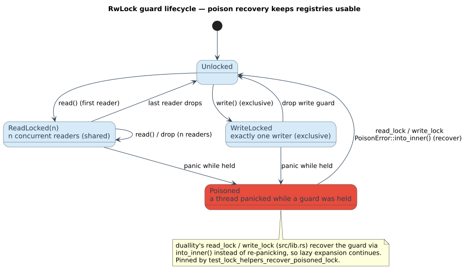

# Concurrency and locking

duallity's concurrency model is small and explicit, and that is a deliberate design goal: the whole
argument fits on one page. Per-WFST caches are `&mut self`-**private**; the only shared mutable state
is a set of interning **registries**, each behind an `Arc<RwLock>`. This page documents what is
shared, the exact read/write dance during expansion, the lock lifecycle, how poisoning is recovered,
and the non-blocking direction the design leaves open.

> **Prerequisites:** the registry families of
> [architecture/05](../architecture/05-registries-and-interning.md); the lazy-expansion pipeline of
> [architecture/04](../architecture/04-lazy-evaluation-and-caching.md).
> **Defines:** the shared/private state split, the `compute_transitions` locking protocol, and the
> lock lifecycle.

## 1. Shared and private state

The concurrency surface is exactly the boundary between what a clone **shares** and what it **owns**.

| State | Type | Scope | Guard | Mutated when | Crosses threads? |
|-------|------|-------|-------|--------------|------------------|
| transition cache | `LazyStateCache<CachedCharState>` (`FxHashMap` + LRU min-heap + scratch slot) | **one per WFST** | `&mut self` | on every `expand` / `compute_state` | **No** — private |
| dictionary-node registry | `DictionaryNodeRegistry<N>` / `DepthDictionaryNodeRegistry<N>` | **shared** (clones share it) | `Arc<RwLock<…>>` | first visit to each dictionary node | **Yes** |
| universal-state registry | `UniversalStateRegistry<V>` | shared | `Arc<RwLock<…>>` | first visit to each universal position-set state | **Yes** |
| product-state registry | `ProductStateRegistry` | shared | `Arc<RwLock<…>>` | first visit to each `(NFA states, edit distance)` frontier | **Yes** |
| NFA-state registry | `NfaStateRegistry` | shared | `Arc<RwLock<…>>` | first visit to each NFA state set | **Yes** |
| query characters | `Arc<[char]>` | shared, **immutable** | `Arc` (no lock) | never after construction | read-only |

Because the cache is `&mut self`-private, **expanding a state mutates only `self`**; two threads each
holding their own clone of a WFST expand into private caches without contending. The registries are
the *sole* cross-thread mutable surface, and they exist for one reason: dictionary nodes and abstract
automaton states arrive without integer identities, so they must be assigned **stable, shared ids**
before they can be packed into a `StateId`
([architecture/05](../architecture/05-registries-and-interning.md)).

## 2. The read/write lock dance

During expansion, a state source resolves the current node/state by id (a **read**), then interns any
newly discovered children (a **write**). The protocol below is the shape of
`compute_transitions` in `state_source.rs`; every variant follows the same read-then-write rhythm.

Presented as literate pseudocode (Knuth): the prose fixes the interface, the chunk gives the steps.

- **Input.** a dictionary-node id $`d`$, an automaton-state id $`a`$, and the shared node
  registry $`R`$ behind `Arc<RwLock>`.
- **Output.** the triple $`(\textit{is\_final},\ \textit{final\_weight},\ \textit{transitions})`$
  for the product state $`(d, a)`$.
- **Invariant.** $`R`$ is **append-only**: once a `key → id` mapping exists it is never removed
  or reassigned, and ids are dense and monotonically minted. Hence any id read under a read lock stays
  valid for the life of the WFST, and a concurrent writer can only *extend* $`R`$, never
  invalidate a prior reader's resolution.
- **Complexity.** one read-lock acquisition + at most one write-lock acquisition per call; the write
  lock is held only across the child-edge loop, $`\mathcal{O}(\deg(d))`$ in the node's out-degree.

```text
⟨compute transitions for product state (d, a)⟩ ≡
 1. decode a into an AutomatonState                              ▷ pure; no lock
        if undecodable:  return (false, zero(), ∅)               ▷ zero() = +∞ = 0̄
 2. acquire READ lock on R                                       ▷ many readers may proceed at once
 3. node ← R.get_node(d)
        if node is absent:  release READ lock; return (false, zero(), ∅)
 4. node ← node.clone();  release READ lock                      ▷ hold the read lock ONLY to resolve
 5. from_state ← encode_product_state(d, a)
        if unencodable:  return (false, zero(), ∅)               ▷ u32 StateId capacity guard
 6. precompute edit-operation contexts from `node`               ▷ match / substitute / insert / delete / …
                                                                 ▷   still lock-free (works on the clone)
 7. acquire WRITE lock on R                                      ▷ exclusive, and brief
 8. for each (unit, child) in node.edges():                      ▷ the only mutating region
        child_id ← R.register(child, path_step_key(d, unit))     ▷ mint a dense id on FIRST sight; idempotent
        push the weighted transition(s) (d,a) --in:out/w--> (child_id, a′)
 9. release WRITE lock
10. return (is_final, final_weight, transitions)
```

Two properties make this cheap:

- **Reads dominate.** A write happens only on the *first* visit to each node/state; afterwards the id
  is in the registry and every later visit is read-only (step 8's `register` short-circuits to the
  existing id). Under parallel query processing against a warm registry, contention approaches zero.
- **The node is cloned, not borrowed across the write.** Step 4 releases the read lock before step 7
  takes the write lock, so the crate never holds a read and a write guard on $`R`$ simultaneously
  — there is no lock-upgrade and no self-deadlock.

## 3. The lock lifecycle

An `RwLock` moves through a small state machine. The diagram below is the mental model a reader should
carry; the *Poisoned → recovered* edge is what makes duallity resilient (§5).



> **New diagram — `rwlock-lock-lifecycle` (pending catalog assignment).** A PlantUML state diagram:
> `Unlocked → ReadLocked(n) ⇄ WriteLocked → Poisoned → (recover) → usable`, colored per the
> [shared legend](../diagrams/README.md) — shared read state in teal (`#D1F2EB`), exclusive write
> state in delete-orange (`#E67E22`), the poisoned state in substitute-red (`#E74C3C`), and the
> recovered/usable state with a gold accepting border (`#F9E79F`). Source `.puml` + rendered `.svg`
> to be committed with the diagram catalog.

Transitions in words:

| From | Event | To |
|------|-------|----|
| `Unlocked` | `read_lock` | `ReadLocked(1)` |
| `ReadLocked(n)` | another `read_lock` | `ReadLocked(n+1)` (shared) |
| `ReadLocked(n)` | guard drop | `ReadLocked(n-1)` → `Unlocked` at `n = 0` |
| `Unlocked` | `write_lock` | `WriteLocked` (exclusive) |
| `WriteLocked` | guard drop | `Unlocked` |
| `ReadLocked` / `WriteLocked` | holder thread **panics** | `Poisoned` |
| `Poisoned` | `read_lock` / `write_lock` | recovered via `into_inner` → usable (`Unlocked`) |

## 4. Cheap clones via `Arc`

Every registry lives behind `Arc`, so cloning a WFST — which both `Wfst: Clone` and `compose` do —
**shares** the registries rather than duplicating them. The query characters are likewise an
`Arc<[char]>`. A clone is therefore a handful of `Arc` refcount bumps plus a fresh (empty or copied)
private cache — **not** a deep copy of the dictionary or the interned state. This is what makes
data-parallel querying and composition affordable: N worker threads share one interning table and one
dictionary, each with its own `&mut self` cache.

## 5. Lock poisoning and recovery

If a thread panics while holding a registry lock, Rust marks the lock **poisoned**; by default every
later `.read()`/`.write()` then returns `Err(PoisonError)`. duallity routes **all** registry
acquisitions through two crate-local helpers that recover the inner guard instead:

```rust,ignore
pub(crate) fn read_lock<T>(lock: &RwLock<T>) -> RwLockReadGuard<'_, T> {
    lock.read().unwrap_or_else(|poisoned| poisoned.into_inner())
}

pub(crate) fn write_lock<T>(lock: &RwLock<T>) -> RwLockWriteGuard<'_, T> {
    lock.write().unwrap_or_else(|poisoned| poisoned.into_inner())
}
```

`PoisonError::into_inner()` hands back the very guard the poisoning thread held, so a prior thread
failure does **not** cascade into a fresh panic on every subsequent acquisition.

**Why this is sound here — not a blanket "ignore poisoning".** The recovery is safe specifically
because each registry is an **append-only, idempotent interning table**:

- entries are only ever *added*, never mutated in place or removed;
- an id, once assigned, is never reassigned;
- a panic mid-`register` can at worst leave the table without the *new* entry — it cannot corrupt an
  *existing* mapping.

So after recovery, later reads keep resolving already-assigned ids correctly, and later writes keep
minting fresh ids from the current length. Rust's memory-safety guarantees are preserved throughout
(the data behind the lock is always a valid `Registry`); only the *advisory* poison flag is
overridden. This behaviour is verified by
`lib.rs::test_lock_helpers_recover_poisoned_lock`, which poisons a lock from a panicking thread and
asserts that `read_lock`/`write_lock` still observe and update the value. The same recovery is
described from the registry side in
[architecture/05 · Lock poisoning](../architecture/05-registries-and-interning.md#lock-poisoning).

## 6. Future direction: lock-free and persistent registries

The `RwLock` registries are the **one** place duallity blocks. Replacing them with **non-blocking** or
**persistent** structures — a concurrent hash map (sharded or CAS-based) for the forward `key → id`
map, or a persistent trie for the reverse table — would:

- improve **write-heavy** parallelism (many threads interning *new* nodes at once, the only case where
  the current write lock serializes work);
- align with the project's standing preference for non-blocking algorithms and persistent data
  structures, which maximize parallelism and thread-safety without a global exclusive section.

This is a **compatible** alternative architecture, not a correctness fix: the append-only, idempotent
invariant that makes poison recovery safe (§5) is exactly the invariant a lock-free interner needs, so
the swap is local to the registry implementation and leaves the `StateSource` contract unchanged. The
cache-eviction policy ([architecture/04](../architecture/04-lazy-evaluation-and-caching.md)) is an
independent dimension that does not touch the locking model.

## See also

- [architecture/05 · Registries and interning](../architecture/05-registries-and-interning.md) — the
  registry families and the compact node key these locks protect.
- [engineering/safety-and-panics](safety-and-panics.md) — why poison recovery is *not* a panic
  boundary.
- [security/hashing-and-collisions](../security/hashing-and-collisions.md) — the interning key and its
  collision posture.
