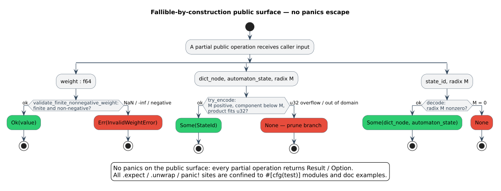

# Safety and panics

duallity is engineered for a **clean, auditable safety story**: no `unsafe`, no reachable production
panic, and a fully typed error surface. This page states that story precisely and gives the
**complete inventory** of every place the crate *can* abort a thread — so a caller embedding duallity
in a long-running service knows exactly what it is exposed to.

> **Prerequisites:** the tropical weight semantics of
> [theory/01](../theory/01-semirings-and-wfsts.md); the registry model of
> [architecture/05](../architecture/05-registries-and-interning.md).
> **Defines:** the panic-boundary inventory, the `Result`/`Option` API table, and the weight-domain
> invariant.

## 1. Zero `unsafe`

Every module under `src/` is written in **safe Rust**. There is **no `unsafe`** anywhere in the crate
(`grep -rn 'unsafe' src/` returns nothing). The consequence is strong: duallity delegates **no**
memory-safety obligation to the caller, and no combination of inputs can provoke undefined behaviour.

The performance budget is therefore spent entirely on *data-structure and laziness* choices — a
[`FxHashMap`](https://docs.rs/rustc-hash) for interning, a
[`SmallVec`](https://docs.rs/smallvec) for the small transition fan-out, `Arc` for structural sharing,
and lazy state expansion ([architecture/04](../architecture/04-lazy-evaluation-and-caching.md)) — not
on unchecked pointer or bounds tricks.

## 2. Fallible by construction: `Result` and `Option`

duallity's rule is that **every partial operation is a total function into an option type.** A step
that can fail returns `Option` (when the only information is *"no value"*) or `Result` (when the
caller deserves a typed reason). Nothing in the production path calls a panic macro to report a
caller-reachable error.

The table below is the **complete public fallible surface**. `L = char`, `W = TropicalWeight`
throughout; `VocabId = u32`, `StateId = u32`.

| API (`pub`) | Returns | Failure is signalled by | Failure condition |
|-------------|---------|-------------------------|-------------------|
| `state_encoding::try_encode(d, a, M)` | `Option<StateId>` | `None` | radix `` $`M = 0`$ ``, component `` $`a \ge M`$ ``, or the product `` $`d \cdot M + a`$ `` overflows `u32` |
| `state_encoding::decode(id, M)` | `Option<(u32, u32)>` | `None` | radix `` $`M = 0`$ `` (no width to divide by) |
| `DictionaryBackend::try_intern(word)` | `Option<VocabId>` | `None` | the `u32` vocabulary space is exhausted (the reserved `VOCAB_ID_EXHAUSTED` sentinel is never assigned) |
| `DictionaryBackend::try_with_vocabulary(dict, terms)` | `Option<Self>` | `None` | any term would exhaust the vocabulary space |
| `RewriteRule::with_cost(in, out, cost)` | `Result<Self, InvalidWeightError>` | `Err` | `cost` is not finite and non-negative |
| `RewriteWfst::with_rules(rules)` | `Result<Self, InvalidWeightError>` | `Err` | any rule cost is invalid |
| `RewriteWfst::add_rule` / `add_rewrite_rule` | `Result<(), InvalidWeightError>` | `Err` | the added rule's cost is invalid |
| `PhoneticNfaWfst::with_phonetic_weight[_and_alphabet]` | `Result<Self, InvalidWeightError>` | `Err` | `phonetic_weight` invalid |
| `PhoneticStateSource::with_phonetic_weight` / `with_weights` | `Result<Self, InvalidWeightError>` | `Err` | `phonetic_weight` or `edit_weight` invalid |
| `PhoneticWfst::with_phonetic_weight` / `with_weights` | `Result<Self, InvalidWeightError>` | `Err` | `phonetic_weight` or `edit_weight` invalid |
| `PhoneticWfstBuilder::phonetic_weight` / `edit_weight` | `Result<Self, InvalidWeightError>` | `Err` | the setter's weight is invalid |
| `PhoneticPipelineBuilder::phonetic_weight` / `edit_weight` | `Result<Self, InvalidWeightError>` | `Err` | the setter's weight is invalid |
| `PhoneticPipelineBuilder::add_rewrite_rule[s]` / `build_rewrite_wfst` | `Result<_, InvalidWeightError>` | `Err` | a rule cost is invalid |
| `PhoneticWfstBuilder::build_from_pattern`, `PhoneticPipelineBuilder::build[_phonetic_nfa]` | `Result<_, String>` | `Err(String)` | regex parse/compile failure, or a mixed pattern-and-rules configuration |
| generalized / wallbreaker `WfstBuilder::build` | `Result<_, String>` | `Err(String)` | a required field (e.g. the query) is unset |

Two contrasts are worth calling out because they are easy to misread:

- **`intern` vs `try_intern`.** The infallible `LatticeBackend::intern(word) -> VocabId` adapter is a
  convenience that returns the reserved `VOCAB_ID_EXHAUSTED` sentinel on exhaustion (a value the
  backend never hands out and `lookup` always maps to `None`). It is implemented as
  `self.try_intern(word).unwrap_or(Self::VOCAB_ID_EXHAUSTED)` — the `unwrap_or` **cannot panic**.
  Callers that must *distinguish* exhaustion from a real id use `try_intern`.
- **Two error channels.** Weight validation returns the typed [`InvalidWeightError`](#5-weight-domain-safety);
  regex/configuration failures in the pattern builders return `Result<_, String>`. They are different
  channels for different mistakes and never mix.



> **New diagram — `panic-safety-boundary` (pending catalog assignment).** A zone diagram placing the
> panic-free production core (duallity blue, `#D6EAF8`) inside the test-and-doc-example harness (gray,
> `#EAECEE`) where every `.expect`/`.unwrap`/`panic!` lives (panic sites in substitute-red,
> `#E74C3C`), colored per the [shared legend](../diagrams/README.md). Source `.puml` + rendered
> `.svg` to be committed with the diagram catalog.

## 3. The panic-boundary inventory

A *panic boundary* is any construct that can unwind a thread. duallity's inventory is short by design.

### 3.1 `.expect` / `.unwrap` / `panic!` are confined to tests and doc examples

Every direct panic-capable construct in the crate sits in one of two places:

1. **`#[cfg(test)]` modules** — unit tests use `.expect("…")` (never bare `.unwrap()`) so a failure
   prints a diagnostic. These are compiled out of the shipped library.
2. **Rustdoc examples** (`///` / `//!`) — illustrative snippets such as
   `wfst.add_rule("ph", "f", 0.1).expect("valid rewrite rule")` model the idiomatic
   `Result`-handling pattern; they are documentation, not a code path in the compiled crate.

There are **no** `.expect`/`.unwrap`/`panic!`/`unreachable!`/`todo!`/`unimplemented!` calls in any
production path. (Auditing recipe: the only matches outside a `#[cfg(test)] mod tests` block are
`///`/`//!` doc-comment lines.)

### 3.2 Implicit panic sources are eliminated by construction

The subtler panic sources — arithmetic overflow and slice indexing — are removed structurally:

| Implicit source | How it is neutralized | Representative symbols |
|-----------------|-----------------------|------------------------|
| integer overflow in id/radix arithmetic | `checked_mul`/`checked_add` return `None` (surfaced as `try_encode → None`, `next_registry_id → None`, `next_vocab_id → None`) | `state_encoding::try_encode`, `node_registry::next_registry_id`, `backend::next_vocab_id` |
| saturating size/hint arithmetic | `saturating_add`/`saturating_mul` clamp instead of overflowing | `registered_product_state_id_span`, `dictionary_product_states_hint`, `next_tick` |
| `u32 → usize` / `usize → u32` conversion | `try_from(…).unwrap_or(…)` fall back to a clamp, never panic | `usize_from_u32` (`node_registry.rs`), `saturating_nonzero_u32` (`lib.rs`) |
| query-tape indexing `query_chars[pos]` | guarded by a `pos < query_len` (`can_read_query`) predicate before the index | `compute_normal_transitions` (`state_source.rs`) |
| `f64` conversion of a large count | `exact_usize_to_f64 → Option` refuses values above the exact-integer range | `exact_usize_to_f64`, `max_exact_f64_usize` (`lib.rs`) |

### 3.3 An over-large product space is a value, not a panic

When a requested WFST product would exceed the `u32` `StateId` capacity, the encoding simply **fails
to produce an id**: `try_encode` returns `None` and the offending transition is dropped, so expansion
stops growing rather than aborting. The registries mirror this — `next_registry_id` /
`next_vocab_id` return `None` at capacity, and the builders stop assigning ids. The caller-facing
remedy is to **reduce the query length, edit bound, or operation set**; nothing crashes.

### 3.4 Lock poisoning is *not* a panic boundary

Each registry is an `Arc<RwLock<…>>`, but acquisitions go through crate-local helpers that recover a
poisoned guard rather than propagate a second panic:

```rust,ignore
pub(crate) fn read_lock<T>(lock: &RwLock<T>) -> RwLockReadGuard<'_, T> {
    lock.read().unwrap_or_else(|poisoned| poisoned.into_inner())
}

pub(crate) fn write_lock<T>(lock: &RwLock<T>) -> RwLockWriteGuard<'_, T> {
    lock.write().unwrap_or_else(|poisoned| poisoned.into_inner())
}
```

The mechanism and why it is sound for append-only interning tables are detailed in
[concurrency §5](concurrency-and-locking.md#5-lock-poisoning-and-recovery).

## 4. `Send + Sync` and `Clone`

Every WFST and state source is bounded `Clone + Send + Sync`, with the dictionary node and unit types
carried as `Send + Sync` (and, for the char variants, `Into<char> + TryFrom<char> + Copy`). Concretely,
`DictionaryBackend<D>` requires `D: Dictionary + Clone + Send + Sync` and `D::Node: Send + Sync`
(`backend.rs`), and the same bounds propagate through the state sources and wrappers. The practical
consequences:

- a WFST can be **moved across threads** and **shared** behind an `Arc`;
- a WFST **clones cheaply** — the registries live behind `Arc`, so a clone shares them rather than
  deep-copying ([architecture/05](../architecture/05-registries-and-interning.md)), and the query
  characters are an `Arc<[char]>`;
- `compose` (which clones its operands) and data-parallel query processing are **sound by
  construction**, with no extra synchronization required of the caller.

## 5. Weight-domain safety

A duallity cost is a tropical weight. `TropicalWeight` admits exactly the domain
`` $`\mathbb{R} \cup \{+\infty\}`$ `` and **rejects `NaN` and `` $`-\infty`$ `` at construction**, so a
weight is always a well-formed tropical value; `lling_llang` additionally checks the semiring laws
against a machine-verified model.

On top of that, duallity requires every *caller-supplied* cost — phonetic weights, edit-weight
multipliers, and rewrite-rule costs — to be **finite and non-negative**. The single validator is:

```rust,ignore
pub(crate) fn validate_finite_nonnegative_weight(
    name: &'static str,
    weight: f64,
) -> Result<f64, InvalidWeightError> {
    if weight.is_finite() && weight >= 0.0 {
        Ok(weight)
    } else {
        Err(InvalidWeightError::new(name, weight))
    }
}
```

Every constructor and builder in [the table above](#2-fallible-by-construction-result-and-option)
routes its weight arguments through this function, so an invalid value is refused with a typed
`InvalidWeightError` that carries the offending `name()` and `value()` for a precise message. Requiring
non-negativity is not merely defensive: the tropical shortest-path collapse (theory/01) and the
Dijkstra-style expansion assume non-negative edge weights, so admitting a negative cost would break the
optimality argument, not just the type.

### The one readability hazard (not a safety hazard)

The only subtlety in the weight domain is **naming**, not correctness. In `lling_llang`:

```math
\texttt{TropicalWeight::zero()} \;=\; +\infty \;=\; \bar{0}
\qquad\text{and}\qquad
\texttt{TropicalWeight::one()} \;=\; 0 \;=\; \bar{1}.
```

The method names follow the **algebraic role** (additive identity / multiplicative identity), not the
numeric value: `zero()` is the annihilator `` $`+\infty`$ `` ("no path"), and `one()` is the free step
`` $`0`$ ``. This is the single most common point of confusion when reading duallity's weights; it is a
*readability* hazard, fully explained where it is introduced in
[theory/01 · The tropical `` $`(\min, +)`$ `` semiring](../theory/01-semirings-and-wfsts.md#3-the-tropical-min--semiring).

## See also

- [engineering/concurrency-and-locking](concurrency-and-locking.md) — the poison-recovery mechanism in
  full.
- [engineering/testing](testing.md) — the tests that pin these invariants (weight rejection,
  label orientation).
- [architecture/05 · Registries and interning](../architecture/05-registries-and-interning.md) — the
  `Arc<RwLock>` state and id-exhaustion behaviour.
- [security/threat-model](../security/threat-model.md) — the same resource bounds from an adversarial
  angle.
