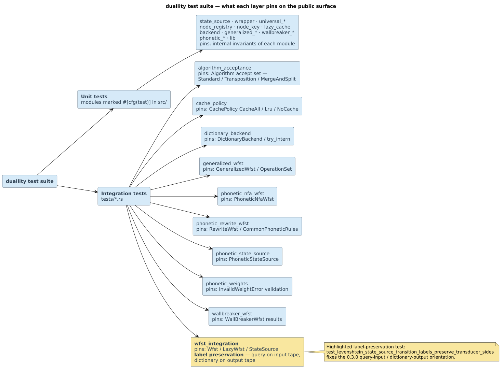

# Testing

duallity's tests are its **executable specification**. They fall into two layers: **per-module unit
tests** (`#[cfg(test)] mod tests` inside each `src/*.rs`) that pin the exact semantics of one
component, and an **integration suite** (`tests/*.rs`) that drives the public API end to end. This page
maps both layers, ties each label-preservation test to the concrete `(input, output, weight)` triple
it asserts, gives a coverage-by-surface table with the **actual** test file names, and provides a
checklist for adding a test to a new variant.

> **Prerequisites:** the transducer label orientation of
> [theory/03](../theory/03-levenshtein-as-transducer.md); the variant semantics in
> [design/](../design/README.md).
> **Defines:** the unit/integration test map, the label-preservation contract, and the
> add-a-variant-test checklist.

## 1. Running the tests

```sh
cargo test                 # default features: Levenshtein, Universal, WallBreaker, Generalized, Rewrite
cargo test --all-features  # adds the phonetic NFA / regex suites behind `phonetic-rules`
cargo test --doc           # compiles and runs the rustdoc example in src/lib.rs
```

The phonetic **NFA/regex** suites are feature-gated at the file level with
`#![cfg(feature = "phonetic-rules")]`, so they compile only under `--all-features` (or
`--features phonetic-rules`). The **rewrite** suite (`tests/phonetic_rewrite_wfst.rs`) needs **no**
feature — `RewriteWfst`, `RewriteRule`, and `CommonPhoneticRules` are always available.

## 2. Two layers: unit and integration



> **New diagram — `test-suite-map` (pending catalog assignment).** A two-column map tying each public
> surface to its `#[cfg(test)]` unit block (left) and its `tests/*.rs` integration file (right),
> colored per the [shared legend](../diagrams/README.md) — duallity surfaces in blue (`#D6EAF8`),
> feature-gated phonetic files with a dashed `` $`\varepsilon`$ ``-style border (`#F2F3F4`), accepting/contract tests
> with a gold accent (`#F9E79F`). Source + rendered `.svg` to be committed with the diagram catalog.

- **Unit layer** — every `src/*.rs` module carries a `#[cfg(test)] mod tests` that exercises its
  internals (encoders, hint arithmetic, cache eviction, per-state transition generation). Unit tests
  use `.expect("…")` so a failure is self-describing.
- **Integration layer** — `tests/*.rs` construct WFSTs from tiny explicit dictionaries and assert the
  **public** behaviour a caller sees.

## 3. The integration test files

The integration suite is **split by surface** into focused files (not one monolith). Each row is a
real file under `tests/`.

| File | Feature | Representative tests | What they verify |
|------|---------|----------------------|------------------|
| `wfst_integration.rs` | default (phonetic parts `#[cfg]`-gated inline) | `test_levenshtein_wfst_basic`, `_start_state`, `_lazy_expansion`, `_clone`; `test_universal_wfst_tracks_exact_query_position`; `test_levenshtein_state_source_*`; `test_dictionary_backend_*`; `test_tropical_weight_semantics`; `test_wfst_transposition_algorithm`; `test_wfst_merge_and_split_algorithm` | construction, start state, lazy `expand`/`computed_states`, clone fidelity, label orientation, `plus=min`/`times=+`/`zero().is_infinite()`/`one()==0`, and the transposition & merge/split variants |
| `algorithm_acceptance.rs` | default | `standard_variants_accept_exact_and_one_substitution_paths`, `universal_variant_accepts_one_insertion_and_deletion_paths`, `transposition_variants_accept_swapped_adjacent_pair` | each metric accepts exactly the edit operations it should, within its bound |
| `cache_policy.rs` | default | `generalized_lru_zero_uses_tunable_default_bound`, `wallbreaker_lru_zero_uses_tunable_default_bound` | `CachePolicy::Lru { max_states: 0 }` falls back to the configured default bound |
| `dictionary_backend.rs` | default | `dictionary_backend_interns_unicode_terms_in_insertion_order`, `_contains_cache_union_underlying_dictionary`, `_reserved_sentinel_is_never_a_lookup_result`, `_with_vocabulary_deduplicates_terms_and_preserves_first_ids`, `_clone_has_independent_lazy_vocabulary` | insertion-order interning, `contains` over cache `` $`\cup`$ `` dictionary, sentinel reservation, dedup, clone independence |
| `generalized_wfst.rs` | default | `generalized_wfst_creation`, `_deduplicates_equivalent_runtime_operations`, `_standard_match_counts_unicode_chars`, `_transposition_reaches_final`, `_restricted_digraph_uses_continuation_state`, `_builder_requires_query`, `_no_cache_policy_uses_scratch_only` | construction, operation dedup, Unicode-scalar counting, digraph continuation states, builder happy/`Err` paths, scratch-only caching |
| `fzf_upstream_differential.rs` | default | `upstream_published_score_fixtures_match_both_engines`, `real_repository_path_corpus_is_score_for_score_equal` | independent batch recurrence agrees with 15 published fzf scores and with incremental production scoring over the checked-in path corpus |
| `wallbreaker_wfst.rs` | default | `wallbreaker_wfst_creation`, `_lazy_expansion`, `_builder_sets_transposition_algorithm`, `_num_results`, `_state_hint`, `_exact_match`, `_path_distance_counted_once`, `_lru_policy_evicts_least_recently_used_state` | eager result production, lazy expansion, builder variants, result count/hint, dedup so a path's distance is counted once, LRU eviction |
| `phonetic_rewrite_wfst.rs` | **default (no feature)** | `rewrite_wfst_one_to_many_output_chain_emits_continuation`, `rewrite_wfst_many_to_one_input_chain_consumes_continuation`, `rewrite_wfst_identity_transitions_passthrough_printable_symbols`, `rewrite_rule_rejects_negative_cost`, `common_english_rules_include_ph_to_f` | char/`` $`\varepsilon`$ `` rewrite chains, printable-ASCII identity passthrough, weight rejection, preset rule tables |
| `phonetic_nfa_wfst.rs` | `phonetic-rules` | `phonetic_nfa_wfst_statesource_matches_lazy_expansion`, `_end_anchor_marks_terminal_state_final`, `_rejects_nan_weight`, `_char_class_enumerates_full_small_range`, `_lru_policy_evicts_least_recently_used_state` | `StateSource` `` $`\equiv`$ `` `LazyWfst` transitions, anchor semantics, weight rejection, alphabet concretization, LRU |
| `phonetic_state_source.rs` | `phonetic-rules` | `phonetic_state_source_start_anchor_allows_initial_dictionary_edge`, `_applies_phonetic_transition_weight`, `_applies_edit_final_weight`, `_rejects_invalid_weights` | anchor semantics on the dictionary product, phonetic edge weight, weighted edit final cost, weight rejection |
| `phonetic_weights.rs` | `phonetic-rules` | `phonetic_wfst_applies_phonetic_edges_and_weighted_edit_final_cost`, `_nonfinal_dictionary_prefix_has_infinite_final_weight`, `pipeline_builder_passes_weight_config_to_dictionary_backed_wfst` | weighted phonetic edges + edit final cost, non-final prefix has final weight `` $`+\infty`$ ``, pipeline weight-config propagation |

## 4. The label-preservation tests (the semantic contract)

The most important tests pin the **transducer label orientation** — input = query side, output =
dictionary side ([theory/03](../theory/03-levenshtein-as-transducer.md)), the contract established by
commit `be3dc6a`. A transition is written `` $`\text{input} : \text{output} / \text{weight}`$ ``, and
in Rust each is a `(Option<char>, Option<char>, f64)` triple where `None` is the `` $`\varepsilon`$ ``
label. **When you change transition generation, these are the tests that must still pass.**

### 4.1 Parameterized Levenshtein — cost on the edge

`tests/wfst_integration.rs::test_levenshtein_state_source_transition_labels_preserve_transducer_sides`.
The parameterized adapter charges each edit **on the edge** (weight `1.0`), with the residual cost in
the final weight:

| Operation | query (input tape) | term (output tape) | start transition `(input, output, weight)` |
|-----------|--------------------|--------------------|--------------------------------------------|
| substitution | `"bat"` | `"cat"` | `(Some('b'), Some('c'), 1.0)` |
| insertion (`` $`\varepsilon`$ `` on input) | `"at"` | `"cat"` | `(None, Some('c'), 1.0)` |
| deletion (`` $`\varepsilon`$ `` on output) | `"cat"` | `"at"` | `(Some('c'), None, 1.0)` |
| identity / match | `"cat"` | `"cat"` | `(Some('c'), Some('c'), 0.0)` |

### 4.2 Universal Levenshtein — cost in the final weight

`src/universal_state_source.rs::test_universal_state_source_transition_labels_preserve_transducer_sides`.
The universal path carries **zero local edge cost** (the free step `` $`\bar{1} = 0`$ ``) and defers the
edit distance to the accepting final weight:

| Operation | query (input tape) | term (output tape) | start transition `(input, output, weight)` |
|-----------|--------------------|--------------------|--------------------------------------------|
| substitution | `"bat"` | `"cat"` | `(Some('b'), Some('c'), 0.0)` |
| identity / match | `"cat"` | `"cat"` | `(Some('c'), Some('c'), 0.0)` |

That the *edit distance still shows up* — just in the final weight — is pinned separately by
`src/universal_state_source.rs::test_universal_state_source_weights_paths_by_final_edit_distance`, whose
total accepting path weight equals the edit distance for each `(query, term)`:

| query | term | total path weight |
|-------|------|-------------------|
| `"cat"` | `"cat"` | `0.0` |
| `"a"` | `"b"` | `1.0` |
| `"tet"` | `"test"` | `1.0` |
| `"at"` | `"cat"` | `1.0` |
| `"cat"` | `"at"` | `1.0` |

Two more universal tests complete the contract:

- `src/universal_state_source.rs::test_universal_state_source_can_spell_full_label_pairs` — the
  deletion/insertion cases `(query, term) ∈ {("at","cat"), ("cat","at"), ("axb","ab")}` still expose a
  path whose labels spell the **whole** query/output pair (the labels are not truncated by the
  universal abstraction).
- `src/universal_state_source.rs::test_universal_state_source_tracks_exact_query_position` — for
  dictionary `"ab"`, query `"xy"`, `` $`k = 2`$ ``: the first substitution transition is
  `(Some('x'), Some('a'), 0.0)` and the **second** dictionary edge consumes the **second** query label
  `(Some('y'), Some('b'), …)`, and crucially *not* `(Some('x'), Some('b'), …)` — proving the label
  cursor is tracked explicitly, never inferred from abstract universal offsets. (The wrapper-level
  mirror is `tests/wfst_integration.rs::test_universal_wfst_tracks_exact_query_position`.)

### 4.3 Phonetic char / `` $`\varepsilon`$ ``-chain semantics

The multi-symbol rewrite chains (commit `314f285`) are pinned in `tests/phonetic_rewrite_wfst.rs`. A
rule whose two sides differ in length emits or consumes the extra symbols on `` $`\varepsilon`$ ``
continuation edges:

| Test | rule | first transition | continuation transition |
|------|------|------------------|-------------------------|
| `rewrite_wfst_one_to_many_output_chain_emits_continuation` | `f → ph` | `(Some('f'), Some('p'), 0.1)` | `(None, Some('h'), 0)` — output `` $`\varepsilon`$ ``-emits `h`, weight `one()` `` $`= \bar{1} = 0`$ ``, back to state `0` |
| `rewrite_wfst_many_to_one_input_chain_consumes_continuation` | `ph → f` | `(Some('p'), Some('f'), 0.1)` | `(Some('h'), None, …)` — input `` $`\varepsilon`$ ``-consumes `h`, back to state `0` |

The remaining phonetic contract tests:

- `tests/phonetic_nfa_wfst.rs::phonetic_nfa_wfst_statesource_matches_lazy_expansion` — the
  `StateSource` transitions are identical to the `LazyWfst` expansion (the two views agree).
- `src/composed_phonetic.rs::test_phonetic_match_ordering` — `PhoneticMatch` sorts by total cost
  (with `test_phonetic_match_ordering_is_total_for_nonfinite_costs` extending the order to non-finite
  costs).

## 5. Coverage by surface

Each public surface is covered by a `#[cfg(test)]` unit block **and** an integration file. This table
names the actual files.

| Surface | Unit tests (`src/*.rs` `#[cfg(test)]`) | Integration tests (`tests/*.rs`) |
|---------|----------------------------------------|----------------------------------|
| Levenshtein WFST / StateSource | `state_source.rs`, `wrapper.rs` | `wfst_integration.rs`, `algorithm_acceptance.rs` |
| Universal Levenshtein | `universal_state_source.rs`, `universal_wrapper.rs` | `wfst_integration.rs`, `algorithm_acceptance.rs` |
| Generalized WFST | `generalized_wfst.rs`, `generalized_ops.rs`, `generalized_builder.rs` | `generalized_wfst.rs`, `cache_policy.rs`, `algorithm_acceptance.rs` |
| WallBreaker WFST | `wallbreaker_wfst.rs`, `wallbreaker_builder.rs`, `wallbreaker_results.rs` | `wallbreaker_wfst.rs`, `cache_policy.rs` |
| Rewrite WFST (no feature) | `phonetic_rewrite_wfst.rs`, `phonetic_rewrite_support.rs` | `phonetic_rewrite_wfst.rs` |
| Phonetic NFA WFST (`phonetic-rules`) | `phonetic_nfa_wfst.rs`, `phonetic_nfa_support.rs` | `phonetic_nfa_wfst.rs` |
| Phonetic StateSource / WFST (`phonetic-rules`) | `phonetic_state_source.rs`, `phonetic_wfst.rs`, `phonetic_state_support.rs` | `phonetic_state_source.rs`, `phonetic_weights.rs` |
| Composed pipeline / `PhoneticMatch` | `composed_phonetic.rs` | (unit-covered; pipeline weight config also in `phonetic_weights.rs`) |
| `DictionaryBackend` | `backend.rs` | `dictionary_backend.rs`, `wfst_integration.rs` |
| fzf scorer / prefix bound | `fzf_support.rs`, `fzf_scorer.rs` | `fzf_integration.rs`, `fzf_upstream_differential.rs` |
| `LazyStateCache` / `CachePolicy` | `lazy_cache.rs` | `cache_policy.rs` (+ each variant's `no_cache`/`lru` tests) |
| `state_encoding` / size hints | `lib.rs` | (unit-covered) |
| Weight domain (`InvalidWeightError`) | `lib.rs` | distributed: `rewrite_rule_rejects_negative_cost`, `phonetic_nfa_wfst_rejects_nan_weight`, `phonetic_state_source_rejects_invalid_weights` |

## 6. Adding a test for a new variant

Follow the pattern established by `tests/wallbreaker_wfst.rs` and `tests/generalized_wfst.rs`:

1. **Place the file by feature.** Default-feature variant → `tests/<variant>.rs` with no gate; a
   variant that needs `phonetic-rules` → add `#![cfg(feature = "phonetic-rules")]` at the top of the
   file.
2. **Construct from a tiny, explicit dictionary and query** so a failure points at an exact transition,
   not at a search heuristic. Prefer `DynamicDawgChar::<()>::from_terms(vec!["…"])`.
3. **Assert the trivially-observable invariants:** `query()` (or the pattern), `max_distance()`, and
   `!is_empty()` / a registered, non-`Pending` start state.
4. **Assert lazy behaviour:** `!is_expanded(start)` and `computed_states() == 0` *before* `expand`,
   then `is_expanded(start)` and `computed_states() >= 1` *after*.
5. **Assert the label semantics directly** if the variant documents any. Emit the concrete
   `(input, output, weight)` triples with `Some`/`None` for `` $`\varepsilon`$ `` — **do not** rely on
   path enumeration alone. This is the step that guards §4's contract.
6. **Exercise the cache dimension:** `clear_cache()` empties `computed_states()`, and a non-default
   `CachePolicy` (`NoCache` → scratch-only; `Lru { max_states }` → eviction) behaves as specified.
7. **Cover the failure channel** if the variant validates weights: assert that a `NaN`/negative input
   yields `Err(InvalidWeightError)` (or `None` for an id-exhaustion surface), never a panic.

Keep dictionaries tiny and deterministic, and prefer asserting a *specific* transition over asserting a
count, so the test documents intent.

## See also

- [theory/03 · The Levenshtein automaton as a transducer](../theory/03-levenshtein-as-transducer.md) —
  the label-orientation contract §4 enforces.
- [design/](../design/README.md) — each variant's documented semantics.
- [engineering/safety-and-panics](safety-and-panics.md) — the weight-rejection and panic-free
  guarantees these tests pin.
