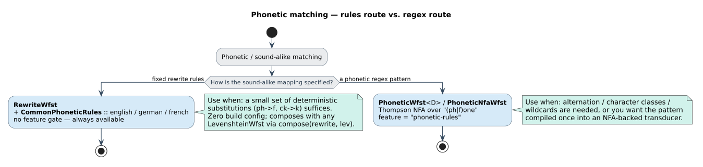

# 04 · Phonetic matching

*Phonetic* matching asks *"which dictionary terms **sound like** this?"* rather than *"which are spelled
like it?"*. duallity answers it two ways — a **rule** route and a **regex** route — over the same
$`\min`$-plus [tropical](../theory/README.md#semirings-and-weights) WFST algebra as every other
variant, so a phonetic stage composes in front of a fuzzy matcher and the total score decomposes into
*sound-alike cost* + *edit distance* ([theory/04 · Composition](../theory/04-composition.md)).

This guide picks a route, wires it, traces it end-to-end, and states its limits. It assumes
[guides/02 · Choosing a variant](02-choosing-a-variant.md) and
[guides/03 · Composing pipelines](03-composing-pipelines.md); the full per-type API is in
[design](../design/README.md), and the expressivity ceiling (both routes are **Type 3 / rational**) is
[theory/07 · Regular-language limits](../theory/07-regular-language-limits.md).

## 1. Two routes, one decision

| | **Route A — Rules** | **Route B — Regex** |
|---|---|---|
| Type | [`RewriteWfst`](../design/phonetic-rewrite-wfst.md) | [`PhoneticWfst`](../design/phonetic-wfst.md) |
| Feature flag | **none** (always available) | **`phonetic-rules`** |
| You supply | a fixed list of rewrites ($`\texttt{ph} \to \texttt{f}`$, $`\texttt{ck} \to \texttt{k}`$) | a phonetic pattern (`(ph|f)one`, classes, `a?`, `a*`) |
| Dictionary | none — it is a front stage you compose | fused in — walks the dictionary as `NFA × Levenshtein × Dictionary` |
| Edit tolerance | from the Levenshtein stage you compose behind it | built in (`max_distance`, a `u8`) |
| Cost knob | per-rule `cost` (finite, $`\ge 0`$) | `phonetic_weight` per consumed char, `edit_weight` scaling the accepting distance |
| Reach for it when | you have a small, explicit sound-alike table | the query is a *pattern* and the target is a *dictionary* |

The heuristic: **a fixed table of substitutions → Route A; a pattern language → Route B.** Route A is
feature-free and orthography-only; Route B is the end-to-end phonetic query but pulls in the
`phonetic-rules` feature and its NFA machinery.

> ⚠ **NEW diagram (pending central render):** a decision flowchart
> [`phonetic-route-decision`](../diagrams/phonetic-route-decision.svg) — *"fixed rule table?"* leads to
> Route A (`RewriteWfst`, no feature); *"pattern with alternation/classes?"* leads to Route B (`PhoneticWfst`,
> `phonetic-rules`), with the bare-NFA and digraph side-doors — belongs here and in the
> [diagram catalog](../diagrams/README.md#catalog) (next free id **D18**). Rendered from
> `docs/diagrams/src/phonetic-route-decision.*` per the [rendering recipe](../diagrams/README.md#rendering).



Two **supporting** stages complete the picture and are covered below: the bare pattern transducer
[`PhoneticNfaWfst`](../design/phonetic-nfa-wfst.md) (§4, the left factor of Route B, no dictionary and
no edits), and the fixed-weight digraph operations of
[`GeneralizedWfst`](../design/generalized-wfst.md) (§6).

## 2. Route A — rule-based rewriting (`RewriteWfst`)

`RewriteWfst` applies orthography rules as char/$`\varepsilon`$ transition chains and composes
**in front of** a Levenshtein matcher ([design/phonetic-rewrite-wfst](../design/phonetic-rewrite-wfst.md)).
It knows nothing about dictionaries or edit distance — it is a *normalizing front stage*, so a pipeline's
cost splits cleanly into *rewrite cost* + *edit distance*.

Its shape (full semantics in
[design §2](../design/phonetic-rewrite-wfst.md#2-operational-semantics)):

- **The whole cost of a rule is paid once**, on its first step; the rest of the chain is free
  ($`\bar{1} = 0`$, the tropical [free step](../theory/README.md#semirings-and-weights)).
- **Unmatched printable-ASCII characters pass through for free** via identity self-loops (95 scalars,
  `' '` = $`\texttt{0x20}`$ through `'~'` = $`\texttt{0x7E}`$), when
  `allow_identity` is on (the default).
- **Rule costs must be finite and non-negative.** Every constructor that takes a cost returns
  `Result<_, InvalidWeightError>`, rejecting `NaN`, $`\pm\infty`$, and negatives; the preset
  constructors and `RewriteRule::new` take already-valid literals and are infallible.

```rust,ignore
use duallity::{LevenshteinWfst, RewriteWfst, RewriteRule, CommonPhoneticRules};
use libdictenstein::dynamic_dawg::char::DynamicDawgChar;
use lling_llang::composition::compose;

let dict = DynamicDawgChar::<()>::from_terms(vec!["phone", "telephone", "graph"]);

// Preset rule sets (feature-free):
let english = RewriteWfst::with_rules(CommonPhoneticRules::english())
    .expect("valid English rules");
let _german = RewriteWfst::with_rules(CommonPhoneticRules::german())
    .expect("valid German rules");
let _french = RewriteWfst::with_rules(CommonPhoneticRules::french())
    .expect("valid French rules");

// Compose the rewriter in front of a Levenshtein matcher and search the pipeline.
let lev      = LevenshteinWfst::new(&dict, "fone", 2);
let _matcher = compose(english, lev);          // RewriteWfst ∘ LevenshteinWfst
```

### 2.1 The preset rule sets

`CommonPhoneticRules` bundles three starter sets. Each is a `Vec<RewriteRule>` with `priority = 0`
throughout; the rows below are **verified verbatim against `src/phonetic_rewrite_wfst.rs`** (the
`CommonPhoneticRules::{english, german, french}` constructors).

| Set | Rules — $`\texttt{input} \to \texttt{output (cost)}`$ |
|-----|---------------------------------|
| `english()` | $`\texttt{ph} \to \texttt{f (0.1)}`$, $`\texttt{gh} \to \texttt{f (0.2)}`$, $`\texttt{ck} \to \texttt{k (0.1)}`$, $`\texttt{qu} \to \texttt{kw (0.1)}`$, $`\texttt{x} \to \texttt{ks (0.1)}`$, $`\texttt{c} \to \texttt{k (0.2)}`$, $`\texttt{c} \to \texttt{s (0.2)}`$ |
| `german()`  | $`\texttt{sch} \to \texttt{sh (0.1)}`$, $`\texttt{ch} \to \texttt{x (0.1)}`$, $`\texttt{ß} \to \texttt{ss (0.1)}`$, $`\texttt{ä} \to \texttt{ae (0.1)}`$, $`\texttt{ö} \to \texttt{oe (0.1)}`$, $`\texttt{ü} \to \texttt{ue (0.1)}`$ |
| `french()`  | $`\texttt{eau} \to \texttt{o (0.1)}`$, $`\texttt{aux} \to \texttt{o (0.1)}`$, $`\texttt{ai} \to \texttt{e (0.1)}`$, $`\texttt{ph} \to \texttt{f (0.1)}`$, $`\texttt{qu} \to \texttt{k (0.1)}`$ |

Notes that matter for cost and state count (full derivation in
[design §3 · the preset rule sets](../design/phonetic-rewrite-wfst.md#3-api-surface-duallity-030)):

- **$`\texttt{gh} \to \texttt{f}`$ costs `0.2`, not `0.1`** — the $`\texttt{rough} \to \texttt{ruff}`$ reduction is charged higher than the other
  English rules; $`\texttt{c} \to \texttt{k}`$ and $`\texttt{c} \to \texttt{s}`$ are the two `0.2` *coarse* alternatives (see §7).
- **German `ß`, `ä`, `ö`, `ü` are single Unicode `char`s** ($`\lvert\mathrm{in}\rvert = 1`$), so
  $`\texttt{ß} \to \texttt{ss}`$ is a one-to-two rewrite — matched by its explicit rule edge, not by an identity loop (those are
  printable-ASCII only; §7).
- A rule spanning $`s = \max(\lvert\mathrm{in}\rvert, \lvert\mathrm{out}\rvert)`$ symbols
  contributes $`s-1`$ continuation states. English and French each total
  $`\sum (s{-}1) = 5`$ continuation states ($`\lvert Q\rvert = 6`$); German totals `3`
  ($`\texttt{sch} \to \texttt{sh}`$ alone contributes `2`).

### 2.2 Custom rules and priority

Build a set from scratch with explicit costs and priorities:

```rust,ignore
use duallity::{RewriteWfst, RewriteRule};

let mut custom = RewriteWfst::new();                    // empty, allow_identity = true
custom.add_rule("ph", "f", 0.1).expect("valid rewrite rule");
custom
    .add_rewrite_rule(
        RewriteRule::with_cost("ck", "k", 0.1)
            .expect("valid rewrite rule")
            .with_priority(5),                          // enumerated before priority-0 rules
    )
    .expect("valid rewrite rule");
assert_eq!(custom.num_rules(), 2);

// Accept a character ONLY if a rule consumes it (no free passthrough):
custom.set_allow_identity(false);
```

`priority` **orders, it does not gate**: a higher-priority rule's step-0 edge is enumerated first from
the home state, with insertion order breaking ties — but every applicable rule stays available. Overlap
is resolved not by priority but by `prune_dominated_transitions`, which keeps the minimum-weight edge per
$`(\text{from}, \text{in}, \text{out}, \text{to})`$ key
([design §2](../design/phonetic-rewrite-wfst.md#2-operational-semantics)).

## 3. Worked trace — `"fone"` through $`\texttt{RewriteWfst} \circ \texttt{LevenshteinWfst}`$

The canonical two-stage phonetic pipeline: `RewriteWfst` *normalizes* the `ph`/`f` orthography, then
`LevenshteinWfst` *fuzzes* the rest against the dictionary.

```rust,ignore
use duallity::{LevenshteinWfst, RewriteWfst, CommonPhoneticRules};
use libdictenstein::dynamic_dawg::char::DynamicDawgChar;
use lling_llang::composition::compose;

let dict     = DynamicDawgChar::<()>::from_terms(vec!["phone", "graph", "telephone"]);
let rewrite  = RewriteWfst::with_rules(CommonPhoneticRules::english())
    .expect("valid preset rules");
let lev      = LevenshteinWfst::new(&dict, "fone", 2);
let composed = compose(rewrite, lev);          // RewriteWfst ∘ LevenshteinWfst
```

**The char/$`\varepsilon`$ chains inside `RewriteWfst`.** Every rule is a chain of arcs rooted at
the accepting home state $`0`$; the whole cost sits on step 0, and $`h : \varepsilon`$
shortens the input tape. The English $`\texttt{ph} \to \texttt{f}`$ rule (the bridge that connects the dictionary spelling
`phone` to the query `fone`) and the free identity self-loops that carry `o`, `n`, `e` are exactly
(weights shown as their numeric tropical value, $`\bar{1} = 0`$):

```text
   ┌────────────────────── the ph→f rule (whole cost on step 0) ──────────────────────┐
   0 ── p : f / 0.1 ──▶ c₁ ── h : ε / 0 ──▶ 0            ▷ reads "ph", writes "f"; input tape shortens
   │
   0 ── o : o / 0 ──▶ 0                                  ▷ identity self-loop (free, printable-ASCII)
   0 ── n : n / 0 ──▶ 0                                  ▷ identity self-loop (free)
   0 ── e : e / 0 ──▶ 0                                  ▷ identity self-loop (free)
```

Reading the correspondence `phone ⇄ fone`, the rewrite stage pays `0.1` **once** for the `ph`/`f`
alternation and `0` for every other character — total rewrite cost $`0.1`$. These are the
many-to-one and one-to-many tape shapes of **diagram D10**
([`rewrite-char-epsilon-chains`](../diagrams/rewrite-char-epsilon-chains.svg); see
[design §7](../design/phonetic-rewrite-wfst.md#7-diagram)).

**Composition folds the two costs.** `compose(rewrite, lev)` matches the rewrite's *output* tape against
the Levenshtein stage's *input* tape, so the `ph`/`f` correspondence becomes reachable to the search at
cost $`0.1`$ and the Levenshtein stage charges only the **residual** edit distance. Every accepting
path's tropical weight is therefore

```math
w(\pi) \;=\; \underbrace{\mathrm{cost}_{\mathrm{rewrite}}}_{0.1\ \text{for the}\ \texttt{ph}/\texttt{f}\ \text{rule}} \;+\; \underbrace{d_{\mathrm{lev}}(\cdot)}_{\text{residual edits}} ,
```

so a term reached purely by identity pass-through and edits carries **no** rewrite component, while
reaching `phone` from `fone` pays the `ph`/`f` rewrite plus whatever edits remain after normalization.
Drive the search and read the ranked results exactly as in
[guides/03 §5](03-composing-pipelines.md#5-shortest-path-search); the end-to-end driven search is in
[design §5 · Worked example](../design/phonetic-rewrite-wfst.md#5-worked-example).

## 4. Route B — regex phonetic matching (`PhoneticWfst`)

With `features = ["phonetic-rules"]`, compile a phonetic **regular expression** into an NFA-backed WFST
fused with the dictionary as the triple product `NFA × Levenshtein × Dictionary`
([design/phonetic-wfst](../design/phonetic-wfst.md)):

```rust,ignore
// Cargo.toml:  duallity = { version = "0.3", features = ["phonetic-rules"] }
use duallity::PhoneticWfstBuilder;
use libdictenstein::dynamic_dawg::char::DynamicDawgChar;

let dict = DynamicDawgChar::<()>::from_terms(vec!["phone", "fone", "bone"]);
let _wfst = PhoneticWfstBuilder::new(dict, 2)               // k = 2 (a u8)
    .phonetic_weight(0.1)                                   // ω_p: cost per consumed phonetic step
    .expect("valid phonetic weight")
    .edit_weight(1.5)                                       // ω_e: scales the accepting edit distance
    .expect("valid edit weight")
    .build_from_pattern("(ph|f)one")                        // alternation, grouping, classes, optionality
    .expect("valid pattern");
```

Two weights, two roles ([design §2](../design/phonetic-wfst.md#2-operational-semantics--the-triple-product)):
`phonetic_weight` ($`\omega_p`$) is charged on each *consumed* dictionary/NFA edge; `edit_weight`
($`\omega_e`$) scales the accepting **edit-distance** final weight. Both must be finite and
non-negative. `max_distance` is the **unweighted** bound $`k \le 255`$ baked into the product — the
weights scale *reported* costs for ranking; they do **not** change which states are explored.

**Wide labels are finite-alphabet-relative.** `lling_llang::Wfst` transitions carry *concrete* labels, so
`.`, negated classes, and unbounded positive classes are exact **only over the configured alphabet**
$`\Sigma`$ (default: the 95 printable-ASCII scalars). A literal `Char(c)` and any explicit range of
width $`\le 256`$ are always exact; supply a domain alphabet with `with_alphabet` when the default
is wrong. This is the alphabet contract of
[design/phonetic-nfa-wfst §4](../design/phonetic-nfa-wfst.md#4-alphabet-contract-for-wide-labels).

**The bare NFA stage.** [`PhoneticNfaWfst`](../design/phonetic-nfa-wfst.md) is the same pattern transducer
*without* a dictionary or edit distance — a lazy subset construction over the compiled NFA, one identity
edge per consumed character at `phonetic_weight`. Use it when you want the pattern transducer *itself* to
compose by hand or inspect; use `PhoneticWfst` for the end-to-end *pattern-against-dictionary-within-$`k`$*
query. Both are gated behind `phonetic-rules`.

## 5. One builder for both routes

[`PhoneticPipelineBuilder`](../design/phonetic-pipeline-builder.md) emits whichever *stage* you need from
one fluent configuration:

| Build method | Emits | Feature | Mode |
|---|---|---|---|
| `build_rewrite_wfst()` | [`RewriteWfst`](../design/phonetic-rewrite-wfst.md) | **none** | rewrite-rule mode |
| `build_phonetic_nfa()` | [`PhoneticNfaWfst`](../design/phonetic-nfa-wfst.md) | `phonetic-rules` | pattern mode |
| `build()` | [`PhoneticWfst<D>`](../design/phonetic-wfst.md) (needs a `dictionary(..)`) | `phonetic-rules` | pattern mode |

```rust,ignore
use duallity::PhoneticPipelineBuilder;

// Rule mode → feature-free RewriteWfst:
let rewrite_stage = PhoneticPipelineBuilder::new()
    .add_rewrite_rule("ph", "f", 0.1).expect("valid rewrite rule")
    .add_rewrite_rule("c",  "k", 0.2).expect("valid rewrite rule")
    .allow_identity(true)
    .build_rewrite_wfst()
    .expect("valid rewrite configuration");
```

Pattern and rewrite-rule configurations are **mutually exclusive** for the single-WFST builds:
`build_phonetic_nfa()` and `build()` reject a configuration that also carries rewrite rules (so
dictionary-backed builds never silently drop rules). `phonetic_weight` scores consuming phonetic
transitions; `edit_weight` scales the accepting edit-distance final weight for dictionary-backed
`build()`; both must be finite and non-negative. Remember the builder produces *stages* — you `compose`
and search them yourself ([guides/03](03-composing-pipelines.md)).

## 6. Related — phonetic digraphs in `GeneralizedWfst`

A third, feature-free option lives in [`GeneralizedWfst`](../design/generalized-wfst.md): its
`with_phonetic_digraphs()` operation set adds **restricted** two-character rewrites
(`ch↔k`, `sh↔s`, `ph↔f`, `th↔t`, `qu↔kw`) directly into the edit metric, each a two-arc continuation
chain at a **fixed** cost $`0.15`$. Reach for it when you want digraph rewrites *fused into one
edit-distance automaton over a `char` dictionary* rather than composed as a separate stage — and when the
fixed $`0.15`$ weight is acceptable (it exposes no knob; retune by building a custom `OperationSet`).
For tunable, rule-based phonetics, prefer Route A.

## 7. ⚠ Limitations

- **Rules are unconditional.** `RewriteRule` stores only `input` / `output` / `cost` / `priority` — no
  left/right context, lookahead, or word-boundary condition. The English $`\texttt{c} \to \texttt{k}`$ and $`\texttt{c} \to \texttt{s}`$ presets are
  therefore *coarse alternatives offered simultaneously* (both fire), not lexically-conditioned choices.
  Model context by **expanding it into explicit consumed-context rules** before construction: a
  right-context rule *"$`\texttt{c} \to \texttt{s}`$ before `e`"* becomes the consumed-context rule $`\texttt{ce} \to \texttt{se}`$ (the `e` passes
  through as part of the output). This is the intended workaround, and it is exact
  ([design/phonetic-rewrite-wfst §6](../design/phonetic-rewrite-wfst.md#6--honest-limitations)).
- **`priority` orders, it does not suppress.** Higher priority only enumerates a rule's step-0 edge
  earlier; every applicable rule remains available. Use it to influence enumeration order, not to gate
  alternatives.
- **The identity alphabet is printable ASCII only** (95 scalars, $`\texttt{0x20}`$ …
  $`\texttt{0x7E}`$). A character outside that range (an emoji, a CJK ideograph, most accented
  Latin letters) has **no** free identity self-loop, so with `allow_identity` on it is accepted only if
  some rule consumes it. Preset rules whose *inputs* are wide scalars (German `ä`, `ö`, `ü`, `ß`) match
  through their explicit edges. For full-Unicode alternation use Route B with a custom alphabet.
- **Route B is feature-gated and edit-bounded at `u8`.** `PhoneticWfst` / `PhoneticNfaWfst` exist only
  under `phonetic-rules`, and `max_distance` is $`k \le 255`$; its weights are ranking-only and do
  not widen the explored set.
- **Both routes are Type 3.** A finite rule set and a phonetic regular expression each denote a
  *rational relation* — expressive within the regular tier, but unable to enforce unbounded nested or
  long-range structure ([theory/07 · Regular-language limits](../theory/07-regular-language-limits.md#2-what-a-regular-transducer-can-express)).

## See also

- [design/phonetic-rewrite-wfst](../design/phonetic-rewrite-wfst.md) — Route A semantics, the preset breakdown, and **D10** (`rewrite-char-epsilon-chains`).
- [design/phonetic-wfst](../design/phonetic-wfst.md) · [design/phonetic-nfa-wfst](../design/phonetic-nfa-wfst.md) — Route B and its bare-NFA left factor.
- [design/phonetic-pipeline-builder](../design/phonetic-pipeline-builder.md) — the fluent front-end of §5.
- [design/generalized-wfst](../design/generalized-wfst.md) — the fixed-weight digraph operations of §6.
- [theory/04 · Composition](../theory/04-composition.md) — how $`\text{rewrite} \circ \text{lev}`$ folds the two cost components.
- [theory/07 · Regular-language limits](../theory/07-regular-language-limits.md) — why both routes stay Type 3.
- [guides/02 · Choosing a variant](02-choosing-a-variant.md) · [guides/03 · Composing pipelines](03-composing-pipelines.md) · [guides/05 · Performance and tuning](05-performance-and-tuning.md).
