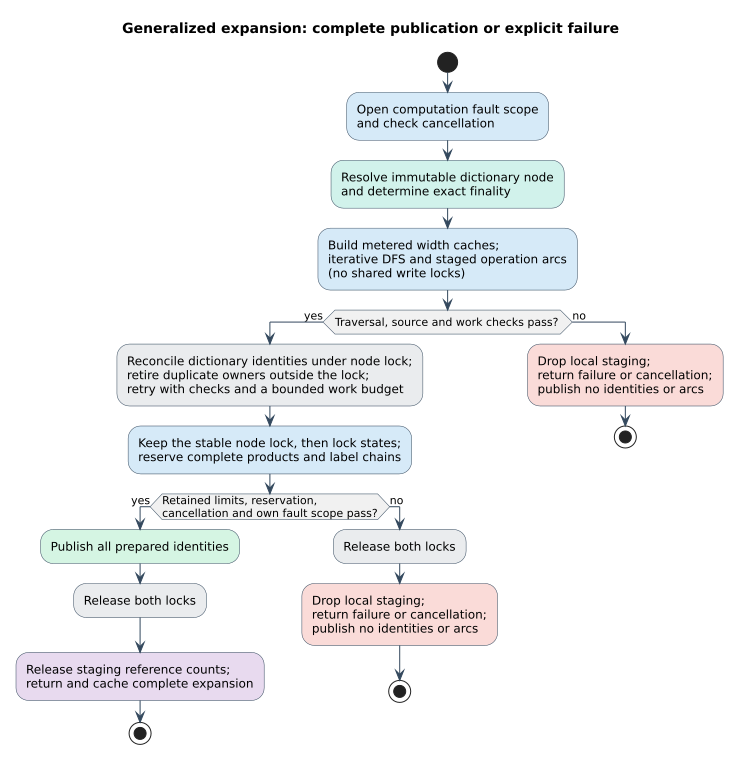

# Generalized expansion bounds and transactions

`GeneralizedWfst` builds a weighted finite-state transducer (WFST) lazily over a
dictionary snapshot and a fixed query. A configured operation can consume many
scalars, and even a short operation can encounter a high-degree dictionary node.
Resource limits therefore apply to construction, one expansion's scratch work,
and identities retained across expansions—not just cached transitions.

Read [generalized semantics](../design/generalized-wfst.md) first for tape
orientation, exact costs, and acceptance. This page specifies the implementation
in `generalized_limits.rs`, `generalized_expansion.rs`, and
`generalized_computation.rs`.

## 1. Choosing limits

Every ceiling is inclusive. The defaults are:

| `GeneralizedWfstLimits` field | Default | Scope |
|---|---:|---|
| `max_query_bytes` | 1,048,576 | Owned query UTF-8 bytes |
| `max_query_scalars` | 262,144 | Query Unicode scalar values |
| `max_operation_source_scalars` | 4,096 | One rule's dictionary width |
| `max_operation_query_scalars` | 4,096 | One rule's query width |
| `max_retained_dictionary_nodes` | 1,000,000 | Shared node identities, including root |
| `max_retained_wfst_states` | 1,000,000 | Shared product and continuation identities, including start |
| `max_paths_per_expansion` | 262,144 | Complete paths materialized during one expansion |
| `max_work_units_per_expansion` | 4,000,000 | One expansion's charged work |

A zero query ceiling allows only an empty query. A zero width ceiling allows
only zero consumption on that side; the native grammar still rejects a rule
that consumes neither side. Root and start each need at least one retained entry.
The native grammar also bounds total catalog consumption independently of these
per-operation limits.

`try_new_with_limits` checks query limits before making its owned query copy.
The fluent builder's `query` setter already owns a copy; its validation happens
at `try_build`. Caller-owned configuration and operation-set construction are
not covered by an expansion budget.

Foreign generalized constructors use the same preset configuration but pass a
borrowed query directly to validation, avoiding the fluent setter's preliminary
copy. Their typed binding error retains the underlying generalized error.
The existing C ABI reports configured bounds and scale/identifier overflow as
`LimitExceeded`, including that status returned by snapshot/root/length callbacks.
Malformed configuration remains `InvalidArgument`. The C status alphabet has
no separate closed-provider code, so `Closed` remains `ProviderError` there;
the scalar-WFST interop surface can preserve the richer interop status.

A complete example, also built and run as
[`generalized_bounded.rs`](../../examples/generalized_bounded.rs):

```rust
use duallity::{GeneralizedWfst, GeneralizedWfstLimits};
use libdictenstein::dynamic_dawg::char::DynamicDawgChar;
use liblevenshtein::transducer::OperationSet;

fn main() -> Result<(), Box<dyn std::error::Error>> {
    let dictionary = DynamicDawgChar::<()>::from_terms(["phone", "phony"]);
    let limits = GeneralizedWfstLimits {
        max_query_bytes: 128,
        max_query_scalars: 64,
        max_retained_dictionary_nodes: 10_000,
        max_retained_wfst_states: 20_000,
        max_paths_per_expansion: 1_000,
        max_work_units_per_expansion: 100_000,
        ..Default::default()
    };
    let mut wfst = GeneralizedWfst::try_new_with_limits(
        &dictionary, "fone", 2, OperationSet::standard(), limits,
    )?;
    let arcs = wfst.try_transitions(0)?;
    assert!(!arcs.is_empty());
    Ok(())
}
```

Construction returns `GeneralizedWfstError`, with native grammar and scale
errors available through `std::error::Error::source`. Expansion uses lling-llang's
`ExpansionError`: exhausted configured limits, identifier arithmetic, and fallible
reservations produce non-retryable `ResourceExhausted` failures. Cancellation
remains distinct. No such failure is converted to a successful empty expansion.

The legacy `transitions_lazy` convenience method cannot return an error and
panics on failure. Use `try_transitions`, `LazyWfst::expand`, or
`StateSource::compute_state` when the caller must handle limits.

## 2. Scratch, retained identities, and caches

These are different memory lifetimes:

- Scratch paths, DFS frames, query segments, and staged arcs belong to one
  expansion and are released when it finishes or fails.
- Dictionary-node IDs and product/continuation IDs are shared by WFST clones.
  They survive transition-cache eviction because published arcs refer to them.
- Materialized transition caches remain per-wrapper. LRU or no-cache policy
  controls these entries, not the shared identity registries.

Here DFS means depth-first search. It uses an explicit stack of owned edge
iterators and shared prefix buffers, not recursive Rust calls. The width-4096
regression runs traversal and continuation emission on a 64 KiB thread stack.

Query and path caches use compact slots assigned to distinct widths during
construction. Slots are not indexed by the raw width: a sole width-4096 rule
needs one slot, not 4097 large entries. SmallVec stores up to six slots inline.
A missing query segment and an empty path set are cached results, preventing
repeated scans for operations sharing that width.

## 3. The work ledger

A work unit is a deterministic accounting unit for explicit expansion work,
not a CPU instruction or elapsed-time measurement. Let $`r`$ be prepared rule
count, $`d_x`$ and $`d_y`$ distinct source/query widths, and $`V`$ charged
traversal, predicate, and label work. The explicit expansion loop is
$`O(r+d_x+d_y+V)`$; it contains no search across earlier width-cache entries.

Charges occur **before** the corresponding work:

| Action | Charged units |
|---|---:|
| Product finality probe | 1 |
| Initialize width caches | One per distinct source/query slot |
| Inspect a prepared rule | 1 |
| First query-segment fill | Twice its declared scalar width |
| Start an edge iterator; request each next edge or end marker | 1 each |
| DFS frame step | 1 |
| Materialize a complete path | 1 plus scalar and UTF-8 byte lengths |
| Apply one predicate to a path/query pair | 1 plus both UTF-8 byte lengths |
| Stage a matching arc | 1 plus both scalar lengths |
| Reconcile a staged dictionary identity | 1 |
| Prepare an arc's product/chain | 1 plus eight times both scalar lengths |
| Emit a precommitted continuation | 1 |

The path ceiling counts complete paths once when materialized for a width;
each rule still pays for its own predicate evaluation over those paths.
All work and path additions are checked for integer overflow. Cancellation is
polled with every charge and immediately before publication.
Reconciliation retries charge every staged node again. They cannot spin
unboundedly when concurrent publications or destructor reentry change the
registry between passes.

For the valid catalog with source widths 1 through 90, query width zero, and an
empty dictionary, the regression's ledger is exactly
$`1+91+90\cdot4=452`$ units. A ceiling of 451 fails without publication;
452 succeeds with an empty expansion. This pins linear cache work without a
wall-clock assertion.

These limits do **not** preempt a callback that never returns, bound arbitrary
user-defined `Clone`/`Drop` implementations, or account for every internal
allocator/hash-table instruction. Allocation failure is handled where
fallible reservations are used; Rust's process-wide allocation-abort behavior
is not eliminated. Use process-level memory/time limits for untrusted execution.
Foreign providers must honor the ABI's buffer validity and callback contracts.

## 4. Atomic logical publication



The two shared registries are acquired in a fixed order: dictionary nodes first,
WFST states second. Staged nodes are reconciled against identities published by
concurrent expansions **before** testing retained limits. Two clones reaching
the same new path can therefore both succeed at an exact-fitting limit.

The transaction's invariant is: every published transition target denotes a
fully registered product or continuation. All continuation positions of a
multi-label rule are reserved with its first arc. Dictionary and state IDs
become visible only after the complete batch passes all checks.
`StateId::MAX` is reserved as lling-llang's `NO_STATE` sentinel and is never
allocated, even if the caller raises the retained-state ceiling.

```text
Publish a prepared expansion
  Input: staged path handles and operation arcs; shared registries
  Output: complete transitions or explicit failure
  Invariant: staged indexes never escape as public IDs

  1. Lock nodes; resolve parents before children and reuse canonical owners.
  2. If any redundant owners must be retired:
       unlock nodes, destroy those owners, check fault/cancellation,
       then restart with fresh provisional IDs and fresh work charges.
  3. Keeping the stable node guard, lock states.
  4. Count and reserve genuinely new nodes, products, and complete chains.
  5. Reject over-limit counts, allocation failures, or reserved/unrepresentable IDs.
  6. Check cancellation and the exact invocation's captured provider fault.
  7. Append nodes, then states, using prevalidated IDs and reserved storage.
  8. Unlock both registries.
  9. Release staging reference counts; return the complete transition batch.
```

A failure publishes no new IDs or cached arcs from that attempt. Earlier
successful expansions and concurrent successful publications remain valid.
A failed reservation may change physical container capacity; “transactional”
means logical identities and visible expansions, not restoration of allocator
state or rollback of arbitrary external callback side effects.

Registered user nodes are owned through `Arc`. Read-side resolution copies an
internal reference count; it does not invoke the user's `Clone` under a lock.
Staging retains candidate owners until guards are gone. Redundant owners are
destroyed before publication, outside locks, followed by source-fault and
cancellation checks. A destructor can therefore reenter safely or report a
foreign callback fault before the outer transaction publishes anything.
Each retry discards its provisional IDs and resolves them afresh.
After a successful commit, every remaining staging owner shares its `Arc`
with a retained registry owner; staging cleanup cannot invoke a user destructor.
Tests cover lifecycle lock probes, destructor-triggered provider failure,
cancellation, successful reentry, and retry-work exhaustion.

The registries still use `RwLock`. This transaction is not advertised as
lock-free; short ordered commits and callback isolation are its guarantees.

## 5. Foreign callback fault ownership

`ResourceDictionary` adapts an infallible native dictionary trait to fallible
`vt.dictionary.v1` callbacks. Each synchronous generalized expansion owns a
thread-local computation scope. This works through ordinary node decorators:
they do not need to implement a new diagnostic method.

`ResourceDictionary::with_checked` creates a provider-specific checked scope
and preserves the first exact `VtStatus`. A failing callback finds the nearest
matching provider scope or computation scope. If the computation wins, it also
notifies the nearest enclosing matching provider scope, stopping at any older
computation. Precommit checks its **own guard**, never the ambient top scope.

| Scope nesting and failing callback | Fault owners |
|---|---|
| Checked A → Checked B → expansion; A fails | Expansion and Checked A |
| Outer expansion → Checked B → inner expansion; B fails | Inner expansion and Checked B |
| Outer expansion → inner expansion; A fails | Inner expansion only |
| Outer expansion → Checked B; B fails | Checked B only |

This preserves exact foreign statuses while allowing a nested failure to be
handled without poisoning unrelated outer work. A directly failed expansion
still latches its enclosing `with_checked` even if the caller ignores the
returned error. A fresh nested checked or computation scope is the explicit
recovery boundary. Scopes cannot migrate between threads; unwind removes them.

Outside a checked scope or generalized computation, a failed direct infallible
resource-node call panics instead of silently reporting an empty branch.

Foreign adjacency is pulled one fixed 256-edge page at a time. The consumer
checks page capacity, progress, offsets, a stable total across pages, valid
Unicode scalar labels, and a total no larger than the Unicode scalar alphabet.
It never reserves storage from an untrusted degree or iterator size hint.
Work exhaustion can stop before later pages are fetched.

The scalar-WFST export preserves `LimitExceeded` rather than erasing it to
`ProviderError`. lling-llang's resource bridge forwards non-success provider
statuses, and its direct ABI preserves the distinguished limit/closed outcomes.
A malformed provider error containing `Ok` never becomes success.

## 6. Executable evidence

The [verification ledger](../scientific-ledger/generalized-expansion-2026-09-06.md)
records the tested source graph, outcomes, reproduction commands, and limits of
the claims below.

| Contract | Regression location |
|---|---|
| Thirty tenths accepted; thirty-one rejected; integer-grid differential | `tests/generalized_wfst.rs` |
| Exact/over-limit constructor boundaries and capture-failure ownership | `tests/ffi_constructor_limits.rs` |
| Exhaustive constructor error classification | `src/ffi.rs` tests and `proofs/coq/StatusMapping.v` |
| No false final state from an unemitted query suffix | `tests/generalized_wfst.rs` |
| Exact node/state/path/work ceilings and no partial identity publication | `src/generalized_wfst.rs` tests |
| Compact maximum-width slots and linear width-cache budget | `src/generalized_ops.rs` and `src/generalized_wfst.rs` tests |
| No user node lifecycle operation under locks | `src/generalized_lock_tests.rs` |
| Two workers both stage before exact-fit reconciliation | `src/generalized_lock_tests.rs` |
| Late page failure, inflated total, and every scalar adapter's limit status | `tests/ffi_paging_acceptance.rs` |
| Real callbacks through decorators, nested recovery, unrelated faults, threads | `tests/generalized_provider_scopes.rs` |
| Thread-local first-error and unwind isolation | `src/bindings/fault_scope.rs` tests |
| Exported status preservation and direct-ABI status distinctions | lling-llang `src/bindings.rs` / `src/ffi.rs` tests |
| Exhaustive status-mapping model | lling-llang `proofs/coq/abi/StatusMapping.v` |

The independent integer-grid oracle and native-automaton differential establish
language/cost behavior; sink tests alone are not accepted as proof of foreign
callback transactionality. Performance measurements must be reported separately
with their workload and machine-load conditions, not inferred from passing tests.
