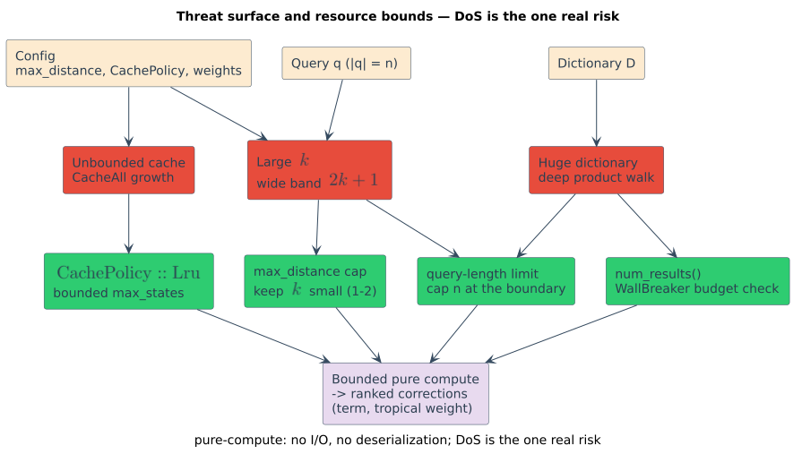

# Threat model

> **Defines:** duallity's trust boundary and inputs, the (small) attack surface, and the one realistic
> risk — algorithmic resource exhaustion — together with the concrete numeric bounds that contain it.
> **Symbols** (`` $`q`$ ``, `` $`n = \lvert q \rvert`$ ``, `` $`D`$ ``, `` $`k`$ ``) are from the
> [master notation](../theory/README.md#master-notation).

This page states what duallity is exposed to, what it is **not** exposed to, and how to bound the one
risk that actually exists for a pure-compute library: making a single correction expensive.

## 1. Trust boundary and inputs

duallity is a library embedded inside a host application. It crosses no process, file, or network
boundary of its own; the only boundary that matters is the **API call** from host to library. Its
inputs are exactly three:

| Input | Typical trust | Shape | Notes |
|-------|---------------|-------|-------|
| the **query** `` $`q`$ `` | often **untrusted** (e.g. a user's search box) | a `&str`, `` $`n = \lvert q \rvert`$ `` Unicode scalars | the only input an anonymous caller usually controls directly |
| the **dictionary** `` $`D`$ `` | usually **trusted** (built by the host) | an in-memory [libdictenstein](../references/glossary.md) container (DAWG, DAT, SCDAWG…) | host-constructed; not deserialized by duallity |
| **configuration** (`max_distance` `` $`= k`$ ``, `CachePolicy`, edit/phonetic weights, rewrite rules) | the **host** | scalars, enums, small rule tables | the resource-governing knobs |

duallity performs **no I/O**: it opens no files or sockets, makes no network calls, spawns no
processes, reads no environment, and **deserializes nothing**. There is therefore no
parsing-of-untrusted-bytes surface, no SSRF or path-traversal surface, and no deserialization-gadget
surface of duallity's own making. Everything downstream of the API call is deterministic in-memory
computation.



> **New diagram.** `threat-surface-resource-bounds` is introduced by this page. Its D2 source
> (`../diagrams/src/threat-surface-resource-bounds.d2`) and rendered SVG are committed alongside the
> other diagrams; regenerate with `d2 --layout elk` per
> [diagrams/README.md](../diagrams/README.md#rendering). It uses the shared color legend: untrusted
> query = warm orange, trusted dictionary = green, host config = gray, the duallity core = blue,
> results = purple, the resource-bound valves = gold, and the structural-ceiling backstop = red-pink.

## 2. The attack surface

The surface an adversary can actually reach is small and is enumerated here in full.

**Reachable by an untrusted caller:**

- the **content and length of the query** `` $`q`$ `` — arbitrary Unicode text up to whatever length
  the host permits;
- indirectly, **which configured code path** runs, if the host maps user actions to features (e.g.
  exposing a large-`` $`k`$ `` mode).

**Not reachable by an untrusted caller (host-controlled):**

- `max_distance` `` $`= k`$ ``, the `CachePolicy`, and all weights/rules;
- the **dictionary** `` $`D`$ `` itself — its terms and its container type.

**Explicitly out of scope** (no mechanism exists inside duallity):

- **Memory-safety exploits** — the crate contains **no `unsafe`**
  ([engineering/safety-and-panics](../engineering/safety-and-panics.md)); it has no raw-pointer,
  uninitialized-memory, or out-of-bounds surface of its own.
- **Injection** — there is no query language, template engine, SQL, or shell invocation to inject
  into; `` $`q`$ `` is consumed as an array of `char`, never interpreted as code.
- **Deserialization / untrusted parsing** — duallity constructs nothing from untrusted bytes.
- **Secrets** — duallity holds none; it processes strings, not credentials, and its timing is a
  function of public inputs only.

## 3. The realistic risk: resource exhaustion (DoS)

The genuine concern is **algorithmic**. duallity walks a product of two structures — the dictionary
and a Levenshtein (or universal / phonetic / generalized) automaton — and an adversary who controls
`` $`q`$ `` (and possibly influences `` $`D`$ ``) can try to make that walk explore a large region of
the product state space.

The size of that region is governed by a small, closed formula. For the standard Levenshtein adapter
the automaton reaches a diagonal **band of width** `` $`2k{+}1`$ `` around the query/dictionary
diagonal, and across all `` $`n{+}1`$ `` query positions the number of reachable automaton states is
bounded by

```math
\lvert \text{automaton states} \rvert \;\le\; (n + 1)\,(2k + 1),
```

which is exactly the estimate `state_encoding::estimate_automaton_states(n, k)` computes in `lib.rs`.
Two independent levers therefore inflate work: **`` $`k`$ `` widens the band** (`` $`2k{+}1`$ ``), and
**`` $`n`$ `` lengthens it** (`` $`n{+}1`$ `` positions). At large `` $`k`$ `` a third effect appears —
the **"wall effect"** ([theory/06](../theory/06-wallbreaker-and-the-wall-effect.md)): a short query
prefix can no longer be pruned, forcing wide exploration before matching narrows. The eager
[`WallBreakerWfst`](../design/wallbreaker-wfst.md) exists precisely to replace that wall with a
split → seed → extend strategy when large `` $`k`$ `` is genuinely required.

Beneath the tunable knobs sit **hard structural ceilings** that make the crate *fail closed* rather
than overflow:

- the product `StateId` is a `u32`, so at most `` $`2^{32}-1`$ `` product states are representable;
  `state_encoding::try_encode` returns `None` on overflow instead of wrapping
  ([architecture/03](../architecture/03-state-encoding-and-product-space.md)), and oversized product
  construction is a single explicit, documented panic boundary
  ([engineering/safety-and-panics §3](../engineering/safety-and-panics.md));
- the dictionary `VocabId` is a `u32` with a reserved exhaustion sentinel (`VocabId::MAX`), so at most
  `` $`2^{32}-1`$ `` terms intern; `try_intern` returns `None` and the infallible `intern` returns the
  sentinel rather than aliasing an existing id ([`DictionaryBackend`](../design/levenshtein-wfst.md));
- dictionary-node registry ids are likewise `u32`-bounded (`next_registry_id` returns `None` past
  `` $`2^{32}-1`$ `` nodes; [architecture/05](../architecture/05-registries-and-interning.md)).

These ceilings are backstops, not budgets: a well-configured host bounds work **far** below them.

## 4. Per-vector mitigations

Each DoS vector maps to a concrete, enforceable bound and a specific 0.3 API control.

| Vector | Mechanism | Concrete bound | API control |
|--------|-----------|----------------|-------------|
| large `` $`k`$ `` (`max_distance`) | band width grows as `` $`2k{+}1`$ ``; the wall effect forces wide exploration at large `` $`k`$ `` | cap `` $`k`$ `` to a small constant (**1–2**) for untrusted input | pass a small `max_distance` to `LevenshteinWfst::new`; use [`WallBreakerWfst`](../design/wallbreaker-wfst.md) for legitimate large `` $`k`$ `` |
| long queries | reachable state count scales with `` $`(n{+}1)(2k{+}1)`$ `` | cap `` $`n`$ `` at the trust boundary (e.g. **64** scalars) | truncate/reject before constructing the WFST (host-side) |
| unbounded cache growth | `CachePolicy::CacheAll` retains **every** visited state | bound the live cache to `max_states` | `set_cache_policy(CachePolicy::Lru { max_states })` / `set_max_cache_size(n)` ([guides/05](../guides/05-performance-and-tuning.md)) |
| eager result sets (WallBreaker) | construction runs the **whole** query up front and stores every match | cap `` $`k`$ ``; treat very large match counts as suspicious | inspect `num_results()` after `build()`; gate behind trusted paths |
| large / adversarial dictionary | product work and interning grow with `` $`\lvert D \rvert`$ `` (paid lazily, per explored corner) | keep `` $`D`$ `` host-built and trusted; rely on the `u32` ceilings as backstops | build `` $`D`$ `` from vetted terms; prefer a bounded `CachePolicy` for long-lived services |

## 5. Recommended posture for untrusted queries

The defensive configuration is three lines: cap the query, keep `` $`k`$ `` small, and bound the
cache.

```rust,ignore
use duallity::LevenshteinWfst;
use lling_llang::prelude::*; // CachePolicy, and LazyWfst for set_cache_policy

// 1. Cap the query length at the trust boundary, before building anything.
const MAX_QUERY_CHARS: usize = 64;
let query: String = raw_query.chars().take(MAX_QUERY_CHARS).collect();

// 2. Keep the edit bound small and fixed for interactive, untrusted input.
let mut lev = LevenshteinWfst::new(&dict, &query, 2);

// 3. Bound the memoization cache for any long-lived process.
lev.set_cache_policy(CachePolicy::Lru { max_states: 50_000 });
```

For features that legitimately need a large `` $`k`$ ``, gate them behind authenticated/trusted call
paths and inspect the eager result count:

```rust,ignore
use duallity::WallBreakerWfst;

const SUSPICIOUS_RESULTS: usize = 10_000;

// WallBreaker construction is eager: it runs the whole query up front.
let wb = WallBreakerWfst::new(&dict, &query, 6);
if wb.num_results() > SUSPICIOUS_RESULTS {
    // Treat as adversarial: reject, rate-limit, or truncate downstream.
}
```

Checklist:

- Keep `max_distance` small (**1–2**) for interactive, untrusted queries.
- Bound the query length **before** constructing the WFST.
- Prefer a bounded `CachePolicy::Lru` for any long-lived process; reserve `CacheAll` for one-shot or
  batch work.
- For large-`` $`k`$ `` features, gate them behind trusted call paths and check `num_results()`.

## 6. Determinism and reproducibility

duallity is **deterministic**: for a fixed `` $`(q, D, \text{config})`$ `` it produces the same set of
matched terms with the same tropical weights, and therefore the same ranking. This is a security
property in its own right — it makes reported issues reproducible and results auditable.

The determinism is robust to threading:

- **Single-threaded traversal** is fully deterministic, including the internal `u32` ids: first-visit
  order is fixed by the deterministic edge iteration and the fixed transition order
  (`SmallVec<[_; 4]>`).
- **Under concurrent expansion of a shared registry** (cloned WFSTs, or `compose` operating across
  threads; [engineering/concurrency-and-locking](../engineering/concurrency-and-locking.md)), the
  *interleaving* of first-visit id assignment may differ run to run, but the **observable results do
  not**. The matched terms and their weights are functions of the inputs alone: `` $`\oplus = \min`$ ``
  is order-independent, and each accepting path accumulates `` $`\otimes = +`$ `` in that path's own
  fixed edge order, so the assigned weights are independent of traversal scheduling.
- There is **no RNG, no clock, and no environment read** anywhere in the crate, so results depend on
  nothing outside `` $`(q, D, \text{config})`$ ``.

Practical consequences: golden-output tests are stable, a reported miscorrection can be reproduced
from its inputs, and results can be cached or compared byte-for-byte across runs and machines.

## See also

- [security/README](README.md) — the STRIDE-lite assessment this page details.
- [security/hashing-and-collisions](hashing-and-collisions.md) — why the node key admits no logical aliasing.
- [guides/05 · Performance and tuning](../guides/05-performance-and-tuning.md) — the same knobs, framed for performance.
- [engineering/safety-and-panics](../engineering/safety-and-panics.md) — the zero-`unsafe` story and the `u32` fail-closed boundaries.
- [theory/06 · WallBreaker and the wall effect](../theory/06-wallbreaker-and-the-wall-effect.md) — the large-`` $`k`$ `` cost this page bounds.
