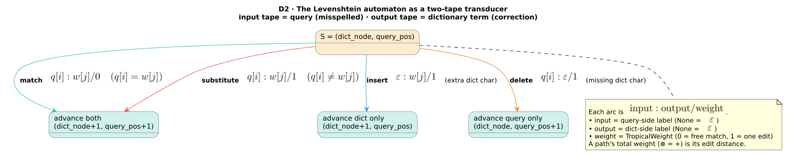
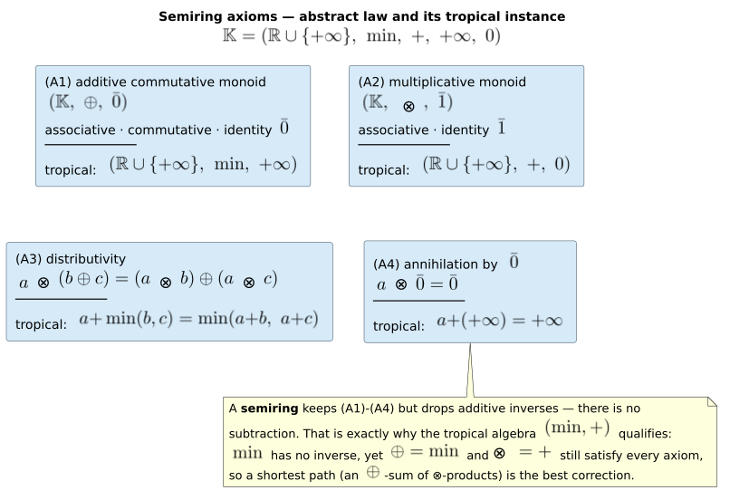
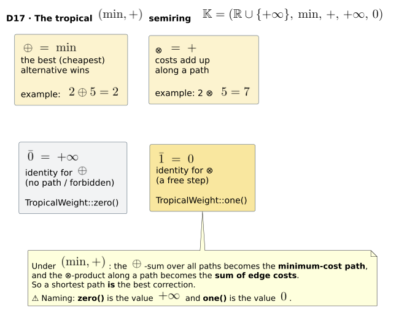

# 01 · Semirings and weighted finite-state transducers

> **Prerequisites:** none. **Defines:** finite automaton, finite-state transducer (FST), weighted
> finite-state transducer (WFST), the semiring $`\mathbb{K}`$, the path-weight functional
> $`T(x, y)`$, and the tropical $`(\min, +)`$ semiring $`\mathbb{T}`$.
> **Symbols** are the ones fixed once in the [master notation](README.md#master-notation); page-local
> scratch symbols are defined inline at first use.

`duallity` presents liblevenshtein's Levenshtein automata as [`lling_llang`](https://github.com/vinary-tree/lling-llang)
weighted finite-state transducers over the tropical semiring. Everything the later chapters do —
[composition](04-composition.md), [universal automata](05-universal-automata.md), the
[WallBreaker](06-wallbreaker-and-the-wall-effect.md) split — rests on the two algebraic objects
defined here: the **transducer** (a machine that relates two tapes) and the **semiring** (the algebra
of the weights it carries). This chapter builds both from first principles and proves that the weight
a transducer assigns to a tape pair is a single, well-defined number.

## 1. Intuition: from a yes/no machine to a cost-labelled relation

A **finite automaton** reads one string and answers a single yes/no question: *does this string
belong to the language?* For spelling correction that is too little information. We do not merely want
to know *whether* some dictionary word lies within edit distance $`k`$ of the query; we want to
know *which* word, and *how far* away it is, so we can rank candidates and return the best one.

A **finite-state transducer (FST)** removes the first limitation. Every transition carries **two**
labels — one for an **input tape** and one for an **output tape** — so the machine no longer accepts a
single string; it relates an input string to an output string. In `duallity` the input tape is the
**query** $`q`$ (the misspelled word) and the output tape is a **dictionary term** $`w`$
(a candidate correction). A path through the machine spells out an *alignment* of $`q`$ against
$`w`$.

A **weighted** FST (WFST) removes the second limitation. Each transition — and each accepting state —
additionally carries a **weight** drawn from a **semiring** $`\mathbb{K}`$. The weight records
*how good* a step is; for us it is the *cost* of an edit. Two questions then arise, and they demand
two different operations on weights:

- **Along one path:** how do we accumulate the cost of a whole alignment from the costs of its
  individual edits? This is the semiring's **times**, $`\otimes`$.
- **Across alternative paths:** the same pair $`(q, w)`$ may be alignable in several ways (delete
  here vs. substitute there); how do we combine those competing alignments into one score? This is the
  semiring's **plus**, $`\oplus`$.

The whole design of `duallity` follows from one choice of these two operations. In the **tropical
semiring**, $`\otimes`$ is ordinary addition (costs add up along a path) and $`\oplus`$ is
$`\min`$ (the cheapest alternative wins). Under that choice the score of a $`(q, w)`$ pair
is exactly the **minimum-cost alignment**, and finding the best correction becomes a **shortest-path
search**. The rest of this chapter makes each of these words precise and proves the claim.

## 2. Formal definitions

### 2.1 Finite automaton (the base case)

A **(nondeterministic) finite automaton** is a 5-tuple

```math
A \;=\; (Q,\ \Sigma,\ \delta,\ q_0,\ F),
```

where $`Q`$ is a finite **state set**, $`\Sigma`$ is the input **alphabet**
([master notation](README.md#master-notation)), $`\delta \subseteq Q \times (\Sigma \cup \{\varepsilon\}) \times Q`$
is the **transition relation** (with $`\varepsilon`$ the empty label), $`q_0 \in Q`$ is the
**start state**, and $`F \subseteq Q`$ is the set of **final (accepting) states**. Writing
$`\hat{\delta}(q_0, x)`$ for the set of states reachable from $`q_0`$ by reading the string
$`x`$, the automaton **accepts** the language

```math
L(A) \;=\; \bigl\{\, x \in \Sigma^{\ast} : \hat{\delta}(q_0, x) \cap F \neq \varnothing \,\bigr\},
```

where $`\Sigma^{\ast}`$ is the set of all finite strings over $`\Sigma`$ and
$`\varnothing`$ is the empty set. The automaton's answer is a single **bit**: $`x \in L(A)`$
(accept) or not (reject). Seen algebraically, this is already a *weighted* machine over the smallest
useful semiring — the **Boolean semiring** $`\mathbb{B} = (\{0, 1\},\ \vee,\ \wedge,\ 0,\ 1)`$,
in which a path's weight is $`1`$ iff every transition is enabled ($`\wedge`$) and a string
is accepted iff *some* path witnesses it ($`\vee`$). The two generalizations that follow — a
second tape, and a richer semiring — are what turn this bit into an alignment and a cost.

### 2.2 Finite-state transducer (two tapes)

A **finite-state transducer** adds an output tape. It is a 6-tuple

```math
\tau \;=\; (\Sigma_i,\ \Sigma_o,\ Q,\ I,\ F,\ \delta),
\qquad
\delta \;\subseteq\; Q \times (\Sigma_i \cup \{\varepsilon\}) \times (\Sigma_o \cup \{\varepsilon\}) \times Q,
```

where $`\Sigma_i`$ and $`\Sigma_o`$ are the **input** and **output** alphabets, $`Q`$
is the state set, $`I \subseteq Q`$ the set of **initial states**, $`F \subseteq Q`$ the
**final states**, and each transition $`(p,\ \text{in},\ \text{out},\ p') \in \delta`$ reads
$`\text{in} \in \Sigma_i \cup \{\varepsilon\}`$ on the input tape and writes
$`\text{out} \in \Sigma_o \cup \{\varepsilon\}`$ on the output tape while moving from state
$`p`$ to state $`p'`$. Instead of a language, an FST realizes a **relation**

```math
R(\tau) \;=\; \bigl\{\, (x, y) \in \Sigma_i^{\ast} \times \Sigma_o^{\ast} :
                \text{some accepting path reads } x \text{ and writes } y \,\bigr\}.
```

Because either label may be $`\varepsilon`$, one input symbol can map to zero, one, or several
output symbols and vice-versa — exactly the freedom an edit alignment needs (an insertion writes
without reading; a deletion reads without writing). Chapter [03](03-levenshtein-as-transducer.md) makes
the correspondence between the four edit operations and these $`\text{in} : \text{out}`$ labels
explicit.

### 2.3 Weighted finite-state transducer

A **weighted finite-state transducer** attaches a semiring weight to every transition and to every
final state. Following the [master notation](README.md#master-notation), it is the 6-tuple

```math
T \;=\; (\Sigma_i,\ \Sigma_o,\ Q,\ I,\ F,\ E),
\qquad
E \;\subseteq\; Q \times (\Sigma_i \cup \{\varepsilon\}) \times (\Sigma_o \cup \{\varepsilon\}) \times \mathbb{K} \times Q,
```

where $`E`$ is the **weighted transition relation** (an element of $`E`$ is written
$`\text{in} : \text{out} / w`$, an edge carrying weight $`w \in K`$) and $`\mathbb{K}`$
is a semiring, defined in §2.4. The final states additionally carry a **terminal-weight function**

```math
\rho : Q \to K, \qquad \rho(q) = \bar{0}\ \text{ for every non-final } q \notin F,
```

so $`\rho(q)`$ is the cost of *stopping* in state $`q`$ (and $`\bar{0}`$, the additive
identity introduced below, means "you may not stop here"). A **path**
$`\pi = e_1 e_2 \cdots e_L`$ is a sequence of edges $`e_j \in E`$ whose states chain up
(the target of $`e_j`$ is the source of $`e_{j+1}`$); it **reads**
$`x = \text{in}(e_1)\,\text{in}(e_2)\cdots`$ (concatenating input labels, $`\varepsilon`$
contributing nothing) and **writes** $`y = \text{out}(e_1)\,\text{out}(e_2)\cdots`$ on the two
tapes. Its **path weight** is the $`\otimes`$-product of its edge weights,

```math
w(\pi) \;=\; \bigotimes_{j=1}^{L} w(e_j),
```

and $`\rho(\pi)`$ abbreviates $`\rho`$ of the last state of $`\pi`$. A path is
**accepting** when it starts in an initial state ($`I`$) and ends in a final state ($`F`$).



### 2.4 The semiring $`\mathbb{K}`$

The weights live in a **semiring**
$`\mathbb{K} = (K,\ \oplus,\ \otimes,\ \bar{0},\ \bar{1})`$: a carrier set $`K`$ with two
binary operations, **plus** $`\oplus`$ (combining *alternative* paths) and **times**
$`\otimes`$ (combining weights *along* a path), and two distinguished constants, the additive
identity $`\bar{0}`$ and the multiplicative identity $`\bar{1}`$. It satisfies four axioms
[[1]](#references), [[3]](#references):

```math
\begin{aligned}
\textbf{(A1)}\ \ &(K,\ \oplus,\ \bar{0})\ \text{is a commutative monoid:}\\
&\quad (a \oplus b) \oplus c = a \oplus (b \oplus c), \qquad a \oplus b = b \oplus a, \qquad a \oplus \bar{0} = a;\\
\textbf{(A2)}\ \ &(K,\ \otimes,\ \bar{1})\ \text{is a monoid:}\\
&\quad (a \otimes b) \otimes c = a \otimes (b \otimes c), \qquad a \otimes \bar{1} = \bar{1} \otimes a = a;\\
\textbf{(A3)}\ \ &\otimes\ \text{distributes over}\ \oplus\ \text{on both sides:}\\
&\quad a \otimes (b \oplus c) = (a \otimes b) \oplus (a \otimes c), \qquad (a \oplus b) \otimes c = (a \otimes c) \oplus (b \otimes c);\\
\textbf{(A4)}\ \ &\bar{0}\ \text{annihilates}\ \otimes:\\
&\quad a \otimes \bar{0} = \bar{0} \otimes a = \bar{0}.
\end{aligned}
```

These are exactly the axioms enumerated in `lling_llang`'s `Semiring` trait doc-comment. The semantic
reading is fixed:

- $`\oplus`$ (**plus**) combines the weights of **parallel** paths — the different ways of
  relating the same $`(x, y)`$ pair. Its identity $`\bar{0}`$ means "no path."
- $`\otimes`$ (**times**) combines the weights of **sequential** transitions — accumulation along
  one path. Its identity $`\bar{1}`$ means "a free step" (it changes nothing).
- Axiom **(A4)** is what lets a WFST *ignore* forbidden edges: an edge of weight $`\bar{0}`$
  poisons its entire path (Theorem 1.1(c)), and a $`\bar{0}`$-weighted path is absorbed by the
  $`\oplus`$-identity, so it may simply be dropped.

> **Proposed diagram (integrator to render).** A four-panel *semiring-axioms panel* — one panel per
> axiom **(A1)**–**(A4)**, each showing the abstract law beside its tropical instantiation — would make
> this section far more legible. It is embedded below with its target path; the SVG source is authored
> centrally (see the status note accompanying this rewrite).



### 2.5 The path-weight functional $`T(x, y)`$

With $`\oplus`$ and $`\otimes`$ in hand, the weight a WFST $`T`$ assigns to an
input/output pair $`(x, y)`$ is defined uniformly over *any* semiring. Let

```math
P(x, y) \;=\; \bigl\{\, \pi : \pi \text{ is an accepting path that reads } x \text{ and writes } y \,\bigr\}
```

be the (page-local) set of accepting $`x \to y`$ paths. Then

```math
T(x, y) \;=\; \bigoplus_{\pi \,\in\, P(x, y)} w(\pi) \otimes \rho(\pi)
          \;=\; \bigoplus_{\pi : x \to y} \Bigl( \bigotimes_{e \in \pi} w(e) \Bigr) \otimes \rho(\pi).
```

In words: the weight along one path is the $`\otimes`$-product of its edge weights times its
terminal weight; the weight of the pair $`(x, y)`$ is the $`\oplus`$-sum of *all* accepting
paths carrying that pair. Section 5 proves this expression is a single well-defined element of
$`K`$, independent of the order in which the paths are summed and of the bracketing used inside
each path product.

> **On finiteness.** duallity's transducers are the product of a Levenshtein automaton with a finite
> dictionary; for a fixed $`(x, y)`$ the accepting-path set $`P(x, y)`$ is finite (indeed
> acyclic), so the $`\bigoplus`$ above is a literal finite sum and no convergence question
> arises. Constructions that introduce cycles (e.g. $`\varepsilon`$-closure) need the semiring's
> countable sums to converge; the tropical semiring with non-negative weights is *k-closed* with bound
> $`0`$ (recorded in `lling_llang` as `impl KClosedSemiring for TropicalWeight`), so those sums
> also stabilize. Closure is taken up in later chapters; here $`P(x, y)`$ is finite.

## 3. The tropical $`(\min, +)`$ semiring

`duallity` works exclusively in the **tropical semiring**, `lling_llang`'s `TropicalWeight`
([master notation](README.md#master-notation)):

```math
\mathbb{T} \;=\; \bigl(\mathbb{R} \cup \{+\infty\},\; \min,\; +,\; +\infty,\; 0\bigr),
\qquad a \oplus b = \min(a, b), \qquad a \otimes b = a + b,
\qquad \bar{0} = +\infty, \qquad \bar{1} = 0,
```

so $`\oplus = \min`$ (the cheapest alternative wins), $`\otimes = +`$ (costs add along a
path), the additive identity $`\bar{0}`$ is $`+\infty`$ ("no path"), and the multiplicative
identity $`\bar{1}`$ is $`0`$ ("a free step"). The carrier is $`\mathbb{R} \cup \{+\infty\}`$,
the reals extended with a single point at positive infinity; `lling_llang`'s constructor
`TropicalWeight::try_new` **rejects** $`\mathrm{NaN}`$ and $`-\infty`$, because neither
appears in the verified domain and both break the laws under IEEE-754 arithmetic. That verified domain
$`\mathbb{R} \cup \{+\infty\}`$ is exactly the carrier of the crate's machine-checked **Rocq**
model of the tropical semiring.



Substituting $`(\min, +)`$ into the functional of §2.5 collapses two abstract operations into one
familiar idea — a $`\otimes`$-product along a path becomes a **sum of edge costs**, and a
$`\oplus`$-sum over all paths becomes a **minimum**:

```math
T(x, y) \;=\; \min_{\pi \,:\, x \to y}\ \Bigl( \sum_{e \in \pi} w(e) \;+\; \rho(\pi) \Bigr).
```

**A shortest path is the best answer.** This single identity is why `duallity` can phrase fuzzy
matching, phonetic rewriting, and language-model rescoring as *one* problem: build a WFST whose path
weights are the quantity you want to minimize, then run a shortest-path search. Mohri, Pereira and
Riley [[2]](#references) established the tropical semiring as the standard weight structure for exactly
this reason. Proposition 1.2 discharges the collapse formally.

> ⚠️ **The `zero()` / `one()` gotcha (read this once).** `TropicalWeight::zero()` returns the value
> $`+\infty`$ and `TropicalWeight::one()` returns the value $`0`$. The method names denote
> the *algebraic role* ($`\bar{0}`$ = additive identity, $`\bar{1}`$ = multiplicative
> identity), **not** the number printed. When a duallity state source returns `TropicalWeight::zero()`
> for a non-accepting state it is saying "$`+\infty`$ — there is no accepting path here," **not**
> "cost zero." This is the single most common point of confusion; it is called out wherever it matters.

The tropical laws are easy to confirm, and duallity's integration test `test_tropical_weight_semantics`
asserts them directly (`tests/wfst_integration.rs`):

```rust,ignore
use lling_llang::prelude::*;

let w1 = TropicalWeight::new(1.0);
let w2 = TropicalWeight::new(2.0);

// Plus is min:   1 ⊕ 2 = min(1, 2) = 1
let sum = w1.plus(&w2);
assert_eq!(sum.value(), 1.0);

// Times is add:  1 ⊗ 2 = 1 + 2 = 3
let prod = w1.times(&w2);
assert_eq!(prod.value(), 3.0);

// Zero is +∞ (the additive identity 0̄ — "no path")
let zero = TropicalWeight::zero();
assert!(zero.is_infinite());

// One is 0.0 (the multiplicative identity 1̄ — "a free step")
let one = TropicalWeight::one();
assert_eq!(one.value(), 0.0);
```

## 4. What duallity implements — the `Wfst` trait surface

Every WFST in duallity implements `lling_llang`'s `Wfst<char, TropicalWeight>` trait (plus its lazy
extensions — see [architecture/02](../architecture/02-wfst-trait-surface.md)). The label type is
`char` (duallity works per Unicode scalar) and the weight type is `TropicalWeight`. The core surface is
small; the five required methods are all a shortest-path search needs, and the trait supplies the rest
as provided defaults:

```rust,ignore
pub trait Wfst<L, W: Semiring>: Clone + Send + Sync {
    /// The start state ID.
    fn start(&self) -> StateId;

    /// Whether a state is final (accepting).
    fn is_final(&self, state: StateId) -> bool;

    /// The final weight for a state (the semiring zero, 0̄ = +∞, for non-final states).
    fn final_weight(&self, state: StateId) -> W;

    /// The outgoing transitions from a state (an empty slice for invalid IDs).
    fn transitions(&self, state: StateId) -> &[WeightedTransition<L, W>];

    /// The number of states in the transducer.
    fn num_states(&self) -> usize;

    // Provided defaults, derived from the five above:
    //   fn is_valid_state(&self, state: StateId) -> bool     // state < num_states()
    //   fn num_transitions(&self, state: StateId) -> usize   // transitions(state).len()
    //   fn total_transitions(&self) -> usize                 // Σ over states
    //   fn is_empty(&self) -> bool                           // num_states() == 0
    //   fn state(&self, state: StateId) -> Option<WfstState<L, W>>
}
```

A `StateId` is a `u32` (compact storage for millions of states, $`\mathrm{StateId} \in [0, 2^{32})`$),
and an edge is a `WeightedTransition` whose two `Option<L>` labels realize the $`\text{in} : \text{out}`$
pair (with `None` standing for $`\varepsilon`$):

```rust,ignore
pub type StateId = u32;

pub struct WeightedTransition<L, W: Semiring> {
    pub from: StateId,      // source state
    pub input: Option<L>,   // input label  (None = ε)
    pub output: Option<L>,  // output label (None = ε)
    pub to: StateId,        // target state
    pub weight: W,          // edge weight, an element of the semiring K
}
```

Because the weight type is a tropical `Semiring`, the moment a Levenshtein automaton satisfies this
trait it becomes an algebraic object you can **compose** (chapter [04](04-composition.md)) and
**search**. The `Semiring` supertrait bound `W: Semiring` is precisely what lets the generic
shortest-path and composition algorithms treat `plus`/`times`/`zero`/`one` uniformly — the guarantees
proved in §5 are what make those generic algorithms correct.

## 5. Theorems and proofs

Throughout, $`\mathbb{K} = (K, \oplus, \otimes, \bar{0}, \bar{1})`$ is a semiring satisfying
**(A1)**–**(A4)**, and $`P(x, y)`$ is finite (§2.5). We first prove that $`T(x, y)`$ is
well-defined over *any* such semiring (Theorem 1.1), then that the tropical structure *is* such a
semiring (Lemma 1.3), and finally that substituting it collapses $`T`$ to a minimum cost
(Proposition 1.2).

### Theorem 1.1 (Well-definedness of $`T(x, y)`$)

**Statement.** For every input/output pair $`(x, y)`$ with finite accepting-path set
$`P(x, y)`$, the value

```math
T(x, y) \;=\; \bigoplus_{\pi \,\in\, P(x, y)} w(\pi) \otimes \rho(\pi),
\qquad w(\pi) = \bigotimes_{e \in \pi} w(e),
```

is a single, well-defined element of $`K`$. Specifically it is independent of **(a)** the order
in which the finite $`\oplus`$-sum over $`P(x, y)`$ is evaluated, **(b)** the bracketing
used to form each path product $`w(\pi)`$, and **(c)** the presence of edges of weight
$`\bar{0}`$ — a forbidden edge or non-final terminus contributes nothing and may be dropped.

**Proof.** We discharge (a), (b), (c) in turn.

**Part (a) — order- and bracket-independence of the $`\oplus`$-sum.** By **(A1)**,
$`(K, \oplus, \bar{0})`$ is a commutative monoid. We prove the standard *commutative-monoid
coherence* fact: for a finite family of terms, every fully-parenthesized, arbitrarily-ordered
$`\oplus`$-expression evaluates to the same element. Fix a reference enumeration
$`a_1, a_2, \ldots, a_N`$ of the $`N = \lvert P(x, y) \rvert`$ summands
$`a_\pi = w(\pi) \otimes \rho(\pi)`$, and define the **canonical value** as the right-nested fold

```math
C_N \;=\; a_1 \oplus \bigl( a_2 \oplus \bigl( \cdots \oplus a_N \bigr) \cdots \bigr).
```

We show by strong induction on $`N`$ that *every* $`\oplus`$-expression $`E`$ built
from the same multiset of summands equals $`C_N`$.

- **Base case $`N = 0`$.** The empty $`\oplus`$-sum is $`\bar{0}`$ by convention; it is
  the unique value, and $`C_0 = \bar{0}`$.
- **Base case $`N = 1`$.** The only expression is $`a_1`$ itself, and $`C_1 = a_1`$.
- **Inductive step ($`N \ge 2`$).** Assume the claim for every multiset of size $`< N`$.
  Any fully-parenthesized $`E`$ has an outermost operation splitting it as
  $`E = E_L \oplus E_R`$, where $`E_L`$ is an expression over a non-empty sub-multiset of
  size $`p \ge 1`$ and $`E_R`$ over the complementary sub-multiset of size
  $`q = N - p \ge 1`$. The reference-first summand $`a_1`$ lies in exactly one side; two
  cases.
  - **Case A: $`a_1`$ occurs in $`E_L`$.** Both $`E_L`$ and $`E_R`$ have fewer
    than $`N`$ summands, so by the inductive hypothesis each equals the canonical fold of its own
    multiset; in particular $`E_L = a_1 \oplus R_L`$, where $`R_L`$ is the canonical fold
    of $`E_L`$'s remaining $`p - 1`$ summands. Then, by associativity **(A1)**,

    ```math
    E \;=\; (a_1 \oplus R_L) \oplus E_R \;=\; a_1 \oplus (R_L \oplus E_R).
    ```

    Now $`R_L \oplus E_R`$ is an $`\oplus`$-expression over the $`N - 1`$ non-first
    summands, so by the inductive hypothesis it equals their canonical fold
    $`a_2 \oplus (\cdots \oplus a_N)`$. Hence $`E = a_1 \oplus (a_2 \oplus \cdots) = C_N`$.
  - **Case B: $`a_1`$ occurs in $`E_R`$.** Symmetrically, the inductive hypothesis gives
    $`E_R = a_1 \oplus R_R`$ with $`R_R`$ the canonical fold of $`E_R`$'s remaining
    summands. Then, using associativity, commutativity, and associativity again **(A1)**,

    ```math
    E \;=\; E_L \oplus (a_1 \oplus R_R)
      \;=\; (E_L \oplus a_1) \oplus R_R
      \;=\; (a_1 \oplus E_L) \oplus R_R
      \;=\; a_1 \oplus (E_L \oplus R_R).
    ```

    Again $`E_L \oplus R_R`$ ranges over the $`N - 1`$ non-first summands and equals their
    canonical fold by the inductive hypothesis, so $`E = a_1 \oplus (a_2 \oplus \cdots) = C_N`$.

  Both cases give $`E = C_N`$. Finally, $`C_N`$ is defined relative to a chosen reference
  enumeration; any two enumerations differ by a permutation, and the argument just given (applied with
  each enumeration as the reference) shows every expression — including each canonical fold — equals
  the other's $`C_N`$. Therefore all evaluations coincide. This closes the induction and
  proves (a).

**Part (b) — bracket-independence of each path product $`w(\pi)`$.** The edges of a path
$`\pi = e_1 e_2 \cdots e_L`$ occur in a **fixed order** (the path order), so we must show only
that the *bracketing* of $`w(e_1) \otimes \cdots \otimes w(e_L)`$ is immaterial — we must **not**
reorder factors, since a general semiring's $`\otimes`$ need not commute. This is the
*generalized associativity* (monoid coherence) theorem for $`(K, \otimes, \bar{1})`$, which is a
monoid by **(A2)**. Induct on $`L`$.

- **Base $`L = 0`$.** The empty $`\otimes`$-product is $`\bar{1}`$ by convention.
- **Base $`L = 1`$.** The product is the single factor $`w(e_1)`$.
- **Step ($`L \ge 2`$).** Any fully-parenthesized product of the *ordered* factors
  $`w(e_1), \ldots, w(e_{L})`$ splits at its outermost $`\otimes`$ into
  $`P_1 \otimes P_2`$, where $`P_1`$ brackets the first $`j`$ factors (in order) and
  $`P_2`$ the last $`L - j`$ (in order), $`1 \le j \le L - 1`$. By the inductive
  hypothesis, $`P_1`$ equals the left-nested product $`L_1 = (\cdots(w(e_1) \otimes w(e_2)) \otimes \cdots \otimes w(e_j))`$
  and $`P_2`$ equals $`L_2 = (\cdots(w(e_{j+1}) \otimes \cdots) \otimes w(e_{L}))`$.
  Repeated application of associativity **(A2)** re-brackets $`L_1 \otimes L_2`$ into the single
  left-nested product of *all* $`L`$ factors, which is independent of $`j`$. Because the
  factor order is preserved at every step, commutativity is never invoked. Hence $`w(\pi)`$ is
  well-defined for non-commutative and commutative semirings alike. This proves (b).

**Part (c) — $`\bar{0}`$ drops forbidden edges and paths.** Suppose some edge
$`e^{\ast} \in \pi`$ carries weight $`w(e^{\ast}) = \bar{0}`$ (a forbidden transition), or
$`\pi`$ ends in a non-final state so that $`\rho(\pi) = \bar{0}`$ (by the definition of
$`\rho`$). By part (b) we may bracket the path product so the $`\bar{0}`$ factor is
isolated:

```math
w(\pi) \otimes \rho(\pi) \;=\; P_{\text{left}} \otimes \bar{0} \otimes P_{\text{right}}.
```

The annihilation axiom **(A4)** gives $`P_{\text{left}} \otimes \bar{0} = \bar{0}`$, and applying
it once more, $`\bar{0} \otimes P_{\text{right}} = \bar{0}`$. Thus the whole path contributes
$`a_\pi = \bar{0}`$ to the outer $`\oplus`$-sum. But $`\bar{0}`$ is the
$`\oplus`$-identity **(A1)**, so for the partial sum $`s`$ of the remaining paths,
$`s \oplus \bar{0} = s`$. Hence forbidden paths leave $`T(x, y)`$ unchanged and may be
removed from $`P(x, y)`$ without altering its value. In particular a WFST need only enumerate
paths all of whose edges carry non-$`\bar{0}`$ weight and that terminate in a final state.

Combining (a), (b), (c): $`T(x, y)`$ is a single well-defined element of $`K`$, independent
of summation order, of intra-path bracketing, and unaffected by forbidden edges. $`\blacksquare`$

### Proposition 1.2 (Tropical collapse)

**Statement.** Substituting $`\oplus = \min`$, $`\otimes = +`$, $`\bar{0} = +\infty`$,
$`\bar{1} = 0`$ into the functional of Theorem 1.1 yields

```math
T(x, y) \;=\; \min_{\pi \,\in\, P(x, y)}\ \Bigl( \sum_{e \in \pi} w(e) \;+\; \rho(\pi) \Bigr),
```

the **minimum total cost** over all accepting paths reading $`x`$ and writing $`y`$, with
$`T(x, y) = +\infty`$ exactly when $`P(x, y) = \varnothing`$ (equivalently, when every path
is forbidden).

**Proof.** By Lemma 1.3 (proved next) the tropical structure $`\mathbb{T}`$ is a semiring
satisfying **(A1)**–**(A4)**, so Theorem 1.1 applies and $`T(x, y)`$ is a well-defined element of
$`\mathbb{R} \cup \{+\infty\}`$. Perform the substitution in three steps.

- **Step 1 — the path product becomes a sum.** For $`\pi = e_1 \cdots e_L`$, since
  $`\otimes = +`$,

  ```math
  w(\pi) \;=\; \bigotimes_{j=1}^{L} w(e_j) \;=\; w(e_1) + w(e_2) + \cdots + w(e_L) \;=\; \sum_{e \in \pi} w(e),
  ```

  and the bracketing is immaterial by Theorem 1.1(b) (real addition is associative). Multiplying by the
  terminal weight, $`w(\pi) \otimes \rho(\pi) = \sum_{e \in \pi} w(e) + \rho(\pi)`$.
- **Step 2 — the $`\oplus`$-sum becomes a minimum.** Since $`\oplus = \min`$,

  ```math
  T(x, y) \;=\; \bigoplus_{\pi} \bigl( w(\pi) \otimes \rho(\pi) \bigr)
           \;=\; \min_{\pi}\ \Bigl( \sum_{e \in \pi} w(e) + \rho(\pi) \Bigr),
  ```

  and the minimum is order-independent by Theorem 1.1(a) ($`\min`$ is associative and commutative
  — Lemma 1.3).
- **Step 3 — discharge the identities.**
  - $`\bar{1} = 0`$ (a free step). An edge of weight $`\bar{1} = 0`$ adds $`0`$ to the
    path sum: $`s + 0 = s`$. This is precisely the $`\otimes`$-identity
    $`s \otimes \bar{1} = s`$ instantiated as real addition of $`0`$, so a zero-cost
    identity or $`\varepsilon`$ step leaves the accumulated cost unchanged.
  - $`\bar{0} = +\infty`$ (no path / forbidden). A forbidden edge or non-final terminus
    contributes $`+\infty`$. In Step 1 the path sum becomes $`s + (+\infty) = +\infty`$
    (annihilation, Lemma 1.3), and in Step 2 the outer minimum satisfies
    $`\min(s', +\infty) = s'`$ for every real $`s'`$ (the value $`+\infty`$ is the
    $`\min`$-identity, Lemma 1.3), so the $`+\infty`$ term never lowers the minimum and is
    discarded — matching Theorem 1.1(c). If **every** path is forbidden, or $`P(x, y) = \varnothing`$,
    the minimum is taken over no finite value and equals the $`\oplus`$-identity
    $`\bar{0} = +\infty`$; thus $`T(x, y) = +\infty`$, i.e. "there is no accepting alignment
    of $`x`$ against $`y`$." Conversely, if some real-valued accepting path exists then
    $`T(x, y) < +\infty`$.

Therefore in the tropical semiring $`T(x, y)`$ is exactly the least-cost accepting-path weight,
with $`+\infty`$ signalling "no path." $`\blacksquare`$

### Lemma 1.3 (Tropical is a commutative idempotent semiring)

**Statement.** The structure $`\mathbb{T} = (\mathbb{R} \cup \{+\infty\},\ \min,\ +,\ +\infty,\ 0)`$
is a semiring satisfying **(A1)**–**(A4)**; moreover its $`\oplus = \min`$ is **idempotent**
($`a \oplus a = a`$) and its $`\otimes = +`$ is **commutative** ($`a \otimes b = b \otimes a`$).
We use the total order $`\le`$ on $`\mathbb{R} \cup \{+\infty\}`$ (every real is
$`\le +\infty`$) and the extended-arithmetic conventions

```math
a + (+\infty) = (+\infty) + a = +\infty, \qquad \min(a, +\infty) = \min(+\infty, a) = a \qquad (a \in \mathbb{R} \cup \{+\infty\}).
```

The domain deliberately excludes $`-\infty`$ and $`\mathrm{NaN}`$, matching
`lling_llang`'s `TropicalWeight::try_new` (which rejects both); with that restriction the extended
arithmetic above is **total**, and the laws below hold without exception.

**Proof.** Verify each axiom over $`K = \mathbb{R} \cup \{+\infty\}`$, then the two extra
properties. In every case we treat the finite sub-case and the $`+\infty`$ sub-cases explicitly.

- **(A1) $`(K, \min, +\infty)`$ is a commutative monoid.**
  - *Associativity:* $`\min(\min(a, b), c) = \min(a, b, c) = \min(a, \min(b, c))`$. The
    three-element minimum is the single $`\le`$-least of $`a, b, c`$, and both nestings
    select it. If some argument equals $`+\infty`$, it is $`\ge`$ every other argument and
    is selected only if *all* arguments are $`+\infty`$ (value $`+\infty`$); the two
    nestings agree in every sub-case.
  - *Commutativity:* $`\min(a, b) = \min(b, a)`$, since the least element of a two-element set
    does not depend on the order of presentation.
  - *Identity $`+\infty`$:* $`\min(a, +\infty) = a`$ for every $`a \in K`$, because
    $`a \le +\infty`$ always (with equality iff $`a = +\infty`$). Hence
    $`\bar{0} = +\infty`$ is the $`\oplus`$-identity.
- **(A2) $`(K, +, 0)`$ is a monoid.**
  - *Associativity:* $`(a + b) + c = a + (b + c)`$. For finite reals this is field associativity
    of $`+`$; if any operand is $`+\infty`$ then, by the convention
    $`x + (+\infty) = +\infty`$, both sides evaluate to $`+\infty`$. All sub-cases agree.
  - *Identity $`0`$:* $`a + 0 = 0 + a = a`$ for finite $`a`$ (additive identity of
    $`\mathbb{R}`$), and $`(+\infty) + 0 = +\infty`$ by convention. Hence
    $`\bar{1} = 0`$ is the $`\otimes`$-identity. ($`+`$ need not have inverses, and it
    does not for $`+\infty`$ — a monoid, not a group, is all **(A2)** requires.)
- **(A3) $`+`$ distributes over $`\min`$.** We show the left law
  $`a + \min(b, c) = \min(a + b,\ a + c)`$; the right law follows by commutativity of $`+`$
  (below).
  - *Finite case:* adding a fixed $`a \in \mathbb{R}`$ is a monotone bijection of $`\mathbb{R}`$:
    $`b \le c \iff a + b \le a + c`$, and monotone maps commute with $`\min`$. Concretely,
    without loss of generality assume $`b \le c`$; then $`\min(b, c) = b`$ and
    $`a + b \le a + c`$, so $`\min(a + b, a + c) = a + b = a + \min(b, c)`$. The
    complementary sub-case $`c \le b`$ is identical with $`b`$ and $`c`$ interchanged.
  - *Infinite cases:* if $`a = +\infty`$, the left side is
    $`+\infty + \min(b, c) = +\infty`$ and the right side is
    $`\min(+\infty, +\infty) = +\infty`$. If $`b = +\infty`$ with $`c`$ finite, the
    left side is $`a + \min(+\infty, c) = a + c`$ and the right side is
    $`\min(a + \infty,\ a + c) = \min(+\infty,\ a + c) = a + c`$; the sub-case $`c = +\infty`$
    is symmetric. If $`b = c = +\infty`$, both sides are $`+\infty`$. Every sub-case
    discharges.
- **(A4) $`\bar{0} = +\infty`$ annihilates $`+`$.** $`a + (+\infty) = (+\infty) + a = +\infty`$
  for all $`a \in K`$ by the extended-arithmetic convention, i.e.
  $`a \otimes \bar{0} = \bar{0} \otimes a = \bar{0}`$. This is precisely why a $`+\infty`$
  edge kills its path in Theorem 1.1(c) and Proposition 1.2.
- **Extra — commutativity of $`\otimes`$:** $`a + b = b + a`$ for finite reals (commutativity
  of $`\mathbb{R}`$), and $`x + (+\infty) = (+\infty) + x = +\infty`$ by convention. So
  $`\otimes`$ is commutative; $`\mathbb{T}`$ is a **commutative** semiring. (`lling_llang`
  records this as `impl CommutativeTimesSemiring for TropicalWeight`.)
- **Extra — idempotency of $`\oplus`$:** $`\min(a, a) = a`$ for all $`a \in K`$ (the
  least element of $`\{a\}`$ is $`a`$). So $`\oplus`$ is idempotent; $`\mathbb{T}`$
  is an **idempotent** semiring. (`lling_llang` records this as `impl IdempotentSemiring for TropicalWeight`.)

**Consequence (forward reference to composition, chapter [04](04-composition.md)).** Idempotency
$`a \oplus a = a`$ induces the *natural order* $`a \sqsubseteq b \iff a \oplus b = a`$,
which for $`\oplus = \min`$ is the usual $`\le`$ (smaller = better; `lling_llang`'s
`TropicalWeight::natural_less` returns `self < other`). An idempotent semiring whose $`\otimes`$
is monotone with respect to this order is exactly the setting in which **Dijkstra's** shortest-path
algorithm and best-first (A\*) search are correct: once a state's minimum cost is settled it never
needs revisiting, because no later path can improve on an already-minimal prefix. `duallity` relies on
this whenever it runs shortest-path search over a composed WFST; the correctness argument is completed
in chapter 04. This is why `duallity`'s weight structure is the tropical semiring specifically, and not
merely *some* semiring. $`\blacksquare`$

## 6. Worked example

**Atomic operations.** With $`a = 2`$ and $`b = 5`$,

```math
a \oplus b = \min(2, 5) = 2, \qquad a \otimes b = 2 + 5 = 7.
```

$`\oplus`$ keeps the cheaper of two alternatives; $`\otimes`$ accumulates cost along a path.
(`lling_llang`'s own module example uses $`2`$ and $`3`$: $`\min(2, 3) = 2`$,
$`2 + 3 = 5`$.)

**A single path.** Fix a pair $`(x, y)`$ and an accepting path $`\pi_1`$ with three edges: a
near-match substitution of cost $`0.1`$ (a small phonetic tie-break), an insertion of cost
$`1`$, and an exact match of cost $`0`$ (a free step, $`\bar{1} = 0`$). Assume the
terminal weight $`\rho(\pi_1) = 0`$ (stopping in an accepting state is free). Its weight is the
$`\otimes`$-product, i.e. the sum:

```math
w(\pi_1) \otimes \rho(\pi_1) \;=\; 0.1 + 1 + 0 + 0 \;=\; 1.1 .
```

The $`0`$-cost edge illustrates $`\bar{1}`$: it contributes nothing, exactly as the
$`\otimes`$-identity should.

**Choosing among alternatives.** Suppose the same $`(x, y)`$ also admits a second accepting path
$`\pi_2`$ (a different alignment — say two substitutions) of total weight $`2.0`$. Then, by
Proposition 1.2,

```math
T(x, y) \;=\; \min\bigl( w(\pi_1) \otimes \rho(\pi_1),\ w(\pi_2) \otimes \rho(\pi_2) \bigr)
         \;=\; \min(1.1,\ 2.0) \;=\; 1.1 .
```

The cheaper alignment wins, and $`T(x, y) = 1.1`$ is the edit cost duallity would report for
relating $`x`$ to $`y`$. Had *no* accepting path existed, the minimum would be over the
empty set and $`T(x, y) = \bar{0} = +\infty`$ — "these two strings do not align within the
machine," surfaced in code as `TropicalWeight::zero()` (whose `is_infinite()` is `true`).

## See also

- [02 · Edit distance and Levenshtein automata](02-edit-distance-and-levenshtein-automata.md) — the
  metric $`d_{\mathrm{lev}}`$ and the automaton that accepts $`L(q, k)`$.
- [03 · The Levenshtein automaton as a transducer](03-levenshtein-as-transducer.md) — how the four edit
  operations become $`\text{in} : \text{out} / w`$ edges.
- [04 · Composition](04-composition.md) — $`T_1 \circ T_2`$ and the Dijkstra-validity argument
  the tropical semiring's idempotency (Lemma 1.3) sets up.
- [architecture/02 · The WFST trait surface](../architecture/02-wfst-trait-surface.md) — the lazy
  extensions of the `Wfst` trait shown in §4.
- [architecture/03 · State encoding and the product space](../architecture/03-state-encoding-and-product-space.md)
  — how $`\mathrm{StateId}`$ packs $`(d, a)`$ product states.
- [Glossary](../references/glossary.md) and [bibliography](../references/bibliography.md).

## References

1. **Mohri, M.** (1997). *Finite-State Transducers in Language and Speech Processing.* Computational
   Linguistics 23(2), 269–311. [ACL Anthology J97-2003](https://aclanthology.org/J97-2003/) — the
   canonical treatment of WFSTs, the semiring axioms, and the path-weight functional $`T(x, y)`$.
2. **Mohri, M., Pereira, F., & Riley, M.** (2002). *Weighted Finite-State Transducers in Speech
   Recognition.* Computer Speech & Language 16(1), 69–88.
   [doi:10.1006/csla.2001.0184](https://doi.org/10.1006/csla.2001.0184) — establishes the tropical
   $`(\min, +)`$ semiring as the standard weight structure for shortest-path decoding.
3. **Droste, M., & Kuich, W.** (2009). *Semirings and Formal Power Series.* In *Handbook of Weighted
   Automata*, 3–28. Springer.
   [doi:10.1007/978-3-642-01492-5_1](https://doi.org/10.1007/978-3-642-01492-5_1) — the algebraic
   foundations, including well-definedness of finite sums over a commutative monoid (Theorem 1.1(a)).
4. **Droste, M., Kuich, W., & Vogler, H.** (Eds.) (2009). *Handbook of Weighted Automata.* EATCS
   Monographs in Theoretical Computer Science. Springer.
   [doi:10.1007/978-3-642-01492-5](https://doi.org/10.1007/978-3-642-01492-5) — the reference volume
   for weighted automata, semirings, and their algorithms.
