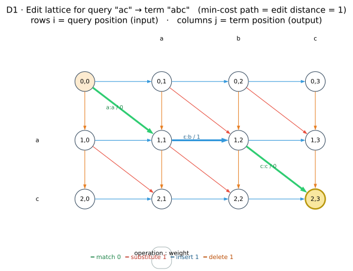
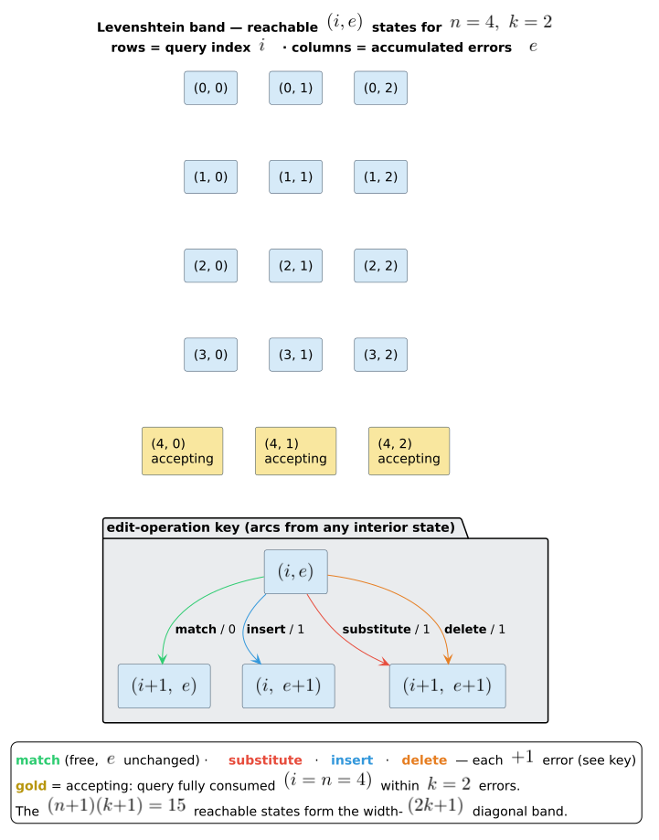

# 02 · Edit distance and Levenshtein automata

> **Prerequisites:** [01 · Semirings and WFSTs](01-semirings-and-wfsts.md).
> **Defines:** the Levenshtein distance $`d_{\mathrm{lev}}`$, the edit lattice $`\Delta`$,
> the Levenshtein automaton $`A(q, k)`$ and its language $`L(q, k)`$.
> **Symbols** are from the [master notation](README.md#master-notation); $`A(q, k)`$ is
> page-local and defined in [§5](#5-the-levenshtein-automaton-aq-k).

## 1. Intuition — from "how wrong is this word?" to a machine that answers it

A spell checker faces two questions at once. *How far* is a misspelled query $`q`$ from a
candidate correction $`w`$? And how can that question be answered against a whole dictionary
$`D`$ of millions of terms without paying for each term separately? This chapter answers both,
and shows they are the **same** question viewed from two angles.

- The **distance** angle. Give a numeric cost to turning $`q`$ into $`w`$ — one unit per
  single-character insertion, deletion, or substitution. The minimum such cost is the *Levenshtein
  distance* $`d_{\mathrm{lev}}(q, w)`$ (Levenshtein, 1966 [[1]](#references)). It is computed by
  filling a grid $`\Delta`$ — the **edit lattice** — whose cheapest corner-to-corner path costs
  exactly $`d_{\mathrm{lev}}(q, w)`$ (Wagner & Fischer, 1974 [[2]](#references)).

- The **automaton** angle. Freeze $`q`$ and a budget $`k`$, and build a finite machine
  $`A(q, k)`$ that accepts a term $`w`$ **iff** $`d_{\mathrm{lev}}(q, w) \le k`$.
  Run that machine *in lockstep* with a trie/DAWG traversal of $`D`$ and every term that shares
  a prefix shares the work of scoring that prefix, so the entire dictionary is filtered in one pass
  (Schulz & Mihov, 2002 [[3]](#references)).

The bridge between the two is a single mental picture: **walk a term $`w`$ through the edit
lattice while tracking a pair $`(i, e)`$** — how many query characters you have consumed
($`i`$) and how many edits you have spent ($`e`$). The reachable $`(i, e)`$ pairs
are the automaton's states; the lattice's diagonal band bounds how many there can be; and the tropical
$`(\min, +)`$ semiring of chapter [01](01-semirings-and-wfsts.md) turns "cheapest path" into
"edit distance". Everything below makes this precise and proves it in full.

## 2. Levenshtein distance, formally

We fix the alphabet $`\Sigma`$ (for duallity, Unicode scalar values). Throughout, $`q`$
is the query with $`n = \lvert q \rvert`$ and $`w`$ a term with $`m = \lvert w \rvert`$;
$`q[i]`$ is the $`i`$-th scalar (0-indexed) and $`q[a \mathbin{..} b]`$ the half-open
slice.

**Definition (alignment and Levenshtein distance).** An **alignment** (or **edit trace**) of
$`x`$ (length $`p`$) and $`y`$ (length $`r`$) is a finite sequence of
**columns** $`\gamma = (\gamma_1, \ldots, \gamma_t)`$, each column of exactly one shape:

- a **diagonal** column $`(x[a],\, y[b])`$ pairing one symbol of $`x`$ with one of
  $`y`$ — a **match** if $`x[a] = y[b]`$, otherwise a **substitution**;
- an **insert** column $`(\varepsilon,\, y[b])`$ — a gap on the $`x`$ side;
- a **delete** column $`(x[a],\, \varepsilon)`$ — a gap on the $`y`$ side;

subject to the constraint that reading the non-gap top entries left to right spells $`x`$ and
reading the non-gap bottom entries spells $`y`$ (so the used indices $`a`$ and $`b`$
each increase by one along the columns that touch them). Each insert, delete, or substitution column
denotes one unit edit operation and each match column a preserved symbol, so an alignment **is** an
edit script rewriting $`x`$ into $`y`$, displayed positionally. Its **cost**
$`\mathrm{cost}(\gamma)`$ is the number of non-match columns. The **Levenshtein distance** is the
minimum cost over all alignments:

```math
d_{\mathrm{lev}}(x, y) \;=\; \min_{\gamma}\, \mathrm{cost}(\gamma),
\qquad \gamma \text{ ranging over alignments of } x \text{ and } y .
```

The set of alignments of $`x`$ and $`y`$ is finite (every alignment has between
$`\max(p, r)`$ and $`p + r`$ columns), so the minimum is attained. This is exactly the
operational count of the [master notation](README.md#master-notation) — "the minimum number of
single-character insertions, deletions, and substitutions that turn one into the other" — the
identification of the two being the trace theorem of Wagner & Fischer [[2]](#references).

**Indicator convention.** $`\mathbf{1}[\varphi]`$ is $`1`$ when the proposition
$`\varphi`$ holds and $`0`$ otherwise; a substitution column $`(x[a], y[b])`$ thus
costs $`\mathbf{1}[x[a] \ne y[b]]`$ and a diagonal column in general costs
$`\mathbf{1}[x[a] \ne y[b]]`$ (zero for a match, one for a substitution).

A few distances, each with one optimal alignment:

| $`q`$ | $`w`$ | $`d_{\mathrm{lev}}(q, w)`$ | one optimal edit |
|:---:|:---:|:---:|---|
| `helo` | `hello` | $`1`$ | insert one `l` |
| `tset` | `test` | $`2`$ | two substitutions ($`1`$ under Damerau–Levenshtein: one transposition) |
| `kitten` | `sitting` | $`3`$ | substitute, substitute, insert (worked out in [§8](#8-worked-example-kitten--sitting)) |

**Damerau–Levenshtein.** Adding **adjacent transposition** (swapping two neighbouring symbols) as a
fourth unit-cost operation yields the Damerau–Levenshtein distance $`d_{\mathrm{DL}}`$, under
which $`d_{\mathrm{DL}}(\texttt{tset}, \texttt{test}) = 1`$. duallity exposes both metrics: the
`Algorithm` enum selects the operation set, and the parameterized state source reserves **disjoint
continuation-state ranges** over the very same $`(i, e)`$ lattice for the two-step operations
(transposition, merge, split). The formal development below is for standard Levenshtein — the three
edge types of the next section — and chapters [03](03-levenshtein-as-transducer.md) and
[05](05-universal-automata.md) extend it to the variants.

## 3. The edit lattice

Wagner & Fischer's dynamic program lays out a grid whose rows index positions in the query
$`q`$ ($`i = 0, \ldots, n`$) and whose columns index positions in the term $`w`$
($`j = 0, \ldots, m`$). A node $`(i, j)`$ means "$`i`$ query symbols and $`j`$
term symbols have been consumed", and we write

```math
\Delta[i, j] \;=\; d_{\mathrm{lev}}\bigl(q[0 \mathbin{..} i],\; w[0 \mathbin{..} j]\bigr)
```

for the edit distance between the two consumed prefixes. Three kinds of edge leave each node, and they
are exactly the three column shapes of an alignment, one column contributed per edge:

| Edge | Lattice step | Operation | Cost |
|------|-----------|-----------|:----:|
| diagonal | $`(i, j) \to (i{+}1, j{+}1)`$ | **match** if $`q[i] = w[j]`$, else **substitute** | $`0`$ / $`1`$ |
| horizontal | $`(i, j) \to (i, j{+}1)`$ | **insert** a term symbol ($`q`$ stays) | $`1`$ |
| vertical | $`(i, j) \to (i{+}1, j)`$ | **delete** a query symbol ($`w`$ stays) | $`1`$ |

A path from $`(0, 0)`$ to $`(n, m)`$ reads off an alignment of $`q`$ against
$`w`$: its diagonal, horizontal, and vertical edges are the diagonal, insert, and delete columns.
The path's total cost is the alignment's cost, so the **minimum-cost path from
$`(0, 0)`$ to $`(n, m)`$ has weight exactly $`d_{\mathrm{lev}}(q, w)`$**. Chapter
[03](03-levenshtein-as-transducer.md) makes this correspondence exact at the level of transducer
labels (input = query side, output = dictionary side); chapter [01](01-semirings-and-wfsts.md) is why
"minimum-cost path" is literally the tropical $`\bigoplus = \min`$ over path weights.



### Lemma 2.1 (Wagner–Fischer optimal substructure)

**Statement.** For all $`0 \le i \le n`$ and $`0 \le j \le m`$, the matrix $`\Delta`$
satisfies the boundary conditions

```math
\Delta[0, 0] = 0, \qquad \Delta[i, 0] = i, \qquad \Delta[0, j] = j,
```

and, for $`i, j \ge 1`$, the min-of-three recurrence

```math
\Delta[i, j] \;=\; \min
\begin{cases}
\Delta[i-1,\, j] + 1 & \text{(delete } q[i-1] \text{)}, \\[3pt]
\Delta[i,\, j-1] + 1 & \text{(insert } w[j-1] \text{)}, \\[3pt]
\Delta[i-1,\, j-1] + \mathbf{1}\bigl[\, q[i-1] \ne w[j-1] \,\bigr] & \text{(match / substitute)} .
\end{cases}
```

**Proof.** By strong induction on $`i + j`$.

*Base cases ($`i = 0`$ or $`j = 0`$).*

- $`\Delta[0, 0] = d_{\mathrm{lev}}(\varepsilon, \varepsilon)`$. The empty alignment (no columns)
  transforms $`\varepsilon`$ into $`\varepsilon`$ at cost $`0`$, and cost is always
  $`\ge 0`$, so the minimum is $`0`$.
- $`\Delta[i, 0] = d_{\mathrm{lev}}(q[0 \mathbin{..} i], \varepsilon)`$. An insert column needs a
  $`y`$-symbol and a diagonal column needs one too, but $`y = \varepsilon`$ supplies none;
  hence every column of every alignment is a delete column. To spell $`q[0 \mathbin{..} i]`$ on
  the top, there must be exactly $`i`$ delete columns, one per symbol, in order. This is the
  unique alignment and it costs $`i`$, so $`\Delta[i, 0] = i`$.
- $`\Delta[0, j] = j`$ is symmetric: only insert columns are available, exactly $`j`$ of
  them, cost $`j`$.

*Inductive step ($`i, j \ge 1`$).* Assume the statement for all prefix pairs with sum smaller
than $`i + j`$; in particular $`\Delta[i-1, j]`$, $`\Delta[i, j-1]`$, and
$`\Delta[i-1, j-1]`$ are the edit distances of their (smaller) prefix pairs. Abbreviate the three
candidate values

```math
A = \Delta[i-1, j] + 1, \qquad
B = \Delta[i, j-1] + 1, \qquad
C = \Delta[i-1, j-1] + s, \quad s = \mathbf{1}\bigl[\, q[i-1] \ne w[j-1] \,\bigr].
```

We show $`\Delta[i, j] = \min(A, B, C)`$ by two inequalities.

**Achievability** (the $`\le`$ direction). Each candidate is realized by extending an optimal
alignment of a smaller prefix pair with one column:

- take an optimal alignment of $`q[0 \mathbin{..} i-1]`$ and $`w[0 \mathbin{..} j]`$ (cost
  $`\Delta[i-1, j]`$) and append a delete column $`(q[i-1], \varepsilon)`$; this is an
  alignment of $`q[0 \mathbin{..} i]`$ and $`w[0 \mathbin{..} j]`$ of cost $`A`$, so
  $`\Delta[i, j] \le A`$;
- append an insert column $`(\varepsilon, w[j-1])`$ to an optimal alignment of
  $`q[0 \mathbin{..} i]`$ and $`w[0 \mathbin{..} j-1]`$; cost $`B`$, so
  $`\Delta[i, j] \le B`$;
- append a diagonal column $`(q[i-1], w[j-1])`$ (cost $`s`$) to an optimal alignment of
  $`q[0 \mathbin{..} i-1]`$ and $`w[0 \mathbin{..} j-1]`$; cost $`C`$, so
  $`\Delta[i, j] \le C`$.

Hence $`\Delta[i, j] \le \min(A, B, C)`$.

**Minimality** (the $`\ge`$ direction). Let $`\alpha`$ be an optimal alignment of
$`q[0 \mathbin{..} i]`$ and $`w[0 \mathbin{..} j]`$, so $`\mathrm{cost}(\alpha) = \Delta[i, j]`$. Since
$`i + j \ge 1`$, $`\alpha`$ has at least one column; inspect its **last** column
$`\gamma_t`$. Because the columns spell the prefixes in order, $`\gamma_t`$ consumes the
last symbol(s) available, and it is one of three shapes:

- **delete** $`(q[i-1], \varepsilon)`$: deleting $`\gamma_t`$ leaves an alignment of
  $`q[0 \mathbin{..} i-1]`$ and $`w[0 \mathbin{..} j]`$ (it consumed the query's last
  symbol and none of $`w`$) of cost $`\Delta[i, j] - 1`$. That cost is $`\ge`$ the
  minimum $`\Delta[i-1, j]`$, so $`\Delta[i, j] \ge \Delta[i-1, j] + 1 = A`$.
- **insert** $`(\varepsilon, w[j-1])`$: symmetrically $`\Delta[i, j] - 1 \ge \Delta[i, j-1]`$,
  so $`\Delta[i, j] \ge B`$.
- **diagonal** $`(q[i-1], w[j-1])`$: it costs $`s`$; removing it leaves an alignment of
  $`q[0 \mathbin{..} i-1]`$ and $`w[0 \mathbin{..} j-1]`$ of cost $`\Delta[i, j] - s`$,
  which is $`\ge \Delta[i-1, j-1]`$, so $`\Delta[i, j] \ge \Delta[i-1, j-1] + s = C`$.

In every case $`\Delta[i, j]`$ is at least one of $`A, B, C`$, hence at least their minimum:
$`\Delta[i, j] \ge \min(A, B, C)`$.

Combining the two inequalities gives $`\Delta[i, j] = \min(A, B, C)`$, which is the recurrence.
The base cases anchor the induction, and the step is discharged for every $`i, j \ge 1`$.
$`\blacksquare`$

### Worked matrix: q = "ac" versus w = "abc"

Filling $`\Delta`$ bottom-up by Lemma 2.1 for $`n = 2`$, $`m = 3`$ gives the
$`3 \times 4`$ matrix below; **bold** cells trace the unique cost-$`1`$ path
$`(0,0) \to (1,1) \to (1,2) \to (2,3)`$ (match `a`, insert `b`, match `c`):

| $`\Delta`$ | $`\varepsilon`$ | `a` | `b` | `c` |
|:---:|:---:|:---:|:---:|:---:|
| $`\varepsilon`$ | **0** | 1 | 2 | 3 |
| `a` | 1 | **0** | **1** | 2 |
| `c` | 2 | 1 | 1 | **1** |

The bottom-right corner $`\Delta[2, 3] = 1 = d_{\mathrm{lev}}(\texttt{"ac"}, \texttt{"abc"})`$.
Reading the bold path: $`\Delta[1,1] = 0`$ (free match of `a`), then $`\Delta[1,2] = 1`$ (a
$`+1`$ horizontal insert of `b`, query index held at $`i = 1`$), then
$`\Delta[2,3] = 1`$ (free diagonal match of `c`). This is the same query/term pair drawn in the
lattice diagram above.

## 4. The diagonal band and the compact radix

Not every cell of $`\Delta`$ is relevant when we only care whether the distance stays within a
budget $`k`$. The reachable cells collapse into a thin diagonal band, and that fact is what makes
the automaton — and duallity's state encoding — small.

### Corollary 2.2 (Band containment)

**Statement.** If $`d_{\mathrm{lev}}(q[0 \mathbin{..} i], w[0 \mathbin{..} j]) \le k`$, then
$`\lvert i - j \rvert \le k`$. Consequently every cell $`(i, j)`$ on a path of cost
$`\le k`$ lies in the band $`j \in [\,i - k,\ i + k\,]`$, so there are at most
$`(n + 1)(2k + 1)`$ reachable cells; and the compact $`(i, e)`$ encoding — query position
$`i`$ paired with accumulated cost $`e \in \{0, \ldots, k\}`$ — needs only
$`(n + 1)(k + 1)`$ states.

**Proof.** Fix any alignment $`\gamma`$ of $`x = q[0 \mathbin{..} i]`$ (length $`i`$)
and $`y = w[0 \mathbin{..} j]`$ (length $`j`$), and let $`\mathrm{del}`$,
$`\mathrm{ins}`$, $`\mathrm{sub}`$, and $`\mathrm{diag}_0`$ count its delete, insert,
substitution, and match columns. Delete and diagonal columns each consume one $`x`$-symbol and
insert columns none, so $`\mathrm{del} + \mathrm{sub} + \mathrm{diag}_0 = i`$; symmetrically
$`\mathrm{ins} + \mathrm{sub} + \mathrm{diag}_0 = j`$. Subtracting,
$`\mathrm{del} - \mathrm{ins} = i - j`$, whence by the triangle inequality

```math
\lvert i - j \rvert \;=\; \lvert \mathrm{del} - \mathrm{ins} \rvert
\;\le\; \mathrm{del} + \mathrm{ins}
\;\le\; \mathrm{del} + \mathrm{ins} + \mathrm{sub}
\;=\; \mathrm{cost}(\gamma) .
```

Taking $`\gamma`$ to be an optimal alignment gives
$`\lvert i - j \rvert \le d_{\mathrm{lev}}(x, y) \le k`$, proving the first claim.

For the counts: on any within-budget path each row $`i \in \{0, \ldots, n\}`$ admits only the
columns $`j \in [\,i - k,\ i + k\,] \cap [0, m]`$, at most $`2k + 1`$ of them, so at most
$`(n + 1)(2k + 1)`$ cells are reachable. In the $`(i, e)`$ encoding the free coordinate is
the accumulated cost $`e`$ instead of the column $`j`$ (the term position is carried
externally, by the dictionary node — see [§5](#5-the-levenshtein-automaton-aq-k)); because a reachable
state has $`e \le k`$, there are $`k + 1`$ cost values per query position and
$`(n + 1)(k + 1)`$ states in all. $`\blacksquare`$

### The two radices in code

duallity ships both bounds. The classical $`(\text{position}, \text{offset})`$ band count
$`(n{+}1)(2k{+}1)`$ is a conservative generic estimate; the parameterized adapter stores
$`(\text{query\_position}, \text{edit\_cost})`$ and therefore uses the exact, tighter radix
$`(n{+}1)(k{+}1)`$. Both are pure functions in `mod state_encoding`
(byte-accurate to `src/lib.rs`):

```rust,ignore
// src/lib.rs — mod state_encoding

/// Classical banded estimate: O((n+1)·(2k+1)) (position, offset) cells.
#[inline]
pub fn estimate_automaton_states(query_len: usize, max_distance: usize) -> u32 {
    let positions = query_len.saturating_add(1);
    let distances = max_distance.saturating_mul(2).saturating_add(1);
    saturating_nonzero_u32(positions.saturating_mul(distances))
}

/// Exact radix of the compact (query_position, edit_cost) encoding: (n+1)·(k+1).
#[inline]
pub fn bounded_levenshtein_states(query_len: usize, max_distance: usize) -> u32 {
    let positions = query_len.saturating_add(1);
    let costs = max_distance.saturating_add(1);
    saturating_nonzero_u32(positions.saturating_mul(costs))
}
```

Here `saturating_nonzero_u32(v) = u32::try_from(v.max(1)).unwrap_or(u32::MAX)` clamps the product into
a nonzero `u32` (an empty query still needs the single start state, and pathological lengths saturate
rather than overflow). The `LevenshteinStateCodec` takes `bounded_levenshtein_states` as its
`normal_automaton_states` and multiplies by $`1 + c`$ — where $`c`$ is the number of
enabled continuation-state classes (`continuation_state_kinds`: $`+1`$ for transposition,
$`+2`$ for merge/split) — to obtain the full radix

```math
M_{\mathrm{lev}} \;=\; (n{+}1)(k{+}1)\,(1 + c),
```

the [master-notation](README.md#state-encoding-the-product-automaton) standard-Levenshtein radix. Each
continuation class occupies a disjoint copy of the normal $`(i, e)`$ lattice, so the two-step
operations reuse the same geometry (`state_source_support.rs`).



## 5. The Levenshtein automaton A(q, k)

Computing $`\Delta`$ for one term is the grid of [§3](#3-the-edit-lattice). A dictionary has
millions of terms sharing prefixes, so we recast the row-by-row computation as a machine that reads a
term and reports whether it is within $`k`$.

**Definition (Levenshtein automaton, $`(i, e)`$ model).** For a query $`q`$ of length
$`n`$ and budget $`k`$, the **Levenshtein automaton** $`A(q, k)`$ is the
$`\varepsilon`$-NFA over the term alphabet $`\Sigma`$ whose

- **states** are the pairs $`(i, e)`$ with $`0 \le i \le n`$ (query symbols consumed) and
  $`0 \le e \le k`$ (accumulated edit cost) — precisely the $`(n{+}1)(k{+}1)`$ cells of
  Corollary 2.2;
- **start state** is $`(0, 0)`$;
- **transitions**, while a term head advances through $`w`$ (writing $`j`$ = symbols of
  $`w`$ read so far), are the four rows below, each guarded to keep $`e \le k`$.

| Operation | Reads term? | Guard | Effect on $`(i, e)`$ | Weight |
|-----------|:---:|-------|-----------|:---:|
| **match** | yes ($`w[j]`$) | $`i < n,\ q[i] = w[j]`$ | $`(i, e) \to (i{+}1, e)`$ | $`0`$ |
| **substitute** | yes ($`w[j]`$) | $`i < n,\ q[i] \ne w[j],\ e < k`$ | $`(i, e) \to (i{+}1, e{+}1)`$ | $`1`$ |
| **insert** | yes ($`w[j]`$) | $`e < k`$ | $`(i, e) \to (i, e{+}1)`$ | $`1`$ |
| **delete** | no ($`\varepsilon`$) | $`i < n,\ e < k`$ | $`(i, e) \to (i{+}1, e)`$, term head fixed | $`1`$ |

Writing a **configuration** as $`(j, (i, e))`$ — term head at $`j`$, automaton state
$`(i, e)`$ — the match/substitute/insert transitions advance $`j \to j{+}1`$ (they consume
$`w[j]`$) while delete is a term-$`\varepsilon`$ move that holds $`j`$ fixed and
advances $`i`$. The start configuration is $`(0, (0, 0))`$. In duallity's product with the
dictionary, $`j`$ **is** the dictionary node: the product state is $`(d, (i, e))`$ and the
term head walks the DAWG rather than a fixed string (chapters
[03](03-levenshtein-as-transducer.md), [architecture/03](../architecture/03-state-encoding-and-product-space.md)).

**Acceptance.** A configuration $`(j, (i, e))`$ is **accepting** exactly when the whole term has
been read and the query can be finished within budget by deleting its tail:

```math
\mathrm{accept}\bigl(j, (i, e)\bigr) \;\iff\; j = m \;\wedge\; e + \underbrace{(n - i)}_{\displaystyle \mathrm{rem}} \le k .
```

When it accepts, the **final weight** is $`\mathrm{rem} = n - i`$ — the cost of deleting the
$`n - i`$ unconsumed query symbols — so the total path weight is
$`e + \mathrm{rem}`$. (This is `normal_final_weight`: a final dictionary node,
`within_max_distance(e, rem, k)`, final weight $`\mathrm{rem}`$. Trailing deletes may equivalently
be spent as explicit $`\varepsilon`$-moves that drive $`i`$ to $`n`$; the folded
$`+\,\mathrm{rem}`$ form is the one the code evaluates. Chapter
[03](03-levenshtein-as-transducer.md) states the same test at the label level, carrying $`e`$ on
the path instead of in the state.)

The automaton **accepts** $`w`$ iff some accepting configuration is reachable from
$`(0, (0, 0))`$ by a run that reads all of $`w`$. Its language is

```math
L(q, k) \;=\; \bigl\{\, w \in \Sigma^{\ast} : A(q, k) \text{ accepts } w \,\bigr\} .
```

Section [6](#6-correctness-of-aq-k-soundness-and-completeness) proves
$`L(q, k) = \{\, w : d_{\mathrm{lev}}(q, w) \le k \,\}`$ and that the minimum accepting weight is
$`d_{\mathrm{lev}}(q, w)`$ itself.

**Small run: $`q = \texttt{"ac"}`$, $`w = \texttt{"abc"}`$** ($`n = 2`$,
$`m = 3`$), the same pair as the worked matrix:

| # | operation | consumes | configuration $`(j, (i, e))`$ |
|:---:|---|:---:|:---:|
| — | start | — | $`(0, (0, 0))`$ |
| 1 | match `a` | $`q[0], w[0]`$ | $`(1, (1, 0))`$ |
| 2 | insert `b` | $`w[1]`$ | $`(2, (1, 1))`$ |
| 3 | match `c` | $`q[1], w[2]`$ | $`(3, (2, 1))`$ |

At the end $`j = 3 = m`$ (final node), $`\mathrm{rem} = n - i = 0`$, and
$`e + \mathrm{rem} = 1 \le k`$ for any $`k \ge 1`$: $`w`$ is accepted with weight
$`1 = d_{\mathrm{lev}}(q, w)`$, matching $`\Delta[2, 3]`$.

## 6. Correctness of A(q, k) (soundness and completeness)

We prove that the automaton computes exactly $`L(q, k)`$ — and, tropically, the distance — via
two invariants tying **runs** to **alignments**. Fix $`q`$ (length $`n`$), $`k`$, and
a term $`w`$ (length $`m`$).

### Lemma 2.3a (reachability ⇒ alignment)

**Statement.** If the configuration $`(j, (i, e))`$ is reachable from $`(0, (0, 0))`$ by a
run of $`A(q, k)`$ on $`w`$, then there is an alignment of $`q[0 \mathbin{..} i]`$ and
$`w[0 \mathbin{..} j]`$ of cost exactly $`e`$; in particular
$`d_{\mathrm{lev}}(q[0 \mathbin{..} i], w[0 \mathbin{..} j]) \le e \le k`$.

**Proof.** By induction on the number $`t`$ of transitions in the run.

*Base ($`t = 0`$).* The only configuration reachable in zero transitions is $`(0, (0, 0))`$.
The empty alignment of $`\varepsilon`$ and $`\varepsilon`$ has cost $`0 = e`$, and
$`e = 0 \le k`$.

*Step.* Suppose the run reaches $`(j', (i', e'))`$ in $`t`$ transitions — by the induction
hypothesis with a witnessing alignment $`\alpha'`$ of $`q[0 \mathbin{..} i']`$ and
$`w[0 \mathbin{..} j']`$ of cost $`e' \le k`$ — and then takes one more transition to
$`(j, (i, e))`$. Extend $`\alpha'`$ by one column according to the transition (its guard,
which held because the transition fired, is noted):

- **match** ($`i = i'{+}1,\ j = j'{+}1,\ e = e'`$; guard $`q[i'] = w[j']`$): append the
  diagonal column $`(q[i'], w[j'])`$ (a match, cost $`0`$). New cost $`e' = e`$.
- **substitute** ($`i = i'{+}1,\ j = j'{+}1,\ e = e'{+}1`$; guard $`q[i'] \ne w[j'],\ e' < k`$):
  append the diagonal column $`(q[i'], w[j'])`$ (a substitution, cost $`1`$). New cost
  $`e'{+}1 = e`$, and $`e = e'{+}1 \le k`$ because $`e' < k`$.
- **insert** ($`i = i',\ j = j'{+}1,\ e = e'{+}1`$; guard $`e' < k`$): append the insert
  column $`(\varepsilon, w[j'])`$ (cost $`1`$). New cost $`e'{+}1 = e \le k`$.
- **delete** ($`i = i'{+}1,\ j = j',\ e = e'{+}1`$; guard $`i' < n,\ e' < k`$): append the
  delete column $`(q[i'], \varepsilon)`$ (cost $`1`$). New cost $`e'{+}1 = e \le k`$.

In each case the extended alignment covers $`q[0 \mathbin{..} i]`$ and $`w[0 \mathbin{..} j]`$
and has cost exactly $`e`$, and the pruning guard forces $`e \le k`$. Existence of a
cost-$`e`$ alignment gives $`d_{\mathrm{lev}} \le e`$. $`\blacksquare`$

### Lemma 2.3b (alignment ⇒ reachability)

**Statement.** For all $`0 \le i \le n`$ and $`0 \le j \le m`$: if there is an alignment of
$`q[0 \mathbin{..} i]`$ and $`w[0 \mathbin{..} j]`$ of cost $`c \le k`$, then the
configuration $`(j, (i, c))`$ is reachable by a run of $`A(q, k)`$ on $`w`$ — and no
guard blocks that run.

**Proof.** By strong induction on $`i + j`$.

*Base ($`i + j = 0`$).* Then $`i = j = 0`$ and the only alignment of
$`\varepsilon, \varepsilon`$ is empty, cost $`c = 0`$. The target $`(0, (0, 0))`$ is
the start configuration, reachable in zero transitions.

*Step ($`i + j \ge 1`$).* Let $`\alpha`$ be an alignment of $`q[0 \mathbin{..} i]`$
and $`w[0 \mathbin{..} j]`$ of cost $`c \le k`$. It has at least one column; case-split on
its **last** column $`\gamma_t`$. In each case, deleting $`\gamma_t`$ yields an alignment
of a strictly smaller prefix pair to which the induction hypothesis applies, and one automaton
transition re-adds it. The key observation — **the guard never blocks** — is that whenever the
re-added transition costs $`+1`$, the predecessor cost is $`c - 1`$, and
$`c \le k`$ forces $`c - 1 \le k - 1 < k`$, satisfying the $`e < k`$ guard.

- **delete** $`(q[i-1], \varepsilon)`$ (so $`i \ge 1`$): removing it gives an alignment
  $`\alpha'`$ of $`q[0 \mathbin{..} i-1]`$ and $`w[0 \mathbin{..} j]`$ of cost
  $`c' = c - 1`$. Since $`(i-1) + j < i + j`$, by the hypothesis $`(j, (i{-}1, c'))`$
  is reachable. The delete transition needs $`i - 1 < n`$ (true, as $`i \le n`$ and
  $`q[i-1]`$ exists) and $`c' < k`$ (true, as $`c' = c - 1 \le k - 1`$); it moves
  $`(j, (i{-}1, c')) \to (j, (i, c'{+}1)) = (j, (i, c))`$.
- **insert** $`(\varepsilon, w[j-1])`$ (so $`j \ge 1`$): removing it gives $`\alpha'`$
  of $`q[0 \mathbin{..} i]`$ and $`w[0 \mathbin{..} j-1]`$, cost $`c' = c - 1`$. By the
  hypothesis ($`i + (j-1) < i + j`$) $`(j{-}1, (i, c'))`$ is reachable. The insert
  transition needs $`j - 1 < m`$ (true) and $`c' < k`$ (true); it moves
  $`(j{-}1, (i, c')) \to (j, (i, c'{+}1)) = (j, (i, c))`$.
- **diagonal** $`(q[i-1], w[j-1])`$ (so $`i, j \ge 1`$) with cost
  $`s = \mathbf{1}[q[i-1] \ne w[j-1]]`$: removing it gives $`\alpha'`$ of
  $`q[0 \mathbin{..} i-1]`$ and $`w[0 \mathbin{..} j-1]`$, cost $`c' = c - s`$. By the
  hypothesis ($`(i-1) + (j-1) < i + j`$) $`(j{-}1, (i{-}1, c'))`$ is reachable.
  - If $`s = 0`$ (match, $`q[i-1] = w[j-1]`$): the match transition (guards
    $`i-1 < n`$, $`j-1 < m`$, equal symbols — all hold) moves
    $`(j{-}1, (i{-}1, c')) \to (j, (i, c'))`$ with $`c' = c`$.
  - If $`s = 1`$ (substitute): the substitute transition additionally needs $`c' < k`$,
    true since $`c' = c - 1 \le k - 1`$; it moves
    $`(j{-}1, (i{-}1, c')) \to (j, (i, c'{+}1)) = (j, (i, c))`$.

In every case $`(j, (i, c))`$ is reachable with all guards satisfied, closing the induction.
$`\blacksquare`$

### Theorem 2.3 (Automaton correctness)

**Statement.** For every term $`w \in \Sigma^{\ast}`$,

```math
A(q, k) \text{ accepts } w \quad\Longleftrightarrow\quad d_{\mathrm{lev}}(q, w) \le k,
\qquad\text{i.e.}\qquad
L(q, k) = \bigl\{\, w : d_{\mathrm{lev}}(q, w) \le k \,\bigr\},
```

and the minimum total weight over accepting configurations for $`w`$ equals
$`d_{\mathrm{lev}}(q, w)`$ whenever that is $`\le k`$ (and no accepting configuration exists
otherwise). Thus the tropical $`\bigoplus = \min`$ over accepting paths reports the edit distance,
capped at $`k`$.

**Proof.**

*Soundness (accept $`\Rightarrow`$ within $`k`$).* Suppose an accepting configuration
$`(m, (i, e))`$ is reachable, so $`e + (n - i) \le k`$. By **Lemma 2.3a** there is an
alignment $`\beta`$ of $`q[0 \mathbin{..} i]`$ and $`w[0 \mathbin{..} m] = w`$ of cost
$`e`$. Append $`n - i`$ delete columns for the remaining query symbols
$`q[i], q[i+1], \ldots, q[n-1]`$; the result is an alignment of $`q`$ and $`w`$ of
cost $`e + (n - i)`$. Hence

```math
d_{\mathrm{lev}}(q, w) \;\le\; e + (n - i) \;\le\; k .
```

*Completeness (within $`k`$ $`\Rightarrow`$ accept at the exact cost).* Suppose
$`d \coloneqq d_{\mathrm{lev}}(q, w) \le k`$ and let $`\alpha`$ be an optimal alignment of
$`q`$ and $`w`$ (cost $`d`$). Look at $`\alpha`$ **after its last column that
consumes a term symbol** (its last non-delete column); every column past that point consumes a query
symbol but no term symbol, hence is a delete column. Let there be $`r \ge 0`$ such trailing
delete columns, consuming $`q[i], \ldots, q[n-1]`$, so $`r = n - i`$ where $`i`$ is
the number of query symbols consumed by the prefix $`\alpha_{\mathrm{pre}}`$ of $`\alpha`$
up to and including that last term-consuming column. (If $`w = \varepsilon`$, take
$`\alpha_{\mathrm{pre}}`$ empty, $`i = 0`$.) Then $`\alpha_{\mathrm{pre}}`$ aligns
$`q[0 \mathbin{..} i]`$ with $`w[0 \mathbin{..} m] = w`$, and since the $`r`$ trailing
columns are all deletes (cost $`1`$ each) its cost is
$`e \coloneqq d - r`$.

Because $`e = d - r \le d \le k`$, **Lemma 2.3b** applied to the pair
$`(i,\ j = m)`$ makes the configuration $`(m, (i, e))`$ reachable. Its acceptance test
holds,

```math
e + (n - i) \;=\; (d - r) + r \;=\; d \;\le\; k,
```

so $`(m, (i, e))`$ is accepting with total weight $`e + (n - i) = d`$. Therefore
$`A(q, k)`$ accepts $`w`$ at total weight exactly $`d`$.

*Weight.* By soundness every accepting configuration witnesses an alignment of $`q`$ and
$`w`$ of cost equal to its total weight, so its weight is $`\ge d_{\mathrm{lev}}(q, w)`$; by
completeness one accepting configuration attains $`d_{\mathrm{lev}}(q, w)`$ exactly. Hence the
$`\min`$ (the tropical $`\bigoplus`$) over accepting configurations is
$`d_{\mathrm{lev}}(q, w)`$ when $`\le k`$, and there is no accepting configuration when
$`d_{\mathrm{lev}}(q, w) > k`$ (soundness would otherwise force $`\le k`$). The two
directions together give $`L(q, k) = \{\, w : d_{\mathrm{lev}}(q, w) \le k \,\}`$.
$`\blacksquare`$

This is precisely the promise duallity relies on: as a `Wfst<char, TropicalWeight>` the Levenshtein
automaton does not merely list the neighborhood $`L(q, k)`$ — for each accepted term it reports
$`d_{\mathrm{lev}}(q, w)`$ as the shortest-path weight, ready to compose with downstream
transducers (chapter [04](04-composition.md)).

## 7. Complexity

### Theorem 2.4 (Membership and one-pass filtering)

**Statement.** Deciding $`w \in L(q, k)`$ — and, when it holds, computing
$`d_{\mathrm{lev}}(q, w)`$ — by running $`A(q, k)`$ on $`w`$ takes
$`\mathcal{O}(\lvert w \rvert \cdot k)`$ time and $`\mathcal{O}(k)`$ working space. Walking $`A(q, k)`$ in
lockstep with a dictionary DAWG filters the entire dictionary $`D`$ in a single traversal, at
cost proportional to the number of DAWG edges the band keeps alive rather than to
$`\sum_{w \in D} \lvert w \rvert`$.

**Proof.** *Single term.* Advance the term head $`j`$ from $`0`$ to $`m = \lvert w \rvert`$.
At each $`j`$ maintain the **live frontier** $`\{\, (i, e) : (j, (i, e)) \text{ reachable} \,\}`$,
keeping for each query index $`i`$ the least cost $`e`$ (larger costs at the same
$`i`$ can only produce dominated successors). By Corollary 2.2 a live $`(i, e)`$ has
$`\lvert i - j \rvert \le e \le k`$, so the frontier holds at most $`2k + 1`$ entries.
Moving from $`j`$ to $`j + 1`$ reads $`w[j]`$ and, for each frontier entry, evaluates
its $`\mathcal{O}(1)`$ match/substitute/insert successors; the delete $`\varepsilon`$-moves form
chains that advance $`i`$ within the same $`j`$, at most $`k - e`$ steps before the
budget is spent, and are absorbed into the $`\mathcal{O}(k)`$ frontier bound. Thus each term position costs
$`\mathcal{O}(k)`$, and the whole term $`\mathcal{O}(m \cdot k) = \mathcal{O}(\lvert w \rvert \cdot k)`$ time with two
$`\mathcal{O}(k)`$ frontiers of working space. This is the diagonal-band (cutoff) dynamic program of Ukkonen
(1985) [[4]](#references), whose $`\mathcal{O}(k \cdot \min(m, n))`$ thresholded cost this reproduces; Myers
(1999) [[5]](#references) sharpens the per-column work to $`\mathcal{O}(\lceil m / \omega \rceil)`$ on a
machine word of $`\omega`$ bits by packing the band into bit-vectors.

*Whole dictionary.* The automaton has a fixed start $`(\text{root}, (0, 0))`$. A traversal of the
DAWG visits each of its edges once; visiting an edge $`(\text{node} \xrightarrow{c} \text{child})`$
advances the frontier by the term symbol $`c`$ (its match/substitute/insert successors, plus the
delete $`\varepsilon`$-moves). Because a DAWG merges shared prefixes (and suffixes), an edge
common to many terms is scored **once**, and its frontier computed once; so the total work is
$`\mathcal{O}(\lvert E_{\text{alive}} \rvert \cdot k)`$, where $`E_{\text{alive}}`$ are the DAWG edges
reached with a non-empty frontier — far fewer than $`\sum_{w \in D} \lvert w \rvert`$ term-by-term
characters. This is the lockstep insight of Schulz & Mihov [[3]](#references), and it is exactly what
duallity's lazy `StateSource` realizes: `compute_normal_transitions` iterates a node's edges only when a
child-consuming edit is legal, prunes any successor whose cost would exceed $`k`$ (the
`next_cost <= max_distance` and `e < k` guards — the operational form of Corollary 2.2), and
`register_dictionary_node_for_targets` registers a child DAWG node only when at least one encodable
target state survives, so dead branches are never expanded. $`\blacksquare`$

## 8. Worked example: kitten → sitting

Take $`q = \texttt{"kitten"}`$ ($`n = 6`$) and $`w = \texttt{"sitting"}`$
($`m = 7`$). The full $`7 \times 8`$ matrix $`\Delta`$, computed by Lemma 2.1, is:

| $`\Delta`$ | $`\varepsilon`$ | `s` | `i` | `t` | `t` | `i` | `n` | `g` |
|:---:|:---:|:---:|:---:|:---:|:---:|:---:|:---:|:---:|
| $`\varepsilon`$ | **0** | 1 | 2 | 3 | 4 | 5 | 6 | 7 |
| `k` | 1 | **1** | 2 | 3 | 4 | 5 | 6 | 7 |
| `i` | 2 | 2 | **1** | 2 | 3 | 4 | 5 | 6 |
| `t` | 3 | 3 | 2 | **1** | 2 | 3 | 4 | 5 |
| `t` | 4 | 4 | 3 | 2 | **1** | 2 | 3 | 4 |
| `e` | 5 | 5 | 4 | 3 | 2 | **2** | 3 | 4 |
| `n` | 6 | 6 | 5 | 4 | 3 | 3 | **2** | **3** |

The corner $`\Delta[6, 7] = 3 = d_{\mathrm{lev}}(\texttt{kitten}, \texttt{sitting})`$. The **bold**
cells trace one optimal path
$`(0,0) \to (1,1) \to (2,2) \to (3,3) \to (4,4) \to (5,5) \to (6,6) \to (6,7)`$, whose alignment is:

| step | 1 | 2 | 3 | 4 | 5 | 6 | 7 |
|---|:---:|:---:|:---:|:---:|:---:|:---:|:---:|
| query $`q`$ | k | i | t | t | e | n | — |
| term $`w`$ | s | i | t | t | i | n | g |
| operation | substitute | match | match | match | substitute | match | insert |
| cost | 1 | 0 | 0 | 0 | 1 | 0 | 1 |

Total $`= 3`$. The same optimal witness as an $`A(q, k)`$ run (configurations
$`(j, (i, e))`$), for any budget $`k \ge 3`$:

| # | operation | consumes | configuration $`(j, (i, e))`$ |
|:---:|---|:---:|:---:|
| — | start | — | $`(0, (0, 0))`$ |
| 1 | substitute $`\texttt{k} \to \texttt{s}`$ | $`q[0], w[0]`$ | $`(1, (1, 1))`$ |
| 2 | match `i` | $`q[1], w[1]`$ | $`(2, (2, 1))`$ |
| 3 | match `t` | $`q[2], w[2]`$ | $`(3, (3, 1))`$ |
| 4 | match `t` | $`q[3], w[3]`$ | $`(4, (4, 1))`$ |
| 5 | substitute $`\texttt{e} \to \texttt{i}`$ | $`q[4], w[4]`$ | $`(5, (5, 2))`$ |
| 6 | match `n` | $`q[5], w[5]`$ | $`(6, (6, 2))`$ |
| 7 | insert `g` | $`w[6]`$ | $`(7, (6, 3))`$ |

At the end $`j = 7 = m`$ (a final dictionary node), $`\mathrm{rem} = n - i = 6 - 6 = 0`$, and
$`e + \mathrm{rem} = 3 \le k`$: accepted with weight $`3 = d_{\mathrm{lev}}(q, w) = \Delta[6, 7]`$.
For $`k = 2`$ no accepting configuration exists — every run reaching a final node has
$`e + \mathrm{rem} \ge 3 > 2`$ — so $`\texttt{sitting} \notin L(\texttt{kitten}, 2)`$, exactly
as Theorem 2.3 requires.

## 9. See also

- [01 · Semirings and WFSTs](01-semirings-and-wfsts.md) — why "cheapest path" is the tropical
  $`\bigoplus`$, and the `Wfst<char, TropicalWeight>` surface $`A(q, k)`$ implements.
- [03 · The Levenshtein automaton as a transducer](03-levenshtein-as-transducer.md) — the four edit
  operations as labelled, weighted arcs (input = query, output = dictionary), and the transposition
  split.
- [05 · Universal automata](05-universal-automata.md) — the query-agnostic construction and
  characteristic vectors that reuse the band across queries.
- [06 · WallBreaker and the wall effect](06-wallbreaker-and-the-wall-effect.md) — what happens to the
  $`(2k{+}1)`$-band count as $`k`$ grows.
- [architecture/03 · State encoding and the product space](../architecture/03-state-encoding-and-product-space.md)
  — how $`(d, (i, e))`$ packs into one `StateId` via the radix $`M_{\mathrm{lev}}`$.
- [design/levenshtein-wfst](../design/levenshtein-wfst.md) — the `LevenshteinStateSource` that realizes
  this chapter.

## References

1. Levenshtein, V. I. (1966). *Binary codes capable of correcting deletions, insertions, and
   reversals.* Soviet Physics Doklady 10(8), 707–710.
2. Wagner, R. A., & Fischer, M. J. (1974). *The String-to-String Correction Problem.* Journal of the
   ACM 21(1), 168–173. [doi:10.1145/321796.321811](https://doi.org/10.1145/321796.321811).
3. Schulz, K. U., & Mihov, S. (2002). *Fast String Correction with Levenshtein Automata.*
   International Journal on Document Analysis and Recognition (IJDAR) 5(1), 67–85.
   [doi:10.1007/s10032-002-0082-8](https://doi.org/10.1007/s10032-002-0082-8).
4. Ukkonen, E. (1985). *Algorithms for approximate string matching.* Information and Control 64(1–3),
   100–118. [doi:10.1016/S0019-9958(85)80046-2](https://doi.org/10.1016/S0019-9958(85)80046-2).
5. Myers, G. (1999). *A fast bit-vector algorithm for approximate string matching based on dynamic
   programming.* Journal of the ACM 46(3), 395–415.
   [doi:10.1145/316542.316550](https://doi.org/10.1145/316542.316550).
