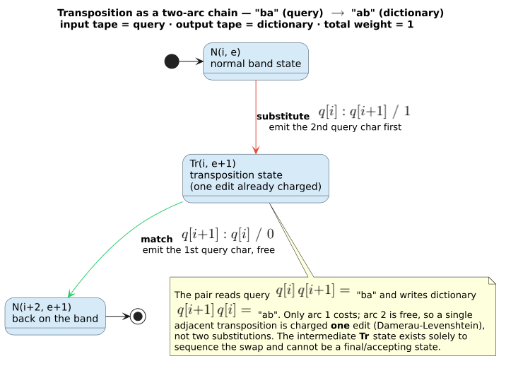

# 03 · The Levenshtein automaton as a transducer

> **Prerequisites:** [02 · Edit distance and Levenshtein automata](02-edit-distance-and-levenshtein-automata.md)
> (the edit lattice and **Theorem 2.3**, the soundness/completeness of the construction),
> [01 · Semirings and WFSTs](01-semirings-and-wfsts.md) (the tropical semiring and the path-weight
> function $`T(x,y)`$).
> **Defines:** the exact label/weight semantics duallity emits — **input = query side, output =
> dictionary side** — and proves that a shortest tropical path through the machine reports the
> (capped) edit distance.
> **Symbols** follow the [master notation](README.md#master-notation); this page introduces no symbol
> absent from that table.

Chapter 02 built the *unweighted* Levenshtein automaton $`L(q,k) = \{\, w \in \Sigma^{\ast} : d_{\mathrm{lev}}(q,w) \le k \,\}`$
and asserted, in prose, that its shortest accepting path weighs a term's edit distance. This chapter
makes that machine a genuine **weighted finite-state transducer** — it fixes which tape is the query
and which is the dictionary, assigns a tropical weight to every arc, and then *proves* the
shortest-path claim end to end. Everything here is realized by one Rust function,
`LevenshteinStateSource::compute_transitions` (`src/state_source.rs`); each definition and lemma is
pinned to it.

---

## 1. The transducer contract

`duallity` presents the Levenshtein automaton as a transducer whose two tapes are fixed **by
contract**. The orientation is not cosmetic: it is what lets the machine compose on its output tape
with a downstream transducer (chapter [04](04-composition.md)), and it is asserted directly by the
integration tests.

> **Invariant (the transducer contract).** Every arc of a duallity Levenshtein WFST has the form
> $`\text{in} : \text{out} / w`$ where
> - the **input** label ($`\text{in}`$) is the **query side** — a scalar $`q[i]`$ of the
>   query, or the empty label $`\varepsilon`$;
> - the **output** label ($`\text{out}`$) is the **dictionary side** — a scalar $`c`$ of a
>   term $`w`$, or $`\varepsilon`$;
> - the **weight** is the tropical cost of the step: $`0`$ for a free match, $`1`$ for one
>   edit (in the tropical semiring $`\mathbb{T}`$, so $`\otimes = +`$ accumulates them).
>
> This orientation was made canonical by commit `be3dc6a` and is pinned by
> `state_source.rs::test_state_source_transition_labels_preserve_transducer_sides`. Composition
> (chapter 04) matches this **output** tape against a downstream transducer's **input** tape.

(In the transition form $`\text{in} : \text{out} / w`$ the trailing $`w`$ is the *arc
weight*, following the [master-notation](README.md#master-notation) rendering of the edge relation
$`E`$. The dictionary term is *also* written $`w`$; to avoid any clash, every concrete arc
weight on this page is one of the literals $`0`$ or $`1`$, never a symbol.)

### 1.1 The product state $`(d, (i, e))`$

A duallity Levenshtein state is a **product state** $`(d, (i, e))`$ (master notation): a
dictionary node $`d`$ (how far a trie/DAWG walk of the dictionary has advanced), a query
position $`i`$ (how many scalars of $`q`$ have been consumed, $`0 \le i \le n`$), and
an accumulated **edit cost** $`e`$ ($`0 \le e \le k`$). The pair $`(i, e)`$ is the
*automaton* half; $`d`$ is the *dictionary* half. Both halves pack into a single `u32`
`StateId` by the arithmetic encoding of
[architecture/03](../architecture/03-state-encoding-and-product-space.md); the automaton half is
`AutomatonState::Normal { query_pos: i, edit_cost: e }` in `src/state_source_support.rs`.

The four edit operations are the four ways to leave a `Normal` product state. Writing $`d'`$ for
the dictionary node reached from $`d`$ along an outgoing edge labelled $`c`$:


| Operation | Guard | Label $`\text{in} : \text{out} / w`$ | Successor of $`(d,(i,e))`$ |
|-----------|-------|--------------------------------------------|----------------------------------|
| **match** | $`i < n`$, $`q[i] = c`$ | $`q[i] : c \,/\, 0`$ | $`(d',\, (i{+}1,\, e))`$ |
| **substitute** | $`i < n`$, $`q[i] \ne c`$, $`e < k`$ | $`q[i] : c \,/\, 1`$ | $`(d',\, (i{+}1,\, e{+}1))`$ |
| **insert** | $`e < k`$ (one per dictionary edge $`c`$) | $`\varepsilon : c \,/\, 1`$ | $`(d',\, (i,\, e{+}1))`$ |
| **delete** | $`i < n`$, $`e < k`$ | $`q[i] : \varepsilon \,/\, 1`$ | $`(d,\, (i{+}1,\, e{+}1))`$ |

The **match** arc carries the cost guard $`e \le k`$ implicitly: a matched character never
raises the cost, and every reachable state already satisfies $`e \le k`$, so a match is always
admissible when $`q[i] = c`$ (in code, `next_cost = e + 0 <= max_distance`). The other three
each raise the cost by one and therefore require the headroom $`e < k`$ (in code,
`can_edit = edit_cost < max_distance`, and `next_cost = e + 1 <= max_distance`).

Note the asymmetry that makes the two tapes *mean* something:

- **insert** advances the **dictionary** ($`d \to d'`$) but **not** the query — it accounts for
  an *extra* character the term has and the query lacks, so the query side is $`\varepsilon`$;
- **delete** advances the **query** ($`i \to i{+}1`$) but **not** the dictionary — it accounts
  for a character the query has and the term lacks, so the dictionary side is $`\varepsilon`$.

This is exactly the diagonal / horizontal / vertical decomposition of the edit lattice
([02 · §2](02-edit-distance-and-levenshtein-automata.md)), now carrying labels on two tapes.

---

## 2. Acceptance and the final weight

A product state may be **accepting**, and if so it carries a **final weight**
$`\rho`$ (master notation). A `Normal` state accepts exactly when its dictionary node is a real
word-end *and* the query can still be finished within budget:

```math
\operatorname{accept}\bigl(d,(i,e)\bigr) \;\iff\; \operatorname{final}(d)\ \wedge\ e + \mathrm{rem} \le k,
\qquad \mathrm{rem} := n - i .
```

Here $`\mathrm{rem} = n - i`$ is the number of **unconsumed** query scalars (master notation). The
condition $`e + \mathrm{rem} \le k`$ is `within_max_distance(edit_cost, remaining, max_distance)`
in `src/state_source_support.rs`, which computes $`e + \mathrm{rem} \le k`$ (not merely
$`\mathrm{rem} \le k`$): the tail still to be deleted is charged *together with* the cost already
spent. When accepting, the final weight is the tail-deletion cost $`\mathrm{rem}`$; otherwise it
is the additive identity $`\bar{0} = +\infty`$:

```math
\rho\bigl(d,(i,e)\bigr) \;=\;
\begin{cases}
\mathrm{rem} = n - i, & \operatorname{final}(d)\ \wedge\ e + \mathrm{rem} \le k, \\[4pt]
\bar{0} = +\infty, & \text{otherwise.}
\end{cases}
```

Recall the [`zero()` gotcha](01-semirings-and-wfsts.md#3-the-tropical-min--semiring):
`TropicalWeight::zero()` is the *value* $`+\infty`$, meaning "no accepting path here", **not**
"cost $`0`$". The final weight $`\mathrm{rem}`$ prepays, in one number, the cost of deleting
every query character not yet consumed — a shorthand whose correctness is discharged in §5.

With acceptance fixed we can write the object down formally.

### Definition 3.1 (the Levenshtein transducer $`A(q,k)`$)

For a query $`q \in \Sigma^{\ast}`$ ($`n = \lvert q\rvert`$), a bound $`k`$, and a
dictionary $`D`$ with root node $`d_0`$, the **standard Levenshtein transducer** is the WFST
$`A(q,k) = (\Sigma, \Sigma, Q, q_0, F, \rho, E)`$ over the tropical semiring $`\mathbb{T}`$
where

- $`Q`$ is the set of product states $`(d,(i,e))`$ with $`d`$ a node of $`D`$,
  $`0 \le i \le n`$, $`0 \le e \le k`$;
- the start state is $`q_0 = (d_0, (0,0))`$ — root of the dictionary, nothing consumed, no cost;
- $`E`$ is the union of the four arc families of the table in §1.1, ranging $`c`$ over the
  outgoing edges of each $`d`$;
- $`F = \{\, (d,(i,e)) : \operatorname{accept}(d,(i,e)) \,\}`$ with final weights $`\rho`$
  as above.

`LevenshteinStateSource<D>` realizes $`A(q,k)`$ lazily: it never materializes $`Q`$ or
$`E`$ in full, but computes the outgoing arcs of any state on demand (§3), so a dictionary of
millions of terms is walked in lockstep with the automaton.

---

## 3. The transition kernel, as literate pseudocode

All of Definition 3.1 lives in one function. One call touches only the outgoing edges of a single
dictionary node, so it runs in $`\mathcal{O}(\deg(d))`$ time (where $`\deg(d)`$ is the number of
outgoing dictionary edges of $`d`$) and emits at most $`2\deg(d) + 1`$ arcs for the
standard metric. In Knuth's literate form (math inside the fence is written plainly; $`\bar{0}`$
denotes the tropical additive identity $`+\infty`$):

```text
⟨COMPUTE-TRANSITIONS(d, i, e)⟩ ≡
  Input:      a Normal product state (d, (i, e)) — dict node d, query pos i, edit cost e
  Output:     (is_final, final_weight, transitions)
  Invariant:  every emitted arc's target (d', (i', e')) has e' ≤ k, and
              w(π · arc) = e'   for the extended path   (Lemma 3.2)

  1  transitions ← [ ]
  2  ⟨Match / Substitute / Insert — one pass over d's outgoing edges⟩
  3  ⟨Delete — consume the current query char, dictionary stays⟩
  4  ⟨Decide acceptance and the tail-deletion weight⟩
  5  return (is_final, final_weight, transitions)

⟨Match / Substitute / Insert — one pass over d's outgoing edges⟩ ≡
  for each edge (c, d') of d:                                        ▷ c = dict char, d' = child node
    if i < n and q[i] = c and e ≤ k:                                 ▷ MATCH (free)
        emit  q[i] : c / 0   →  (d', (i+1, e))
    else if i < n and e + 1 ≤ k:                                     ▷ SUBSTITUTE (one edit)
        emit  q[i] : c / 1   →  (d', (i+1, e+1))
    if e + 1 ≤ k:                                                    ▷ INSERT: term has an extra char
        emit  ε   : c / 1    →  (d', (i,   e+1))                     ▷   advance dictionary only
    ⟨First arc of each enabled two-arc edit (Transposition / MergeAndSplit)⟩

⟨Delete — consume the current query char, dictionary stays⟩ ≡
  if i < n and e + 1 ≤ k:                                            ▷ DELETE: term is missing a char
      emit  q[i] : ε / 1     →  (d,  (i+1, e+1))                     ▷   advance query only

⟨Decide acceptance and the tail-deletion weight⟩ ≡
  rem ← n − i
  if final(d) and e + rem ≤ k:                                       ▷ real word-end, budget suffices
      is_final, final_weight ← true,  TropicalWeight(rem)           ▷   prepay rem tail-deletes
  else:
      is_final, final_weight ← false, TropicalWeight::zero()        ▷   0̄ = +∞ : no accepting path here

⟨First arc of each enabled two-arc edit (Transposition / MergeAndSplit)⟩ ≡
  ▷ Emitted only when the Algorithm enables it and e + 1 ≤ k; each is arc 1 of 2.
  ▷ The second arc is produced by the continuation kernel of §6 (transpose) or §7 (merge/split).
  if Algorithm supports Transposition and i+1 < n
     and q[i] ≠ q[i+1] and c = q[i+1] and d' has an outgoing edge q[i]:
        emit  q[i] : c / 1   →  (d', TransposeSecond(i, e+1))       ▷ see §6
  if Algorithm supports MergeAndSplit and i+1 < n:                  ▷ MERGE: two query chars → one dict char
        emit  q[i] : c / 1   →  (d', MergeSecond(i, e+1))           ▷ see §7
  if Algorithm supports MergeAndSplit and i < n and d' has an outgoing edge:  ▷ SPLIT: one query char → two dict chars
        emit  q[i] : c / 1   →  (d', SplitSecond(i, e+1))           ▷ see §7
```

The real implementation buffers arcs in a
`SmallVec<[WeightedTransition<char, TropicalWeight>; 4]>` (inline capacity `4` — the exact standard
branching of one cell: match-or-substitute, insert, delete, plus one continuation), packs each
successor $`(d',(i',e'))`$ back into a single `StateId`, and interns freshly reached dictionary
nodes in a shared registry under a write lock (`register_dictionary_node_for_targets`, see
[architecture/05](../architecture/05-registries-and-interning.md)). The `TransposeSecond`,
`MergeSecond`, and `SplitSecond` continuation states occupy **disjoint slot ranges** stacked above the
`Normal` range in the automaton-state encoding (`src/state_source_support.rs`), so a two-arc edit never
collides with an ordinary one.

---

## 4. The weight of a path is the cost of its state

Before proving the headline theorem we isolate the bookkeeping lemma that makes it go through: the
tropical weight accumulated along *any* path equals the edit cost recorded in the state it reaches. It
is what lets us treat "sum of arc weights" (chapter 02's currency) and "the $`e`$ component of a
product state" (this chapter's currency) as one quantity.

### Lemma 3.2 (accumulated weight equals state cost)

**Statement.** Let $`\pi`$ be any path of $`A(q,k)`$ from the start state
$`q_0 = (d_0,(0,0))`$ to a state $`s`$ whose automaton half carries the cost component
$`e(s)`$ — whether $`s`$ is a `Normal` state $`(d,(i,e))`$ (so $`e(s) = e`$) or one
of the continuation states $`\textsf{TransposeSecond}`$, $`\textsf{MergeSecond}`$,
$`\textsf{SplitSecond}`$ (which also store an `edit_cost`). Then the $`\otimes`$-accumulated
weight of $`\pi`$ equals that cost:

```math
w(\pi) \;=\; \bigotimes_{a \,\in\, \pi} w(a) \;=\; \sum_{a \,\in\, \pi} w(a) \;=\; e(s) .
```

(The middle equality is just $`\otimes = +`$ in $`\mathbb{T}`$.)

**Proof.** Induction on the number of arcs $`\lvert\pi\rvert`$.

*Base ($`\lvert\pi\rvert = 0`$).* The empty path ends at $`q_0 = (d_0,(0,0))`$. The empty
$`\otimes`$-product is the multiplicative identity $`\bar{1} = 0`$ (chapter 01), and
$`e(q_0) = 0`$. So $`w(\pi) = 0 = e(q_0)`$.

*Inductive step.* Assume $`w(\pi') = e(s')`$ for a path $`\pi'`$ ending at state
$`s'`$, and let $`\pi = \pi' \cdot a`$ extend it by one arc $`a`$ with weight
$`w(a)`$ to a state $`s`$. Because $`\otimes = +`$,
$`w(\pi) = w(\pi') + w(a) = e(s') + w(a)`$. It therefore suffices to show, for **every** arc kind,
that the weight it adds equals the increase it makes to the cost component,
$`w(a) = e(s) - e(s')`$. Enumerating the arcs of §1.1 and §3 ($`d'`$ is the child reached,
$`\delta`$ the amount added):

| Arc $`a`$ | $`s' = (\cdot,(i,e))`$ → $`s`$ | $`w(a)`$ | $`e(s) - e(s')`$ |
|-----------------|--------------------------------------------|----------------|-----------------------|
| **match** | $`(d',(i{+}1,e))`$ | $`0`$ | $`e - e = 0`$ |
| **substitute** | $`(d',(i{+}1,e{+}1))`$ | $`1`$ | $`(e{+}1) - e = 1`$ |
| **insert** | $`(d',(i,e{+}1))`$ | $`1`$ | $`(e{+}1) - e = 1`$ |
| **delete** | $`(d,(i{+}1,e{+}1))`$ | $`1`$ | $`(e{+}1) - e = 1`$ |
| **transpose** arc 1 | $`\textsf{TransposeSecond}(i, e{+}1)`$ | $`1`$ | $`(e{+}1) - e = 1`$ |
| **transpose** arc 2 | $`(d'',(i{+}2, e{+}1))`$ | $`0`$ | $`(e{+}1) - (e{+}1) = 0`$ |
| **merge** arc 1 | $`\textsf{MergeSecond}(i, e{+}1)`$ | $`1`$ | $`(e{+}1) - e = 1`$ |
| **merge** arc 2 | $`(d',(i{+}2, e{+}1))`$ | $`0`$ | $`(e{+}1) - (e{+}1) = 0`$ |
| **split** arc 1 | $`\textsf{SplitSecond}(i, e{+}1)`$ | $`1`$ | $`(e{+}1) - e = 1`$ |
| **split** arc 2 | $`(d'',(i{+}1, e{+}1))`$ | $`0`$ | $`(e{+}1) - (e{+}1) = 0`$ |

In every row $`w(a) = e(s) - e(s')`$. The arc weights are read directly from `src/state_source.rs`:
`TropicalWeight::new(f64::from(operation_cost))` with
$`\texttt{operation\_cost} \in \{0,1\}`$ for match/substitute,
`TropicalWeight::new(1.0)` for insert/delete and for each *first* continuation arc, and
`TropicalWeight::new(0.0)` for each *second* continuation arc
(`compute_transpose_second_transitions`, `compute_merge_second_transitions`,
`compute_split_second_transitions`). The cost components stored in the successor automaton states are
read from the same functions (`next_edit_cost = edit_cost.saturating_add(1)` for the cost-raising arcs;
the second continuation arc reuses the already-raised `edit_cost`). Hence
$`w(\pi) = e(s') + w(a) = e(s') + \bigl(e(s) - e(s')\bigr) = e(s)`$, completing the induction.
$`\blacksquare`$

A $`0`$-cost arc never raises $`e`$, so a matched character (or the second half of a
two-arc edit) is genuinely *free*; a $`1`$-cost arc raises $`e`$ by exactly one. Lemma 3.2
guarantees the automaton's $`e`$ field is a faithful running total of the tropical weight, with
no drift.

---

## 5. A shortest tropical path reports the capped edit distance

### Theorem 3.3 (tropical path weight $`=`$ capped edit distance)

**Statement.** For every dictionary term $`w`$, the weight the transducer $`A(q,k)`$ assigns
to the pair $`(q, w)`$ is the Levenshtein distance capped at $`k`$:

```math
T_{A(q,k)}(q, w) \;=\;
\begin{cases}
d_{\mathrm{lev}}(q, w), & d_{\mathrm{lev}}(q, w) \le k, \\[4pt]
\bar{0} = +\infty, & d_{\mathrm{lev}}(q, w) > k,
\end{cases}
```

where, per the [master notation](README.md#master-notation),
$`T_{A(q,k)}(q,w) = \bigoplus_{\pi : q \to w} w(\pi) \otimes \rho(\pi) = \min_{\pi : q \to w}\bigl(w(\pi) + \rho(\pi)\bigr)`$,
the tropical $`\oplus`$-sum over all accepting paths of $`A(q,k)`$ that read $`q`$ and
write $`w`$.

**Proof outline.** We first dispatch a bookkeeping subtlety (§5.1), then import the
path $`\leftrightarrow`$ alignment
correspondence from chapter 02 (§5.2), then prove the two bounds and the out-of-budget case (§5.3).

### 5.1 No double counting: prepaid tail versus explicit tail-deletes

The final weight $`\rho`$ prepays the deletion of the unconsumed query tail (§2). One might worry
that a term could *also* be reached by a path that deletes that tail with explicit `delete` arcs, so
the tail is charged twice — or that the two mechanisms disagree. Neither happens.

Fix a term $`w`$ and let $`d_w`$ be its terminal dictionary node. Suppose a path
$`\pi`$ reaches a `Normal` state $`s = (d_w,(i,e))`$ having written exactly $`w`$ (so
by Lemma 3.2, $`w(\pi) = e`$), with $`\mathrm{rem} = n - i`$ query scalars still unread.
There are two ways for $`A(q,k)`$ to finish, and both need the *same* budget condition
$`e + \mathrm{rem} \le k`$:

- **(a) Prepay.** Accept at $`s`$. Then the total is $`w(\pi) \otimes \rho(s) = e + \mathrm{rem}`$.
- **(b) Delete explicitly.** Continue with the *forced* suffix of $`\mathrm{rem}`$ `delete` arcs
  $`q[i]:\varepsilon/1,\ q[i{+}1]:\varepsilon/1,\ \ldots,\ q[n{-}1]:\varepsilon/1`$. Each `delete`
  keeps the dictionary node fixed at $`d_w`$ and raises $`(i,e)`$ to
  $`(i{+}1, e{+}1)`$, so the suffix ends at $`s^{\star} = (d_w,(n, e+\mathrm{rem}))`$. There
  $`\mathrm{rem}^{\star} = n - n = 0`$, and $`s^{\star}`$ accepts iff
  $`(e+\mathrm{rem}) + 0 \le k`$ — the identical condition — with $`\rho(s^{\star}) = 0`$.
  By Lemma 3.2 the path to $`s^{\star}`$ weighs $`e + \mathrm{rem}`$, so the total is again
  $`(e + \mathrm{rem}) + 0 = e + \mathrm{rem}`$.

The two totals are **identical**, and the suffix in (b) is **deterministic** — from $`s`$ the
only arcs that consume the query tail without moving the dictionary are those `delete`s, taken in query
order. Route (a) charges the tail once (through $`\rho`$); route (b) charges it once (through arc
weights); no route charges it twice. Consequently $`A(q,k)`$ and the *fully explicit* transducer
$`A_{\mathrm{full}}(q,k)`$ — identical to $`A(q,k)`$ except that its only final states have
$`i = n`$ (whole query read) with final weight $`0`$ — assign every pair the same weight:

```math
T_{A(q,k)}(q,w) \;=\; T_{A_{\mathrm{full}}(q,k)}(q,w) .
```

$`A_{\mathrm{full}}`$ reads all of $`q`$ on every accepting path, so it is the object to which
chapter 02's path $`\leftrightarrow`$ alignment correspondence (Theorem 2.3) applies verbatim; the
prepaid $`\rho`$ in $`A`$ is merely that correspondence's forced delete-suffix, contracted
into one number for efficiency.

### 5.2 What we import from chapter 02

Let $`\mathrm{align}(q,w)`$ be the set of edit **alignments** transforming $`q`$ into
$`w`$ — sequences of match / substitute / insert / delete steps, each costing $`0`$ (match)
or $`1`$ (otherwise), summing to a cost $`\lvert\alpha\rvert`$ — so that
$`d_{\mathrm{lev}}(q,w) = \min_{\alpha \in \mathrm{align}(q,w)} \lvert\alpha\rvert`$ (Levenshtein
[1]; Wagner–Fischer [2]). Chapter [02](02-edit-distance-and-levenshtein-automata.md), **Theorem 2.3**,
establishes the two directions of the correspondence between alignments and paths of
$`A_{\mathrm{full}}(q,k)`$ that read $`q`$ and write $`w`$:

- **(Completeness.)** Every alignment $`\alpha \in \mathrm{align}(q,w)`$ with
  $`\lvert\alpha\rvert \le k`$ is realized by an accepting path whose arc-weight sum is
  $`\lvert\alpha\rvert`$. In particular an *optimal* alignment of cost $`d_{\mathrm{lev}}(q,w) \le k`$
  yields an accepting path of total weight $`d_{\mathrm{lev}}(q,w)`$.
- **(Soundness.)** Every accepting path that reads $`q`$ and writes $`w`$ spells an
  alignment in $`\mathrm{align}(q,w)`$ whose cost equals the path's arc-weight sum; hence that sum
  is $`\ge d_{\mathrm{lev}}(q,w)`$.

This correspondence is precisely the diagonal/horizontal/vertical structure of the edit lattice (Wagner
–Fischer [2]) run in lockstep with a dictionary walk (Schulz–Mihov [3]); Lemma 3.2 above supplies the
bridge that an arc-weight sum equals the reached state's $`e`$.

### 5.3 Proof of Theorem 3.3

**Case $`d_{\mathrm{lev}}(q,w) \le k`$.** By §5.1 it suffices to evaluate
$`T_{A_{\mathrm{full}}(q,k)}(q,w) = \min_{\pi}\,(w(\pi) + \rho(\pi))`$ over accepting paths reading
$`q`$ and writing $`w`$, where $`\rho(\pi) = 0`$ on every such path.

- *Upper bound.* By completeness (§5.2) an optimal alignment of cost $`d_{\mathrm{lev}}(q,w) \le k`$
  is realized by an accepting path $`\pi^{\ast}`$ whose arc-weight sum, by Lemma 3.2, is
  $`w(\pi^{\ast}) = d_{\mathrm{lev}}(q,w)`$. Hence
  $`T_{A(q,k)}(q,w) = \min_{\pi}\,w(\pi) \le w(\pi^{\ast}) = d_{\mathrm{lev}}(q,w)`$.
- *Lower bound.* By soundness (§5.2) every accepting path $`\pi`$ reading $`q`$ and writing
  $`w`$ spells an alignment of cost $`w(\pi) \ge d_{\mathrm{lev}}(q,w)`$. Taking the minimum,
  $`T_{A(q,k)}(q,w) = \min_{\pi}\,w(\pi) \ge d_{\mathrm{lev}}(q,w)`$.

The two bounds meet, so $`T_{A(q,k)}(q,w) = d_{\mathrm{lev}}(q,w)`$. Because $`\oplus = \min`$
in the tropical semiring, the $`\oplus`$-sum over the accepting paths is literally their
minimum total weight (Mohri–Pereira–Riley [4]); the shortest path *is* the answer.

**Case $`d_{\mathrm{lev}}(q,w) > k`$.** Suppose, for contradiction, that some accepting path
$`\pi`$ reads $`q`$ and writes $`w`$. In $`A_{\mathrm{full}}`$ it reaches a final
state $`(d_w,(n, e))`$ with $`e = w(\pi)`$ (Lemma 3.2) and, by soundness, $`e \ge d_{\mathrm{lev}}(q,w) > k`$.
But a final state satisfies $`e + \mathrm{rem} \le k`$ with $`\mathrm{rem} = 0`$, i.e.
$`e \le k`$ — contradiction. (Equivalently, in $`A`$ any state $`(d_w,(i,e))`$ writing
$`w`$ has $`e + \mathrm{rem} \ge d_{\mathrm{lev}}(q,w) > k`$, so $`\operatorname{accept}`$
fails.) Hence there is **no** accepting path for $`w`$, the index set of the $`\oplus`$-sum is
empty, and the empty tropical sum is the additive identity:

```math
T_{A(q,k)}(q,w) \;=\; \bigoplus \varnothing \;=\; \bar{0} \;=\; +\infty .
```

$`\blacksquare`$

Theorem 3.3 is what makes $`A(q,k)`$ more than an acceptor: it is a $`\mathbb{T}`$-weighted
transducer whose shortest accepting path *reports* each term's edit distance, capping at $`k`$ and
returning $`+\infty`$ ($`\bar{0}`$, "not a match") beyond the budget. That is exactly the
contract a `Wfst<char, TropicalWeight>` must satisfy to be composed and shortest-path-searched
(chapter [04](04-composition.md)).

---

## 6. Damerau transposition: unit cost across two arcs

The Damerau–Levenshtein distance $`d_{\mathrm{DL}}`$ adds **adjacent transposition** — swapping
two neighbouring characters — as a unit-cost edit (Damerau [5]; master notation). Selecting
`Algorithm::Transposition` in `LevenshteinStateSource` adds this without changing the single-`char`
WFST label type: the swap is realized as a **two-arc chain** through a dedicated continuation state
$`\textsf{TransposeSecond}`$, so each arc stays an ordinary $`\text{in}:\text{out}`$ pair and
remains composable.

### Theorem 3.4 (adjacent transposition costs 1, split across two arcs)

**Statement.** Fix `Algorithm::Transposition`, a `Normal` state $`(d,(i,e))`$ with
$`i+1 < n`$, $`e < k`$, and $`q[i] \ne q[i+1]`$. Suppose the term being walked contains,
at $`d`$, the two edges $`q[i+1]`$ then $`q[i]`$ (i.e. it carries the swapped pair
$`q[i+1]\,q[i]`$ where $`q`$ has $`q[i]\,q[i+1]`$). Then $`A(q,k)`$ contains the
two-arc path

```math
(d,(i,e)) \;\xrightarrow{\;q[i]\,:\,q[i+1]\,/\,1\;}\; \bigl(d_1,\ \textsf{TransposeSecond}(i,\,e{+}1)\bigr)
\;\xrightarrow{\;q[i+1]\,:\,q[i]\,/\,0\;}\; \bigl(d_2,\ (i{+}2,\,e{+}1)\bigr),
```

where $`d_1`$ is the child of $`d`$ under edge $`q[i+1]`$ and $`d_2`$ the child
of $`d_1`$ under edge $`q[i]`$. Its total weight is $`1 + 0 = 1`$; it advances the
query by two positions and the dictionary by two nodes. If $`d_2`$ is a terminal node and
$`(e{+}1) + (n - (i{+}2)) \le k`$, the target accepts, contributing total weight
$`(e{+}1) + \mathrm{rem}`$ — the transposition and the remaining tail.

**Proof.** *Arc 1 ($`\textsf{Normal} \to \textsf{TransposeSecond}`$).* In
`compute_normal_transitions`, with `Algorithm::Transposition` and $`e < k`$, the `transpose_context`
is built for `next_pos = i+1 < n`, carrying $`(q[i], q[i+1], \textsf{TransposeSecond}(i,e{+}1))`$.
For the dictionary edge $`(c, d_1)`$, the guard fires exactly when
$`c = q[i+1]`$ **and** $`q[i] \ne q[i+1]`$ **and** $`d_1`$ has an outgoing edge
$`q[i]`$ (`dict_char == second_query_char && first_query_char != second_query_char && node_has_char_edge(child, first_query_char)`).
It then emits $`\text{input} = q[i]`$, $`\text{output} = c = q[i+1]`$, weight $`1.0`$,
to $`(d_1, \textsf{TransposeSecond}(i,e{+}1))`$ — the arc $`q[i]:q[i+1]/1`$. The
`node_has_char_edge` guard *pre-checks* that arc 2 will exist, so no dead transposition is emitted.

*Arc 2 ($`\textsf{TransposeSecond} \to \textsf{Normal}`$).* `compute_transpose_second_transitions`
sets `second_input = q[i+1]` and `required_output = q[i]`, and its target is
$`\textsf{Normal}(i{+}2, e{+}1)`$ (`query_pos.checked_add(2)`, cost unchanged). For each edge
$`(c', d_2)`$ of $`d_1`$ with $`c' = q[i]`$ (`dict_char != required_output` are skipped),
it emits $`\text{input} = q[i+1]`$, $`\text{output} = c' = q[i]`$, weight $`0.0`$, to
$`(d_2, (i{+}2, e{+}1))`$ — the arc $`q[i+1]:q[i]/0`$. The two arcs together read
$`q[i]\,q[i+1]`$ on the input tape and write $`q[i+1]\,q[i]`$ on the output tape, at total
weight $`1`$, which is exactly Damerau's transposition. By Lemma 3.2 the target's cost component
$`e{+}1`$ equals the accumulated weight. Acceptance at $`d_2`$ follows from Definition 3.1.
$`\blacksquare`$

**Trace: $`q = \texttt{"ba"}`$ against the term $`\texttt{"ab"}`$ ($`k = 1`$).** Here
$`n = 2`$, $`q[0] = \texttt{b}`$, $`q[1] = \texttt{a}`$, $`i = 0`$, $`e = 0`$.
This is the scenario of `wrapper.rs::test_levenshtein_wfst_transposition_reaches_final_state`:

| Step | From $`(d,\text{aut})`$ | Arc $`\text{in}:\text{out}/w`$ | To $`(d',\text{aut}')`$ |
|------|-------------------------------|--------------------------------------|-------------------------------|
| 1 | $`(\langle\,\rangle,\ \textsf{Normal}(0,0))`$ | $`\texttt{b} : \texttt{a} \,/\, 1`$ | $`(\langle\texttt{a}\rangle,\ \textsf{TransposeSecond}(0,1))`$ |
| 2 | $`(\langle\texttt{a}\rangle,\ \textsf{TransposeSecond}(0,1))`$ | $`\texttt{a} : \texttt{b} \,/\, 0`$ | $`(\langle\texttt{ab}\rangle,\ \textsf{Normal}(2,1))`$ |

At $`(\langle\texttt{ab}\rangle, \textsf{Normal}(2,1))`$: the node $`\texttt{ab}`$ is terminal,
$`\mathrm{rem} = 2 - 2 = 0`$, and $`e + \mathrm{rem} = 1 + 0 = 1 \le k`$, so it accepts with
$`\rho = 0`$. Total weight $`= 1 + 0 + 0 = 1 = d_{\mathrm{DL}}(\texttt{"ba"}, \texttt{"ab"})`$.
The test asserts exactly this: a first arc $`\texttt{b}:\texttt{a}`$ of weight $`1`$, a second
arc $`\texttt{a}:\texttt{b}`$ of weight $`0`$, reaching a final state of final weight $`0`$.

 TransposeSecond --q[i+1]:q[i]/0--> Normal, traced on query 'ba' against term 'ab' at total weight 1" width="820"/>

(We name each dictionary node by the term prefix it spells — $`\langle\,\rangle`$ is the root — which
is unambiguous here because the trie of a single word is a simple path.)

---

## 7. Merge and split: two more two-arc chains

`Algorithm::MergeAndSplit` handles the two most common OCR/typographic confusions where the *number of
characters* changes: a **merge** collapses two query characters into one dictionary character (e.g. the
ligature-like $`\texttt{"rn"} \to \texttt{"m"}`$), and a **split** expands one query character into
two dictionary characters ($`\texttt{"m"} \to \texttt{"rn"}`$). Each is a unit-cost edit realized,
like transposition, as a two-arc chain through a continuation state — and each is a literal `char`/$`\varepsilon`$
chain of the kind that recurs in phonetic rewriting.


### Proposition 3.5 (merge and split each cost 1 across two arcs)

**Statement.** Fix `Algorithm::MergeAndSplit`, a `Normal` state $`(d,(i,e))`$ with $`e < k`$.

*Merge* ($`\langle 1\ \text{dictionary character}, 2\ \text{query characters}\rangle`$). If $`i+1 < n`$
and $`d`$ has an edge $`c`$ to $`d_1`$, then $`A(q,k)`$ contains

```math
(d,(i,e)) \;\xrightarrow{\;q[i]\,:\,c\,/\,1\;}\; \bigl(d_1,\ \textsf{MergeSecond}(i,e{+}1)\bigr)
\;\xrightarrow{\;q[i+1]\,:\,\varepsilon\,/\,0\;}\; \bigl(d_1,\ (i{+}2,\,e{+}1)\bigr).
```

The dictionary node does **not** move on arc 2 (its single character $`c`$ was already produced
on arc 1); the second query character is absorbed with an $`\varepsilon`$ output. Two query
scalars are consumed for one dictionary scalar, total weight $`1 + 0 = 1`$.

*Split* ($`\langle 2\ \text{dictionary characters}, 1\ \text{query character}\rangle`$). If $`i < n`$
and $`d`$ has an edge $`c_1`$ to $`d_1`$ which itself has a further edge $`c_2`$
to $`d_2`$, then $`A(q,k)`$ contains

```math
(d,(i,e)) \;\xrightarrow{\;q[i]\,:\,c_1\,/\,1\;}\; \bigl(d_1,\ \textsf{SplitSecond}(i,e{+}1)\bigr)
\;\xrightarrow{\;\varepsilon\,:\,c_2\,/\,0\;}\; \bigl(d_2,\ (i{+}1,\,e{+}1)\bigr).
```

The query advances by only one (its single character $`q[i]`$ was consumed on arc 1); the second
dictionary character is produced with an $`\varepsilon`$ input. One query scalar is consumed for
two dictionary scalars, total weight $`1 + 0 = 1`$.

**Proof.** *Merge.* In `compute_normal_transitions` with merge/split enabled and $`e < k`$,
`merge_context` is $`(q[i], \textsf{MergeSecond}(i,e{+}1))`$ when `next_pos = i+1 < n`. For a
dictionary edge $`(c, d_1)`$ it emits $`\text{input} = q[i]`$, $`\text{output} = c`$,
weight $`1.0`$, to $`(d_1, \textsf{MergeSecond}(i,e{+}1))`$ — the arc $`q[i]:c/1`$. Then
`compute_merge_second_transitions` emits a single arc $`\text{input} = q[i{+}1]`$,
$`\text{output} = \textsf{None} = \varepsilon`$, weight $`0.0`$, keeping the **same**
`dict_node_id` and targeting $`\textsf{Normal}(i{+}2, e{+}1)`$ (`query_pos.checked_add(2)`) — the arc
$`q[i{+}1]:\varepsilon/0`$.

*Split.* `split_context` is $`(q[i], \textsf{SplitSecond}(i,e{+}1))`$, emitted for a dictionary
edge $`(c_1, d_1)`$ only when $`d_1`$ has at least one outgoing edge
(`node_has_any_edge(child)`), guaranteeing arc 2 exists. It emits $`\text{input} = q[i]`$,
$`\text{output} = c_1`$, weight $`1.0`$, to $`(d_1, \textsf{SplitSecond}(i,e{+}1))`$ — the
arc $`q[i]:c_1/1`$. Then `compute_split_second_transitions` iterates the edges $`(c_2, d_2)`$
of $`d_1`$, emitting $`\text{input} = \textsf{None} = \varepsilon`$,
$`\text{output} = c_2`$, weight $`0.0`$, to $`\textsf{Normal}(i{+}1, e{+}1)`$
(`query_pos.checked_add(1)`) — the arc $`\varepsilon:c_2/0`$. In both cases Lemma 3.2 gives the
target cost $`e{+}1`$ as the accumulated weight. $`\blacksquare`$

**Trace: merge $`q = \texttt{"rn"}`$ against $`\texttt{"m"}`$ ($`k=1`$).**
(`wrapper.rs::test_levenshtein_wfst_merge_and_split_reaches_final_state`.)

| Step | From | Arc $`\text{in}:\text{out}/w`$ | To |
|------|------|--------------------------------------|----|
| 1 | $`(\langle\,\rangle,\ \textsf{Normal}(0,0))`$ | $`\texttt{r} : \texttt{m} \,/\, 1`$ | $`(\langle\texttt{m}\rangle,\ \textsf{MergeSecond}(0,1))`$ |
| 2 | $`(\langle\texttt{m}\rangle,\ \textsf{MergeSecond}(0,1))`$ | $`\texttt{n} : \varepsilon \,/\, 0`$ | $`(\langle\texttt{m}\rangle,\ \textsf{Normal}(2,1))`$ |

Accept at $`(\langle\texttt{m}\rangle, \textsf{Normal}(2,1))`$: terminal, $`\mathrm{rem} = 0`$,
$`e + \mathrm{rem} = 1 \le k`$, $`\rho = 0`$. Total $`= 1`$.

**Trace: split $`q = \texttt{"m"}`$ against $`\texttt{"rn"}`$ ($`k=1`$).**

| Step | From | Arc $`\text{in}:\text{out}/w`$ | To |
|------|------|--------------------------------------|----|
| 1 | $`(\langle\,\rangle,\ \textsf{Normal}(0,0))`$ | $`\texttt{m} : \texttt{r} \,/\, 1`$ | $`(\langle\texttt{r}\rangle,\ \textsf{SplitSecond}(0,1))`$ |
| 2 | $`(\langle\texttt{r}\rangle,\ \textsf{SplitSecond}(0,1))`$ | $`\varepsilon : \texttt{n} \,/\, 0`$ | $`(\langle\texttt{rn}\rangle,\ \textsf{Normal}(1,1))`$ |

Accept at $`(\langle\texttt{rn}\rangle, \textsf{Normal}(1,1))`$: terminal,
$`\mathrm{rem} = 1 - 1 = 0`$, $`e + \mathrm{rem} = 1 \le k`$, $`\rho = 0`$. Total
$`= 1`$. The $`\varepsilon`$-on-one-tape shape here is the same one phonetic rewrite rules
use when they expand or contract a string — the char/$`\varepsilon`$ chains of
[design/phonetic-rewrite-wfst](../design/phonetic-rewrite-wfst.md).

---

## 8. Worked example: `"cat"` and the four operations

duallity's tests nail down each **standard** operation's labels against a one-word dictionary
(`state_source.rs::test_state_source_transition_labels_preserve_transducer_sides` asserts the label
triples $`(\text{in}, \text{out}, w)`$ shown):

| Dictionary | Query | Produced transition $`\text{in}:\text{out}/w`$ | Operation |
|------------|-------|------------------------------------------------------|-----------|
| `["cat"]` | `"cat"` | $`\texttt{c} : \texttt{c} \,/\, 0`$ | match |
| `["cat"]` | `"bat"` | $`\texttt{b} : \texttt{c} \,/\, 1`$ | substitute (query $`\texttt{b}`$, dict $`\texttt{c}`$) |
| `["cat"]` | `"at"`  | $`\varepsilon : \texttt{c} \,/\, 1`$ | insert (term has an extra $`\texttt{c}`$) |
| `["at"]`  | `"cat"` | $`\texttt{c} : \varepsilon \,/\, 1`$ | delete (query has an extra $`\texttt{c}`$) |

Read the substitution row carefully: the **input** label is the query character $`\texttt{b}`$ and
the **output** label is the dictionary character $`\texttt{c}`$. That direction is the contract of
§1 — and it is exactly what makes the Levenshtein WFST composable on its **output** tape with a
downstream transducer (chapter [04](04-composition.md)).

### 8.1 A full accepting path: $`\texttt{"helo"} \to \texttt{"hello"}`$

Take the canonical example `LevenshteinWfst::new(&dict, "helo", 2)` with the term `"hello"` in the
dictionary. Here $`q = \texttt{"helo"}`$, $`n = 4`$, $`k = 2`$, and
$`d_{\mathrm{lev}}(\texttt{"helo"}, \texttt{"hello"}) = 1`$ (one inserted $`\texttt{l}`$). The
accepting path threads three matches, one insert, and one more match:

| Step | From $`(d,(i,e))`$ | Arc $`\text{in}:\text{out}/w`$ | To $`(d',(i',e'))`$ | Op |
|------|--------------------------|--------------------------------------|---------------------------|----|
| 1 | $`(\langle\,\rangle,(0,0))`$ | $`\texttt{h} : \texttt{h} \,/\, 0`$ | $`(\langle\texttt{h}\rangle,(1,0))`$ | match |
| 2 | $`(\langle\texttt{h}\rangle,(1,0))`$ | $`\texttt{e} : \texttt{e} \,/\, 0`$ | $`(\langle\texttt{he}\rangle,(2,0))`$ | match |
| 3 | $`(\langle\texttt{he}\rangle,(2,0))`$ | $`\texttt{l} : \texttt{l} \,/\, 0`$ | $`(\langle\texttt{hel}\rangle,(3,0))`$ | match |
| 4 | $`(\langle\texttt{hel}\rangle,(3,0))`$ | $`\varepsilon : \texttt{l} \,/\, 1`$ | $`(\langle\texttt{hell}\rangle,(3,1))`$ | insert |
| 5 | $`(\langle\texttt{hell}\rangle,(3,1))`$ | $`\texttt{o} : \texttt{o} \,/\, 0`$ | $`(\langle\texttt{hello}\rangle,(4,1))`$ | match |

At $`(\langle\texttt{hello}\rangle,(4,1))`$ the node $`\texttt{hello}`$ is terminal,
$`\mathrm{rem} = 4 - 4 = 0`$, and $`e + \mathrm{rem} = 1 + 0 = 1 \le k = 2`$, so the state
accepts with $`\rho = 0`$. Summing the tropical weights along the path and adding the final weight:

```math
w(\pi) \otimes \rho(\pi) \;=\; \underbrace{0 + 0 + 0}_{\text{three matches}} + \underbrace{1}_{\text{insert}} + \underbrace{0}_{\text{match}} \;+\; \underbrace{0}_{\rho} \;=\; 1 \;=\; d_{\mathrm{lev}}(\texttt{"helo"}, \texttt{"hello"}),
```
in perfect agreement with Theorem 3.3 (and with Lemma 3.2: the reached cost component $`e = 1`$
equals $`w(\pi) = 1`$). Had the dictionary offered a *cheaper* alignment, the tropical
$`\oplus = \min`$ would have selected it; here $`1`$ is both the only and the least cost, so it
is the reported distance.

---

## See also

- **[design/levenshtein-wfst](../design/levenshtein-wfst.md)** — `LevenshteinWfst<D>`, the adapter that
  runs this transition kernel lazily and caches expanded states.
- **[architecture/03 · State encoding and the product space](../architecture/03-state-encoding-and-product-space.md)**
  — how $`(d,(i,e))`$ and the continuation slots pack into a single `StateId`.
- **[architecture/05 · Registries and interning](../architecture/05-registries-and-interning.md)**
  — how freshly reached dictionary nodes are interned during `COMPUTE-TRANSITIONS`.
- **[theory/02 · Edit distance and Levenshtein automata](02-edit-distance-and-levenshtein-automata.md)**
  — the edit lattice and Theorem 2.3, imported by Theorem 3.3.
- **[theory/04 · Composition](04-composition.md)** — why the fixed **output = dictionary** orientation
  is what lets $`A(q,k)`$ participate in $`T_1 \circ T_2`$.
- **[design/phonetic-rewrite-wfst](../design/phonetic-rewrite-wfst.md)** — the char/$`\varepsilon`$
  chains of §7 generalized to arbitrary rewrite rules.

---

## References

1. **Levenshtein, V. I.** (1966). *Binary codes capable of correcting deletions, insertions, and
   reversals.* Soviet Physics Doklady 10(8), 707–710. — the edit distance $`d_{\mathrm{lev}}`$.
2. **Wagner, R. A., & Fischer, M. J.** (1974). *The String-to-String Correction Problem.* Journal of
   the ACM 21(1), 168–173. [doi:10.1145/321796.321811](https://doi.org/10.1145/321796.321811) — the
   edit-lattice alignment $`\leftrightarrow`$ path correspondence underlying Theorem 2.3.
3. **Schulz, K. U., & Mihov, S.** (2002). *Fast String Correction with Levenshtein Automata.*
   International Journal on Document Analysis and Recognition (IJDAR) 5(1), 67–85.
   [doi:10.1007/s10032-002-0082-8](https://doi.org/10.1007/s10032-002-0082-8) — the automaton whose
   accepting paths this chapter weights.
4. **Mohri, M., Pereira, F., & Riley, M.** (2002). *Weighted Finite-State Transducers in Speech
   Recognition.* Computer Speech & Language 16(1), 69–88.
   [doi:10.1006/csla.2001.0184](https://doi.org/10.1006/csla.2001.0184) — the tropical path-weight
   semantics $`T(x,y) = \bigoplus_{\pi} w(\pi) \otimes \rho(\pi)`$, so the shortest path is the
   best answer.
5. **Damerau, F. J.** (1964). *A technique for computer detection and correction of spelling errors.*
   Communications of the ACM 7(3), 171–176.
   [doi:10.1145/363958.363994](https://doi.org/10.1145/363958.363994) — adjacent transposition as a
   unit-cost edit ($`d_{\mathrm{DL}}`$), realized here as the two-arc chain of Theorem 3.4.
