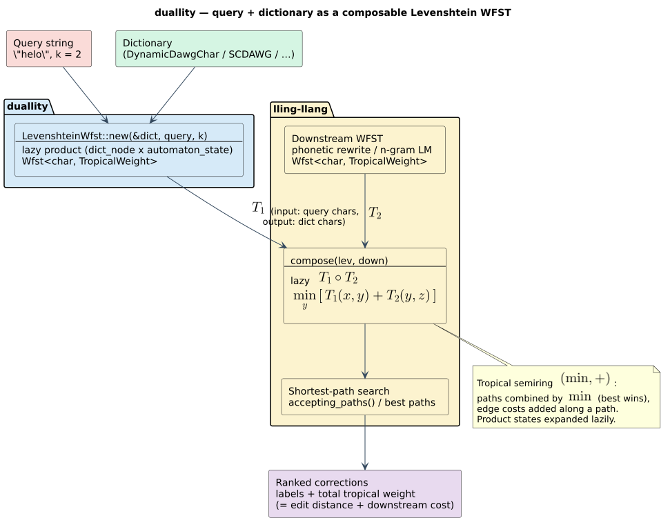
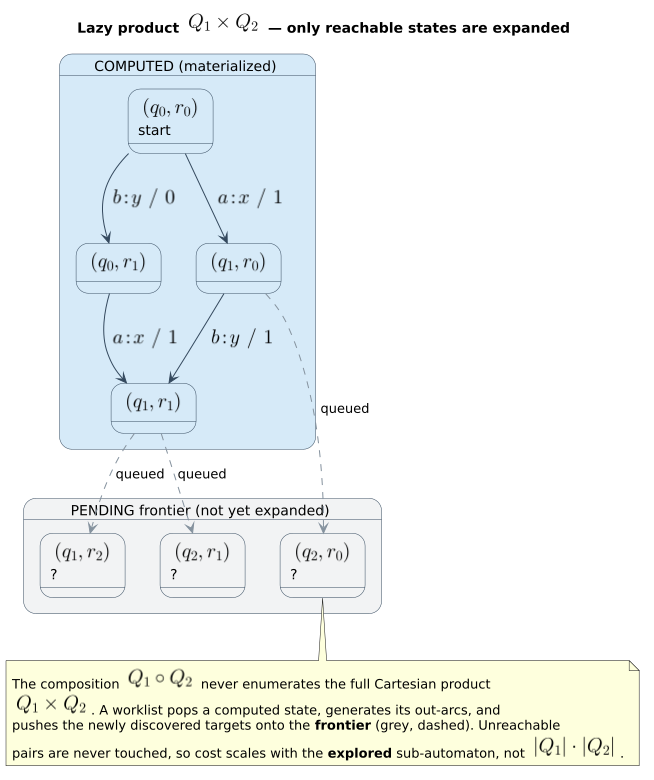

# 04 · Composition

> **Prerequisites:** [01 · Semirings and WFSTs](01-semirings-and-wfsts.md),
> [03 · The Levenshtein automaton as a transducer](03-levenshtein-as-transducer.md).
> **Defines:** the composition operator $`T_1 \circ T_2`$, the filtered lazy product $`T_1 \bowtie T_2`$,
> the three-state $`\varepsilon`$-filter, shortest-path search over the lazy product, and *why a fuzzy
> matcher must **be** a WFST to participate*.
> **Symbols** are from the [master notation](README.md#master-notation); the tropical
> `zero()`/`one()` naming gotcha is called out in [§ Semirings and weights](README.md#semirings-and-weights).

Composition is the operation that turns a *collection* of transducers into a *pipeline*. It is the
algebraic heart of duallity: it is the reason a Levenshtein matcher is exposed as a
`Wfst<char, TropicalWeight>` rather than as a procedure returning a list of hits. This chapter defines
composition, constructs the lazy product that realizes it, and proves — completely — that the lazy
product computes the composition weight, that a shortest-path search over it is sound, and that
composition is associative so pipelines of any length are well defined.

---

## 1. The composition operation

Let $`T_1`$ and $`T_2`$ be two WFSTs over one common alphabet $`\Sigma`$ and one common semiring
$`\mathbb{K} = (K, \oplus, \otimes, \bar{0}, \bar{1})`$ (chapter [01](01-semirings-and-wfsts.md)).
Recall from the [master notation](README.md#transducers-paths-and-composition) that the weight a WFST
assigns to an input/output pair is the $`\oplus`$-sum of the $`\otimes`$-accumulated weights of all
accepting paths carrying that pair:

```math
T(x, y) \;=\; \bigoplus_{\pi \,:\, x \,\to\, y} w(\pi) \otimes \rho(\pi),
\qquad
w(\pi) = \bigotimes_{e \,\in\, \pi} w(e),
```

where $`\rho(\pi)`$ is the final weight of the last state of $`\pi`$ (and $`\bar{0}`$ when that state
is non-final). Given $`T_1`$ relating an input tape $`x`$ to an intermediate tape $`y`$, and $`T_2`$
relating $`y`$ to an output tape $`z`$, the **composition** $`T_1 \circ T_2`$ relates $`x`$ directly
to $`z`$ by *matching $`T_1`$'s output tape against $`T_2`$'s input tape* and summing over every
intermediate string that could bridge them:

```math
(T_1 \circ T_2)(x, z) \;=\; \bigoplus_{y \,\in\, \Sigma^{\ast}} \bigl[\, T_1(x, y) \otimes T_2(y, z) \,\bigr].
```

In the tropical semiring $`\mathbb{T} = (\mathbb{R} \cup \{+\infty\},\ \min,\ +,\ +\infty,\ 0)`$ that
duallity uses ($`\oplus = \min`$, $`\otimes = +`$), the sum-of-products collapses into a
*minimum over intermediate tapes of a sum of two costs*:

```math
(T_1 \circ T_2)(x, z) \;=\; \min_{y \,\in\, \Sigma^{\ast}} \bigl[\, T_1(x, y) + T_2(y, z) \,\bigr].
```

This is *the cheapest way to get from $`x`$ to $`z`$ through some intermediate tape $`y`$*. A
Levenshtein WFST maps a query $`x`$ to dictionary terms $`y`$ with edit-distance weights; compose it
with a phonetic-rewrite transducer or an n-gram language model $`T_2`$ that scores $`y \to z`$, and the
composite scores corrections by **edit distance + downstream cost** in a single object. That
composition is *well defined* precisely because rational (finite-state) relations are closed under
composition — a classical theorem of Elgot & Mezei [[4]](#references), sharpened for the weighted
setting by Mohri [[1]](#references) and Mohri, Pereira & Riley [[2]](#references), and given its modern
textbook treatment by Sakarovitch [[5]](#references).



> **Standing assumptions.** Two hypotheses hold throughout and are satisfied by every operand
> duallity composes. **(H1) Commutativity.** $`\mathbb{K}`$ is *commutative* ($`a \otimes b = b \otimes a`$);
> the tropical semiring is, since $`+`$ is commutative. **(H2) Finiteness.** For each pair
> $`(x, z)`$ only finitely many intermediate strings $`y`$ give a non-$`\bar{0}`$ product, and each
> $`T(x, y)`$ is a finite $`\oplus`$-sum. This holds for duallity's operands because every one of them
> makes strict progress — a Levenshtein WFST advances the dictionary node or the query cursor on all
> but a bounded number of $`\varepsilon`$-steps (chapter [03](03-levenshtein-as-transducer.md)), and a
> rewrite WFST advances through a bounded rule chain (chapter
> [design/phonetic-rewrite-wfst](../design/phonetic-rewrite-wfst.md)). (H2) is the standard
> *$`\varepsilon`$-cycle-free* condition under which composition is a finite $`\oplus`$; Mohri
> [[3]](#references) treats the general case with $`\varepsilon`$-cycles.

---

## 2. Why the matcher must *be* a WFST

Before duallity, a Levenshtein matcher in this family was a *closed procedure*: hand it a query and a
dictionary, get back "all terms within distance $`k`$". That output is a **set**
$`L(q, k) = \{\, w : d_{\mathrm{lev}}(q, w) \le k \,\}`$, not an algebraic object. A set cannot enter
the $`\bigoplus_{y}`$ fold of § 1, and the reason is exactly the information a set throws away.

Write the fold out. To evaluate $`(T_1 \circ T_2)(x, z)`$ we need, for **every** intermediate term
$`y`$, the weight $`T_1(x, y)`$ — the edit cost of reaching $`y`$ from $`x`$ — so that it can be
combined ($`\otimes`$) with the downstream cost $`T_2(y, z)`$ and then minimized ($`\oplus`$) over
$`y`$. A result set $`\{y_1, y_2, \ldots\}`$ records *which* $`y`$ are within budget but **discards
the weights** $`T_1(x, y_i)`$; the $`\otimes`$ and $`\oplus`$ have nothing to operate on. Concretely,
the set answer to "correct `helo`" is `{hello, help, held, …}` with no attached costs, so there is no
way to prefer the distance-$`1`$ `hello` over the distance-$`2`$ `held` *once a downstream model is
folded in* — the very quantity a shortest-path search minimizes has been erased.

By making the matcher satisfy `Wfst<char, TropicalWeight>`, duallity keeps the weights *attached to
the structure*. The matcher becomes a legitimate $`T_1`$ whose $`T_1(x, y)`$ is recoverable as a path
weight, so `lling_llang::composition::compose` can fold it against any $`T_2`$:

```rust,ignore
use duallity::LevenshteinWfst;
use lling_llang::composition::compose;

let lev      = LevenshteinWfst::new(&dict, "helo", 2);   // T₁ : query → term, weight = edit distance
let mut composed = compose(lev, language_model);         // T₁ ∘ T₂  (lazy)
for path in composed.accepting_paths() {                 // best-first: shortest paths first
    println!("{:?} -> {:?}  weight {}", path.inputs, path.outputs, path.weight.value());
}
```

This is the entire *raison d'être* of the crate: **make the Levenshtein matcher a $`T_1`$ you can feed
into the $`\bigoplus_{y}`$ fold.** Everything downstream — phonetic rewriting, language-model
rescoring, pipelines of arbitrary length (§ 8) — follows from that one design decision.

---

## 3. The lazy product

Composition is *realized* by a **product automaton**. We distinguish the algebraic *relation*
$`T_1 \circ T_2`$ (defined in § 1) from the *construction* $`T_1 \bowtie T_2`$ that computes it; § 6
proves the two agree.

### 3.1 Product states

A state of the product is a triple

```math
(s_1,\, s_2,\, \varphi) \;\in\; Q_1 \times Q_2 \times \{\, \textsf{None},\ \textsf{Eps1},\ \textsf{Eps2} \,\},
```

pairing a state $`s_1`$ of $`T_1`$ with a state $`s_2`$ of $`T_2`$ and a **filter component**
$`\varphi`$ (§ 4). The start state is $`(i_1,\, i_2,\, \textsf{None})`$; a product state is final iff
both components are final, with final weight $`\rho_1(s_1) \otimes \rho_2(s_2)`$. In `lling_llang`
this triple is `ProductStateId { s1, s2, filter }` (`composition/fst_fst.rs`).

### 3.2 The matched-tape rule

Every arc out of $`(s_1, s_2, \varphi)`$ is one of three kinds. Writing an arc as
$`\text{in} : \text{out} / \text{weight}`$ and letting $`b`$ range over non-$`\varepsilon`$ symbols:

| Kind | Fires when | Product arc | Successor |
|------|-----------|-------------|-----------|
| **match** | $`e_1 \in E_1(s_1)`$, $`e_2 \in E_2(s_2)`$ with $`\mathrm{out}(e_1) = \mathrm{in}(e_2) = b`$ | $`\mathrm{in}(e_1) : \mathrm{out}(e_2)\, /\, w(e_1) \otimes w(e_2)`$ | $`(\mathrm{dst}(e_1),\, \mathrm{dst}(e_2),\, \textsf{None})`$ |
| **eps1** | $`e_1 \in E_1(s_1)`$ with $`\mathrm{out}(e_1) = \varepsilon`$ | $`\mathrm{in}(e_1) : \varepsilon\, /\, w(e_1)`$ | $`(\mathrm{dst}(e_1),\, s_2,\, \textsf{Eps1})`$ |
| **eps2** | $`e_2 \in E_2(s_2)`$ with $`\mathrm{in}(e_2) = \varepsilon`$ | $`\varepsilon : \mathrm{out}(e_2)\, /\, w(e_2)`$ | $`(s_1,\, \mathrm{dst}(e_2),\, \textsf{Eps2})`$ |

The **match** rule is the essential one: an arc exists exactly when $`T_1`$'s output symbol equals
$`T_2`$'s input symbol, and the two per-arc weights combine with $`\otimes`$. This is the
*matched-tape rule* — $`T_1`$'s output tape is glued to $`T_2`$'s input tape, and only shared symbols
survive. The two $`\varepsilon`$ rules let one operand advance while the other waits (a symbol present
on only one intermediate tape). Which of the three are *enabled* in state $`\varphi`$ is decided by the
filter of § 4; the literate kernel below folds all of it together.

A one-line cost bound: with $`T_2`$'s arcs indexed by input label, each product-state expansion runs
in $`O\bigl(\lvert E_1(s_1)\rvert + \lvert E_2(s_2)\rvert\bigr)`$ time.

```text
⟨expand product state (s₁, s₂, φ)⟩ ≡
  Input:  product state (s₁, s₂, φ);  operands T₁, T₂;  filter 𝔉
  Output: (is_final, final_weight, transitions)
  Invariant: φ records any ε-move in progress; a match resets it to None

  1. is_final     ← T₁.is_final(s₁) ∧ T₂.is_final(s₂)
  2. final_weight ← if is_final then ρ₁(s₁) ⊗ ρ₂(s₂) else 0̄          ▷ ρ = final weight; 0̄ = +∞
  3. (can_eps1, can_eps2, can_match) ← 𝔉.allowed_moves(φ)           ▷ see § 4
  4. transitions  ← [ ]
  5. if can_eps1:                                                    ▷ advance T₁ only
       for e₁ ∈ E₁(s₁) with out(e₁) = ε:
         emit  in(e₁) : ε  / w(e₁)          →  (dst(e₁), s₂, 𝔉.next(φ, ε₁))
  6. if can_eps2:                                                    ▷ advance T₂ only
       for e₂ ∈ E₂(s₂) with in(e₂) = ε:
         emit  ε : out(e₂) / w(e₂)          →  (s₁, dst(e₂), 𝔉.next(φ, ε₂))
  7. if can_match:                                                   ▷ advance both on shared symbol b
       index E₂(s₂) by input label                                  ▷ O(out-degree) match
       for e₁ ∈ E₁(s₁) with out(e₁) = b ≠ ε:
         for e₂ ∈ E₂(s₂) with in(e₂) = b:
           emit in(e₁) : out(e₂) / w(e₁) ⊗ w(e₂) → (dst(e₁), dst(e₂), 𝔉.next(φ, match))
  8. return (is_final, final_weight, transitions)
```

This kernel is exactly `LazyComposition::compute_state` in `lling_llang`
(`composition/fst_fst.rs`): step 2 is `final_weight = fst1.final_weight(s1).times(&fst2.final_weight(s2))`,
step 7 combines weights with `t1.weight.times(&t2.weight)`, and the input-label index is
`input_transition_index`.

### 3.3 Why *lazy*

The product state set is the **Cartesian product** $`Q_1 \times Q_2 \times \{\textsf{None},\textsf{Eps1},\textsf{Eps2}\}`$.
Materializing it eagerly would be ruinous — millions of dictionary nodes times the states of the
downstream model. `compose` instead returns a **lazy** product: a state $`(s_1, s_2, \varphi)`$ is
computed by the kernel *only when a search visits it*, and cached under the active
[cache policy](../architecture/04-lazy-evaluation-and-caching.md). Because each operand is *itself*
lazy (chapters [03](03-levenshtein-as-transducer.md), [architecture/04](../architecture/04-lazy-evaluation-and-caching.md)),
the pipeline never pays for the full product — only for the corner the search explores. This is what
makes "compose a Levenshtein automaton over a million-word dictionary with a language model"
tractable. The builder front-ends in duallity (e.g. `PhoneticPipelineBuilder`) produce the *stages*;
the composition itself is performed by the caller with `compose` / `LazyWfstWrapper`:


The frontier the search actually materializes — a thin reachable shell of the full product grid — is
illustrated below.



---

## 4. The three-state $`\varepsilon`$-filter

If both operands may take $`\varepsilon`$-moves on the intermediate tape, a naïve product **double
counts**. Suppose at $`(s_1, s_2)`$ the transducer $`T_1`$ can advance on an output-$`\varepsilon`$ arc
to $`s_1'`$ *and* $`T_2`$ can advance on an input-$`\varepsilon`$ arc to $`s_2'`$. Two move orders
reach $`(s_1', s_2')`$ — *(eps1 then eps2)* and *(eps2 then eps1)* — spelling the **same** input,
output, and weight. Counted twice, they corrupt the $`\oplus`$ over paths.

The remedy is the **$`\varepsilon`$-filter** of Mohri, Pereira & Riley [[2]](#references), given its
canonical three-state form by Mohri [[3]](#references). It is a tiny automaton, embedded as the
filter component $`\varphi`$ of every product state, that admits **exactly one** canonical interleaving
of each such pair. `lling_llang` realizes it as `FilterState` and `EpsilonFilter`
(`composition/filter.rs`):

| $`\varphi`$ | Meaning | Enabled moves |
|-------------|---------|---------------|
| `None` | no $`\varepsilon`$-move in progress | eps1, eps2, **match** |
| `Eps1` | an $`\varepsilon`$-run on $`T_1`$'s output is open | eps1 (continue the run), **match** (closes the run, resets to `None`) |
| `Eps2` | an $`\varepsilon`$-run on $`T_2`$'s input is open | eps2 (continue the run), **match** (closes the run, resets to `None`) |

`allowed_moves` reads this table; `next_state` performs the resets (a **match** — both sides
non-$`\varepsilon`$ — returns to `None`). The effect is a *canonical serialization*: between two
consecutive matched symbols the filter fixes a single order for the independent $`\varepsilon`$-moves,
so each pair of operand paths contributes its shared $`(x, z)`$ weight to the product **once**. Mohri
[[3]](#references) proves this filter is both *complete* (no valid pairing is lost) and *non-redundant*
(no pairing is counted twice); § 6 uses exactly that guarantee.

> **duallity in practice.** duallity's own operands are $`\varepsilon`$-normalized so that the
> *shortest* composed path is **match-driven**: a Levenshtein arc that spells a real symbol on both
> tapes, or a rewrite arc whose output symbol matches the next Levenshtein input. The worked example of
> § 9 exercises only **match** arcs, so the filter never leaves `None` there; the filter earns its
> keep on the general pipelines of chapter [guides/03](../guides/03-composing-pipelines.md).

---

## 5. Shortest-path search over the lazy product

Because a shortest path *is* the best answer in the tropical semiring (chapter
[01, § 3](01-semirings-and-wfsts.md)), duallity answers "best correction" by a **best-first search** over
$`T_1 \bowtie T_2`$ — a uniform-cost (Dijkstra) search that expands partial paths in nondecreasing
$`\otimes`$-accumulated weight. `lling_llang`'s `AcceptingPathIterator` is exactly this: a binary
min-heap keyed by partial-path weight, popping the cheapest partial path and pushing its lazily
computed successors.

A one-line cost bound: the search performs $`\mathcal{O}(\lvert \mathcal{E}\rvert \log \lvert \mathcal{E}\rvert)`$
heap operations over the set $`\mathcal{E}`$ of *explored* product states, never touching the rest of
the grid.

```text
⟨shortest accepting weight of T₁ ⋈ T₂⟩ ≡
  Input:  lazy product P with start p₀ = (i₁, i₂, None)
  Output: min over y of  T₁(x, y) ⊗ T₂(y, z)   (the composition weight)
  Invariant: the heap is ordered by g, the ⊗-accumulated weight of a partial path

  1. heap ← { (p₀, 1̄) }                        ▷ 1̄ = 0 : the empty path is free
  2. while heap nonempty:
  3.    (p, g) ← extract-min(heap)              ▷ Dijkstra order: smallest g first
  4.    if P.is_final(p):  return g ⊗ ρ(p)      ▷ first popped final state ⇒ global optimum (Thm 4.2)
  5.    for t ∈ P.transitions(p):               ▷ lazily computed by ⟨expand product state⟩
  6.       push (t.target, g ⊗ t.weight) onto heap
  7. return 0̄                                    ▷ +∞ : no accepting path exists
```

The real `AcceptingPathIterator` does not stop at the first final state — it keeps expanding so the
iterator yields *every* accepting path — but the **first** path it yields is the global optimum, which
is all a shortest-path query needs. Theorem 4.2 proves both that this lazy search is *sound* (it
returns the true composition weight) and that it never needs the full product.

---

## 6. Theorem 4.1 — composition correctness

**Theorem 4.1.** Under (H1)–(H2), for all $`x, z \in \Sigma^{\ast}`$ the weight the filtered product
$`T_1 \bowtie T_2`$ assigns to $`(x, z)`$ equals the composition weight:

```math
(T_1 \bowtie T_2)(x, z) \;=\; (T_1 \circ T_2)(x, z) \;=\; \bigoplus_{y \,\in\, \Sigma^{\ast}} T_1(x, y) \otimes T_2(y, z).
```

The proof has three parts: a semiring identity (Lemma 4.1.1), a weight-preserving path bijection
(Lemma 4.1.2), and the assembly.

### Lemma 4.1.1 (finite bilinear expansion)

For finite index sets $`A, B`$ and families $`(\alpha_a)_{a \in A}`$, $`(\beta_b)_{b \in B}`$ in
$`K`$,

```math
\Bigl( \bigoplus_{a \in A} \alpha_a \Bigr) \otimes \Bigl( \bigoplus_{b \in B} \beta_b \Bigr)
\;=\; \bigoplus_{(a, b) \,\in\, A \times B} \alpha_a \otimes \beta_b .
```

**Proof.** The semiring axioms (chapter [01, § 2](01-semirings-and-wfsts.md); Droste & Kuich
[[6]](#references)) give *left* distributivity $`c \otimes (u \oplus v) = (c \otimes u) \oplus (c \otimes v)`$
and *right* distributivity $`(u \oplus v) \otimes c = (u \otimes c) \oplus (v \otimes c)`$, and $`\oplus`$
is associative and commutative. Induct on $`\lvert A \rvert`$. If $`A = \varnothing`$ both sides are
$`\bar{0}`$ (the empty $`\oplus`$ is $`\bar{0}`$, and $`\bar{0} \otimes u = \bar{0}`$ annihilates).
For $`A = A' \cup \{a^{\ast}\}`$ with $`a^{\ast} \notin A'`$, right distributivity splits the left
factor,
```math
\Bigl( \bigoplus_{a \in A} \alpha_a \Bigr) \otimes \Bigl( \bigoplus_{b} \beta_b \Bigr)
= \Bigl( \bigoplus_{a \in A'} \alpha_a \Bigr) \otimes \Bigl( \bigoplus_{b} \beta_b \Bigr)
\ \oplus\ \alpha_{a^{\ast}} \otimes \Bigl( \bigoplus_{b} \beta_b \Bigr).
```
The first summand is $`\bigoplus_{(a,b) \in A' \times B} \alpha_a \otimes \beta_b`$ by the induction
hypothesis; the second is $`\bigoplus_{b \in B} \alpha_{a^{\ast}} \otimes \beta_b`$ by left
distributivity (applied $`\lvert B \rvert`$ times). Their $`\oplus`$ is
$`\bigoplus_{(a,b) \in A \times B} \alpha_a \otimes \beta_b`$ because
$`A \times B = (A' \times B) \sqcup (\{a^{\ast}\} \times B)`$ is a disjoint partition and $`\oplus`$ is
associative and commutative. $`\blacksquare`$

### Lemma 4.1.2 (weight-preserving path bijection)

Fix $`(x, z)`$. Let $`\mathcal{P}(x, z)`$ be the accepting paths of $`T_1 \bowtie T_2`$ that read
$`x`$ and write $`z`$, and let
```math
\mathcal{Q}(x, z) \;=\; \bigl\{\, (\pi_1, \pi_2) \ :\ \pi_1 \text{ accepts } (x, y) \text{ in } T_1,\ \pi_2 \text{ accepts } (y, z) \text{ in } T_2,\ \text{for a common } y \in \Sigma^{\ast} \,\bigr\}.
```

> There is a bijection $`\Phi : \mathcal{P}(x, z) \to \mathcal{Q}(x, z)`$ with
> $`w(\Pi)\otimes\rho(\Pi) = \bigl(w(\pi_1)\otimes\rho_1(\pi_1)\bigr) \otimes \bigl(w(\pi_2)\otimes\rho_2(\pi_2)\bigr)`$
> for every $`\Pi \in \mathcal{P}(x, z)`$ with $`\Phi(\Pi) = (\pi_1, \pi_2)`$.

**Proof.** *Forward map (projection).* A product path $`\Pi`$ is a sequence of arcs, each **match**,
**eps1**, or **eps2** (§ 3.2). Project onto each coordinate: keep an arc's $`T_1`$-part on **match** and
**eps1** arcs (dropping **eps2** arcs, which fix $`s_1`$), giving a path $`\pi_1`$ in $`T_1`$; symmetrically
keep the $`T_2`$-part on **match** and **eps2** arcs, giving $`\pi_2`$. Because the start state is
$`(i_1, i_2, \textsf{None})`$ and a product state is final iff both components are, $`\pi_1`$ runs
$`i_1 \to F_1`$ and $`\pi_2`$ runs $`i_2 \to F_2`$. Read off the tapes:

- $`\Pi`$'s **input** symbols come from $`T_1`$ (from **match** and **eps1** arcs, which carry
  $`\mathrm{in}(e_1)`$) and equal $`\pi_1`$'s input, so $`\pi_1`$ reads $`x`$.
- $`\Pi`$'s **output** symbols come from $`T_2`$ (from **match** and **eps2** arcs, carrying
  $`\mathrm{out}(e_2)`$) and equal $`\pi_2`$'s output, so $`\pi_2`$ writes $`z`$.
- The **intermediate** symbol of a **match** arc is the shared $`b = \mathrm{out}(e_1) = \mathrm{in}(e_2)`$.
  Reading the **match** arcs left to right spells one string $`y`$: it is simultaneously the sequence of
  non-$`\varepsilon`$ outputs of $`\pi_1`$ and the sequence of non-$`\varepsilon`$ inputs of $`\pi_2`$
  (the **eps1** arcs contribute $`\varepsilon`$ to $`\pi_1`$'s output, the **eps2** arcs contribute
  $`\varepsilon`$ to $`\pi_2`$'s input). Hence $`\pi_1`$ writes $`y`$ and $`\pi_2`$ reads the *same*
  $`y`$, so $`(\pi_1, \pi_2) \in \mathcal{Q}(x, z)`$.

*Weight preservation.* The kernel (§ 3.2) sets the weight of a **match** arc to
$`w(e_1) \otimes w(e_2)`$, of an **eps1** arc to $`w(e_1)`$, and of an **eps2** arc to $`w(e_2)`$.
Thus, reading $`\Pi`$'s arcs in path order, $`w(\Pi)`$ is a $`\otimes`$-product of factors, each an
$`e_1`$-weight or an $`e_2`$-weight, in *interleaved* order. By (H1) $`\otimes`$ is commutative, so the
factors may be regrouped into all the $`T_1`$-factors (in $`\pi_1`$'s order) followed by all the
$`T_2`$-factors (in $`\pi_2`$'s order): $`w(\Pi) = w(\pi_1) \otimes w(\pi_2)`$. The final weight of
$`\Pi`$'s last state is $`\rho_1 \otimes \rho_2`$ by § 3.1. Regrouping once more (H1),
$`w(\Pi) \otimes \rho(\Pi) = (w(\pi_1)\otimes\rho_1(\pi_1)) \otimes (w(\pi_2)\otimes\rho_2(\pi_2))`$.

*Bijectivity.* We exhibit the inverse. Given $`(\pi_1, \pi_2) \in \mathcal{Q}(x, z)`$ with common
$`y`$, define the **canonical interleaving** $`\Psi(\pi_1, \pi_2)`$: scan $`y = b_1 b_2 \cdots b_r`$
left to right; to emit $`b_{j}`$, first replay every $`T_1`$ output-$`\varepsilon`$ arc of $`\pi_1`$
that precedes $`\pi_1`$'s arc producing $`b_j`$ and has not yet been replayed (as **eps1** arcs), then
every $`T_2`$ input-$`\varepsilon`$ arc of $`\pi_2`$ preceding $`\pi_2`$'s arc consuming $`b_j`$ (as
**eps2** arcs), then the **match** arc pairing those two arcs; after $`b_r`$, replay any trailing
$`\varepsilon`$-arcs of $`\pi_1`$ then of $`\pi_2`$. This *(eps1)\*(eps2)\* per block* order is precisely
the one interleaving the three-state filter admits (§ 4; Mohri [[3]](#references)), so
$`\Psi(\pi_1, \pi_2) \in \mathcal{P}(x, z)`$. By construction $`\Phi \circ \Psi = \mathrm{id}`$ (the
projections recover $`\pi_1, \pi_2`$). Conversely $`\Psi \circ \Phi = \mathrm{id}`$: given
$`\Pi \in \mathcal{P}(x, z)`$, its filter component forbids any **eps2**-before-**eps1** or
resumed-**eps1**-after-**eps2** within a block, so $`\Pi`$ *already* lists its per-block
$`\varepsilon`$-arcs in the canonical order, and re-interleaving its projections reproduces it. Hence
$`\Phi`$ is a bijection. $`\blacksquare`$

### Assembly

By definition of the product's weight and Lemma 4.1.2,
```math
(T_1 \bowtie T_2)(x, z)
= \bigoplus_{\Pi \,\in\, \mathcal{P}(x,z)} w(\Pi)\otimes\rho(\Pi)
= \bigoplus_{(\pi_1,\pi_2) \,\in\, \mathcal{Q}(x,z)} \bigl(w(\pi_1)\otimes\rho_1\bigr) \otimes \bigl(w(\pi_2)\otimes\rho_2\bigr).
```
Partition $`\mathcal{Q}(x, z)`$ by the common intermediate string $`y`$ — writing
$`\mathcal{Q}_y = \{(\pi_1, \pi_2) : \pi_1 : x \to y,\ \pi_2 : y \to z\}`$, which is
$`\{\pi_1 : x \to y\} \times \{\pi_2 : y \to z\}`$ — and use associativity/commutativity of $`\oplus`$
(H2 makes every sum finite):
```math
= \bigoplus_{y} \ \bigoplus_{\pi_1 : x \to y} \ \bigoplus_{\pi_2 : y \to z} \bigl(w(\pi_1)\otimes\rho_1\bigr) \otimes \bigl(w(\pi_2)\otimes\rho_2\bigr).
```
For each fixed $`y`$, apply Lemma 4.1.1 with $`A = \{\pi_1 : x \to y\}`$,
$`\alpha_{\pi_1} = w(\pi_1)\otimes\rho_1(\pi_1)`$, $`B = \{\pi_2 : y \to z\}`$,
$`\beta_{\pi_2} = w(\pi_2)\otimes\rho_2(\pi_2)`$:
```math
= \bigoplus_{y} \Bigl( \bigoplus_{\pi_1 : x \to y} w(\pi_1)\otimes\rho_1(\pi_1) \Bigr) \otimes \Bigl( \bigoplus_{\pi_2 : y \to z} w(\pi_2)\otimes\rho_2(\pi_2) \Bigr)
= \bigoplus_{y} T_1(x, y) \otimes T_2(y, z),
```
the last step by the definition of $`T(\cdot,\cdot)`$ from § 1. This is $`(T_1 \circ T_2)(x, z)`$.
$`\blacksquare`$

Specializing to the tropical semiring ($`\oplus = \min`$, $`\otimes = +`$) recovers the operational
reading: the product's shortest accepting path from $`x`$ to $`z`$ has weight
$`\min_{y}\,[\,T_1(x, y) + T_2(y, z)\,]`$ — *the cheapest bridge through any intermediate term*.

---

## 7. Theorem 4.2 — the lazy realization computes the same weight

Theorem 4.1 is about the *whole* product. Duallity never builds the whole product; it runs the § 5
search over lazily computed states. Theorem 4.2 closes the gap.

> **Theorem 4.2.** Under (H1)–(H2) with non-negative tropical edge weights, the best-first search of
> § 5 over the *lazy* product returns $`(T_1 \circ T_2)(x, z)`$, having expanded only reachable product
> states.

**Proof.** Two independent facts combine.

*(a) Referential transparency: lazy $`=`$ eager.* The product kernel is exposed through
`lling_llang`'s `StateSource::compute_state(&self, ExpansionRequest) -> StateExpansion` and, for the
product, `LazyComposition::compute_state(&self, request)` — both take `&self` (a shared, immutable
borrow of the operands). Once request cancellation and snapshot identity are fixed, the returned
expansion is a *pure* function of the state id: for a fixed pair of immutable operands it is
deterministic and side-effect-free, and the
`LazyWfstWrapper` cache is pure *memoization* (caching a pure function changes *when* work happens, not
*what* it returns; chapter [architecture/04](../architecture/04-lazy-evaluation-and-caching.md)). Let
$`G`$ be the full (eager) filtered product graph of § 3 and $`G_{\mathrm{lazy}}`$ the subgraph induced
by the states the search expands. Because a successful `compute_state(p)` depends only on $`p`$ and
the stable source snapshot, the arcs it returns
for an expanded $`p`$ are *identical* — same targets, same labels, same weights — to $`p`$'s arcs in
$`G`$. Therefore $`G_{\mathrm{lazy}}`$ is an **induced subgraph** of $`G`$: every explored path is a
$`G`$-path of equal weight, and conversely every $`G`$-path is discoverable, since each of its states
is reachable and is expanded when the search first pops it. The search thus ranges over exactly the
reachable part of $`G`$, with faithful weights.

*(b) Shortest-path soundness.* Every tropical edge weight in $`G`$ is finite and non-negative: match
and mismatch edit costs are $`0`$ or $`1`$ (chapter [03](03-levenshtein-as-transducer.md)), rewrite
costs are validated finite and $`\ge 0`$ by `validate_finite_nonnegative_weight`
(chapter [design/phonetic-rewrite-wfst](../design/phonetic-rewrite-wfst.md)), a **match** weight is the
$`\otimes = +`$ of two such, and final weights are non-negative deletion counts. In $`\mathbb{T}`$,
$`\oplus = \min`$ is *selective* ($`a \oplus b \in \{a, b\}`$) and $`\otimes = +`$ is *monotone*
($`a \le b \Rightarrow a \otimes c \le b \otimes c`$), and $`\bar{1} = 0`$ is the least element under
these non-negative weights. These are the hypotheses of Dijkstra / uniform-cost search: expanding
partial paths in nondecreasing accumulated weight $`g`$, when a final state is first popped with weight
$`\delta`$, no cheaper accepting path can remain — any unexpanded partial path already has weight
$`\ge \delta`$ (heap order) and extending it only adds non-negative weight (monotonicity), so its
completion costs $`\ge \delta`$. Hence the first popped final state's $`g \otimes \rho`$ is the global
minimum accepting weight over $`G`$. This is line 4 of the § 5 kernel and the min-heap order of
`AcceptingPathIterator` (`OrderedPartialPath`, keyed by `natural_less`).

*Combining.* By (a) the lazy search sees exactly $`G`$'s reachable part with true weights; by (b) it
returns $`G`$'s global minimum accepting weight; by Theorem 4.1 that weight is
$`\bigoplus_{y} T_1(x, y) \otimes T_2(y, z) = (T_1 \circ T_2)(x, z)`$. Termination is guaranteed by
(H2): strict progress bounds path length, so the reachable product is finite and the heap drains.
Crucially, only states on explored partial paths are ever expanded — the full
$`Q_1 \times Q_2 \times \{\ldots\}`$ grid is never built. $`\blacksquare`$

---

## 8. Theorem 4.3 — associativity

**Theorem 4.3.** Under (H1)–(H2), composition is associative:

```math
(T_1 \circ T_2) \circ T_3 \;=\; T_1 \circ (T_2 \circ T_3).
```

**Proof.** Fix $`x, w \in \Sigma^{\ast}`$ and expand the left side with the definition of § 1 twice
(intermediate tapes $`z`$ between the first composite and $`T_3`$, and $`y`$ inside the first
composite):
```math
\bigl((T_1 \circ T_2) \circ T_3\bigr)(x, w)
= \bigoplus_{z} (T_1 \circ T_2)(x, z) \otimes T_3(z, w)
= \bigoplus_{z} \Bigl( \bigoplus_{y} T_1(x, y) \otimes T_2(y, z) \Bigr) \otimes T_3(z, w).
```
Right distributivity ($`(\bigoplus_y u_y) \otimes c = \bigoplus_y (u_y \otimes c)`$) pushes $`T_3(z,w)`$
inside, and $`\otimes`$-associativity re-brackets the triple product:
```math
= \bigoplus_{z} \bigoplus_{y} \bigl(T_1(x, y) \otimes T_2(y, z)\bigr) \otimes T_3(z, w)
= \bigoplus_{z} \bigoplus_{y} T_1(x, y) \otimes \bigl(T_2(y, z) \otimes T_3(z, w)\bigr).
```
By (H2) both index sets are finite, so the *finite reindexing lemma* — $`\oplus`$ associative and
commutative implies a finite double $`\oplus`$ may be summed in either order,
$`\bigoplus_{z}\bigoplus_{y} = \bigoplus_{y}\bigoplus_{z}`$ — swaps the sums; then left distributivity
($`c \otimes (\bigoplus_z v_z) = \bigoplus_z (c \otimes v_z)`$) pulls $`T_1(x, y)`$ out of the
$`z`$-sum:
```math
= \bigoplus_{y} \bigoplus_{z} T_1(x, y) \otimes \bigl(T_2(y, z) \otimes T_3(z, w)\bigr)
= \bigoplus_{y} T_1(x, y) \otimes \Bigl( \bigoplus_{z} T_2(y, z) \otimes T_3(z, w) \Bigr).
```
The inner $`\oplus`$ is $`(T_2 \circ T_3)(y, w)`$ by definition, so the whole expression is
$`\bigoplus_{y} T_1(x, y) \otimes (T_2 \circ T_3)(y, w) = \bigl(T_1 \circ (T_2 \circ T_3)\bigr)(x, w)`$.
As $`x, w`$ were arbitrary, the two composites are equal. $`\blacksquare`$

**Consequence.** An arbitrarily long pipeline — *phonetic rewrite* $`\circ`$ *Levenshtein* $`\circ`$
*language model* — is well defined regardless of grouping, and the tropical weight of a complete path
is the plain sum of per-stage costs. A worked end-to-end pipeline appears in
[guides/03 · Composing pipelines](../guides/03-composing-pipelines.md).

---

## 9. Worked example: $`\texttt{RewriteWfst} \circ \texttt{LevenshteinWfst}`$

We correct the misspelling `fone` to the dictionary word `phone`, and watch the composition weight
come out to exactly $`0.1`$ — the cost of a single phonetic rewrite, with a *free* fuzzy match on top.

**Stage $`T_1`$ — a rewrite WFST.** One rule, $`\texttt{f} \to \texttt{ph}`$, at cost $`0.1`$, with identity pass-through for
every other character (chapter [03](03-levenshtein-as-transducer.md); `RewriteWfst`):

```rust,ignore
use duallity::{RewriteWfst, LevenshteinWfst};
use lling_llang::composition::compose;
use libdictenstein::dynamic_dawg::char::DynamicDawgChar;

let mut rewrite = RewriteWfst::new();
rewrite.add_rule("f", "ph", 0.1).expect("valid rewrite rule");   // T₁ : f ↦ ph, cost 0.1

let dict = DynamicDawgChar::<()>::from_terms(vec!["phone", "phony", "shone"]);
let lev  = LevenshteinWfst::new(&dict, "phone", 1);              // T₂ : query "phone" → dict term

let mut pipeline = compose(rewrite, lev);                        // T₁ ∘ T₂
let best = pipeline.accepting_paths().next().expect("a correction exists");
assert_eq!(best.inputs.iter().collect::<String>(), "fone");     // reads x = "fone"
assert_eq!(best.outputs.iter().collect::<String>(), "phone");   // writes z = "phone"
assert!((best.weight.value() - 0.1).abs() < 1e-9);              // weight 0.1
```

**How $`T_1`$ rewrites.** The rule $`\texttt{f} \to \texttt{ph}`$ expands one symbol into two, spelled as a match arc then an
output-side insertion: $`f : p / 0.1`$, then $`\varepsilon : h / \bar{0}`$ (input-$`\varepsilon`$,
output $`h`$). Every other input symbol takes a free identity arc $`c : c / \bar{0}`$. So on input
$`x = \texttt{fone}`$, $`T_1`$ writes the intermediate $`y = \texttt{phone}`$ at total weight
$`0.1 + 0 + 0 + 0 + 0 = 0.1`$:

```text
 x:  f      (ε)     o      n      e
 T₁: f:p /0.1   ε:h /0̄   o:o /0̄  n:n /0̄  e:e /0̄
 y:  p       h      o      n      e          →  y = "phone"
```

**How the fold picks $`y`$.** $`T_2`$ is the Levenshtein WFST for the query `phone`; it maps `phone` to
the dictionary term `phone` at edit distance $`0`$, i.e. $`T_2(\texttt{phone}, \texttt{phone}) = 0`$.
The composition minimizes over *every* intermediate string:

```math
(T_1 \circ T_2)(\texttt{fone}, \texttt{phone})
= \min_{y} \bigl[\, T_1(\texttt{fone}, y) + T_2(y, \texttt{phone}) \,\bigr].
```

Two candidate bridges illustrate the $`\min`$:

| intermediate $`y`$ | $`T_1(\texttt{fone}, y)`$ | $`T_2(y, \texttt{phone})`$ | sum |
|--------------------|---------------------------|----------------------------|-----|
| `phone` (apply $`\texttt{f} \to \texttt{ph}`$) | $`0.1`$ | $`0`$ (exact match) | $`\mathbf{0.1}`$ |
| `fone` (identity only) | $`0`$ | $`2`$ ($`d_{\mathrm{lev}}(\texttt{fone}, \texttt{phone}) = 2`$) | $`2.0`$ |

The minimum is $`0.1`$, attained at $`y = \texttt{phone}`$. This is the whole point of § 2 made concrete: the
$`0.1`$ from $`T_1`$ and the $`0`$ from $`T_2`$ are both *weights on structure*, so the
$`\min_y[\,\cdot + \cdot\,]`$ fold can weigh the cheap-rewrite-then-exact-match route against the
no-rewrite-then-distance-2 route and pick the former. A result-set matcher, having discarded
$`T_1(\texttt{fone}, y)`$, could not.

Along the winning path every product arc is a **match** arc (the rewrite's
$`f : p`$/$`\varepsilon : h`$/identity outputs
line up symbol-for-symbol with $`T_2`$'s inputs), so the filter of § 4 never leaves `None` — the
$`\varepsilon`$-filter is present but idle, exactly as promised.

---

## See also

- [01 · Semirings and WFSTs](01-semirings-and-wfsts.md) — the tropical semiring and the shortest-path-is-best-answer principle this chapter rests on.
- [03 · The Levenshtein automaton as a transducer](03-levenshtein-as-transducer.md) — the labelled, weighted arcs $`T_1`$ contributes.
- [05 · Universal automata](05-universal-automata.md) — the query-agnostic operand you can drop into the same fold.
- [architecture/03 · State encoding and the product space](../architecture/03-state-encoding-and-product-space.md) — how product states become `StateId`s.
- [architecture/04 · Lazy evaluation and caching](../architecture/04-lazy-evaluation-and-caching.md) — the memoization that makes lazy $`=`$ eager (Theorem 4.2a).
- [guides/03 · Composing pipelines](../guides/03-composing-pipelines.md) — a full multi-stage worked pipeline.
- [design/phonetic-rewrite-wfst](../design/phonetic-rewrite-wfst.md) — the `RewriteWfst` used in § 9.

## References

1. **Mohri, M.** (1997). *Finite-State Transducers in Language and Speech Processing.* Computational
   Linguistics 23(2), 269–311. [ACL Anthology J97-2003](https://aclanthology.org/J97-2003/) — rational
   relations and their closure under composition.
2. **Mohri, M., Pereira, F., & Riley, M.** (2002). *Weighted Finite-State Transducers in Speech
   Recognition.* Computer Speech & Language 16(1), 69–88.
   [doi:10.1006/csla.2001.0184](https://doi.org/10.1006/csla.2001.0184) — weighted composition, the
   tropical semiring, and the $`\varepsilon`$-filter.
3. **Mohri, M.** (2009). *Weighted Automata Algorithms.* In *Handbook of Weighted Automata*, 213–254.
   Springer. [doi:10.1007/978-3-642-01492-5_6](https://doi.org/10.1007/978-3-642-01492-5_6) — the
   canonical three-state $`\varepsilon`$-filter and its completeness.
4. **Elgot, C. C., & Mezei, J. E.** (1965). *On Relations Defined by Generalized Finite Automata.* IBM
   Journal of Research and Development 9(1), 47–68.
   [doi:10.1147/rd.91.0047](https://doi.org/10.1147/rd.91.0047) — rational relations are closed under
   composition.
5. **Sakarovitch, J.** (2009). *Elements of Automata Theory.* Cambridge University Press.
   ISBN 978-0521844253 — rational relations and the composition theorem, textbook treatment.
6. **Droste, M., & Kuich, W.** (2009). *Semirings and Formal Power Series.* In *Handbook of Weighted
   Automata*, 3–28. Springer.
   [doi:10.1007/978-3-642-01492-5_1](https://doi.org/10.1007/978-3-642-01492-5_1) — the semiring axioms
   (distributivity, annihilation) used in Lemma 4.1.1.
