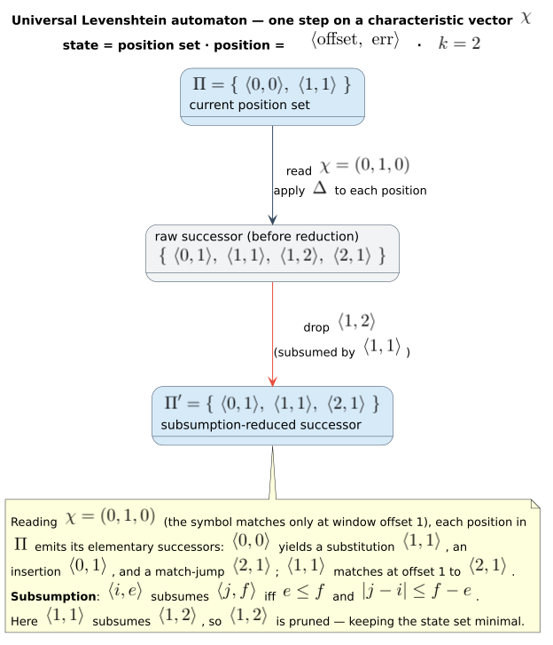

# 05 · Universal automata

> **Prerequisites:** [02 · Edit distance and Levenshtein automata](02-edit-distance-and-levenshtein-automata.md),
> [03 · The Levenshtein automaton as a transducer](03-levenshtein-as-transducer.md).
> **Defines:** query-parameterized vs. query-agnostic automata; the position set $`\Pi`$; the
> characteristic vector $`\chi(c, s)`$ and relevant subword $`s_n(w, i)`$; the reuse factory
> `BoundUniversalWfst`; the three position variants; and how duallity binds the theory to a WFST.
> **Symbols** are from the [master notation](README.md#master-notation) (see especially
> [Automaton state functions](README.md#automaton-state-functions)).

A parameterized Levenshtein automaton bakes the query into its transitions, so a fresh automaton must
be built for every query. The **universal** automaton does the opposite: it is built **once per error
bound $`k`$**, mentions no query character at all, and is driven — for *any* query — by a small bit
vector computed on the fly. This chapter defines the universal automaton, proves that a single bit
vector per step carries all the query-dependent information (Theorem 5.2), proves the universal
automaton is isomorphic to the parameterized one while being reusable across queries (Theorem 5.3), and
proves its size depends only on $`k`$ — not on the alphabet or the query length (Theorem 5.4).

---

## 1. Two ways to build a Levenshtein automaton

Call an automaton **query-parameterized** when its transition relation refers to specific characters of
the query $`q`$, and **query-agnostic** when it does not. The automaton of chapter
[02](02-edit-distance-and-levenshtein-automata.md) is query-parameterized: its states are "query
position $`i`$ with $`e`$ errors", and its arcs test equality against literal characters $`q[i]`$. That
is fine for a one-off correction but wasteful for a service answering thousands of queries against the
same dictionary and the same bound $`k`$ — each query pays to rebuild an automaton of the same *shape*.

Mihov & Schulz [[2]](#references), building on Schulz & Mihov [[1]](#references), introduced the
**universal Levenshtein automaton** $`U_k`$: a single automaton, built **once per $`k`$**, that is
**independent of the query**. Its states are not "query position $`i`$" but abstract, subsumption-reduced
sets of *positions-with-errors* relative to a moving head; the query and the candidate term enter only
through a bit vector computed at each step. duallity wraps it as `UniversalLevenshteinWfst<V, D>` and
the reuse factory `BoundUniversalWfst<V, D>`.

---

## 2. The position set, the relevant subword, and the characteristic vector

### 2.1 Positions and the state set $`\Pi`$

A **position** records how far a partial alignment has advanced and at what cost. In the parameterized
automaton a position is a pair $`(i, e)`$ — query index $`i`$ consumed, $`e \le k`$ errors used. In the
universal automaton positions are *relative* to the current input head and carry a kind tag, written
$`\langle \mathrm{offset},\ \mathrm{errors},\ \mathrm{type} \rangle`$. A **universal state** is a
subsumption-reduced set of such positions,

```math
\Pi \;=\; \bigl\{\, \langle \mathrm{offset}_1, e_1, \tau_1\rangle,\ \ldots,\ \langle \mathrm{offset}_p, e_p, \tau_p\rangle \,\bigr\},
```

with $`\mathrm{offset}_j \in \{-k, \ldots, +k\}`$ and $`e_j \in \{0, \ldots, k\}`$ (master notation:
[$`\Pi`$](README.md#automaton-state-functions)). *Subsumption reduction* discards any position dominated
by another (same or fewer errors reachable at the same or better offset), keeping $`\Pi`$ small.
liblevenshtein represents $`\Pi`$ as `UniversalState<V>`; duallity interns each distinct
$`(\Pi,\ \text{query-label cursor})`$ pair to a dense id in `UniversalStateRegistry`
(`universal_state_support.rs`).

### 2.2 The relevant subword $`s_n(w, i)`$

To decide a step, the automaton needs only the slice of the fixed word that a distance-$`k`$ alignment
could still touch around the current position — the **relevant subword**
[$`s_n(w, i)`$](README.md#automaton-state-functions). With radius $`n`$, out-of-range left positions
padded by the sentinel `$` (which matches no real character), and $`1`$-indexed positions,

```math
s_n(w, i) \;=\; \underbrace{\texttt{\$} \cdots \texttt{\$}}_{(\,n + 1 - i\,)^{+}}\;
w\bigl[\, \max(i - n,\, 1) \,\mathbin{..}\, \min(\lvert w \rvert,\ i + n + 1) \,\bigr],
\qquad (\cdot)^{+} = \max(\cdot, 0).
```

For a distance-$`k`$ automaton the **radius is the error bound**, $`n = k`$, so the window is
$`s_k(q, i+1)`$ when the head sits just before query position $`i`$. This is exactly duallity's
`relevant_subword_at(word, max_distance, position)` (`universal_state_support.rs`); e.g.
`relevant_subword_at("abcdef", 2, 1)` returns `$$abcd` (two sentinels, then the first
$`2k = 4`$ characters). The window spans at most $`2k + 1`$ real characters centred on the head —
exactly the diagonal band of chapter [02](02-edit-distance-and-levenshtein-automata.md), now slid along
the term. duallity precomputes one window per dictionary depth: at depth $`d`$ it uses
$`s_k(q,\, d{+}1)`$ (`precompute_relevant_subwords`).

### 2.3 The characteristic vector $`\chi(c, s)`$

Given a candidate character $`c`$ and a window $`s`$, the **characteristic vector**
[$`\chi(c, s)`$](README.md#automaton-state-functions) is the bit vector marking where $`c`$ occurs in
$`s`$:

```math
\chi(c, s) \;=\; (b_1, b_2, \ldots, b_r), \qquad b_j = \begin{cases} 1 & \text{if } s_j = c, \\ 0 & \text{otherwise,} \end{cases}
```

where $`r = \lvert s \rvert \le 2k + 1`$ (plus sentinels). Sentinel cells are always $`0`$ (no real
character equals `$`), so **$`\chi`$ folds the end-of-query boundary into its bits**. This is
duallity's `CharacteristicVector::new(c, s)`. Because the universal automaton consumes
$`\chi(c, s)`$ — *not* the literal character $`c`$ — the *same* automaton serves every query; only the
bit vector changes.


In the figure, $`w = \texttt{hello}`$, $`k = 1`$, head at position $`i = 2`$: the window is
$`s_1(\texttt{hello}, 2) = \texttt{ell}`$, and for candidate character $`c = \texttt{l}`$ the characteristic vector
is $`\chi(\texttt{l}, \texttt{ell}) = (0, 1, 1)`$. The automaton consumes $`(0, 1, 1)`$ and steps; it
never sees the letter `l`.

---

## 3. Reuse across queries: `BoundUniversalWfst`

duallity exposes the reuse explicitly. `BoundUniversalWfst<V, D>` stores a dictionary, a position
variant $`V`$, and a `max_distance` $`k`$ — and *nothing query-specific* (its only other field is
`PhantomData<V>`). Each call to `with_query(q)` mints a fresh lazy `UniversalLevenshteinWfst` that
reuses that fixed $`(D, k, V)`$ configuration, driving the query-agnostic transition function $`U_k`$
with the $`\chi`$-stream of $`q`$:


```rust,ignore
use duallity::BoundUniversalWfst;
use liblevenshtein::transducer::universal::Standard;
use libdictenstein::dynamic_dawg::char::DynamicDawgChar;

let dict  = DynamicDawgChar::<()>::from_terms(vec!["hello", "world", "help"]);
let bound = BoundUniversalWfst::<Standard, _>::new(dict, 2);   // fix (D, k=2, V=Standard)
let w1 = bound.with_query("helo");   // lazy WFST, reuses the query-agnostic core
let w2 = bound.with_query("wrld");   // another query, same core
```

`max_distance` is a `u8` for the universal, generalized, and phonetic WFSTs (it is `usize` for
`LevenshteinWfst`/`WallBreakerWfst`).

### Position variants

The type parameter $`V \in \{\textsf{Standard},\ \textsf{Transposition},\ \textsf{MergeAndSplit}\}`$
(master notation: [$`V`$](README.md#automaton-state-functions)) selects the metric the universal
automaton encodes:

| $`V`$ | Metric | Adds |
|-------|--------|------|
| `Standard` | Levenshtein $`d_{\mathrm{lev}}`$ | match, substitute, insert, delete |
| `Transposition` | Damerau–Levenshtein $`d_{\mathrm{DL}}`$ | adjacent-swap as a unit-cost operation |
| `MergeAndSplit` | merge/split | one↔two character merges and splits (useful for OCR) |

These are the same families catalogued for the generalized automaton in chapter
[07](07-regular-language-limits.md).

---

## 4. How duallity binds the theory to a WFST

The universal automaton is an *acceptor* over bit-vector sequences; duallity wraps WFST labels around
it. For a query $`q`$ and a dictionary path prefix of depth $`d`$, duallity treats **$`q`$ as the fixed
word** and the **dictionary path as the processed input**. The next dictionary character $`c`$ therefore
drives the automaton through

```math
s_k(q,\, d + 1), \qquad \chi\bigl(c,\ s_k(q,\, d + 1)\bigr).
```

The product state stores the dictionary node, the universal state $`\Pi`$, and the exact consumed
query-label cursor. The dictionary depth is held in `DepthDictionaryNodeRegistry`; the query-label
cursor is part of the `UniversalStateRegistry` key. This exact cursor is why the implementation no
longer estimates a query position from abstract universal offsets — the regression test
`test_universal_state_source_tracks_exact_query_position` pins it.

### Weights live only in the final weight

**Universal transitions carry the tropical multiplicative identity $`\bar{1} = 0`$** — every
dictionary-edge and deletion-continuation arc is emitted with `TropicalWeight::one()`
(`universal_state_source.rs`), spelling only the input/output label pair. The edit cost is attached
**once**, at the **final weight**, computed from the accepting universal state. This deliberate split
avoids double counting: if each error arc also carried cost $`1`$, a $`k`$-error path would be charged
$`k`$ along the way *and* $`k`$ at the end. Concretely, the final weight is `universal_accepting_weight`
composed with `is_final` on the dictionary node (`registered_final_weight`); Theorem 5.3 proves it
equals $`d_{\mathrm{lev}}(q, w)`$.

---

## 5. Theorem 5.2 — characteristic-vector sufficiency

**Theorem 5.2.** For the distance-$`k`$ Levenshtein automaton $`A(q, k)`$, the set of elementary
transitions available from a position $`(i, e)`$ on reading the next candidate character $`c`$ depends
on the query $`q`$ **only** through the characteristic vector $`\chi\bigl(c,\ s_k(q, i+1)\bigr)`$. That
is, there is a query-independent function $`\hat{\delta}`$ with

```math
\delta_q(i, e, c) \;=\; \hat{\delta}\bigl(i, e,\ \chi(c, s_k(q, i+1))\bigr).
```

**Proof.** The automaton reads the candidate word symbol by symbol (the dictionary path is the
processed input; § 4). From position $`(i, e)`$, reading $`c`$, write the window $`s = s_k(q, i+1)`$ and
$`\chi = \chi(c, s) = (b_1, \ldots, b_r)`$, and enumerate the four elementary operations
(chapter [03](03-levenshtein-as-transducer.md); Schulz & Mihov [[1]](#references)). The candidate
character $`c`$ occupies the alignment slot against $`q`$, so $`b_1`$ is the bit "$`c = q[i]`$" (the next
unconsumed query character sits at the first non-sentinel window cell).

| Operation | Guard | Successor | Local cost | Query-dependence |
|-----------|-------|-----------|:----------:|------------------|
| **Match** (M) | $`i < n`$ and $`b_1 = 1`$ | $`(i + 1,\ e)`$ | $`0`$ | the bit $`b_1`$ of $`\chi`$ |
| **Substitute** (S) | $`i < n`$ and $`e < k`$ | $`(i + 1,\ e + 1)`$ | $`1`$ | none |
| **Insert** (I) | $`e < k`$ | $`(i,\ e + 1)`$ | $`1`$ | none |
| **Delete** (D) | $`i < n`$ and $`e < k`$ | $`(i + 1,\ e + 1)`$ | $`1`$ | none |

Read the "query-dependence" column. **Substitute**, **Insert**, and **Delete** are pure error moves:
their guards test only $`e < k`$ (a constant) and $`i < n`$, and their targets are arithmetic on
$`(i, e)`$ and the constant $`k`$ — no reference to $`q`$'s characters. **Match** is the only operation
that inspects $`q`$, and it inspects it *exactly* through the equality $`c = q[i]`$, which is the bit
$`b_1`$ of $`\chi`$. The boundary guard $`i < n`$ (with $`n = \lvert q \rvert`$) is likewise absorbed
into $`\chi`$: positions beyond $`\lvert q \rvert`$ are sentinel-padded in $`s_k(q, i+1)`$, and a
sentinel matches no real $`c`$, so the corresponding bit is forced to $`0`$ — attempting to match past
the query end yields $`b_1 = 0`$ and the M-arc simply does not fire. (Schulz & Mihov's
subsumption-reduced form uses the further bits $`b_2, \ldots, b_r`$ to fold "match after
$`\delta`$ deletions" into a single step; each such shortcut still reads only bits of the *same*
$`\chi`$.) Therefore every guard and every target is a function of $`(i, e)`$ and the bits of
$`\chi(c, s_k(q, i+1))`$ alone. Define $`\hat{\delta}(i, e, \chi)`$ to be the set of successors so
produced; then $`\delta_q(i, e, c) = \hat{\delta}(i, e, \chi(c, s_k(q, i+1)))`$, with $`\hat{\delta}`$
independent of $`q`$. $`\blacksquare`$

This factoring is exactly duallity's implementation: the successor is computed by
`automaton_state.transition_with_consumption(&bit_vector, consumes_query, matched)`
(`universal_state_source.rs`), whose *only* query-dependent argument is `bit_vector` $`= \chi(c, s)`$.
The two booleans are label bookkeeping, not query content. Mihov & Schulz [[2]](#references) prove the
same factoring for the full universal construction and every variant $`V`$.



---

## 6. Theorem 5.3 — universal ≅ parameterized, with query-agnostic reuse

> **Theorem 5.3.** Fix $`k`$ and a variant $`V`$. Let $`A(q, k)`$ be the query-parameterized automaton
> of chapter [02](02-edit-distance-and-levenshtein-automata.md) and $`U_k`$ the query-agnostic universal
> automaton. Then for every query $`q`$ and candidate $`w = w_1 \cdots w_m`$:
>
> 1. **(Run isomorphism)** driving $`U_k`$ with the $`\chi`$-stream of $`q`$ yields runs in
>    weight-preserving bijection with the runs of $`A(q, k)`$ on $`w`$;
> 2. **(Acceptance)** the minimal accepting weight equals $`d_{\mathrm{lev}}(q, w)`$ whenever
>    $`w \in L(q, k)`$, and this weight is computed by duallity's `universal_accepting_weight`;
> 3. **(Reuse)** because $`U_k`$ mentions no query character, it is built once per $`k`$; per-query
>    construction is amortized $`\mathcal{O}(1)`$ in the automaton core.

**Proof of (1).** Feed $`U_k`$ the vectors $`\chi_t = \chi\bigl(w_t,\ s_k(q, t)\bigr)`$ for
$`t = 1, \ldots, m`$ (reading $`w_t`$ at dictionary depth $`d = t - 1`$ uses the window at position
$`d + 1 = t`$; § 4). Let $`\Pi_t^{A}`$ and $`\Pi_t^{U}`$ be the position sets of $`A(q, k)`$ and $`U_k`$
after $`t`$ symbols. We show $`\Pi_t^{A} = \Pi_t^{U}`$ for all $`t`$ by induction on $`t`$.

*Base ($`t = 0`$).* $`A(q, k)`$ starts in $`\{(0, 0)\}`$ (zero query characters consumed, zero errors).
$`U_k`$ starts in `UniversalState::initial(k)`, which `UniversalStateRegistry::new(k)` registers as id
$`0`$ — the same singleton position set. So $`\Pi_0^{A} = \Pi_0^{U}`$.

*Step.* Assume $`\Pi_t^{A} = \Pi_t^{U} =: \Pi`$. Reading $`w_{t+1}`$, the parameterized successor set is
$`\bigl(\bigcup_{(i,e) \in \Pi} \delta_q(i, e, w_{t+1})\bigr)`$ after subsumption reduction. By
Theorem 5.2, $`\delta_q(i, e, w_{t+1}) = \hat{\delta}(i, e, \chi(w_{t+1}, s_k(q, t+1))) = \hat{\delta}(i, e, \chi_{t+1})`$.
The universal successor set is $`\bigl(\bigcup_{(i,e) \in \Pi} \hat{\delta}(i, e, \chi_{t+1})\bigr)`$
after the *same* subsumption reduction. The two unions are over the same $`\Pi`$ with the same
$`\hat{\delta}`$ and the same reduction, hence equal: $`\Pi_{t+1}^{A} = \Pi_{t+1}^{U}`$. The
correspondence "same position set at every step" is a bijection on runs. It is weight-preserving because
*both* automata carry $`\bar{1} = 0`$ on every structural arc (§ 4; chapter
[03](03-levenshtein-as-transducer.md) defers edit cost to the final weight), so every partial run weight
is $`\bar{1}`$ on both sides.

**Proof of (2).** A position set $`\Pi`$ (reached after reading $`d`$ candidate symbols, against the
fixed word $`q`$ of length $`n = \lvert q \rvert`$) is *accepting* iff it contains a position whose
remaining fixed-word suffix fits the remaining error budget — Schulz & Mihov's Proposition 11
[[1]](#references) — and the least accepting total over such positions is $`d_{\mathrm{lev}}(q, w)`$
when $`w \in L(q, k)`$. This criterion is exactly `universal_accepting_weight(state, n, d)`
(`universal_state_support.rs`), which minimizes over the positions of $`\Pi`$ as follows.

- **In-progress ("I-type") position $`\langle \mathrm{offset}, e\rangle`$.** Its query index is
  $`\text{cur} = d + \mathrm{offset}`$ (`apply_i32_offset(processed_input_len, offset)`), the remaining
  query characters are $`\text{rem} = n - \text{cur}`$, and the remaining budget is $`k - e`$. The
  position accepts iff $`\text{rem} \le k - e`$ — the whole remaining query suffix can be *deleted*
  within budget — contributing weight $`e + \text{rem}`$ (errors so far, plus one unit per deleted tail
  character). This mirrors chapter [03](03-levenshtein-as-transducer.md)'s final weight
  $`\mathrm{rem} = n - i`$ exactly.
- **Matched ("M-type") position $`\langle \mathrm{offset}, e\rangle`$.** When the fixed word is already
  consumed at or before this position ($`\mathrm{offset} \le 0`$) and $`e \le k`$, there is no remaining
  suffix; it accepts with weight $`e`$.

`universal_accepting_weight` returns the minimum of these contributions over all positions of $`\Pi`$;
`registered_final_weight` gates it behind `dict_node.is_final()` so that the dictionary path spells a
real word. By Proposition 11 that minimum is $`d_{\mathrm{lev}}(q, w)`$, matching the parameterized
automaton's final weight from part (1). The `Standard` regression suite pins the concrete values:
`test_universal_state_source_weights_paths_by_final_edit_distance` asserts weight $`0`$ for
`cat`↔`cat` and weight $`1`$ for `b`↔`a`, `tet`↔`test`, `at`↔`cat`, and `cat`↔`at` — substitution,
insertion, and deletion cases, each recovered by `universal_accepting_weight` as the true edit
distance $`d_{\mathrm{lev}}(q, w)`$. (The suite pins the accepting weight; it does not itself assert
which position of $`\Pi`$ attains the minimum — that is the content of the argument above.)

**Proof of (3).** By Theorem 5.2 the transition function $`\hat{\delta}`$ of $`U_k`$ is independent of
$`q`$; it is fixed once $`k`$ and $`V`$ are chosen (it is `liblevenshtein`'s
`transition_with_consumption` for variant $`V`$, compiled once). `BoundUniversalWfst` stores only
$`(D, k, V)`$ and no query state, so `with_query(q)` re-derives *no* automaton structure — it allocates
only the per-query $`\chi`$-driver: `precompute_relevant_subwords` is $`\mathcal{O}(\lvert q \rvert + k)`$, and the
initial `UniversalStateRegistry` holds a single state. Amortized over a stream of $`Q`$ queries, the
cost of the query-agnostic core is $`\mathcal{O}(1)`$ per query — versus the parameterized automaton, which must
re-derive its entire transition relation from $`q`$'s characters every time. $`\blacksquare`$

---

## 7. Theorem 5.4 — $`\lvert\Sigma\rvert`$-independence

> **Theorem 5.4.** The number of states of the universal automaton $`U_k`$ depends only on the error
> bound $`k`$ and the variant $`V`$ — **not** on the alphabet size $`\lvert \Sigma \rvert`$, and **not**
> on the query length $`n = \lvert q \rvert`$.

**Proof.** A state of $`U_k`$ is a subsumption-reduced set of positions
$`\langle \mathrm{offset}, e, \tau\rangle`$ with $`\mathrm{offset} \in \{-k, \ldots, +k\}`$,
$`e \in \{0, \ldots, k\}`$, and $`\tau`$ ranging over the finite kind tags of variant $`V`$ (§ 2.1).
The number of *reduced* such sets is therefore bounded by a function $`B(k, V)`$ of $`k`$ and $`V`$
alone. Independence of the two other quantities:

- **Alphabet ($`\lvert \Sigma \rvert`$).** By Theorem 5.2 every transition is driven by a
  characteristic vector $`\chi \in \{0, 1\}^{r}`$ with $`r \le 2k + 1`$ (plus sentinels). The set of
  possible driving symbols is thus the bounded set of bit vectors, of size $`\le 2^{\,2k+1}`$, whatever
  $`\Sigma`$ is: reading *any* character $`c`$ reduces to reading its $`\le (2k{+}1)`$-bit vector. Hence
  neither the state set nor the transition table grows with $`\lvert \Sigma \rvert`$. This is the
  finite-state model of Rabin & Scott [[3]](#references) in its sharpest form — a fixed, finite control
  whose alphabet is the characteristic vectors, not the (possibly enormous, here Unicode) character
  alphabet.
- **Query length ($`n`$).** Offsets are *relative* to the moving head, not absolute query indices, and
  the window $`s_k(q, i+1)`$ has bounded width $`\le 2k + 1`$. Sliding the head along $`q`$ (increasing
  the depth $`d`$) therefore reuses the *same* finite position vocabulary at every step; the state set
  does not grow with $`n`$.

Thus $`\lvert Q_{U_k} \rvert \le B(k, V) = O_k(1)`$, independent of $`\lvert \Sigma \rvert`$ and $`n`$.
$`\blacksquare`$

> **The $`n`$-factor in $`M_{\mathrm{uni}}`$ is bookkeeping, not automaton states.** duallity's
> product-encoding radix is $`M_{\mathrm{uni}} = (n{+}1)^2 (2k{+}1)`$ (master notation:
> [$`M_{\mathrm{uni}}`$](README.md#state-encoding-the-product-automaton);
> `universal_query_state_factor` $`= n{+}1`$ times `estimate_automaton_states` $`= (n{+}1)(2k{+}1)`$).
> The $`n`$ appears because duallity's **product** encoding indexes
> $`(\text{universal state},\ \text{absolute query-label cursor})`$ pairs across dictionary nodes so the
> WFST can spell exact labels (§ 4) — bookkeeping *outside* the abstract $`U_k`$. Theorem 5.4 concerns
> $`U_k`$ itself, whose state count is $`O_k(1)`$; the registry only ever materializes the reachable
> subset.

---

## 8. Worked example: one `BoundUniversalWfst`, two queries

Build the factory **once** at $`k = 2`$, then serve two unrelated queries from the same query-agnostic
core:

```rust,ignore
use duallity::BoundUniversalWfst;
use liblevenshtein::transducer::universal::Standard;
use libdictenstein::dynamic_dawg::char::DynamicDawgChar;

let dict  = DynamicDawgChar::<()>::from_terms(vec!["hello", "world", "help"]);
let bound = BoundUniversalWfst::<Standard, _>::new(dict, 2);   // core fixed once: (D, k=2, Standard)

let _w1 = bound.with_query("helo");   // query A
let _w2 = bound.with_query("wrld");   // query B — same core, no rebuild
```

**A $`\chi`$ step, side by side.** At the start state each WFST reads the first dictionary character at
depth $`d = 0`$, so the window is $`s_2(q, 1)`$ (`relevant_subword_for_depth(0)`):

| query $`q`$ | window $`s_2(q, 1)`$ | read $`c`$ | $`\chi(c,\, s_2(q,1))`$ | universal step |
|-------------|----------------------|:----------:|-------------------------|----------------|
| `helo` | `$$helo` | `h` | $`(0, 0, 1, 0, 0, 0)`$ | match at the first real cell |
| `wrld` | `$$wrld` | `w` | $`(0, 0, 1, 0, 0, 0)`$ | match at the first real cell |

The windows differ (`$$helo` vs `$$wrld`) and the characters differ (`h` vs `w`), yet both reduce to the
**identical** vector $`(0, 0, 1, 0, 0, 0)`$ — a single `1` at the first non-sentinel cell (index $`2`$,
after the two sentinels for $`k - d = 2`$). So the *same* transition fires from the *same* $`U_2`$ state
in both runs. This is Theorem 5.3(3) and Theorem 5.4 made concrete: the automaton consumes the bit
vector, never the letter, so `helo` and `wrld` traverse one shared machine. Only the final weight then
specializes per query — `universal_accepting_weight` reads each run's accepting position set against its
own $`\lvert q \rvert`$ (§ 4) to report $`d_{\mathrm{lev}}`$.

---

## See also

- [02 · Edit distance and Levenshtein automata](02-edit-distance-and-levenshtein-automata.md) — the parameterized automaton $`A(q, k)`$ this chapter universalizes.
- [03 · The Levenshtein automaton as a transducer](03-levenshtein-as-transducer.md) — the four operations and the final-weight convention reused here.
- [04 · Composition](04-composition.md) — the fold a `UniversalLevenshteinWfst` drops into as an operand.
- [07 · Regular-language limits](07-regular-language-limits.md) — the position variants $`V`$ and the generalized automaton.
- [architecture/03 · State encoding and the product space](../architecture/03-state-encoding-and-product-space.md) — the registry encoding and $`M_{\mathrm{uni}}`$.
- [architecture/04 · Lazy evaluation and caching](../architecture/04-lazy-evaluation-and-caching.md) — the lazy expansion `with_query` produces.

## References

1. **Schulz, K. U., & Mihov, S.** (2002). *Fast String Correction with Levenshtein Automata.*
   International Journal on Document Analysis and Recognition (IJDAR) 5(1), 67–85.
   [doi:10.1007/s10032-002-0082-8](https://doi.org/10.1007/s10032-002-0082-8) — the elementary
   transitions, the relevant subword, and Proposition 11 (the acceptance criterion).
2. **Mihov, S., & Schulz, K. U.** (2004). *Fast Approximate Search in Large Dictionaries.* Computational
   Linguistics 30(4), 451–477.
   [doi:10.1162/0891201042544938](https://doi.org/10.1162/0891201042544938) — the universal automaton
   and its characteristic-vector transition function for every variant.
3. **Rabin, M. O., & Scott, D.** (1959). *Finite Automata and Their Decision Problems.* IBM Journal of
   Research and Development 3(2), 114–125.
   [doi:10.1147/rd.32.0114](https://doi.org/10.1147/rd.32.0114) — the finite-state model: a fixed,
   finite control independent of input length.
