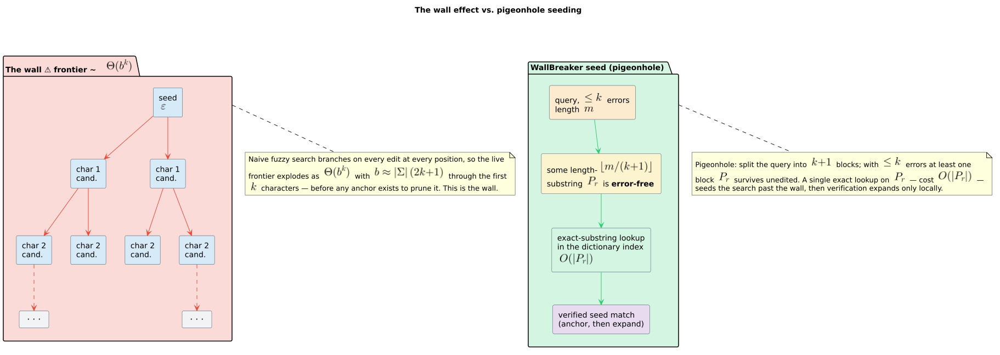

# 06 · WallBreaker and the wall effect

> **Prerequisites:** [02 · Edit distance and Levenshtein automata](02-edit-distance-and-levenshtein-automata.md),
> [03 · The Levenshtein automaton as a transducer](03-levenshtein-as-transducer.md).
> **Defines:** the *wall effect*; the four WallBreaker stages (pigeonhole split, SCDAWG
> exact-substring seeding, bidirectional extension, verify + deduplicate); the *result-forest* WFST.

All symbols follow the [master notation table](README.md#master-notation); the few that are local to
this chapter — the trie branching factor `` $`b`$ ``, the piece count `` $`p`$ ``, the pieces
`` $`P_j`$ ``, and the variant distance `` $`d_V`$ `` — are defined at first use below.

The plain Levenshtein automaton of chapter [02](02-edit-distance-and-levenshtein-automata.md) is
superb when the error bound `` $`k`$ `` is small and useless when it is large. This chapter explains
*why* (the **wall effect**, Theorem 6.1), then develops the algorithm duallity uses to defeat it —
**WallBreaker** (Gerdjikov, Mihov, Mitankin & Schulz, 2013 [[1]](#references)) — proving its two
combinatorial engines (Theorems 6.2–6.3), its end-to-end correctness (Theorem 6.4), and the
faithfulness of the WFST view duallity exposes over its results (Theorem 6.5).

---

## 1. The wall effect

The automaton of chapter [02](02-edit-distance-and-levenshtein-automata.md) traverses the dictionary
`` $`D`$ `` **left to right**, keeping only nodes whose partial edit cost is still within budget. Its
reachable band has width `` $`2k+1`$ ``, so once matching has begun the search is narrow. The problem
is the **beginning**: at the root nothing has been matched yet, so nothing can yet be *ruled out*.

> **Definition 6.1 (Wall effect).** During a left-to-right Levenshtein traversal under bound
> `` $`k`$ ``, no dictionary prefix of length `` $`\le k`$ `` can be pruned: deleting the whole prefix
> is an alignment of cost `` $`\le k`$ ``, so every such prefix remains a live candidate. The search
> must therefore expand the *entire* prefix frontier down to depth `` $`k`$ `` before the automaton
> can begin to discriminate. That mandatory, budget-blind expansion is the **wall**.

The wall is not a constant-factor nuisance; it grows exponentially in `` $`k`$ ``. Let `` $`b`$ `` be
the **branching factor** of the dictionary trie/DAWG — the maximum number of children of any node,
so `` $`b \le \lvert \Sigma \rvert`$ ``. Theorem 6.1 makes the growth precise.

### Theorem 6.1 (Wall-effect growth)

> **Theorem 6.1.** Let the plain Levenshtein automaton traverse a dictionary `` $`D`$ ``, presented as
> a trie/DAWG of branching factor at most `` $`b`$ ``, under error bound `` $`k`$ ``. Then:
>
> **(a) Liveness.** Every dictionary node at depth `` $`d \le k`$ `` is *live* — it cannot be pruned.
>
> **(b) Growth.** Let `` $`N_d`$ `` be the number of live nodes at depth `` $`d`$ ``. Then
> `` $`N_d \le \min(b^{d},\ \lvert D \rvert)`$ ``, and the frontier the traversal must expand through
> the first `` $`k`$ `` characters is `` $`F_k = \sum_{d=0}^{k} N_d = \Theta(b^{k})`$ ``
> whenever the dictionary branches fully to depth `` $`k`$ `` (`` $`N_d = \Theta(b^{d})`$ ``), and in
> every case `` $`F_k`$ `` is **capped by the dictionary size**: `` $`N_d \le \lvert D \rvert`$ `` for
> each `` $`d`$ ``, so `` $`F_k \le (k{+}1)\lvert D \rvert`$ ``.

**Proof.**

*(a) Liveness.* Model the traversal after chapter [02](02-edit-distance-and-levenshtein-automata.md):
at each dictionary node the automaton carries a set of active Levenshtein positions
`` $`\langle i, e \rangle`$ `` — query cursor `` $`i`$ ``, accumulated error `` $`e`$ `` — and prunes
a node exactly when **no** active position has `` $`e \le k`$ `` (equivalently, when the node's
minimal partial cost already exceeds `` $`k`$ ``). Fix any node `` $`\nu`$ `` at depth
`` $`d \le k`$ ``, reached by the dictionary prefix `` $`u = w[0 \mathbin{..} d]`$ `` of length
`` $`d`$ ``. The edit lattice `` $`\Delta`$ `` of chapter 02 has, in its top row, the entry

```math
\Delta[0, d] \;=\; d_{\mathrm{lev}}\!\bigl(\varepsilon,\ u\bigr) \;=\; \lvert u \rvert \;=\; d,
```

the cost of the alignment that consumes **zero** query characters and **deletes all** `` $`d`$ ``
characters of `` $`u`$ `` (one unit each). Because `` $`d \le k`$ ``, the position
`` $`\langle 0, d \rangle`$ `` is active at `` $`\nu`$ `` with error within budget. Hence `` $`\nu`$ ``
has a surviving position and is **not** pruned. As `` $`\nu`$ `` was an arbitrary node of depth
`` $`\le k`$ ``, every such node is live. This is precisely the "delete the whole prefix costs
`` $`\le k`$ `` `` $`\Rightarrow`$ `` non-prunable" mechanism of Definition 6.1
(Schulz & Mihov, 2002 [[2]](#references)).

*(b) Growth.* By part (a) the live nodes at depth `` $`d \le k`$ `` are **exactly** the distinct
dictionary prefixes of length `` $`d`$ ``; call their count `` $`N_d`$ ``. Two independent bounds hold:

- **Branching bound.** The root has `` $`N_0 = 1`$ `` node, and each node has at most `` $`b`$ ``
  children, so `` $`N_d \le b\,N_{d-1}`$ ``, giving `` $`N_d \le b^{d}`$ `` by induction on
  `` $`d`$ ``.
- **Dictionary bound.** Each of the `` $`\lvert D \rvert`$ `` terms contributes **at most one**
  length-`` $`d`$ `` prefix, so the number of *distinct* length-`` $`d`$ `` prefixes satisfies
  `` $`N_d \le \lvert D \rvert`$ ``.

Together `` $`N_d \le \min(b^{d},\ \lvert D \rvert)`$ ``. Summing over the first `` $`k`$ `` depths,
`` $`F_k = \sum_{d=0}^{k} N_d`$ ``. When the dictionary branches fully to depth `` $`k`$ `` (so
`` $`N_d = \Theta(b^{d})`$ `` before the dictionary bound bites), the sum is geometric and dominated
by its last term:

```math
F_k \;=\; \sum_{d=0}^{k} \Theta\!\bigl(b^{d}\bigr)
     \;=\; \Theta\!\left(\frac{b^{k+1} - 1}{b - 1}\right)
     \;=\; \Theta\!\bigl(b^{k}\bigr) \qquad (b \ge 2).
```

In general `` $`F_k \le \sum_{d=0}^{k} \lvert D \rvert = (k{+}1)\lvert D \rvert`$ ``: the exponential
growth continues only until `` $`b^{d}`$ `` saturates the dictionary size, after which each level
contributes at most `` $`\lvert D \rvert`$ ``. `` $`\blacksquare`$ ``

**What Theorem 6.1 means in practice.** For a 100-character pattern at `` $`k = 16`$ `` over a
750 000-word dictionary, the plain automaton is forced to materialise a depth-16 prefix frontier that
is `` $`\Theta(b^{16})`$ `` until it saturates the dictionary — millions of nodes expanded before a
single candidate can be discarded (Gerdjikov et al., 2013 [[1]](#references)). No amount of clever
band-pruning helps, because the band-pruning cannot *start* until depth `` $`k`$ ``. The wall is a
property of *where* the search begins, so the cure is to **start somewhere else**.



---

## 2. WallBreaker: jump past the wall

WallBreaker (Gerdjikov et al., 2013 [[1]](#references)) never grows candidates from the left. Instead
it **locates an exact piece of the query somewhere inside the dictionary first, then extends outward**
from that anchor. duallity wraps the algorithm as `WallBreakerWfst` (module `wallbreaker_wfst`); the
algorithm itself lives in `liblevenshtein::wallbreaker` and runs in four stages, all executed
**eagerly at construction** (`WallBreakerWfst::with_algorithm` calls `WallBreaker::with_algorithm(…)`,
then `wb.query(query)`, then `normalize_wallbreaker_results`).


The pipeline in literate form (one line of complexity precedes it; the anchor search is
`` $`O(\lvert P_j \rvert)`$ `` per piece and independent of `` $`k`$ ``):

```text
⟨WallBreaker query q against dictionary D under bound k, variant V⟩ ≡
  Input:   query q, substring dictionary D (SCDAWG), bound k, variant V
  Output:  R = { WallBreakerResult{term, distance} }  with  distance ≤ k
  1. pieces ← split(q, p)                     ▷ Stage 1: p = k+1 (Standard) or 2k+1 (Transp./M&S)
  2. seeds  ← ∅
  3. for each piece P in pieces:              ▷ Stage 2: exact-substring anchors
  4.     seeds ← seeds ∪ D.find_exact_substring(P)      ▷ SCDAWG, O(|P|), independent of k
  5. cand ← ∅
  6. for each seed s = (node, term-occurrence, offset) in seeds:
  7.     cand ← cand ∪ extend(s, q, k, V)      ▷ Stage 3: bidirectional DFS, distance ≤ k pruning
  8. R ← ∅ ; best : term ↦ distance
  9. for each c = (w, provisional_distance) in cand:      ▷ Stage 4: verify + dedup
 10.     δ ← exact_distance_V(q, w)             ▷ recompute with the metric for V
 11.     if δ ≤ k:  best[w] ← min(best[w], δ)   ▷ keep the minimum distance per term
 12. R ← { WallBreakerResult{w, best[w]} }
 13. return R
```

### Stage 1 — Pigeonhole split

Cut `` $`q`$ `` into `` $`p`$ `` contiguous **pieces** `` $`P_1, \dots, P_p`$ ``. The piece count
`` $`p`$ `` is chosen so the pigeonhole principle *guarantees* at least one piece survives the error
budget untouched (`PatternSplitter::num_pieces`):

| Variant `` $`V`$ `` | Pieces `` $`p`$ `` | Why (proved below) |
|---|---|---|
| `Standard` (Levenshtein) | `` $`k + 1`$ `` | each unit edit damages `` $`\le 1`$ `` piece ⇒ `` $`\le k`$ `` of `` $`k{+}1`$ `` damaged (Thm 6.2). |
| `Transposition` (Damerau–Levenshtein) | `` $`2k + 1`$ `` | a boundary-spanning transposition damages **two** adjacent pieces (Thm 6.3). |
| `MergeAndSplit` (OCR) | `` $`2k + 1`$ `` | a boundary-spanning merge/split damages **two** adjacent pieces (Thm 6.3). |


These counts are not folklore. They are the content of Theorems 6.2 and 6.3, and each is additionally
**mechanically verified in Coq** upstream (`liblevenshtein`'s
`docs/verification/wallbreaker/theories/Pigeonhole/WallBreakerPigeonhole.v`), with the explicit
counterexamples reproduced in Theorem 6.3.

### Stage 2 — SCDAWG exact-substring seeds

For each piece `` $`P_j`$ ``, look it up as an **exact substring** of the dictionary via
`SubstringDictionary::find_exact_substring`. The canonical implementor is the **SCDAWG** (Symmetric
Compact Directed Acyclic Word Graph): it indexes *every* substring of *every* dictionary term, so it
answers "where does this piece occur, and in which terms?" in time **linear in
`` $`\lvert P_j \rvert`$ `` and independent of `` $`k`$ ``**. Because at least one piece is
uncorrupted (Stage 1's guarantee), at least one lookup lands inside the matching term — this is the
move that vaults over the wall. Each hit is a **seed**: a dictionary node, a term occurrence, and the
offset of `` $`P_j`$ `` within it.

### Stage 3 — Bidirectional extension

From each seed, reconstruct the full term and re-derive its distance to the *whole* query by a small
Levenshtein-bounded depth-first search in **both** directions
(`liblevenshtein::wallbreaker::extension`, over `BidirectionalDictionaryNode`):

- **left** — walk *backward* toward the dictionary root via `parent()` / `parent_label()`, aligning
  the query prefix that precedes `` $`P_j`$ ``;
- **right** — walk *forward* toward the leaves via `edges()`, aligning the query suffix that follows
  `` $`P_j`$ ``, accepting only when the walk reaches a **terminal** node (a complete dictionary term).

Each step tries the operations of variant `` $`V`$ `` with `` $`\text{distance} \le k`$ `` pruning.
Because dictionary nodes are bidirectional, one code path serves both byte (`u8`) and Unicode
(`char`) dictionaries.

### Stage 4 — Verify and deduplicate

Extension distances are *provisional* (a DFS bound, not a proven metric value). Each candidate term is
**re-verified** with the exact distance function for the chosen variant, kept only if
`` $`\le k`$ ``, and deduplicated. In duallity this is `normalize_wallbreaker_results` (module
`wallbreaker_results`): it drops any result whose `distance > max_distance` (or whose distance is not
an exactly representable `f64`), collapses duplicate terms **keeping the minimum distance**
(`term_to_index`), and yields the survivors as `WallBreakerResult { term, distance }`.

---

## 3. Why the seeding is correct: the pigeonhole theorems

Fix a dictionary term `` $`w`$ `` and a partition of `` $`q`$ `` into `` $`p`$ `` contiguous,
non-empty pieces `` $`P_1, \dots, P_p`$ `` (so `` $`q = P_1 P_2 \cdots P_p`$ ``). Write `` $`d_V`$ ``
for the exact distance of the selected variant: `` $`d_{\mathrm{lev}}`$ `` for `Standard`,
`` $`d_{\mathrm{DL}}`$ `` for `Transposition`, and the merge/split distance `` $`d_{\mathrm{MS}}`$ ``
for `MergeAndSplit`. We show exactly when *some* piece is guaranteed to occur verbatim in `` $`w`$ ``.

### Theorem 6.2 (Pigeonhole seeding — Standard)

> **Theorem 6.2.** If `` $`p \ge k + 1`$ `` and `` $`d_{\mathrm{lev}}(q, w) \le k`$ ``, then at least
> one piece `` $`P_j`$ `` occurs as a **contiguous exact substring** of `` $`w`$ ``.

**Proof.** Fix an **optimal alignment** `` $`A`$ `` realising `` $`d_{\mathrm{lev}}(q, w) = t \le k`$ ``.
`` $`A`$ `` is a monotone sequence of unit operations, each of exactly one type: *match* (cost 0),
*substitution* (1), *deletion* of a query character (1), or *insertion* of a `` $`w`$ `` character
(1); and `` $`t = \#\text{sub} + \#\text{del} + \#\text{ins}`$ ``.

Call a query position **touched** if it is substituted or deleted (not matched). Call a piece
`` $`P_j = q[a \mathbin{..} b]`$ `` **damaged** if either

- **(i)** it contains a touched position, or
- **(ii)** an insertion of `` $`A`$ `` falls **strictly between** two consecutive positions of
  `` $`P_j`$ `` (a gap `` $`(i, i{+}1)`$ `` with both `` $`i, i{+}1 \in [a, b)`$ ``);

otherwise `` $`P_j`$ `` is **clean**.

*Claim A — a clean piece appears verbatim in `` $`w`$ ``.* If `` $`P_j`$ `` is clean, every position
in `` $`[a, b)`$ `` is matched, so each maps to an **equal** character of `` $`w`$ ``; and because no
insertion falls strictly inside `` $`P_j`$ ``, those images are **consecutive** in `` $`w`$ ``. Hence
`` $`w[a' \mathbin{..} a' + (b - a)] = q[a \mathbin{..} b] = P_j`$ `` for the image start `` $`a'`$ ``,
i.e. `` $`P_j`$ `` is an exact substring of `` $`w`$ ``.

*Claim B — `` $`\#\{\text{damaged pieces}\} \le t`$ ``.* Assign to each damaged piece a **witnessing
operation** located "in" it: if damaged by (i), pick a substitution or deletion at a position inside
`` $`P_j`$ ``; if damaged only by (ii), pick an insertion strictly interior to `` $`P_j`$ ``. This map
is **injective**:

- substitutions and deletions in different pieces are distinct operations, since their touched
  positions lie in **disjoint** intervals;
- an insertion strictly interior to `` $`P_j`$ `` sits in a gap `` $`(i, i{+}1)`$ `` with **both**
  endpoints in `` $`P_j`$ ``; such a gap belongs to at most one piece, so it cannot also be strictly
  interior to another piece;
- a substitution/deletion (attached to a **position**) is never the same operation as an insertion
  (attached to a **gap**).

Hence distinct damaged pieces receive distinct witnesses, so
`` $`\#\{\text{damaged}\} \le \#\{\text{operations}\} = t`$ ``.

*Fixed boundary convention (why border insertions damage nothing).* An insertion in a gap
`` $`(i, i{+}1)`$ `` where `` $`i`$ `` is the **last** position of `` $`P_j`$ `` and `` $`i{+}1`$ ``
the **first** of `` $`P_{j+1}`$ `` (or before `` $`P_1`$ `` / after `` $`P_p`$ ``) is **not** strictly
interior to any piece. It merely separates two pieces' images inside `` $`w`$ `` without breaking
either piece's internal contiguity, so it is charged to **no** piece. This is the fixed convention
that makes the witness map of Claim B well defined.

*Conclusion.* Combining the claims,
`` $`\#\{\text{damaged}\} \le t \le k < k + 1 \le p = \#\{\text{pieces}\}`$ ``, so at least one piece
is clean, and by Claim A it is an exact substring of `` $`w`$ ``. `` $`\blacksquare`$ ``

### Theorem 6.3 (Transposition / MergeAndSplit need `` $`2k+1`$ ``)

Under Damerau–Levenshtein or merge/split, a *single* edit can span a piece boundary and damage **two**
adjacent pieces, so `` $`k+1`$ `` pieces no longer suffice — but `` $`2k+1`$ `` do.

> **Theorem 6.3.**
> **(a) Insufficiency of `` $`k+1`$ ``.** For each of `` $`d_{\mathrm{DL}}`$ `` and
> `` $`d_{\mathrm{MS}}`$ `` there is a query `` $`q`$ ``, a bound `` $`k`$ ``, and a term `` $`w`$ ``
> with `` $`d_V(q, w) \le k`$ `` such that with `` $`p = k + 1`$ `` pieces **no** piece occurs in
> `` $`w`$ ``.
> **(b) Sufficiency of `` $`2k+1`$ ``.** If `` $`p \ge 2k + 1`$ `` and `` $`d_V(q, w) \le k`$ `` for
> `` $`V \in \{\textsf{Transposition}, \textsf{MergeAndSplit}\}`$ ``, then at least one piece occurs as
> an exact substring of `` $`w`$ ``.

**Proof.**

*(a) Counterexamples.*

**Transposition.** Let `` $`q = \texttt{ABCDE}`$ ``, `` $`k = 2`$ ``, so `` $`p = k + 1 = 3`$ ``.
Splitting 5 characters into 3 pieces gives `` $`P_1 = \texttt{AB}`$ ``, `` $`P_2 = \texttt{CD}`$ ``,
`` $`P_3 = \texttt{E}`$ ``. Take `` $`w = \texttt{ACBDX}`$ ``. Then
`` $`d_{\mathrm{DL}}(q, w) = 2 \le k`$ ``: one adjacent transposition `` $`\texttt{BC} \to \texttt{CB}`$ ``
(unit cost under Damerau–Levenshtein) plus one substitution `` $`\texttt{E} \to \texttt{X}`$ ``. Check
each piece against `` $`w = \texttt{A\,C\,B\,D\,X}`$ ``:

- `` $`\texttt{AB}`$ ``? No — `` $`\texttt{A}`$ `` is followed by `` $`\texttt{C}`$ ``.
- `` $`\texttt{CD}`$ ``? No — the transposition moved `` $`\texttt{C}`$ `` left of `` $`\texttt{B}`$ ``,
  so `` $`\texttt{C}`$ `` is now followed by `` $`\texttt{B}`$ `` and `` $`\texttt{D}`$ `` follows
  `` $`\texttt{B}`$ ``.
- `` $`\texttt{E}`$ ``? No — substituted to `` $`\texttt{X}`$ ``.

The single transposition of `` $`\texttt{B}`$ `` (last of `` $`P_1`$ ``) and `` $`\texttt{C}`$ ``
(first of `` $`P_2`$ ``) **straddles the `` $`P_1 \mid P_2`$ `` boundary and damages both**, while the
substitution damages `` $`P_3`$ ``. Two edits damage all three pieces; `` $`k+1`$ `` fails.

**MergeAndSplit.** Let `` $`q = \texttt{abcdef}`$ ``, `` $`k = 2`$ ``, `` $`p = 3`$ ``, giving
`` $`P_1 = \texttt{ab}`$ ``, `` $`P_2 = \texttt{cd}`$ ``, `` $`P_3 = \texttt{ef}`$ ``. Take
`` $`w = \texttt{aXYf}`$ ``. Under the merge/split metric `` $`d_{\mathrm{MS}}(q, w) = 2 \le k`$ `` via
two two-into-one steps relating `` $`\texttt{bc}`$ `` to `` $`\texttt{X}`$ `` and `` $`\texttt{de}`$ ``
to `` $`\texttt{Y}`$ ``. Check each piece against `` $`w = \texttt{a\,X\,Y\,f}`$ ``:
`` $`\texttt{ab}`$ ``? No. `` $`\texttt{cd}`$ ``? No. `` $`\texttt{ef}`$ ``? No. The step on
`` $`\texttt{bc}`$ `` straddles `` $`P_1 \mid P_2`$ `` (damages both); the step on `` $`\texttt{de}`$ ``
straddles `` $`P_2 \mid P_3`$ `` (damages both). Two edits damage all three pieces; `` $`k+1`$ `` fails.

*(b) Sufficiency of `` $`2k+1`$ ``.* Extend the accounting of Theorem 6.2 to the richer operation set.
The key geometric fact is that **every single operation consumes at most two consecutive query
characters**, hence has a query-footprint meeting **at most two adjacent pieces**:

| Operation | Query characters consumed | Pieces it can meet |
|---|---|---|
| match / substitution / deletion | 1 (one position) | `` $`\le 1`$ `` |
| insertion | 0 (one gap) | `` $`\le 1`$ `` interior (border insertions: 0, by the convention of Thm 6.2) |
| adjacent transposition | 2 (two positions) | `` $`\le 2`$ `` |
| merge (two-into-one) | 1 | `` $`\le 1`$ `` |
| split (one-into-two) | 2 | `` $`\le 2`$ `` |

A block of at most two consecutive query positions straddles at most **one** piece boundary, so it
meets at most **two** adjacent pieces; therefore any single operation damages at most two pieces. Now
count by covering: each damaged piece is damaged by at least one operation, and each operation damages
at most two pieces, so

```math
\#\{\text{damaged pieces}\} \;\le\; \sum_{\text{operations } o} \#\{\text{pieces } o \text{ damages}\}
\;\le\; 2\,t \;\le\; 2k .
```

With `` $`p \ge 2k + 1`$ `` pieces, `` $`\#\{\text{clean}\} \ge (2k+1) - 2k = 1`$ ``, so at least one
piece survives and (by Claim A of Theorem 6.2, which is metric-independent) occurs as an exact
substring of `` $`w`$ ``. The counterexamples of part (a) exhibit an operation damaging exactly two
pieces, so the bound `` $`2`$ `` is tight and `` $`2k+1`$ `` cannot be lowered. `` $`\blacksquare`$ ``

Both bounds are additionally mechanised in Coq upstream — Standard `` $`k+1`$ ``, Transposition and
MergeAndSplit `` $`2k+1`$ `` — in `WallBreakerPigeonhole.v`, with the very counterexamples
`` $`\texttt{ABCDE} \to \texttt{ACBDX}`$ `` and `` $`\texttt{abcdef} \to \texttt{aXYf}`$ `` above
(Gerdjikov et al., 2013 [[1]](#references)).

---

## 4. WallBreaker soundness and completeness

The pigeonhole theorems power **completeness**; the verify step powers **soundness**. Together they
pin the returned set exactly.

### Theorem 6.4 (WallBreaker soundness & completeness)

> **Theorem 6.4.** For query `` $`q`$ ``, bound `` $`k`$ ``, variant `` $`V`$ ``, and dictionary
> `` $`D`$ ``, let `` $`R`$ `` be the normalized WallBreaker result set. Then `` $`R = L_V(q, k) \cap D = \{\, w \in D : d_V(q, w) \le k \,\}`$ ``,
> where `` $`L_V(q,k)`$ `` is the variant-`` $`V`$ `` neighborhood of `` $`q`$ ``.

**Proof.** We prove the two inclusions.

*Soundness (`` $`R \subseteq L_V(q,k) \cap D`$ ``).* Every candidate arises from a seed inside a
dictionary term and a bidirectional extension that terminates at a **terminal** dictionary node, so
each returned `` $`w`$ `` is a genuine element of `` $`D`$ ``. Stage 4 then recomputes the **exact**
distance `` $`\delta = d_V(q, w)`$ `` and, in `normalize_wallbreaker_results`, discards `` $`w`$ ``
unless `` $`\delta \le k`$ `` (the guard `distance > max_distance ⇒ continue`, plus the
representability guard). The distance stored per surviving term is the **minimum** over duplicates.
Hence every `` $`w \in R`$ `` satisfies `` $`w \in D`$ `` and `` $`d_V(q, w) \le k`$ ``, i.e.
`` $`w \in L_V(q,k) \cap D`$ ``.

*Completeness (`` $`L_V(q,k) \cap D \subseteq R`$ ``).* Take any `` $`w \in D`$ `` with
`` $`d_V(q, w) \le k`$ ``. Stage 1 splits `` $`q`$ `` into `` $`p`$ `` pieces with `` $`p = k+1`$ ``
(Standard) or `` $`p = 2k+1`$ `` (Transposition, MergeAndSplit). By Theorem 6.2 (Standard) or Theorem
6.3(b) (the other variants), some piece `` $`P_j`$ `` occurs as an exact substring of `` $`w`$ ``,
and — by Claim A — there is an **optimal** alignment of `` $`q`$ `` to `` $`w`$ `` that matches
`` $`P_j`$ `` **verbatim** onto a specific occurrence inside `` $`w`$ ``. Stage 2's
`find_exact_substring(P_j)` over the SCDAWG indexes every substring of every term, so it returns a
seed at exactly that occurrence in `` $`w`$ ``. Anchor the optimal alignment there: it splits into a
left part (query prefix before `` $`P_j`$ `` against the term prefix) and a right part (query suffix
after `` $`P_j`$ `` against the term suffix), and because the anchor contributes cost 0, the two
one-sided optimal costs **sum to** `` $`d_V(q, w) \le k`$ ``. Stage 3's bidirectional DFS explores all
operations of `` $`V`$ `` with running cost `` $`\le k`$ `` in each direction, so it discovers those
one-sided optimal alignments and reconstructs the full term `` $`w`$ `` with total provisional cost
`` $`\le k`$ ``; the right walk terminates at `` $`w`$ ``'s terminal node. Stage 4 verifies the exact
distance `` $`d_V(q, w) \le k`$ `` and inserts `` $`w`$ `` into `` $`R`$ ``. Hence `` $`w \in R`$ ``.

Both inclusions give `` $`R = L_V(q,k) \cap D`$ ``. `` $`\blacksquare`$ ``

The anchoring argument is exactly where the pigeonhole matters: completeness would fail if *no* clean
piece existed, because the SCDAWG seeds only on exact substrings. This is also why WallBreaker is
**incompatible with unbounded phonetic rewriting** — a phonetic transform can corrupt *every* piece
without spending edit budget, so no exact anchor is guaranteed (see the honest boundary in
[07 · Regular-language limits](07-regular-language-limits.md)).

---

## 5. From results to a WFST: the result forest

`WallBreakerWfst` runs all four stages once at construction, then presents the finished result set
`` $`R`$ `` as a **lazy WFST**: a single **super-start** state fanning out one
**identity-labelled linear chain per matched term**, each chain's accepting terminal carrying
`final_weight = distance`. The shape is a *forest of paths sharing one root* — the **result forest**.


**State keys.** A state is a `WallBreakerStateKey`
`` $`\langle \textit{result\_index},\ \textit{char\_position} \rangle`$ `` (both `u32`; module
`wallbreaker_results`). The **super-start** is the sentinel
`` $`\textit{result\_index} = \texttt{u32::MAX}`$ `` (`SUPER_START_RESULT_INDEX`) with
`` $`\textit{char\_position} = 0`$ ``, and it is assigned dense state id `` $`0`$ `` (the WFST
`start`). For the `` $`i`$ ``-th result term `` $`w_i = c_1 c_2 \cdots c_{L_i}`$ ``,
`build_wallbreaker_state_index` allocates one state
`` $`\langle i,\ \textit{pos} \rangle`$ `` for each `` $`\textit{pos} \in \{1, \dots, L_i\}`$ ``, so
the total state count is

```math
\lvert Q \rvert \;=\; 1 \;+\; \sum_{i} L_i
```

(one root plus one per character position of every term; `ResultCharArena::state_count`).

### Theorem 6.5 (Result-forest WFST faithfulness)

> **Theorem 6.5.** Let `` $`R`$ `` be the normalized result set with per-term distances `` $`\delta_i`$ ``
> (Theorem 6.4). The WFST `` $`T`$ `` built by `WallBreakerWfst` realises, over the tropical semiring,
> the weight

```math
T(x, y) \;=\;
\begin{cases}
  \delta_i & \text{if } x = y = w_i \text{ for some non-empty } w_i \in R,\\[2pt]
  \rho(\text{super-start}) = \min\{\, \delta_i : w_i = \varepsilon \,\} & \text{if } x = y = \varepsilon
    \text{ and some } w_i = \varepsilon,\\[2pt]
  +\infty & \text{otherwise.}
\end{cases}
```

> In particular `` $`T(w, w) = d_V(q, w)`$ `` for every `` $`w \in R = L_V(q,k) \cap D`$ ``, and
> `` $`+\infty`$ `` (no accepting path) for every other input/output pair.

**Proof.** Consider a non-empty result term `` $`w_i = c_1 c_2 \cdots c_{L_i}`$ `` with distance
`` $`\delta_i`$ ``.

*Identity chain.* `compute_super_start_transitions` emits, for each such `` $`w_i`$ ``, one transition
`` $`\texttt{0} \xrightarrow{\ c_1 : c_1 / 0\ } \langle i, 1 \rangle`$ `` (input label = output label =
`first_char`, weight `` $`0`$ ``; module `wallbreaker_wfst`). For `` $`1 \le \textit{pos} < L_i`$ ``,
`compute_result_state` at `` $`\langle i, \textit{pos} \rangle`$ `` reads the next character
`` $`c_{\textit{pos}+1} = \texttt{char\_at}(i, \textit{pos})`$ `` and emits the single transition
`` $`\langle i, \textit{pos} \rangle \xrightarrow{\ c_{\textit{pos}+1} : c_{\textit{pos}+1} / 0\ } \langle i, \textit{pos}+1 \rangle`$ ``.
The chain therefore spells `` $`c_1 c_2 \cdots c_{L_i}`$ `` on **both** tapes with every edge weight
`` $`0`$ ``, so its accumulated path weight is `` $`\bigotimes = 0`$ ``.

*Terminal weight.* At `` $`\textit{pos} = L_i`$ `` the next character is
`` $`\texttt{char\_at}(i, L_i) = \textsf{None}`$ `` (out of range), so there is no outgoing edge; the
state is **final** (`is_final = pos >= term_len`) with `final_weight` equal to the precomputed
`` $`\delta_i`$ `` (`result_final_weights[i] = ` `` $`\texttt{distance\_to\_f64}(\delta_i)`$ ``). By the
path-weight definition `` $`T(x,y) = \bigoplus_{\pi : x \to y} w(\pi) \otimes \rho(\pi)`$ ``, the
**only** accepting path reading `` $`x`$ `` and writing `` $`y`$ `` is this chain, reached only when
`` $`x = y = w_i`$ ``, with weight `` $`0 \otimes \delta_i = 0 + \delta_i = \delta_i`$ ``. Since every
edge is an **identity** edge (`` $`\text{input} = \text{output}`$ ``), no path can read
`` $`x`$ `` while writing a different `` $`y`$ ``, so `` $`T(x, y) = +\infty`$ `` whenever
`` $`x \ne y`$ ``; and the accepting states are exactly the chain terminals, so
`` $`T(x, x) = +\infty`$ `` unless `` $`x`$ `` is some `` $`w_i`$ ``.

*Empty-term case.* A result with an empty term (`` $`w_i = \varepsilon`$ ``, `` $`L_i = 0`$ ``)
allocates **no** chain states (the range `` $`1 \mathbin{..} L_i`$ `` is empty) and is **skipped** by
`compute_super_start_transitions` (its `first_char` is `None`). Its distance is instead folded into the
super-start's **own** final weight: `empty_wallbreaker_result_final_weight` sets
`` $`\rho(\text{super-start}) = \min\{\, \delta_i : w_i = \varepsilon,\ \delta_i \le k \,\}`$ ``, making
state `` $`0`$ `` final. The empty input/output pair `` $`(\varepsilon, \varepsilon)`$ `` then has
weight `` $`\rho(\text{super-start})`$ ``, and any non-empty term still routes through its own chain.
This discharges the `` $`x = y = \varepsilon`$ `` row of the claim.

Substituting `` $`\delta_i = d_V(q, w_i)`$ `` from Theorem 6.4 completes the identification.
`` $`\blacksquare`$ ``

**Complexity.** *Construction* pays the eager WallBreaker query cost (Stages 1–4: the SCDAWG anchor
search is `` $`O(\lvert P_j \rvert)`$ `` per piece and independent of `` $`k`$ ``, followed by bounded
extension and verification), materialising `` $`R`$ ``. *Per query, once constructed*, the WFST is an
**`` $`O(1)`$ ``-expansion view**: every non-root state lazily expands to **at most one** outgoing
identity transition and is memoised (`LazyStateCache`); the root expands once to
`` $`\lvert \{\, w_i \in R : w_i \ne \varepsilon \,\} \rvert`$ `` transitions. There are
`` $`1 + \sum_i L_i`$ `` states in total, and a downstream composition (chapter
[04](04-composition.md)) touches only the corner of the forest that its shortest-path search visits.
The internal state keys and the dense-id registry are detailed in
[design/wallbreaker-wfst](../design/wallbreaker-wfst.md).

---

## 6. When to reach for it

| Situation | Prefer |
|---|---|
| small `` $`k`$ `` (1–2), interactive correction | [`LevenshteinWfst`](../design/levenshtein-wfst.md) |
| many queries, same dictionary, small `` $`k`$ `` | [`BoundUniversalWfst`](../design/universal-wfst.md) |
| **large `` $`k`$ `` over a big dictionary** | **`WallBreakerWfst`** (needs a `SubstringDictionary` / SCDAWG) |

The crossover is exactly Theorem 6.1: as soon as `` $`\Theta(b^{k})`$ `` prefix expansion dominates,
the anchored SCDAWG search wins. See [guides/02 · Choosing a variant](../guides/02-choosing-a-variant.md)
for the full decision guide.

## See also

- [02 · Edit distance and Levenshtein automata](02-edit-distance-and-levenshtein-automata.md) — the band and edit lattice `` $`\Delta`$ `` that Theorem 6.1 reasons about.
- [04 · Composition](04-composition.md) — how the result-forest WFST folds into a pipeline.
- [05 · Universal automata](05-universal-automata.md) — the small-`` $`k`$ `` reuse alternative.
- [07 · Regular-language limits](07-regular-language-limits.md) — why phonetic rewriting breaks the pigeonhole anchor.
- [design/wallbreaker-wfst](../design/wallbreaker-wfst.md) — the concrete state keys, dense-id registry, and caching.
- [references/bibliography](../references/bibliography.md) — the full, DOI-resolved citation list.

## References

1. **Gerdjikov, S., Mihov, S., Mitankin, P., & Schulz, K. U.** (2013). *WallBreaker: Overcoming the
   Wall Effect in Similarity Search.* In *Proceedings of the Joint EDBT/ICDT 2013 Workshops*, 366–369.
   ACM. [doi:10.1145/2457317](https://doi.org/10.1145/2457317) — the algorithm, the wall-effect
   analysis, and the pigeonhole piece counts (`` $`k+1`$ `` for Levenshtein, `` $`2k+1`$ `` for
   transposition and merge/split), mechanised upstream in `WallBreakerPigeonhole.v`.
2. **Schulz, K. U., & Mihov, S.** (2002). *Fast String Correction with Levenshtein Automata.*
   International Journal on Document Analysis and Recognition (IJDAR) 5(1), 67–85.
   [doi:10.1007/s10032-002-0082-8](https://doi.org/10.1007/s10032-002-0082-8) — the Levenshtein
   automaton and its `` $`2k+1`$ ``-wide band, whose left edge is the wall.
3. **Mihov, S., & Schulz, K. U.** (2004). *Fast Approximate Search in Large Dictionaries.*
   Computational Linguistics 30(4), 451–477.
   [doi:10.1162/0891201042544938](https://doi.org/10.1162/0891201042544938) — dictionary-automaton
   traversal, the setting in which the depth-`` $`k`$ `` frontier `` $`F_k`$ `` of Theorem 6.1 is paid.
