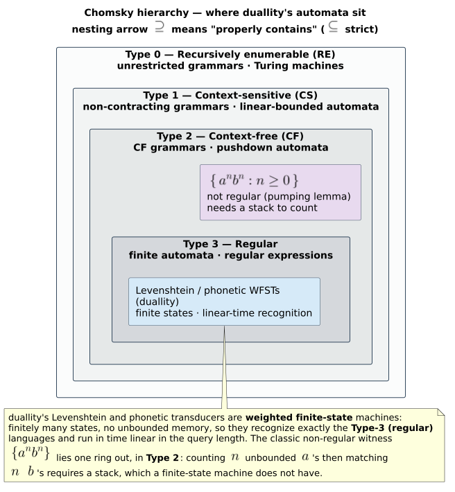

# 07 · Regular-language limits — what a Levenshtein/phonetic WFST can and cannot express

> **Prerequisites:** [01 · Semirings and WFSTs](01-semirings-and-wfsts.md),
> [04 · Composition](04-composition.md).
> **Defines:** the Chomsky hierarchy and duallity's place in it; *rational (regular) relations*; the
> `OperationType` $`\langle \textit{consume\_x},\ \textit{consume\_y},\ \textit{weight},\ \textit{restriction} \rangle`$
> taxonomy; the pumping lemma and the Myhill–Nerode theorem as non-regularity witnesses.

Every transducer in duallity is a **finite-state** device. Finite-stateness is the source of both its
speed and its limits. This chapter states, honestly and with complete proofs, what that buys and what
it forbids — so you reach for duallity when it fits and reach elsewhere when it does not. Symbols
follow the [master notation table](README.md#master-notation); the language $`a^{n} b^{n}`$, the
pumping length $`p`$, and the right-congruence $`\equiv_L`$ are defined at first use.

---

## 1. Where duallity sits in the Chomsky hierarchy

The Chomsky hierarchy (Chomsky, 1956 [[1]](#references)) ranks formal-language classes by the machine
that recognises them and the memory that machine may use:

| Type | Class | Machine | Memory | Can it count / nest arbitrarily? |
|---|---|---|---|---|
| 3 | **Regular** | finite automaton / **FST** | finite (bounded) control only | **no** |
| 2 | Context-free | pushdown automaton | one unbounded stack | balanced nesting, one stack |
| 1 | Context-sensitive | linear-bounded automaton | tape linear in input | bounded context |
| 0 | Recursively enumerable | Turing machine | unbounded tape | anything computable |

A weighted finite-state transducer recognises a **rational relation** (equivalently a *regular*
relation) — Type 3. duallity is a fast, composable engine for rational relations over strings, weighted
in the tropical semiring $`\mathbb{T} = (\mathbb{R} \cup \{+\infty\},\ \min,\ +,\ +\infty,\ 0)`$.
It is **not** a parser, a type checker, or a grammar engine, and it does not pretend to be. Theorem 7.5
pins every duallity construct inside Type 3.



---

## 2. What a regular transducer *can* express

Within Type 3, duallity is expressive and useful.

- **Edit-bounded similarity** — "all terms within edit distance $`k`$", with the distance
  carried as a tropical weight (chapters
  [02](02-edit-distance-and-levenshtein-automata.md)–[03](03-levenshtein-as-transducer.md)).
- **Generalized edit metrics** — obtained by enlarging the operation set: transpositions
  (Damerau–Levenshtein), merges/splits (OCR), and restricted phonetic digraph rewrites. duallity
  catalogues these as `OperationType` values, each a 5-tuple
  $`\langle \textit{consume\_x},\ \textit{consume\_y},\ \textit{weight},\ \textit{applicability},\ \textit{name} \rangle`$
  where $`\textit{consume\_x}`$ is the number of characters consumed from the **dictionary term**
  (output side), $`\textit{consume\_y}`$ the number from the **query** (input side),
  $`\textit{weight}`$ the operation cost, and $`\textit{applicability}`$ the semantic predicate
  `Any`, `Equal`, `AdjacentTranspose`, or `Listed`. The final $`\textit{name}`$ is diagnostic:
  renaming an operation cannot change the relation it accepts. A `Listed` predicate carries a
  directed set of complete source/target string pairs (module `generalized_ops`,
  `liblevenshtein::transducer::OperationType`):

  

  | Operation | $`\textit{consume\_x}`$ (dict) | $`\textit{consume\_y}`$ (query) | $`\textit{weight}`$ | Applicability | Predicate |
  |---|:---:|:---:|:---:|---|---|
  | match | 1 | 1 | $`0`$ | `Equal` | complete slices equal |
  | substitute | 1 | 1 | $`> 0`$ | `Any` | every pair, including equal slices |
  | insert | 0 | 1 | $`1`$ | `Any` | query only |
  | delete | 1 | 0 | $`1`$ | `Any` | dictionary only |
  | transpose | 2 | 2 | $`1`$ | `AdjacentTranspose` | complete two-scalar reversal |
  | merge | 2 | 1 | $`1`$ | `Any` | two dictionary scalars → one query scalar |
  | split | 1 | 2 | $`1`$ | `Any` | one dictionary scalar → two query scalars |
  | phonetic (e.g. $`\texttt{ph} \to \texttt{f}`$) | 2 | 1 | e.g. $`0.15`$ | `Listed` | exact directed pair membership |

  `operation_applies` dispatches directly on this native applicability tag while prepared metadata
  caches only indexes, scalar widths, and weights. Construction validates the original set before
  duallity drops any operation whose weight exceeds the bound or whose full WFST semantics duplicate
  another (`bounded_operation_set`). This is the runtime-configurable machinery of
  [design/generalized-wfst](../design/generalized-wfst.md).
- **Phonetic rewrites** — a *finite* rule set of string rewrites
  ($`\texttt{ph} \to \texttt{f}`$, $`\texttt{ck} \to \texttt{k}`$) is a rational relation,
  encodable as the char/$`\varepsilon`$ transition chains of
  [design/phonetic-rewrite-wfst](../design/phonetic-rewrite-wfst.md).
- **Phonetic regular expressions** — alternation, optionality, grouping, and character classes
  ($`(\texttt{ph}\,|\,\texttt{f})\texttt{one}`$) compile by Thompson's construction (Thompson,
  1968 [[7]](#references)) to an NFA, hence to a WFST
  ([design/phonetic-wfst](../design/phonetic-wfst.md)).

All of these **compose** (chapter [04](04-composition.md)), because rational relations are closed under
composition (Theorem 7.2).

### Theorem 7.1 (WFSTs realize exactly the rational relations)

> **Theorem 7.1.** A relation $`R \subseteq \Sigma^{\ast} \times \Gamma^{\ast}`$ (weighted in a
> semiring $`\mathbb{K}`$) is realised by some weighted finite-state transducer **iff**
> $`R`$ is **rational** — built from finite relations by the rational operations union
> ($`\cup`$), concatenation ($`\cdot`$), and Kleene star ($`\ast`$). Equivalently
> (Elgot & Mezei, 1965 [[2]](#references); Sakarovitch, 2009 [[3]](#references)), the
> transducer-definable relations are exactly the **rational subsets** of the product monoid
> $`\Sigma^{\ast} \times \Gamma^{\ast}`$; the weighted version is the rational closure over
> $`\mathbb{K}`$ (Mohri, 1997 [[4]](#references)).

**Justification.** $`(\Leftarrow)`$ A finite relation is realised by a transducer with one edge
per pair; union is the parallel juxtaposition of two transducers under a shared fresh initial state;
concatenation $`\varepsilon`$-links the finals of the first to the initial of the second; Kleene
star adds an $`\varepsilon`$-loop from finals back to a fresh initial-and-final state. Each
construction is finite-state, so every rational relation has a WFST. $`(\Rightarrow)`$ A WFST has
finitely many states and edges; the transducer analogue of Kleene's theorem (state elimination) reads a
rational expression off the automaton by removing states one at a time, replacing the paths through each
removed state by edges labelled with the corresponding rational expressions, until only an
initial–final edge remains; the label of that edge is a rational expression for $`R`$. Hence
WFST-definable $`=`$ rational. $`\blacksquare`$

### Theorem 7.2 (Closure under $`\cup, \cdot, \ast, {}^{-1}, \circ`$)

> **Theorem 7.2.** The class of rational relations is closed under union, concatenation, Kleene star,
> **inverse**, and **composition**.

**Justification.** Union, concatenation, and star are the very constructions of Theorem 7.1, so their
results are rational. **Inverse** $`R^{-1} = \{(y, x) : (x, y) \in R\}`$ is obtained by swapping
the input and output label on every edge — a syntactic transform that preserves finiteness, hence
rationality. **Composition** $`(T_1 \circ T_2)(x, z) = \bigoplus_y \bigl[\,T_1(x, y) \otimes T_2(y, z)\,\bigr]`$
is realised by the **product construction**: states are pairs $`(s_1, s_2)`$, an edge fires when
$`T_1`$'s output symbol matches $`T_2`$'s input symbol (with an $`\varepsilon`$-filter
to serialise $`\varepsilon`$-moves), and the weights combine with $`\otimes`$. Over the
commutative tropical semiring this product is well defined and finite, so rational relations are closed
under $`\circ`$ (Elgot & Mezei, 1965 [[2]](#references); Mohri, 1997 [[4]](#references)). duallity
depends on exactly this closure to fold a Levenshtein WFST against a downstream model; the constructive
lazy product is exhibited in [04 · Composition](04-composition.md). $`\blacksquare`$

> **Honest caveat.** Rational relations are **not** closed under **intersection** in general (unlike
> regular *languages*), because a two-tape intersection can force two independent unbounded counters
> (Sakarovitch, 2009 [[3]](#references)). This is precisely why duallity **composes** transducers rather
> than intersecting them: composition stays inside Type 3, and duallity never needs an operation that
> would leave it.

---

## 3. What a regular transducer *cannot* express

Finite state means **finite, bounded memory**. A WFST cannot:

- **Count without bound** — recognise $`\{\, a^{n} b^{n} : n \ge 0 \,\}`$ or balance
  parentheses/brackets to arbitrary depth (Theorems 7.3 and 7.4).
- **Enforce nested or long-range structure** — subject–verb agreement across an arbitrarily deep
  embedded clause, or `begin`/`end` nesting in code, needs a *stack* (Type 2) or more.
- **Reason about meaning** — word-sense disambiguation, factual consistency, and discourse coherence are
  not regular (and largely not symbolic at all).

A useful litmus test: **if solving the problem requires remembering an unbounded amount of earlier
input, it is not regular, and a WFST cannot do it.** We prove the canonical case two independent ways —
by the pumping lemma (Theorem 7.3) and by the Myhill–Nerode theorem (Theorem 7.4).

Throughout, let $`L = \{\, a^{n} b^{n} : n \ge 0 \,\}`$ — all strings of some number of
$`a`$'s followed by an **equal** number of $`b`$'s.

### Theorem 7.3 ($`\{a^{n} b^{n}\}`$ is not regular — pumping lemma)

> **Pumping lemma for regular languages** (Hopcroft, Motwani & Ullman, 2006 [[5]](#references)). If
> $`L`$ is regular, there is a constant $`p \ge 1`$ (a *pumping length*) such that every
> $`s \in L`$ with $`\lvert s \rvert \ge p`$ can be written $`s = x\,y\,z`$ with
> **(i)** $`\lvert xy \rvert \le p`$, **(ii)** $`\lvert y \rvert \ge 1`$, and **(iii)**
> $`x\,y^{\,i}\,z \in L`$ for every $`i \ge 0`$.

> **Theorem 7.3.** $`L = \{\, a^{n} b^{n} : n \ge 0 \,\}`$ is not regular.

**Proof.** Suppose, for contradiction, that $`L`$ is regular, with pumping length $`p`$.
Choose $`s = a^{p} b^{p} \in L`$; then $`\lvert s \rvert = 2p \ge p`$, so the lemma applies
and yields a decomposition $`s = x\,y\,z`$ satisfying (i)–(iii). The first $`p`$ characters
of $`s`$ are all $`a`$. By (i), $`\lvert xy \rvert \le p`$, so $`xy`$ lies
entirely within that leading $`a`$-block; hence $`y`$ consists solely of $`a`$'s, say
$`y = a^{\,j}`$ with $`1 \le j \le p`$ by (ii). Pump with $`i = 2`$:

```math
x\,y^{\,2}\,z \;=\; a^{\,p+j}\,b^{\,p}.
```

Since $`j \ge 1`$, we have $`p + j \ne p`$, so the number of $`a`$'s differs from the
number of $`b`$'s and $`a^{\,p+j} b^{\,p} \notin L`$. This contradicts (iii). Therefore no
pumping length exists and $`L`$ is not regular. $`\blacksquare`$

**Corollary 7.3.1.** No WFST accepts $`\{a^{n} b^{n}\}`$ (a WFST's underlying acceptor is a finite
automaton, which recognises only regular languages by Theorem 7.1). Balanced, unbounded nesting is
beyond Type 3.

### Theorem 7.4 (Myhill–Nerode witness — a second, independent proof)

> **Myhill–Nerode theorem** (Nerode, 1958 [[6]](#references); Hopcroft, Motwani & Ullman, 2006
> [[5]](#references)). For $`L \subseteq \Sigma^{\ast}`$, define the **right congruence**
> $`x \equiv_L y`$ iff for **all** $`z \in \Sigma^{\ast}`$,
> $`xz \in L \Leftrightarrow yz \in L`$. Then $`L`$ is regular **iff** $`\equiv_L`$
> has **finitely many** equivalence classes (finite index); moreover the minimal deterministic
> automaton for $`L`$ has exactly one state per class.

> **Theorem 7.4.** $`L = \{\, a^{n} b^{n} : n \ge 0 \,\}`$ has infinitely many $`\equiv_L`$
> classes, hence is not regular.

**Proof.** Consider the infinite family $`\{\, a^{i} : i \ge 0 \,\}`$. Take any
$`i \ne j`$ and the distinguishing suffix $`z = b^{\,i}`$. Then
$`a^{i} z = a^{i} b^{i} \in L`$ (equal counts), whereas $`a^{j} z = a^{j} b^{i} \notin L`$
(since $`j \ne i`$ makes the counts unequal). Thus $`z`$ separates $`a^{i}`$ from
$`a^{j}`$, so $`a^{i} \not\equiv_L a^{j}`$. Consequently the strings
$`a^{0}, a^{1}, a^{2}, \dots`$ lie in **pairwise distinct** classes, giving infinitely many
classes. By Myhill–Nerode, $`L`$ is not regular. $`\blacksquare`$

The two proofs are genuinely independent: Theorem 7.3 exploits a **structural** property of long
accepted strings, while Theorem 7.4 counts the **residual languages** $`\{z : xz \in L\}`$ and
finds unboundedly many. Either alone suffices; together they show the limit is intrinsic, not an
artefact of one proof technique.

---

## 4. Placement: everything duallity ships is Type 3

### Theorem 7.5 (Placement)

> **Theorem 7.5.** Every construct duallity ships denotes a **regular language** or a **rational
> relation** (Type 3):
>
> **(a)** the bounded Levenshtein neighbourhood $`L(q, k)`$ is regular;
> **(b)** phonetic rewrites (a finite rule set) denote a rational relation;
> **(c)** phonetic regular expressions denote a rational relation;
> **(d)** hence the Levenshtein, universal, generalized (`OperationType`), WallBreaker result-forest,
> rewrite, and phonetic-NFA WFSTs are all Type 3.

**Proof.**

*(a)* The parameterized automaton of chapter [02](02-edit-distance-and-levenshtein-automata.md) accepts
exactly $`L(q, k) = \{\, w : d_{\mathrm{lev}}(q, w) \le k \,\}`$ and has
$`O\bigl((n{+}1)(2k{+}1)\bigr)`$ states — the diagonal band of width $`2k+1`$ over the
$`n{+}1`$ query positions ($`n = \lvert q \rvert`$). A finite automaton recognises only
regular languages, so $`L(q, k)`$ is regular; attaching the edit weight makes the query
$`\to`$ term map a rational relation (Theorem 7.1). The WallBreaker **result forest** of chapter
[06](06-wallbreaker-and-the-wall-effect.md) is a fortiori regular: it is a finite union of
single-string identity chains, and a finite relation is rational.

*(b)* Each rewrite rule is a finite char/$`\varepsilon`$ transducer; a *finite* rule set is their
finite union (and, where rules chain, finite composition), and rational relations are closed under both
(Theorem 7.2). So a finite phonetic-rewrite rule set is rational.

*(c)* A phonetic regular expression compiles by Thompson's construction (Thompson, 1968
[[7]](#references)) to an NFA with $`\varepsilon`$-transitions, size linear in the expression;
an NFA recognises a regular language, and pairing input with output labels yields a rational relation
(Theorem 7.1).

*(d)* Each shipped variant is one of (a)–(c) or a composition thereof: Levenshtein and universal
automata realise (a); the generalized `OperationType` automaton is (a) with an enlarged **finite**
operation set (still a finite-state device, since `bounded_operation_set` keeps the set finite);
WallBreaker's result forest is (a); rewrite and phonetic-NFA WFSTs are (b) and (c). Composition of
rational relations is rational (Theorem 7.2). Hence every construct is Type 3. $`\blacksquare`$

Thus duallity sits **entirely** within the regular tier of the Chomsky hierarchy (Chomsky, 1956
[[1]](#references)) — by construction, not by accident.

---

## 5. Honest positioning

duallity occupies the regular tier **deliberately and well**: it is deterministic where it needs to be,
fast, interpretable, needs no training data, and composes cleanly (Theorem 7.2). Problems that
genuinely require Type-2 (context-free parsing) or learned models are **out of scope** for this crate,
and duallity does not paper over that boundary.

A research design for stacking **CFG** and **neural** tiers on top of an FST core is preserved, as
inherited historical context, under [`../archive/`](../archive/README.md) — see in particular the
archived [`cfg_grammar_correction.md`](../archive/cfg_grammar_correction.md) (CFG/Earley/PCFG),
[`nfa_phonetic_regex.md`](../archive/nfa_phonetic_regex.md), and
[`limitations.md`](../archive/limitations.md) (the FST vs. CFG vs. neural expressivity discussion that
this chapter re-grounds). Those tiers sit **outside** duallity's shipped crate surface; this chapter is
the canonical, accurate account of the crate's actual expressivity ceiling.

## See also

- [01 · Semirings and WFSTs](01-semirings-and-wfsts.md) — the tropical semiring $`\mathbb{T}`$ and the WFST definition Theorem 7.1 characterises.
- [04 · Composition](04-composition.md) — the constructive product behind the composition closure of Theorem 7.2.
- [06 · WallBreaker and the wall effect](06-wallbreaker-and-the-wall-effect.md) — the result-forest WFST placed in Type 3 by Theorem 7.5.
- [design/generalized-wfst](../design/generalized-wfst.md) — the runtime-configurable `OperationType` machinery of §2.
- [`../archive/`](../archive/README.md) — the inherited FST + CFG + Neural research directions, out of scope for this crate.
- [references/bibliography](../references/bibliography.md) — the full, DOI-resolved citation list.

## References

1. **Chomsky, N.** (1956). *Three models for the description of language.* IRE Transactions on
   Information Theory 2(3), 113–124.
   [doi:10.1109/TIT.1956.1056813](https://doi.org/10.1109/TIT.1956.1056813) — the language hierarchy.
2. **Elgot, C. C., & Mezei, J. E.** (1965). *On relations defined by generalized finite automata.* IBM
   Journal of Research and Development 9(1), 47–68.
   [doi:10.1147/rd.91.0047](https://doi.org/10.1147/rd.91.0047) — finite transducers realise exactly the
   rational relations, and these are closed under composition.
3. **Sakarovitch, J.** (2009). *Elements of Automata Theory.* Cambridge University Press. ISBN
   978-0521844253 — rational relations, their closure properties, and the non-closure under
   intersection.
4. **Mohri, M.** (1997). *Finite-State Transducers in Language and Speech Processing.* Computational
   Linguistics 23(2), 269–311. [ACL Anthology J97-2003](https://aclanthology.org/J97-2003/) — weighted
   rational relations and their closure under composition.
5. **Hopcroft, J. E., Motwani, R., & Ullman, J. D.** (2006). *Introduction to Automata Theory,
   Languages, and Computation* (3rd ed.). Pearson. ISBN 978-0321455369 — the pumping lemma and the
   Myhill–Nerode theorem.
6. **Nerode, A.** (1958). *Linear automaton transformations.* Proceedings of the American Mathematical
   Society 9(4), 541–544. [doi:10.2307/2033204](https://doi.org/10.2307/2033204) — the right-congruence
   characterisation of regular languages.
7. **Thompson, K.** (1968). *Programming Techniques: Regular expression search algorithm.*
   Communications of the ACM 11(6), 419–422.
   [doi:10.1145/363347.363387](https://doi.org/10.1145/363347.363387) — the regex $`\to`$ NFA
   construction.
